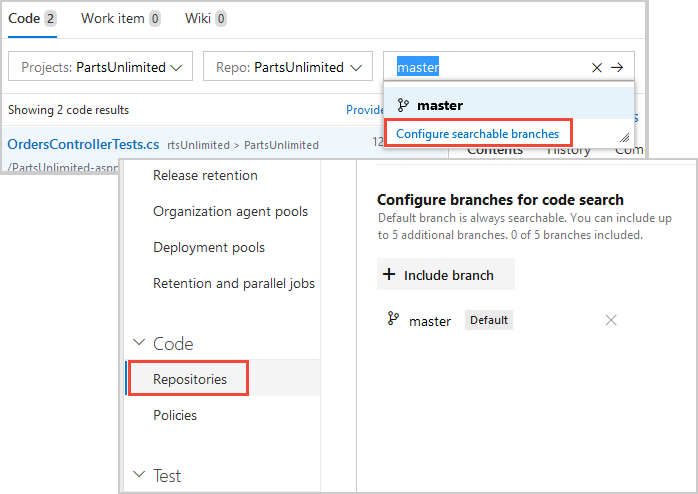

# How To: Use Code Search

[!INCLUDE [version-header](../../_shared/version-tfs-2017-through-vsts.md)]

By using Code Search you can:

* **Search across all of your projects**:
  Search in your own codebase and your partner teams' codebases. Use cross-project 
  searches over all the code in your Azure DevOps or TFS instance to search 
  across your enterprise's entire codebase. Narrow your search by using project, repository, 
  path, file name, and other filter operators. Use wildcards to widen your search and 
  Boolean operators to fine-tune it. 

* **Find specific types of code**: Use code type filters 
  to search for specific kinds of code such as definitions, references, functions, 
  comments, strings, namespaces, and more. You can use Code Search to narrow 
  down your results to exact code type matches. Navigate quickly to a method 
  definition to understand its implementation simply by applying the definition 
  filter, or scope the search to references in order to view calls and maximize 
  code reuse.

* **Easily drill down or widen your search**: When you find an item of interest, 
  simply place the cursor on it and use the shortcut menu to quickly search for 
  that text across all your projects and files. Easily trace how your code works 
  by using the shortcut menu to search for related items such as definitions and 
  references - directly from inside a file.

## Syntax for simple and compound searches

Use simple search strings for words or phrases. The default is a whole word search; 
for example, a search for "valid" will not find instances of the word 
"validation". However, searches are _not_ case-sensitive.

Words separated by spaces, and not wrapped in double-quotes, are treated as 
separate search terms and the search will expect to find an occurrence of 
all the words (in other words, it assumes the `AND` operator between words).

You must escape the special characters `(`,  `)`, `[`, `]`, `:`, `*`, and `?`
by enclosing them in a phrase delimited with double-quotes `"` and `"`.

When you search from inside a project, the default is to search only within that 
project. You can navigate up to higher levels to broaden your search.

In a Git project, you see a list of the repositories it contains. 
Use the project and repository checkboxes to widen your search to more or all projects, or to 
narrow your search to fewer projects and repositories. If there is more than a few 
projects or repositories, use the **Show more** link to see them all.

Code Search can index multiple branches in a Git repository - by default it indexes 
files in only the default branch of your Git repositories (usually this is the **master** branch).
Specify the branches for each repository that you want Code
Search to index in the **Options** tab of the **Repositories** section in the
[project settings page](../navigation/go-to-service-page.md#open-project-settings).

::: moniker range="azure-devops-2019"

::: moniker-end

In a TFVC project, you see a list of folder paths in that project for 
which you have read access - you won't see any projects and folders 
for which you don't have read permission. Select paths in the folder tree 
to narrow your search if required.

Code Search remembers your last settings, such as the project and repository or path you
searched in. Clear all the checkboxes to search across all projects. Do this quickly and 
easily with the **Clear all** links when you want to search in a different scope.

In the results pane, Code Search highlights up to the first 100 hits or matches found in the target files.  

### Narrow your search by using Boolean operators
 
Narrow your search by using Boolean operators to combine search criteria.
Combine multiple search criteria using `AND`, `OR`, or `NOT` (they must be 
uppercase). 

Use parentheses to specify the precedence of the operations when you use more than 
one Boolean operator. By default, a search combines all the words you enter using 
the `AND` operator so that it will return only files that contain all of the 
words you entered. 

For example:

* `validate AND revisit` finds files that contain both the words **validate** and 
  **revisit**. Note that `AND` is the default operator, and so this is equivalent to 
  the search string `validate revisit`.
* `validate OR revisit` finds files that contain either of the words **validate** or **revisit**.
* `validate NOT revisit` finds files that contain the word **validate** but not the word **revisit**.
* `(validate NOT revisit) OR "release delayed"` finds files that contain the word **validate**
  but not the word **revisit** or files that contain the phrase **release delayed**.

### Broaden your search by using  wildcards

Use the wildcard characters `*` and `?` to broaden your search criteria. For 
example:

* `CodeSenseHttp*` finds files containing words that start with **CodeSenseHttp**, 
  such as **CodeSenseHttpClient** and **CodeSenseHttpClientTest**.
* `CodeA23?R` finds files containing words that start with **CodeA23**, have any 
  alphanumeric character next, and end with **R**. For example, **CodeA234R** and **CodeA23QR**. 

You can use wildcard characters anywhere in your search string **except** as 
a **prefix** in a simple search string or a query that uses a 
[code type filter](#codefunctions). 
For example, you cannot use a search query such as `*RequestHandler` or 
`class:?RequestHandler`. However, you can use prefix wildcards with the 
other search filter functions; for example, the search query strings 
`file:*RequestHandler.cs` and `repo:?Handlers` are valid.  

You can use more than one `?` wildcard to match more than one character.

------------------

 **No results found for ...**  
If there is a very large number of hits when using a wildcard search, such 
as when using a very simple wildcard search string, you may see a message that no 
matching files were found. In this case, narrow your search to reduce the number
of matches. For example, specify more characters of the word(s) you want to find,
or add a condition or filter to limit the number of possible matches.   

------------------

### Search for phrases

To find an exact match to a set of words, enclose your search terms in double-quotes 
to perform a _phrase search_. For example, `"Client not found"`.

Within a phrase:

* Boolean operators are treated as literal text.
* The query language characters `:()[]*?` are treated as literal text.
* You need to escape only the special characters `\` and `"`.

### Search for special characters

> **Note**: This feature is currently available only for Azure DevOps Services customers and not TFS.

You can include special characters in a search string, or search specifically for special characters,
according to the following rules:

* Search for any special character that is not a part of the query language, 
  (for example, excluding the characters `: ( )[ ]*?`) as either a simple search string
  or a phrase search string. For example, `react-redux` or `"react-redux"` will produce the same results.

* Search for a special character that is a part of the query language (`: ( )[ ]*?`)
  by enclosing the search string within double-quotes. For example, `"flatten()"` will
  find the literal string `flatten()`.

* Search for a literal occurrence of the double-quote character `"` by preceding it with the
  escape character `\` and enclosing the search string in double-quotes.
  For example, `"\"react-redux\""` will find the literal string `"react-redux"`. 

## Functions to find specific types of code

As you type in the search box, select functions and keywords from the drop-down 
list to quickly create your query. Use the **Show more** link to display all the 
available functions and keywords. Mix and match the functions as required.

You can also select one or a combination of filters from the list in the left column.
Again, the **Show more** link displays all the available functions and keywords.

Alternatively, you can type the functions and parameters directly into the search box. The following table shows 
the full list of functions for selecting specific types or members in your
C#, C, C++, Java, and Visual Basic.NET code.

| To find code where _findThis_ appears as a ... | ... search for argument **arg:**_findThis_ |
| --- | --- |
| Argument | **arg:**_findThis_ | 
| Base type | **basetype:**_findThis_ | 
| Calling function | **caller:**_findThis_ |
| Class definition or declaration | **class:**_findThis_ |
| Class declaration | **classdecl:**_findThis_ |
| Class definition | **classdef:**_findThis_ |
| Comment | **comment:**_findThis_ |
| Constructor | **ctor:**_findThis_ |
| Declaration | **decl:**_findThis_ |
| Definition | **def:**_findThis_ |
| Destructor | **dtor:**_findThis_ |
| Enumerator | **enum:**_findThis_ |
| Extern | **extern:**_findThis_ |
| Field | **field:**_findThis_ |
| Friend function | **friend:**_findThis_ |
| Function | **func:**_findThis_ |
| Function declaration | **funcdecl:**_findThis_ |
| Function definition | **funcdef:**_findThis_ |
| Global | **global:**_findThis_ |
| Header | **header:**_findThis_ |
| Interface | **interface:**_findThis_ |
| Macro | **macro:**_findThis_ |
| Macro definition | **macrodef:**_findThis_ |
| Macro reference | **macroref:**_findThis_ |
| Method | **method:**_findThis_ |
| Method declaration | **methoddecl:**_findThis_ |
| Method definition | **methoddef:**_findThis_ |
| Namespace | **namespace:**_findThis_ |
| Property | **prop:**_findThis_ |
| Reference | **ref:**_findThis_ |
| String literal | **strlit:**_findThis_ |
| Struct | **struct:**_findThis_ |
| Struct declaration | **structdecl:**_findThis_ |
| Struct definition | **structdef:**_findThis_ |
| Template argument | **tmplarg:**_findThis_ |
| Template specification | **tmplspec:**_findThis_ |
| Type | **type:**_findThis_ |
| Typedef | **typedef:**_findThis_ |
| Union | **union:**_findThis_ |

## Functions to select projects, repositories, paths, and files

Functions make it easy to narrow the search to specified locations, 
specific types of files within these locations, or specified filenames.
Mix and match the functions as required.

Narrow the search to a specific location using the `proj`, `repo`, or `path` filters:

* `QueueJobsNow proj:Fabrikam` finds all occurrences of the word **QueueJobsNow** in the **Fabrikam** project.
* `QueueJobsNow repo:Contoso` finds all occurrences of the word **QueueJobsNow** in the **Contoso** repository.
* `QueueJobsNow path:VisualStudio/Services/Framework` finds all occurrences of the word **QueueJobsNow** 
  in the path **VisualStudio/Services/Framework** and its sub-paths.
* Enclose the argument to the filter in double-quotes if it contains a space. 
  For example: `QueueJobsNow path:"VisualStudio/Windows Phones and Devices/Services"`.

Narrow the search to specific files using the `file` or `ext` filters:

* `QueueJobsNow file:queueRegister*` finds all occurrences of the word **QueueJobsNow** in all 
  files where the filename starts with **queueRegister**.
* `QueueJobsNow ext:cs` finds all occurrences of the word **QueueJobsNow** in only C# source files.
* A plain text search string that does not include file type functions 
  will also find files where the string matches part of the filename.

## Find related items or other terms
   
One of the powerful features of Code Search is the capability to expand your
search interactively, based on the results of previous searches. For example,
you can easily broaden your search to related files when tracing or debugging code. 

Place the insertion point on a term in the file and open the shortcut menu (mouse: right-click) to start a new search 
for other files containing the selected term. You can search for it as text, for 
the definition if you select an object name, or for references to a selected object. 

## More examples

Some more examples of search strings are:

* You can find all instances of "ToDo" comments in your code simply by selecting `comment:` and typing `todo`. 

* You can search in specific locations, such as within a particular path, by using a search string such as `Driver path:MyShuttle/Server`. 

* You can search for files by name, such as `Driver file:GreenCabs.cs`, or just by file extension. For example, the search string 
  `error ext:resx` could be useful when you want to review all error strings in your code. 
  But even if your plain text search string (without specific file type functions) 
  matches part of a filename, the file appears in the list of found files.

* You can combine two or more words by using Boolean operators; for example, `validate OR release`.

* You can find an exact match to a set of words by enclosing your search terms in double-quotes. For example, `"Client not found"`. 

* You can use the code type search functions with files written in C#, C, C++, Java, and Visual Basic.NET.

Open the search results in a new browser tab from either search box by
pressing _Ctrl_ + _Enter_ or by holding _Ctrl_ and clicking  the
 icon.
In Google Chrome, press _Ctrl_ + _Shift_ + _Enter_ to switch the focus
to the new browser tab. 

[!INCLUDE [shared-got-feedback](_shared/shared-got-feedback.md)]
