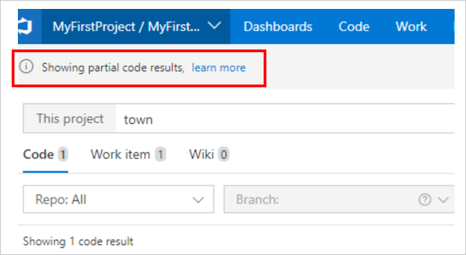

# Troubleshoot Search

[!INCLUDE [version-header-tfs-only](../../_shared/version-header-tfs-only.md)]

- [Troubleshoot Search](#troubleshoot-search)
  - [Q: Why isn't the Search box displayed after it's configured?](#q-why-isnt-the-search-box-displayed-after-its-configured)
  - [Q: Why are no search results shown after installing or configuring Search?](#q-why-are-no-search-results-shown-after-installing-or-configuring-search)
  - [Q: How do I know if indexing was triggered for all the collections?](#q-how-do-i-know-if-indexing-was-triggered-for-all-the-collections)
  - [Q: Why does Search stop working and no results are shown?](#q-why-does-search-stop-working-and-no-results-are-shown)
  - [Q: Why doesn't Search show the expected results?](#q-why-doesnt-search-show-the-expected-results)
  - [Q: Why is Azure DevOps Server or TFS overall performance affected?](#q-why-is-azure-devops-server-or-tfs-overall-performance-affected)
  - [Q: Why doesn't Search work post upgrade to Azure DevOps Server 2019 Update 1?](#q-why-doesnt-search-work-post-upgrade-to-azure-devops-server-2019-update-1)
  - [Partial results in code search](#partial-results-in-code-search)
    - [Problem](#problem)
    - [Explanation](#explanation)
    - [Recommendation](#recommendation)
  - [Wildcard search](#wildcard-search)
    - [Problem](#problem-1)
    - [Explanation](#explanation-1)
    - [Recommendation](#recommendation-1)

<a name="no-search-box"></a>

## Q: Why isn't the Search box displayed after it's configured?
A:
1. The search box is shown only in the context of a project page. 
   Navigate to a project and check if the search box is displayed at the top right. 

2. If the search box is not shown, verify that the extension is installed for the collection. 
   If not, [install](administration.md#install-tfs) or [configure](administration.md#config-ts-azuredevops) the extension.

<a name="no-results-install"></a>

## Q: Why are no search results shown after installing or configuring Search?
A:
1. Wait until you are sure sufficient time has elapsed
   after installing or configuring Search. It typically takes
   less than one hour for Search to index a collection, but 
   it may take up to 12 hours depending on the size and number of code files, work items, or wiki pages.

2. If no results are shown after this period, 
   [check indexing status](administration.md#check-index). 

<a name="indexing-status-for-collections"></a>

## Q: How do I know if indexing was triggered for all the collections?
A:
* [Check indexing status](administration.md#check-index) separately for each collection.

<a name="no-results-later"></a>

## Q: Why does Search stop working and no results are shown?

A: Follow these steps. Replace "SearchServer" with the 
name of the server where Search is installed:

1. Access the URL `http://SearchServer:9200` from a web browser
   on a computer in the same domain as the server running Search.
   - If the status returned is `200 - OK`, go to step 2.
   - If any other status is returned, contact support at 
     the address shown at the end of this topic.
   - If you don't get a response, verify that the 
     **elasticsearch-service-x64** service is running on 
     the server where Search is configured. If the service
     is stopped, start it and access the Search server again.  
     If you still get no response, or a response other than
     `200 - OK`, contact support at 
     the address shown at the end of this topic.<p />

2. If the status is 200, access the URL `http://SearchServer:9200/_cat/health?v`
   from a web browser on a computer in the same domain as the server running Search.
   - If the status column shows green/OK, and 
     Search is still not working, contact support at 
     the address shown at the end of this topic. 
   - If the status column shows red/fault, look at the value
     in the **init** or **unassigned** columns. If these are 
     greater than zero, wait for 30 minutes and then
     repeat this step. If the values are unchanged, go to step 3.<p />

3. Access the URL `http://SearchServer:9200/_cat/shards?v`
   from a web browser on a computer in the same domain as the server running Search.
   - Make a note of the values in the **Shard** column for the 
     rows with a **state** value of **unassigned** and contact 
     support at the address shown at the end of this topic.<p />

<a name="unexpected-results"></a>

## Q: Why doesn't Search show the expected results?
A: 
1. If the files were added in the last few minutes,
   wait for ten minutes or so while they are indexed.
2. [Check indexing status](administration.md#check-index) for the collection. 
3. If the files are still not shown in the results, 
   [re-index the repository or collection](administration.md#re-index)
   where the files are located.

<a name="server-slow"></a>

## Q: Why is Azure DevOps Server or TFS overall performance affected?
A:
1. [Pause all indexing](administration.md#pause-index) and see if performance recovers.
2. If performance does recover, consider locating Search 
   on a separate server if you have not already done so.

<a name="no-search-post-upgrade"></a>

## Q: Why doesn't Search work post upgrade to Azure DevOps Server 2019 Update 1?

A: If the search is set up on a separate (remote) server and source version is TFS 2018 Update 2 (or higher), verify that [these upgrade steps](administration.md#upgrading-search) were followed.
If not, then run [this script](https://github.com/microsoft/Code-Search/blob/master/Azure_DevOps_Server_2019/Troubleshooting/Repair-Search.ps1) to fix the issue.

## Partial results in code search

### Problem

I am seeing a **Showing partial code results** banner in code search.

 

### Explanation

You are likely to encounter this scenario when your code base has one or more large repositories (larger the repository, more the number of documents to search). So, when such repositories are searched, the request may take more time to process from all documents in the index and cause the search request to time out on the index. In such a case you may see partial search results along with **Showing partial code results** banner as shown above before the request times out.

### Recommendation

You could try the following alternatives as applicable for your scenarios

* Try to scope your query by using filters to narrow down to a "repo" or a "path".
* See if your query itself could be narrowed down further to avoid scenarios that require matching too many terms while searching. 

For example, while looking for methods like App_App1/ App_App2 etc., instead of searching for ```a*``` try searching for ```app*``` instead. (```a*``` will match many more terms than ```app*```).

## Wildcard search

### Problem

You may see different results while doing a wildcard search for the term ```ge*``` as compared to a wildcard search for the term ```get*```. For example, in the image below you see ```ge*``` shows **7509** results.


while ```get*``` shows **109,134** results.


### Explanation

Let's understand how wildcard search works in the given scenario. Let's say you search for ```app*```. In the backend, the wildcard `*` is expanded to match any character sequence after the term ```app```. For example, ```app*``` might expand to ```app, app0, app01, .., apple```. This expansion takes place for the first 100 expanded terms only. Post the expansion, all the files associated with the 100 expanded terms are displayed on the search results page. In this case, there is a possibility that ```application``` may not be within the first 100 expanded terms therefore, you may not find files with the search term ```application``` in the search results. This is one of the reasons why you may see fewer search results for the term ```ge*``` as compared to ```get*```.

### Recommendation

This is to ensure that the search results remain performant and that you are able to find the most meaningful results as fast as possible. The expectation is that in case of wildcard search you can type more in the search bar to scope the results to a meaningful and actionable chunk.
