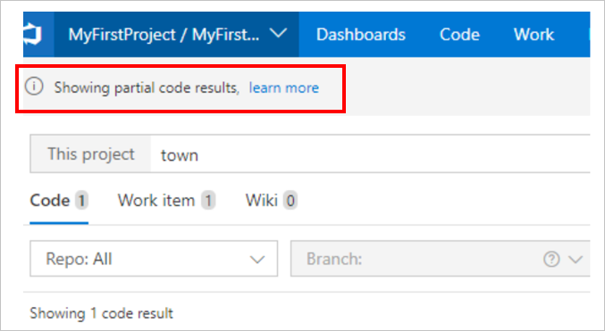

# Answers to common questions about Azure DevOps Search

[!INCLUDE [version-header](../../_shared/version-azure-devops.md)]

This article provides answers to common questions about Azure DevOps Search.

## Partial results in code search

### Problem

I am seeing a **Showing partial code results** banner in code search.

 

### Explanation

You are likely to encounter this scenario when your code base has one or more large repositories (larger the repository, more the number of documents to search). So, when such repositories are searched, the request may take more time to process from all documents in the index and cause the search request to time out on the index. In such a case you may see partial search results along with **Showing partial code results** banner as shown above before the request times out.

### Recommendation

You could try the following alternatives as applicable for your scenarios

* Try to scope your query by using filters to narrow down to a "repo" or a "path".
* See if your query itself could be narrowed down further to avoid scenarios that require matching too many terms while searching. 

For example, while looking for methods like App_App1/ App_App2 etc., instead of searching for ```a*``` try searching for ```app*``` instead. (```a*``` will match many more terms than ```app*```).

## Wildcard search

### Problem

You may see different results while doing a wildcard search for the term ```ge*``` as compared to a wildcard search for the term ```get*```. For example, in the image below you see ```ge*``` shows **7509** results.


while ```get*``` shows **109,134** results.


### Explanation

Let's understand how wildcard search works in the given scenario. Let's say you search for ```app*```. In the backend, the wildcard `*` is expanded to match any character sequence after the term ```app```. For example, ```app*``` might expand to ```app, app0, app01, .., apple```. This expansion takes place for the first 100 expanded terms only. Post the expansion, all the files associated with the 100 expanded terms are displayed on the search results page. In this case, there is a possibility that ```application``` may not be within the first 100 expanded terms therefore, you may not find files with the search term ```application``` in the search results. This is one of the reasons why you may see fewer search results for the term ```ge*``` as compared to ```get*```.

### Recommendation

This is to ensure that the search results remain performant and that you are able to find the most meaningful results as fast as possible. The expectation is that in case of wildcard search you can type more in the search bar to scope the results to a meaningful and actionable chunk.
