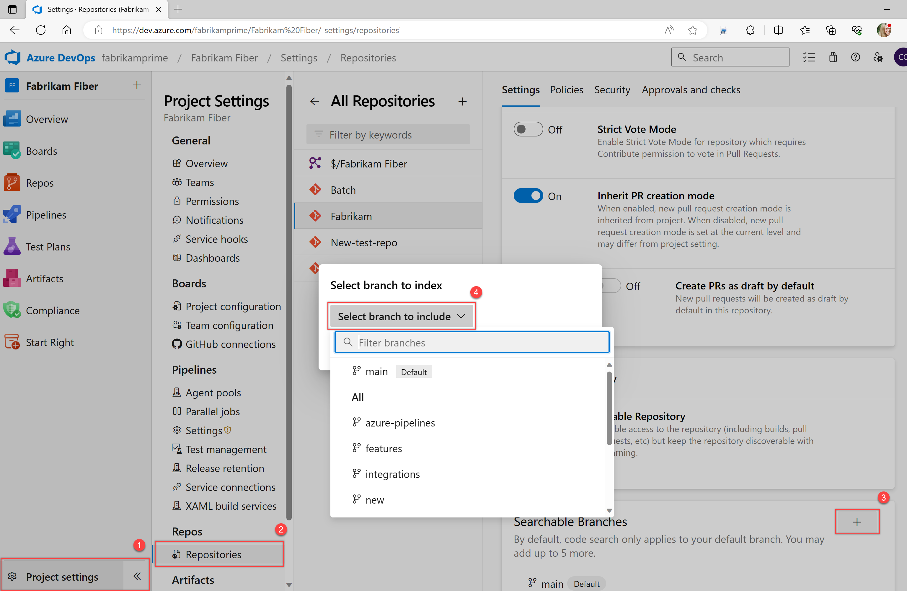

# Functional code search  

[!INCLUDE [version-header](../../includes/version-tfs-2017-through-vsts.md)]

Functional code search command filters extend your ability to refine your search across repositories beyond what is documented in [Get started with semantic search](get-started-search.md). To perform code searches, the [Code Search](https://marketplace.visualstudio.com/items?itemName=ms.vss-code-search) Marketplace extension must be installed for your organization or collection.

## Prerequisites

- You must install [Code Search](https://marketplace.visualstudio.com/items?itemName=ms.vss-code-search)
::: moniker range="< azure-devops"
  For more information, see [Install and configure search](install-configure-search.md).
::: moniker-end
- To use Code Search, you must have at least a Basic access. 
- Users granted Stakeholder access don't have access to code, and so don't have access to Code Search.
::: moniker range="azure-devops"
- Users granted Stakeholder access for a private project can perform code searches, as they have [Full Access to the code](../../organizations/security/access-levels.md).
::: moniker-end
- When you're searching across the organization or collection, only results for which a project member has access are listed.

## Code search best practices

- Get the results you want even faster by starting with a higher-level search. You can narrow your search by using project, repository, path, file name, and other filter operators. 
- Ensure that you get to the results you want even when you're not sure of the exact term you're looking for. [Use wildcards to widen your search](get-started-search.md#semantic-search-features-usage-and-examples) and [Boolean operators to fine-tune it](get-started-search.md#semantic-search-features-usage-and-examples). 
- Find more information about an item of interest faster and with minimal efforts. When you find an item of interest, place the cursor on it and use the shortcut menu to quickly search for that text across all your projects and files.
- Easily trace how your code works by using the shortcut menu to search for related items such as definitions and references – directly from inside a file or from the search results.
- Go quickly to the implementation of, for example, an API your code might be taking dependency on by narrowing down your results to exact code type matches. Use code type filters to search for specific kinds of code such as definitions, references, functions, comments, strings, namespaces, and more. 

> [!NOTE]
> You can't search code in forked repositories. 
## Functions to find specific types of code

As you enter your semantic search, select functions and keywords from the drop-down list to quickly create your query. Use the **Show more** link to display all the available functions and keywords. Mix and match the functions as required.

You can also select one or a combination of filters from the list in the left column. Again, the **Show more** link displays all the available functions and keywords.

Instead, you can enter the functions and parameters directly into the semantic search. The following table shows the full list of functions for selecting specific types or members in your C#, C, C++, Java, and Visual Basic.NET code.

| To find code where _findThis_ appears as a ... | ... search for argument **arg:**_findThis_ |
| --- | --- |
| Argument | **arg:**_findThis_ ```Deprecated in July 2019```| 
| Base type | **basetype:**_findThis_ | 
| Calling function | **caller:**_findThis_ ```Deprecated in July 2019```|
| Class definition or declaration | **class:**_findThis_ |
| Class declaration | **classdecl:**_findThis_ ```Merged with class:```|
| Class definition | **classdef:**_findThis_  ```Merged with class:```|
| Comment | **comment:**_findThis_ |
| Constructor | **ctor:**_findThis_ ```Merged with method:```|
| Declaration | **decl:**_findThis_ |
| Definition | **def:**_findThis_ |
| Destructor | **dtor:**_findThis_ ```Merged with method:```|
| Enumerator | **enum:**_findThis_ |
| Extern | **extern:**_findThis_ ```Deprecated in July 2019```|
| Field | **field:**_findThis_ |
| Friend function | **friend:**_findThis_ ```Deprecated in July 2019```|
| Function | **func:**_findThis_ ```Merged with method:```|
| Function declaration | **funcdecl:**_findThis_ ```Merged with method:```|
| Function definition | **funcdef:**_findThis_ ```Merged with method:```|
| Global | **global:**_findThis_ ```Deprecated in July 2019```|
| Header | **header:**_findThis_ ```Deprecated in July 2019```|
| Interface | **interface:**_findThis_ |
| Macro | **macro:**_findThis_ |
| Macro definition | **macrodef:**_findThis_ ```Merged with macro:```|
| Macro reference | **macroref:**_findThis_ ```Merged with macro:```|
| Method | **method:**_findThis_ |
| Method declaration | **methoddecl:**_findThis_ ```Merged with method:```|
| Method definition | **methoddef:**_findThis_ ```Merged with method:```|
| Namespace | **namespace:**_findThis_ |
| Property | **prop:**_findThis_ |
| Reference | **ref:**_findThis_ |
| String literal | **strlit:**_findThis_ |
| Struct | **struct:**_findThis_ ```Merged with type:```|
| Struct declaration | **structdecl:**_findThis_ ```Merged with type:```|
| Struct definition | **structdef:**_findThis_ ```Merged with type:```|
| Template argument | **tmplarg:**_findThis_ ```Deprecated in July 2019```|
| Template specification | **tmplspec:**_findThis_ ```Deprecated in July 2019```|
| Type | **type:**_findThis_ |
| Typedef | **typedef:**_findThis_ ```Merged with type:```|
| Union | **union:**_findThis_ ```Deprecated in July 2019```|


<a name="locationfunctions"></a>

## Functions to select projects, repositories, paths, and files

Functions make it easy to narrow the search to specified locations, specific types of files within these locations, or specified filenames. Narrow the search to a specific location using the `proj`, `repo`, or `path` filters. Mix and match the functions as required.


|**Usage**  |**Example**  |
|---------|---------|
|Find all occurrences of the word *QueueJobsNow* in the Fabrikam project.     | `QueueJobsNow proj:Fabrikam`        |
|Find all occurrences of the word *QueueJobsNow* in the Contoso repository.    |  `QueueJobsNow repo:Contoso`       |
|Find all occurrences of the word *QueueJobsNow* in the path *VisualStudio/Services/Framework* and its subpaths.  | `QueueJobsNow path:VisualStudio/Services/Framework`        |
|Enclose the argument to the filter in double-quotes if it contains a space.   | `QueueJobsNow path:"VisualStudio/Windows Phones and Devices/Services"`        |
|Find all occurrences of the word *QueueJobsNow* in all files where the filename starts with *queueRegister*. | `QueueJobsNow file:queueRegister*`         |
|Find all files with the name *QueueRegister* without an extension. Use quotes to find files without extensions.   |  `file:"queueRegister"`       |
|Find all occurrences of the word *QueueJobsNow* in only C# source files. A plain text search string that doesn't include file type functions also finds files where the string matches part of the filename.  |  `QueueJobsNow ext:cs`       |


## Find related items or other terms
   
One of the powerful features of Code Search is the capability to expand your search interactively, based on the results of previous searches. For example, you can easily broaden your search to related files when tracing or debugging code. 

Place the insertion point on a term in the file and open the shortcut menu (mouse: right-click) to start a new search for other files containing the selected term. You can search for it as text, for 
the definition if you select an object name, or for references to a selected object. 

For more information about the following search functions, see [Get started with semantic search](get-started-search.md#semantic-search-features-usage-and-examples).
- Keyword
- Exact match
- Wildcard
- Boolean operators
- Proximity

## Additional code search operations

See the following examples of even more code search functions. You can use the code type search functions with files written in C#, C, C++, Java, and Visual Basic.NET. Open the search results in a new browser tab from the semantic search and select **Ctrl** + **Enter**. In Google Chrome, select **Ctrl** + **Shift** + **Enter** to switch the focus to the new browser tab. 


|**Usage** |**Example** |
|---------|---------|
|Find all instances of "ToDo" comments in your code               |Select `comment:` and enter `todo`   |
|Search in specific locations, such as within a particular path   |Use a search string such as `Driver path:MyShuttle/Server`    | 
|Search for files by name or just by file extension    | `Driver file:GreenCabs.cs`. The search string `error ext:resx` could be useful if you want to review all error strings in your code. Even if your plain text search string matches part of a filename, the file appears in the list of found files. This search works without matching specific file type functions.        |


## Search Git projects and repositories

In a Git project, you see a list of the repositories that it contains. Use the project and repository checkboxes to widen your search. You can search more or all projects, or narrow your search to fewer projects and repositories. If there are more than a few projects or repositories, use the **Show more** link to see them all.

Code Search can index multiple branches in a Git repository. By default it indexes files in only the default branch of your Git repositories. Your default branch is usually the **main** branch. Specify the branches for each repository, indexing in the **Options** tab of the **Repositories** section, [project settings page](../navigation/go-to-service-page.md#open-project-settings).

::: moniker range=">= azure-devops-2019"

::: moniker-end

## Search TFVC projects

In a TFVC project, you see a list of folder paths in that project for which you have read access - you won't see any projects and folders for which you don't have read permission. Select paths in the folder tree to narrow your search if necessary.

> [!TIP]
> Code Search remembers your last settings, such as the project and repository or path that you searched in. Clear the checkboxes to search across all projects easily with the **Clear all** links when you want to search in a different scope. In the results pane, Code Search highlights up to the first 100 hits or matches found in the target files.  

## Search code with REST API

You can use APIs to extend or supplement the capabilities listed in this article. For information about Code Search with REST API, see [Fetch Code Search Results](/rest/api/azure/devops/search/code%20search%20results/fetch%20code%20search%20results).

## Next steps

> [!div class="nextstepaction"]
> [Search work items](functional-work-item-search.md)

## Related articles

* [Get started with Search](get-started-search.md)
* [Search artifacts and packages](functional-package-search.md)
* [Search work items](functional-work-item-search.md)
* [Search wiki](../wiki/search-wiki.md)
* [Search FAQs](faq-search.yml)