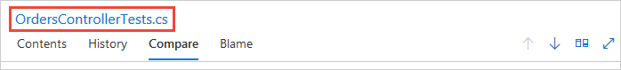
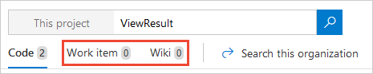

# Functional code search  

[!INCLUDE [version-header](../../includes/version-tfs-2017-through-vsts.md)]

By using Code Search, you can do the following tasks:

* **Search across all of your projects**:
  - Search in your own codebase and your partner teams' code bases. 
  - Use cross-project searches over all the code in your Azure DevOps or TFS instance to search across your enterprise's entire codebase. 
  - Narrow your search by using project, repository, path, file name, and other filter operators. 
  - [Use wildcards to widen your search](#broaden-your-search-by-using-wildcards) and [Boolean operators to fine-tune it](#narrow-your-search-by-using-boolean-operators). 

* **Find specific types of code**: 
  - Use code type filters to search for the following specific kinds of code:
    - definitions
    - references
    - functions
    - comments
    - strings
    - namespaces
    - and more
  - Use Code Search to narrow down your results to exact code type matches. 
  - Go quickly to a method definition to understand its implementation. Apply the definition filter or scope the search to references to view calls and maximize code reuse.

* **Easily drill down or widen your search**: 
  - When you find an item of interest, place the cursor on it and use the shortcut menu to quickly search for that text across all your projects and files. 
  - Easily trace how your code works by using the shortcut menu to search for related items such as definitions and references - directly from inside a file.

<a name="syntaxdetails"></a>

## Prerequisites

To use Code Search, you must have at least a **Basic** access. **Stakeholders** don't have access to code, and so don't have access to Code Search. 

## Start searching code

Code Search requires the [Code Search extension](https://marketplace.visualstudio.com/items?itemName=ms.vss-code-search). If it isn't installed, request that a member of your Project Collection Administrators group [install it](../..//marketplace/install-extension.md).  

::: moniker range=">= azure-devops-2019"
  
To start your search, choose **Repos** > **Files** or another page under **Code**. Enter a keyword or phrase in the search box, and then select *Enter* or choose :::image type="icon" source="../search/media/shared/start-search-icon.png" border="false"::: start search. 

:::image type="content" source="../../organizations/public/media/search/code-search-vert.png" alt-text="Code Search box":::
 
::: moniker-end

::: moniker range=" <= tfs-2018"

1. In the search box, check that the text displays _Search code_. If it doesn't, select it.

   :::image type="content" source="media/code-search-get-started/title-bar-search-box-empty-outlined.png" alt-text="Switch between searching for code and work items":::

2. Enter a search string in the text box, and then select _Enter_ or  
    start search.

::: moniker-end

### View and filter code results

 The search page shows a list of the matching code files. The selected file has all instances of the search string highlighted. If you see a list of work items, ensure **Code** is selected in the top left.
	
  :::image type="content" source="media/get-started/code-search-example.png" alt-text="Code search results example":::

1. Assemble more complex search string using the operators and functions listed in the drop-down menu. Select the filter function or code type that you want to include in your search string from the list, and then enter the criteria value.

   :::image type="content" source="media/get-started/code-search-filters.png" alt-text="Code search bar":::

   * Find all instances of "ToDo" comments in your code by selecting `comment:` and entering `todo`. 
   * Search in specific locations, such as within a particular path, by using a search string such as `Driver path:MyShuttle/Server`. 
   * Search for files by name, such as `Driver file:GreenCabs.cs`, or just by file extension. For example, the search string `error ext:resx` could be useful when you want to review all error strings in your code. Even if your plain text search string matches part of a filename, the file appears in the list of found files.
   * Combine two or more words by using Boolean operators; for example, `validate OR release`.
   * Find an exact match to a set of words by enclosing your search terms in double-quotes. For example, `"Client not found"`. 
   * Use the code type search functions with files written in C#, C, C++, Java, and Visual Basic.NET.
   * Use proximity operators like NEAR, BEFORE, and AFTER to search for files in the vicinity of a term.

2. Widen your search to all projects or your entire organization. Narrow your search to specific areas and types of code by selecting from the drop-down lists at the top of the page.

   

3. Use the tabs in the results page to view the history of the file and to compare versions of the file.

   

4. Choose the filename link at the top of this column to open the file in a new Code Explorer window.

   

5. Quickly [search for work items](work-item-search.md) containing the same search string, or search for the same string in your [project's wiki](../wiki/search-wiki.md).

   

## Syntax for simple and compound searches

> [!NOTE]
> You can't search code in forked repositories. 

Use simple search strings for words or phrases. The default is a whole word search; for example, a search for "valid" won't find instances of the word "validation". However, searches are _not_ case-sensitive.

Words separated by spaces, and not wrapped in double-quotes, are treated as separate search terms and the search will expect to find an occurrence of all the words (in other words, it assumes the `AND` operator between words).

Escape the special characters, `(`,  `)`, `[`, `]`, `:`, `*`, and `?`, by enclosing them in a phrase delimited with double-quotes like `"` and `"`.
<!--- IS THIS TRUE?
When you search from inside a project, the default is to search only within that project. You can go up to higher levels to broaden your search.
-->

In a Git project, you see a list of the repositories that it contains. Use the project and repository checkboxes to widen your search. You can search more or all projects, or narrow your search to fewer projects and repositories. If there are more than a few projects or repositories, use the **Show more** link to see them all.

Code Search can index multiple branches in a Git repository. By default it indexes files in only the default branch of your Git repositories. Your default branch is usually the **main** branch. Specify the branches for each repository, indexing in the **Options** tab of the **Repositories** section, [project settings page](../navigation/go-to-service-page.md#open-project-settings).

::: moniker range=">= azure-devops-2019"

::: moniker-end

In a TFVC project, you see a list of folder paths in that project for which you have read access - you won't see any projects and folders 
for which you don't have read permission. Select paths in the folder tree to narrow your search if necessary.

Code Search remembers your last settings, such as the project and repository or path that you searched in. Clear the checkboxes to search across all projects easily with the **Clear all** links when you want to search in a different scope. In the results pane, Code Search highlights up to the first 100 hits or matches found in the target files.  

### Narrow your search by using Boolean operators
 
Narrow your search by using Boolean operators to combine search criteria. Combine multiple search criteria using `AND`, `OR`, or `NOT` (they must be uppercase). 

Use parentheses to specify the precedence of the operations when you use more than one Boolean operator. By default, a search combines all the words you enter using the `AND` operator so that it only returns files that contain all of the words you entered. 

For example:

* `validate AND revisit` finds files that contain both the words **validate** and 
  **revisit**. `AND` is the default operator, and so it's equivalent to 
  the search string `validate revisit`.
* `validate OR revisit` finds files that contain either of the words **validate** or **revisit**.
* `validate NOT revisit` finds files that contain the word **validate** but not the word **revisit**.
* `(validate NOT revisit) OR "release delayed"` finds files that contain the word **validate**
  but not the word **revisit** or files that contain the phrase **release delayed**.

### Broaden your search by using wildcards

Use the wildcard characters `*` and `?` to broaden your search criteria. 

For example:

* `CodeSenseHttp*` finds files containing words that start with **CodeSenseHttp**, 
  such as **CodeSenseHttpClient** and **CodeSenseHttpClientTest**.
* `CodeA23?R` finds files containing words that start with **CodeA23**, have any 
  alphanumeric character next, and end with **R**. For example, **CodeA234R** and **CodeA23QR**. 

You can use wildcard characters anywhere in your search string **except** as a **prefix** in a simple search string or a query that uses a [code type filter](#codefunctions). 
For example, you can't use a search query such as `*RequestHandler` or `class:?RequestHandler`. However, you can use prefix wildcards with the other search filter functions; for example, the search query strings `file:*RequestHandler.cs` and `repo:?Handlers` are valid.  

You can use more than one `?` wildcard to match more than one character.

> [!WARNING]
> **No results found for ...**  
> If there's a very large number of hits when using a wildcard search, such as when using a very simple wildcard search string, you may see a message that no matching files were found. In this case, narrow your search to reduce the number of matches. For example, specify more characters of the word(s) you want to find, or add a condition or filter to limit the number of possible matches.   

### Search for phrases

To find an exact match to a set of words, enclose your search terms in double-quotes to do a _phrase search_. 

For example, `"Client not found"`.

Within a phrase:

* Boolean operators are treated as literal text.
* The query language characters `:()[]*?` are treated as literal text.
* Escape only the special characters `\` and `"`.

 ::: moniker range=" azure-devops"

### Search for special characters

You can include special characters in a search string, or search specifically for special characters,
according to the following rules:

* Search for any special character that isn't a part of the query language, 
  for example, excluding the characters `: ( )[ ]*?`) as either a simple search string
  or a phrase search string. For example, `react-redux` or `"react-redux"` will produce the same results.

* Search for a special character that is a part of the query language (`: ( )[ ]*?`)
  by enclosing the search string within double-quotes. For example, `"flatten()"` will
  find the literal string `flatten()`.

* Search for a literal occurrence of the double-quote character `"` by preceding it with the
  escape character `\` and enclosing the search string in double-quotes.
  For example, `"\"react-redux\""` will find the literal string `"react-redux"`. 

### Search based on proximity

You can search for files based on the term *vicinity* using proximity operators: NEAR, BEFORE, and AFTER (must be uppercase). By default, proximity search looks for terms within five tokens distance. 

For example:

- BEFORE: `term1` BEFORE `term2` - returns all files where `term1` occurs BEFORE `term2` within a distance of five tokens between them.
- AFTER: `term1` AFTER `term2`: returns the same results as `term2` BEFORE `term1`.
- NEAR: `term1` NEAR `term2`: returns all files where `term1` is within five token distance from `term2` in any direction. `term1` NEAR `term2` returns the same results as `term1` BEFORE `term2` OR `term2` BEFORE `term1`.

> [!NOTE]
> - Wildcards and composite proximity searches, such as `term1` BEFORE `term2` AFTER `term3` aren't supported. 
> - You can combine proximity operators with other filters and operators to narrow your search.
> - There isn't support to customize the token distance, which defaults to five. 

::: moniker-end

<a name="codefunctions"></a>

## Functions to find specific types of code

As you type in the search box, select functions and keywords from the drop-down list to quickly create your query. Use the **Show more** link to display all the available functions and keywords. Mix and match the functions as required.

You can also select one or a combination of filters from the list in the left column. Again, the **Show more** link displays all the available functions and keywords.

Instead, you can type the functions and parameters directly into the search box. The following table shows the full list of functions for selecting specific types or members in your C#, C, C++, Java, and Visual Basic.NET code.

| To find code where _findThis_ appears as a ... | ... search for argument **arg:**_findThis_ |
| --- | --- |
| Argument | **arg:**_findThis_ ```Deprecated in July 2019```| 
| Base type | **basetype:**_findThis_ | 
| Calling function | **caller:**_findThis_ ```Deprecated in July 2019```|
| Class definition or declaration | **class:**_findThis_ |
| Class declaration | **classdecl:**_findThis_ ```Merged with class:```|
| Class definition | **classdef:**_findThis_  ```Merged with class:```|
| Comment | **comment:**_findThis_ |
| Constructor | **ctor:**_findThis_ ```Merged with method:```|
| Declaration | **decl:**_findThis_ |
| Definition | **def:**_findThis_ |
| Destructor | **dtor:**_findThis_ ```Merged with method:```|
| Enumerator | **enum:**_findThis_ |
| Extern | **extern:**_findThis_ ```Deprecated in July 2019```|
| Field | **field:**_findThis_ |
| Friend function | **friend:**_findThis_ ```Deprecated in July 2019```|
| Function | **func:**_findThis_ ```Merged with method:```|
| Function declaration | **funcdecl:**_findThis_ ```Merged with method:```|
| Function definition | **funcdef:**_findThis_ ```Merged with method:```|
| Global | **global:**_findThis_ ```Deprecated in July 2019```|
| Header | **header:**_findThis_ ```Deprecated in July 2019```|
| Interface | **interface:**_findThis_ |
| Macro | **macro:**_findThis_ |
| Macro definition | **macrodef:**_findThis_ ```Merged with macro:```|
| Macro reference | **macroref:**_findThis_ ```Merged with macro:```|
| Method | **method:**_findThis_ |
| Method declaration | **methoddecl:**_findThis_ ```Merged with method:```|
| Method definition | **methoddef:**_findThis_ ```Merged with method:```|
| Namespace | **namespace:**_findThis_ |
| Property | **prop:**_findThis_ |
| Reference | **ref:**_findThis_ |
| String literal | **strlit:**_findThis_ |
| Struct | **struct:**_findThis_ ```Merged with type:```|
| Struct declaration | **structdecl:**_findThis_ ```Merged with type:```|
| Struct definition | **structdef:**_findThis_ ```Merged with type:```|
| Template argument | **tmplarg:**_findThis_ ```Deprecated in July 2019```|
| Template specification | **tmplspec:**_findThis_ ```Deprecated in July 2019```|
| Type | **type:**_findThis_ |
| Typedef | **typedef:**_findThis_ ```Merged with type:```|
| Union | **union:**_findThis_ ```Deprecated in July 2019```|

## Find two or more keywords using Boolean operators

- validate AND revisit finds files that contain both the words validate and revisit. AND is the default operator, and so this is equivalent to the search string validate revisit.
- validate OR revisit finds files that contain either of the words validate or revisit.
- validate NOT revisit finds files that contain the word validate but not the word revisit.
- (validate NOT revisit) OR "release delayed" finds files that contain the word validate but not the word revisit or files that contain the phrase release delayed.

<a name="locationfunctions"></a>

## Functions to select projects, repositories, paths, and files

Functions make it easy to narrow the search to specified locations, specific types of files within these locations, or specified filenames. Mix and match the functions as required.

Narrow the search to a specific location using the `proj`, `repo`, or `path` filters:

* `QueueJobsNow proj:Fabrikam` finds all occurrences of the word **QueueJobsNow** in the **Fabrikam** project.
* `QueueJobsNow repo:Contoso` finds all occurrences of the word **QueueJobsNow** in the **Contoso** repository.
* `QueueJobsNow path:VisualStudio/Services/Framework` finds all occurrences of the word **QueueJobsNow** 
  in the path **VisualStudio/Services/Framework** and its subpaths.
* Enclose the argument to the filter in double-quotes if it contains a space. 
  For example: `QueueJobsNow path:"VisualStudio/Windows Phones and Devices/Services"`.

Narrow the search to specific files using the `file` or `ext` filters:

* `QueueJobsNow file:queueRegister*` finds all occurrences of the word **QueueJobsNow** in all 
  files where the filename starts with **queueRegister**.
  Use quotes to find files without extensions: file:"queueRegister" finds all files with the name QueueRegister without an extension.
* `QueueJobsNow ext:cs` finds all occurrences of the word **QueueJobsNow** in only C# source files.
* A plain text search string that doesn't include file type functions 
  will also find files where the string matches part of the filename.

## Find code comments

......................................

## Find related items or other terms
   
One of the powerful features of Code Search is the capability to expand your search interactively, based on the results of previous searches. For example, you can easily broaden your search to related files when tracing or debugging code. 

Place the insertion point on a term in the file and open the shortcut menu (mouse: right-click) to start a new search for other files containing the selected term. You can search for it as text, for 
the definition if you select an object name, or for references to a selected object. 

## More examples

See the following examples of even more search functions:

* Find all instances of "ToDo" comments in your code by selecting `comment:` and typing `todo`. 
* Search in specific locations, such as within a particular path, by using a search string such as `Driver path:MyShuttle/Server`. 
* Search for files by name, such as `Driver file:GreenCabs.cs`, or just by file extension. For example, the search string `error ext:resx` could be useful when you want to review all error strings in your code. Even if your plain text search string, without specific file type functions, matches part of a filename, the file appears in the list of found files.
* Combine two or more words by using Boolean operators; for example, `validate OR release`.
* Find an exact match to a set of words by enclosing your search terms in double-quotes. For example, `"Client not found"`. 
* Use the code type search functions with files written in C#, C, C++, Java, and Visual Basic.NET.
* Open the search results in a new browser tab from either search box and select _Ctrl_ + _Enter_. In Google Chrome, select _Ctrl_ + _Shift_ + _Enter_ to switch the focus to the new browser tab. 

## Search Code with REST API

You can use APIs to extend or supplement the capabilities listed in this article. For information about Code Search with REST API, see [Fetch Code Search Results](https://docs.microsoft.com/rest/api/azure/devops/search/code%20search%20results/fetch%20code%20search%20results?preserve-view-not-set).

[!INCLUDE [search-limitations](includes/search-limitations.md)]

## Next steps

> [!div class="nextstepaction"]

## Related articles

* [Search artifacts and packages](functional-package-search.md)
* [Search work items](functional-work-item-search.md)
* [Search wiki](../wiki/search-wiki.md)
