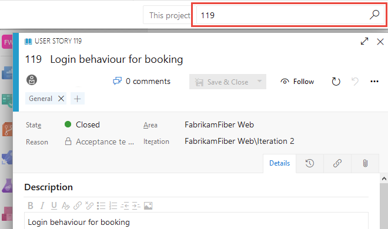
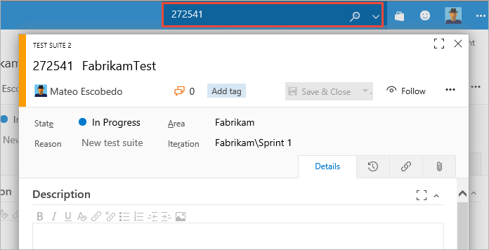
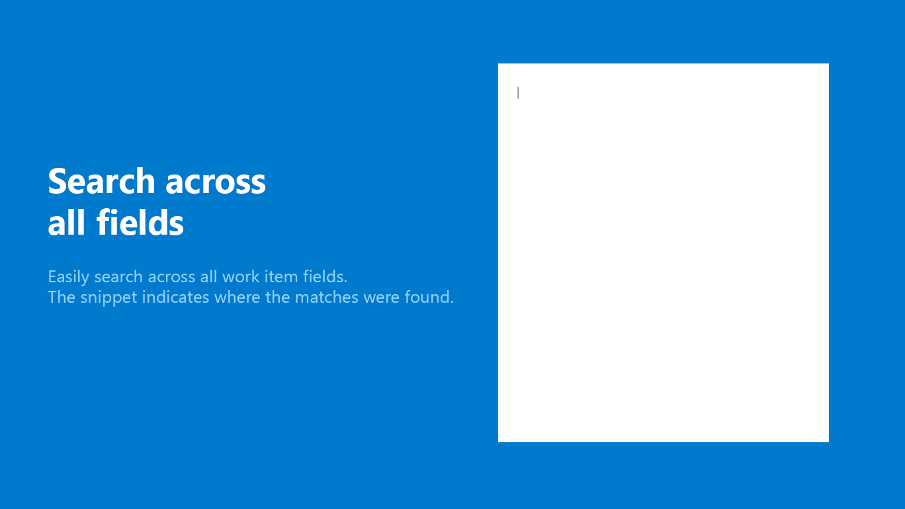
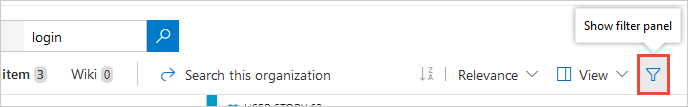
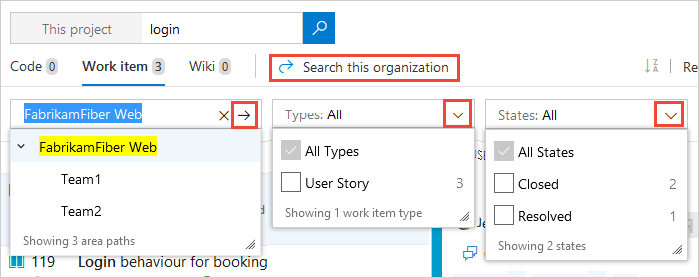
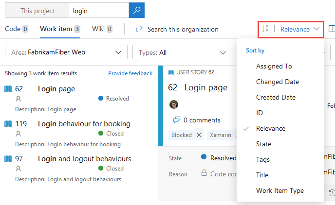
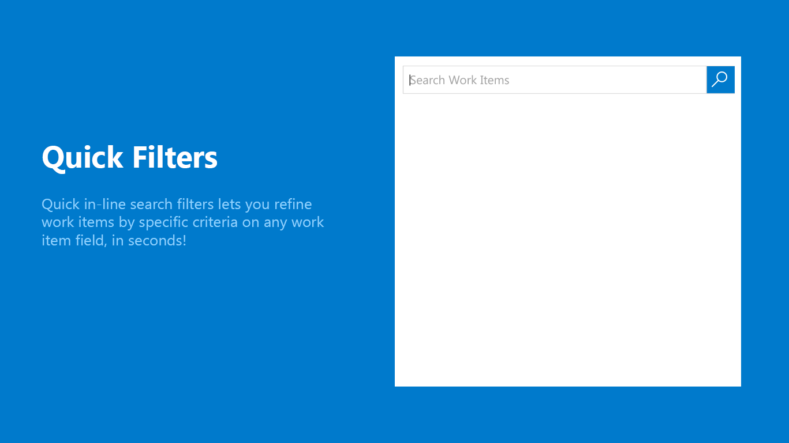

# Functional work item search

[!INCLUDE [version-header](../../includes/version-tfs-2017-through-vsts.md)]

Functional work item search command filters extend your ability to refine your search of work items based on assignment, work item type, specific fields, and more. This is in addition to the filter functions documented in [Get started with search](get-started-search.md). Work item search is a built-in feature available to all Azure DevOps users.

::: moniker range=" azure-devops"

You can use Work Item Search by default without any installation when the Boards service is installed and enabled in Azure DevOps Services.

::: moniker-end

By using Work Item Search, you can do the following tasks and more.

|**Search task**  |**Description**  |
|---------|---------|
|[Search over all your projects](#full-text-search-across-all-fields)   | Search in your own and your partner teams' backlog. Use cross-project searches over all the work items to search across your enterprise's entire work items. Narrow your search by using project and area path filters.         |
|[Search across all work item fields](#full-text-search-across-all-fields)   | Quickly and easily find relevant work items by searching across all work item fields, including custom fields. Use a full text search across all fields to efficiently locate relevant work items. The snippet view indicates where matches were found.        |
|[Search in specific fields](#quick-filters-for-matching-in-specific-fields)  | Use the quick in-line search filters to narrow down to a list of work items in seconds. Use the filters on any work item field. The list of suggestions helps complete your search faster. For example, a search such as **AssignedTo:Chris WorkItemType:Bug State:Active** finds all active bugs assigned to a user named Chris.        |
|Search across test   |Search across Test Plans, Test Suites, and other test work item types.         |
|[Take advantage of integration with work item tracking](#search-by-work-item-id)   | The Work Item Search interface integrates with familiar controls for managing your work items; letting you view, edit, comment, share, and more.        |
## Prerequisites

- All users can use work item search.
### Search by work item ID

Enter the work item ID in the Azure DevOps title bar to quickly go to it. Searching for a work item ID opens the work item in a 
modal dialog, providing quick access to read and edit work items.

::: moniker range=">= azure-devops-2019"

::: moniker-end

::: moniker range="< azure-devops-2019"  

::: moniker-end

## Full text search across all fields

You can easily search across all work item fields, including custom fields, which enables more natural searches. The snippet view indicates where matches were found.

</img>  

- Use simple search strings for words or phrases. Work item search matches derived forms of your search terms; for example, a search for "updating" also finds instances of the word "updated" and "update". Searches aren't case-sensitive.
- When you search from inside a project, the default is to search only within that project. 
- While searching from inside a team, the default is to search only within the default area path of that team. 
  - When you have one project selected, you see a list of area paths in that project for which you have read access - you won't see any projects and area paths for which you don't have read permission
  - Select area paths in the tree to narrow your search if necessary.
- The selected projects are always at the top of the list. Notice that hit counts are also shown for projects that aren't selected. 
- Open the search results in a new browser tab from either the main search function or by selecting **Ctrl** + **Shift** + **Enter**.

## Work item search best practices

- Use a text search across all fields to efficiently locate relevant work items. Text search is useful when you're trying to, for example, search for all work items that had similar exception trace.
- Use the quick in-line search filters on any work item field to narrow down to a list of work items in seconds. The list of suggestions helps complete your search faster.

## Search vs. managed work item queries

You have two ways to find and list work items: managed queries and the main search function. If you're looking for a single work item, use the main search. If you want to generate a list of work items to triage, update, chart, or share with others, use a managed query.

With the main search function, you can search against a more fully indexed set of fields than that of managed queries.  

---
:::row:::
   :::column span="1":::
      **Use a managed query**
   :::column-end:::
   :::column span="1":::
      **Search**
   :::column-end:::
:::row-end:::
---
:::row:::
   :::column span="1":::
      - List items to perform bulk updates to fields.  
      - Review work that's in progress or recently closed.
      - Triage work: set priority, review, update.
      - Create a chart and add it to a dashboard.
      - Create a chart to get a count of items or sum a field.
      - Create a chart that shows a burndown or burnup over time.
      - View a tree of parent-child related work items.
      - List work items with link relationships.
      - List work items for a single project, multiple projects, or across all projects.
   :::column-end:::
   :::column span="1":::
      - Find a specific work item using its ID or a keyword.
      - Find one or more work items across all projects in a fast, flexible manner.  
      - Perform full text search across all work item fields.  
      - Review work items assigned to a specific team member.  
      - Search against specific work item fields to quickly narrow down a list of work items.  
      - Determine what key words will support a managed search.  
      - List work items for a single project, multiple projects, or across all projects.
   :::column-end:::
:::row-end:::
---

To get started, see the following articles:

- [View and run a query](../../boards/queries/view-run-query.md)
- [Use search](../../boards/queries/search-box-queries.md)  
- [Define a query](../../boards/queries/using-queries.md)   

For specific managed query examples, see [Query quick reference, Example queries](../../boards/queries/query-index-quick-ref.md).  

## Apply supported functions to work item search

::: moniker range=">= azure-devops-2019"

1. Fine-tune your search by specifying the fields to search. Enter `a:` and a user name to search for all items assigned to that user.

	:::image type="content" source="media/get-started/search-work-vert.png" alt-text="Search from title bar":::    

   See the following quick filters that you can use:

   * `a:` for **Assigned to:** 
   * `c:` for **Created by:** 
   * `s:` for **State** 
   * `t:` for **Work item type**
 
2. Start entering the name of a field in your work items; for example, enter `ta`.

   :::image type="content" source="media/work-item-search-get-started/dyna-dropdown.png" alt-text="Quick filters as you enter the name of a field":::

   The dropdown list shows work item field name suggestions that match user input. These suggestions help you complete the search faster. For example, a search such as `tags:Critical` finds all work items tagged 'Critical'. 

3. Add more filters to further narrow your search, and use Boolean operators to combine terms if necessary. For example, **a: Chris t: Bug s: Active** finds all active bugs assigned to a user named Chris.

4. Narrow your search to specific types and states, by using the selector lists at the top of the results page.
5. Widen your search across all projects, or narrow it to specific types and states. Use the filter to show the selector lists.

       

6. Select the criteria you want in the drop-down selector lists, or search across the entire organization.

       

7. Sort the results as you need using the drop-down list of field names, work item types, or by relevance.

       

::: moniker-end

::: moniker range=" <= tfs-2018"

1. Fine-tune your search by specifying the fields to search. Enter `a:` and a user name to search for all items assigned to that user.
   
   :::image type="content" source="media/get-started/work-item-search-filters.png" alt-text="Search from the title bar":::   

   See the following quick filters that you can use:

   * `a:` for **Assigned to:** 
   * `c:` for **Created by:** 
   * `s:` for **State** 
   * `t:` for **Work item type**

 
2. Start entering the name of a field in your work items; for example, enter `ta`.

   :::image type="content" source="media/work-item-search-get-started/dyna-dropdown.png" alt-text="Quick filters as you enter a field name":::   

   The dropdown list shows work item field name suggestions that match user input. These suggestions help you complete the search faster. For example, a search such as **tags:Critical** finds all work items tagged 'Critical'. 

3. Add more filters to further narrow your search, and use Boolean operators to combine terms if necessary. For example, **a: Chris t: Bug s: Active** finds all active bugs assigned to a user named Chris.

4. Narrow your search to specific types and states, by using the drop-down selector lists at the top of the results page.
5. Widen your search across all projects, or narrow it to specific types and states. Use the filter to show the selector lists.

       

6. Select the criteria you want in the drop-down selector lists, or search across the entire organization.

       

7. Sort the results as you need using the drop-down list of field names, work item types, or by relevance.

       

::: moniker-end

### Quick filters for matching in specific fields

Quick inline search filters let you refine work items in seconds. The dropdown list of suggestions helps complete your search faster. Mix and match the functions to create quick powerful searches. 

|**Usage**  |**Example** |
|---------|---------|
| Scope your search terms to match in any work item field including custom fields. Enter the field name followed by the search terms.   |`tags:Critical` finds work items having a field 'tags' containing the term 'Critical'.         |
|Use multiple inline search filters to scope your search by any work item field, including custom fields.    | `t: Bug path:"project\search"` finds all bugs in the area path "project\search".        |
|Use the operators `>`, `>=`, `<`, `<=`, `=`, and `!=` for date, integer, and float fields.   |  `t: Bug CreatedDate> @Today-7` finds all bugs created in the last week.       |
|For the search query that contains multiple terms and users looking for exact match, embed the search term inside `" "`   | `BuildPath: "tools.demoproject.com"` finds all work items that necessarily contain the path "tools.demoproject.com".        |

</img>  

### Scope projects and area and iteration paths using filters 

Filters make it easy to narrow the search to specified projects and area paths.

Narrow the search to a specific location using the `proj`, `area`, `iteration`, `path`, and `comment` filters:

|**Usage** |**Example**  |
|---------|---------|
|Finds all occurrences of the word **Wiki** in the **Fabrikam** project.  |    `Wiki proj:Fabrikam`      |
|Finds all occurrences of the word **Wiki** in the area path **Contoso/Mobile** and its subpaths.     |  `Wiki area:Contoso/Mobile`        |
|Finds all occurrences of the word **Wiki** in the iteration path **Contoso/Sprint101** and its subpaths.    |  `Wiki iteration:Contoso/Sprint101`        |
|Enclose the argument to the filter in double-quotes if it contains a space.  | `Wiki path:"Contoso/Windows Phones and Devices/Services"`        |
|Finds backlog comments | `comment:todo` |

## See more of the work item

You can quickly get a full screen view of the selected work item using  **expand** and  **shrink** in the toolbar. However, another way to see more of the work item, while you can still
select work items from the list of matching results, is to hide the left column filter pane
by choosing **&lt;** at the top left of the column. Use **&gt;** to restore the filter pane. 

If you're using a portrait orientation screen, use the **Preview pane: Right** link at the top right of the window to display the code below the search results list.

> [!TIP]
> Search remembers the state of the filter pane, configuration of the work item view pane, and its position between sessions as part of your user preferences.

## Search Work Items with REST API

You can use APIs to extend or supplement the capabilities listed in this article. For information about Work Item Search with REST API, see [Fetch Work Item Search Results](/rest/api/azure/devops/search/work%20item%20search%20results/fetch%20work%20item%20search%20results).

## Next steps

> [!div class="nextstepaction"]
> [Supported filter functions and more for work items](../../boards/backlogs/filter-backlogs-boards-plans.md#supported-filter-functions)

## Related articles

- [Get started with Search](get-started-search.md)
- [Search code](functional-code-search.md)
- [Search artifacts and packages](functional-package-search.md)
- [Search FAQs](faq-search.yml)
