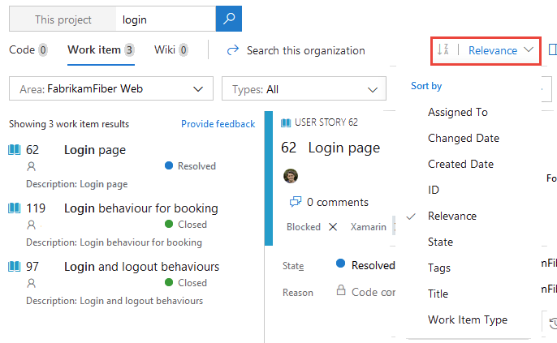

# Get started with semantic search

[!INCLUDE [version-header](../../includes/version-tfs-2017-through-vsts.md)]

The Search function and extensions available for Azure DevOps enable you to easily search across all the projects, teams, and repositories to which you have access.

::: moniker range=">= tfs-2018"

With semantic search, you can quickly find work items, code files, wiki pages, or packages based on a keyword, wildcards, and other supported semantic search filters.

::: moniker-end 

::: moniker range="tfs-2017"

With semantic search, you can quickly find work items and code files based on a keyword, wildcards, and other supported semantic search filters.

::: moniker-end

You can find an at-a-glance look at all of the [semantic Search features](#semantic-search-features) further in this article.

## Prerequisites

- Every project member can use the semantic search functions, including project members granted Stakeholder, Basic, and higher levels of access.
- When searching across the organization or collection, only results for which a project member has access are listed.
- Stakeholder wiki search results are limited to provisioned wikis. Because published wikis require access to regular repositories, which Stakeholders don't have access to, results for published wikis don't appear in the search results. Similarly, Code search results don't appear for Stakeholders.

::: moniker range="<= azure-devops-2020"

> [!NOTE]
> For Code search, a Collection Administrator must install the Code Search extension.

::: moniker-end

## Start searching with a keyword

A keyword search is the most basic type of search to get started. Enter a word enclosed with double quotes, and then select _Enter_ or choose :::image type="icon" source="media/shared/start-search-icon-new.png" border="false"::: start search. You can also search for a phrase by enclosing your search terms in double-quotes.

By default, semantic search covers everything in Azure DevOps. You can narrow down your results and focus on what you need by using [Boolean operators](#narrow-your-search-with-boolean-operators).

::: moniker range=">= azure-devops-2019"

:::image type="content" source="media/shared/title-bar-search-box-select-type-tfs.png" alt-text="Search boxes in Azure DevOps":::

::: moniker-end

::: moniker range="< azure-devops-2019"

:::image type="content" source="media/shared/title-bar-search-box-select-type.png" alt-text="Search boxes in TFS 2018 and earlier":::

::: moniker-end

> [!TIP]
> Searches aren't case-sensitive.

## Semantic search features

The following features apply to all searches - work items, code, wiki, and packages.

---  
:::row:::
   :::column span="1":::
      **Search feature** 
   :::column-end:::
   :::column span="2":::
      **Usage**
   :::column-end:::
   :::column span="2":::
      **Example**
   :::column-end:::
:::row-end:::
---
:::row:::
   :::column span="1":::
      **Keyword** 
   :::column-end:::
   :::column span="2":::
      Search based on one or more keywords.
   :::column-end:::
   :::column span="2":::
      Enter `validate` to find instances that contain the word *validate*.
   :::column-end:::
:::row-end:::
---
:::row:::
   :::column span="1":::
      **Exact match** 
   :::column-end:::
   :::column span="2":::
      Search based on an exact match, enclosed in double-quotes.
   :::column-end:::
   :::column span="2":::
      Enter `"Client not found"` to find instances that contain the exact phrase match *Client not found*.
   :::column-end:::
:::row-end:::
---
:::row:::
   :::column span="1":::
      **Wildcard** 
   :::column-end:::
   :::column span="2":::
      - Add wildcard characters, `*` and `?`, to keywords to extend the search criteria. 
      - Add `*` at the end of a keyword to find items that start with the keyword. 
      - Add `?` in the middle to represent any alphanumeric character. 
      - Use wildcard characters anywhere in your search string except as a prefix. You can use prefix wildcards with the other search filter functions.
      - You can use more than one wildcard to match more than one character.
   :::column-end:::
   :::column span="2":::
      Specify `alpha?version` to find instances of alpha1version and alphaXversion. Specify `Browser*` to find instances of BrowserEdge, BrowserIE, and BrowserFirefox. `CodeSenseHttp*` finds files containing words that start with *CodeSenseHttp*, such as CodeSenseHttpClient and CodeSenseHttpClientTest.
   :::column-end:::
:::row-end:::
---
:::row:::
   :::column span="1":::
      **Boolean operators** 
   :::column-end:::
   :::column span="2":::
      - Find two or more keywords using Boolean operators: AND, OR, and NOT (must be uppercase).
      - Add parenthesis to clauses to support logical groupings.
      - Because AND is the default operator, an entry of two keywords with no operator is the same as an AND search.
   :::column-end:::
   :::column span="2":::
      - `Validate AND revisit` finds files that contain both the words *validate* and *revisit*. 
      - `Validate OR revisit` finds files that contain either of the words *validate* or *revisit*.
      - `Validate NOT revisit` finds files that contain the word *validate* but not the word *revisit*.
      - `(Validate NOT revisit) OR "release delayed"` finds files that contain the word *validate* but not the word *revisit* or files that contain the phrase *release delayed*. 
   :::column-end:::
:::row-end:::
---
::: monikerRange="azure-devops"
:::row:::
   :::column span="1":::
      **Proximity** 
   :::column-end:::
   :::column span="2":::
      You can search for files based on the term vicinity using proximity operators: NEAR, BEFORE, and AFTER (must be uppercase). By default, proximity search looks for terms within five tokens distance
   :::column-end:::
   :::column span="2":::
      - BEFORE: term1 BEFORE term2 - returns all files where term1 occurs BEFORE term2 within a distance of five tokens between them. 
      - AFTER: term1 AFTER term2 - returns the same results as term2 BEFORE term1. 
      - NEAR: term1 NEAR term2 - returns all files where term1 is within five token distance from term2 in any direction. term1 NEAR term2 returns the same results as term1 BEFORE term2 OR term2 BEFORE term1.
   :::column-end:::
:::row-end:::
::: moniker-end
---
:::row:::
   :::column span="1":::
      **Special characters** 
   :::column-end:::
   :::column span="2":::
      You must escape the special characters `(`, `)`, `[`, `]`, `:`, `*`, and `?` by enclosing them in a phrase delimited with double-quotes " and ". You can include special characters in a search string, or search specifically for special characters, according to the following rules: CodeA23?R finds files containing words that start with CodeA23, have any alphanumeric character next, and end with R. For example, CodeA234R and CodeA23QR.   Search for any special character that isn't a part of the query language. For example, excluding the characters: ( )[]*?) as either a simple search string or a phrase search string. For example, react-redux or "react-redux" will produce the same results. Search for a special character that is a part of the query language (: () []*?) by enclosing the search string within double-quotes. 
   :::column-end:::
   :::column span="2":::
      `"flatten()"` will find the literal string *flatten()*. Search for a literal occurrence of the double-quote character *"* by preceding it with the escape character `\` and enclosing the search string in double-quotes. `"\"react-redux\""` will find the literal string "react-redux". 
   :::column-end:::
:::row-end:::
---

## Choose your semantic search starting page

The features that are available to you depend on the page that you start your search from.

### Start searching from the Projects page

From your organization's Overview page, enter a keyword or phrase in the semantic search, and then select **Enter** or choose :::image type="icon" source="media/shared/start-search-icon-new.png" border="false"::: start search.

:::image type="content" source="media/get-started/start-search-from-org-project-page.png" alt-text="Starting search from organization projects page":::

### Start searching from the Project-Overview page

From your project's Overview page, enter a keyword or phrase in the semantic search, and then select **Enter** or choose :::image type="icon" source="media/shared/start-search-icon-new.png" border="false"::: start search.

:::image type="content" source="media/get-started/start-search-from-project-overview-page.png" alt-text="Start search from project overview page":::

### Start searching from a Boards page

Start searching across all your work items over all your projects with a keyword or phrase. Work item search includes all work item types, including test-related and custom work item types.

::: moniker range=">= azure-devops-2019"

1. Choose any **Boards** page, enter a keyword or phrase in the semantic search, and select _Enter_ or choose :::image type="icon" source="../search/media/shared/start-search-icon.png" border="false"::: start search. 

   :::image type="content" source="media/get-started/work-item-search-vert.png" alt-text="Project semantic search":::

2. Search results display in a snippet view where the matches found are shown in bold.

   :::image type="content" source="media/work-item-search-get-started/results-matching.png" alt-text="Search matching results":::

   This full text search uses simple search strings for words or phrases. Work item search matches derived forms of your search terms; for example, a search for
   "check" also finds instances of the word "checked" and "checking".

3. Select a snippet of a work item to display it in the window on the right side of your screen. 
  
   Open the search results in a new browser tab from the semantic search by selecting _Ctrl_ + _Enter_ or by holding _Ctrl_ and selecting  start search.

4. In Google Chrome, select _Ctrl_ + _Shift_ + _Enter_ to switch the focus to the new browser tab. 

::: moniker-end

::: moniker range=" <= tfs-2018"

1. In the semantic search, check that the text says _Search work items_. If it doesn't, use the selector to select it.

      

2. Enter a search string in the text box, and select _Enter_ or  
   
    start search. 

3. Search results display in a snippet view where the matches found are shown in bold.

   

   This full text search uses simple search strings for words or phrases. Work item search matches derived forms of your search terms; for example, a search for "updating" will also find instances of the word "updated" and "update". Searches aren't case-sensitive.

4. Select a snippet of a work item to display it in the right window. 
  
   Open the search results in a new browser tab from semantic search by selecting _Ctrl_ + _Enter_ or by holding _Ctrl_ and clicking  the
    icon. In Google Chrome, select _Ctrl_ + _Shift_ + _Enter_ to switch the focus to the new browser tab. 

::: moniker-end

For more information about searching and filtering in Azure Boards, see [Filter backlogs, boards, and plans](../../boards/backlogs/filter-backlogs-boards-plans.md).

> [!TIP]
> * If you get no results matching the input, try removing filters and retry the search. Broadening the search and after you view the search results, you can apply appropriate filters again and search again for relevant results.
> * Check for the spelling of your search terms. Currently Work item search doesn't support ignoring of users' spelling mistakes.
> * If there are lots of hits when you're using a wildcard search, such as when you're using a simple wildcard search string, you may see a message that no matching files are found. In this case, narrow your search to reduce the number of matches. Specify more characters of the word or words that you want to find, or add a condition or filter to limit the number of possible matches.

### Start searching from a Wiki page

When you search from Wiki, you automatically navigate to wiki search results. Text search across the wiki is supported by the search platform.

:::image type="content" source="../wiki/media/search/wiki-search-example-vert.png" alt-text="Start search from wiki page":::

For more information about searching wikis, see [Search Wiki](../wiki/search-wiki.md) and [Provisioned vs. published wiki](../wiki/provisioned-vs-published-wiki.md).

> [!WARNING]
> **No results found for ...**  
> If there's a large number of hits when using a wildcard search, such as when using a very simple wildcard search string, you may see a message that no matching files were found. In this case, narrow your search to reduce the number of matches. For example, specify more characters of the word(s) you want to find, or add a condition or filter to limit the number of possible matches.   

## Extensions for Search

> [!NOTE]
> Some extensions aren't supported features of Azure DevOps and therefore aren't supported by the product team. For questions, suggestions, or issues you have when using these extensions, visit their corresponding extension page on the [Visual Studio Marketplace](https://marketplace.visualstudio.com/items?itemName=ms.vss-code-search).

- [Code Search](https://marketplace.visualstudio.com/items?itemName=ms.vss-code-search) - Extends semantic search with fast, flexible, and precise search results across all your code. Required for searching repositories.
- [Azure Paths Search](https://marketplace.visualstudio.com/items?itemName=wavemotionio.ado-areapaths) - Adds a special search hub to Boards for searching within iterations and area paths without having to create and maintain custom queries.

## Other search functions

If you want to search for various settings, users, projects, and more, see the following table to find non-semantic search tasks and corresponding actions.

| **Non-semantic search task**                      | **Action**                                                             |
|----------------------------------------------|------------------------------------------------------------------------|
| Find an organization setting                 | Go to your organization and select **Organization settings**.           |
| Find a project setting                       | Go to your project and select **Project settings**.                     |
| Find a user setting                         | Go to your **User settings page**.                                     |
| Find a user                                  | Go to your organization and select **Organization settings** > **Users**, and then enter the name in the filter box.   |
| Find an organization                         | Scroll through the left side of your screen, which lists all organizations.      |
| Find a project                               | Go to your organization, and then enter the project name in the Filter projects box.   |
| View file history and compare versions       | Go to **Repos** > **Files**, highlight your file, and then select **History**.              |

## Next steps

> [!div class="nextstepaction"]
> [Functional work item search](functional-work-item-search.md) or
> [Functional code search](functional-code-search.md) or
> [Functional artifact or package search](functional-package-search.md)

## Related articles
* [Code Search blog posts](https://devblogs.microsoft.com/devops/?s=code+search&submit=%EE%9C%A1)
* [Work item search blog posts](https://devblogs.microsoft.com/devops/?s=work+item+search&submit=%EE%9C%A1)
* [Search wiki](../wiki/search-wiki.md)
