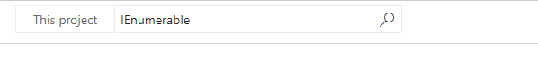
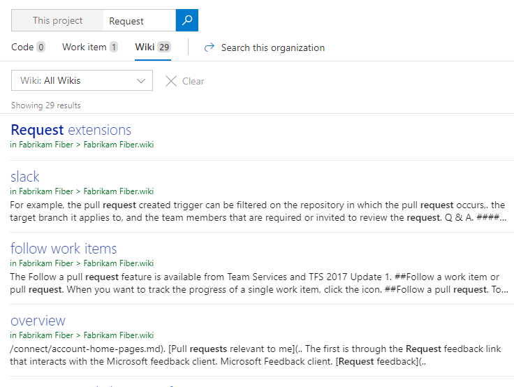

# Get started searching

[!INCLUDE [version-header](../../includes/version-tfs-2017-through-vsts.md)]

The Search function and extensions available for Azure DevOps enable you to easily search across all the projects, teams, and repositories to which you have access.

Azure DevOps stores a tremendous amount of information, which includes the following data:  
- Work items for planning and tracking your work  
- Wiki content for sharing information  
- Source code to maintain code and a history of code file changes  
- Build and release pipeline services to help you ship effortlessly. 

## Prerequisites

- Everyone can use the basic Search function. 
- You must be a Stakeholder to perform semantic searches on work items, wiki, and packages.
- You must be an administrator to perform searches on code.

## Keyboard shortcut to search box
 
A keyword search is the most basic type of search to get started. Default search searches everything. Services - source code, need versioning content You can narrow down your results and focus on what you need by using [filters](#filter-features). 

## Search features

| To find ...                     | Enter in search box ..                                                               |                            |
|---------------------------------|--------------------------------------------------------------------------------------|----------------------------|
| Search within a specific path   | -*In Code:* Driver path:MyShuttle/Server, -*In Work item:*  Area:Fabrikam\DevOps\Web |                            |
| Search for a file name          |                                                                                      |                            |
| Search for a work item by Title |                                                                                      |                            |
| Search for two keywords         | validate OR release                                                                  |                            |
| Exact keyword or phrase match   | "Client not found"                                                                   | Enclose with double quotes |
| Instant search for work items   | *work item #*                                                                        |                            |
| Row8                            |                                                                                      |                            |
| Row9                            |                                                                                      |                            |
| Row10                           |                                                                                      |                            |

::: moniker range=">= tfs-2018"  
With the search box, you can quickly find a code file, work item, or wiki page. 
::: moniker-end  

::: moniker range="tfs-2017"  
With the search box, you can quickly find a code file or work item.  
::: moniker-end  

## Start work item search

::: moniker range=">= azure-devops-2019"

1. Choose any **Boards** page, enter a keyword or phrase in the search box, and select *Enter* or choose :::image type="icon" source="../search/media/shared/start-search-icon.png" border="false"::: start search. 

   :::image type="content" source="../navigation/media/search/work-item-search-vert.png" alt-text="Project search box":::

2. Search results display in a snippet view where the matches found are shown in bold.

   :::image type="content" source="media/work-item-search-get-started/results-matching.png" alt-text="Search results":::

   This is a full text search that uses simple search strings for words or phrases.
   Work item search matches derived forms of your search terms; for example, a search for
   "updating" also finds instances of the word "updated" and "update". Note that searches are _not_ case-sensitive.

3. Select a snippet of a work item to display it in the window on the right side of your screen. 
  
   Open the search results in a new browser tab from a search box by
   selecting _Ctrl_ + _Enter_ or by holding _Ctrl_ and selecting  
    start search.

4. In Google Chrome, select _Ctrl_ + _Shift_ + _Enter_ to switch the focus
   to the new browser tab. 

::: moniker-end 

::: moniker range=">= tfs-2017 <= tfs-2018"

1. In the search box, check that the text says _Search work items_. If it doesn't, use the selector to select it.

      

2. Enter a search string in the text box, and select _Enter_ or  
   
    start search. 

3. Search results display in a snippet view where the matches found are shown in bold.

   

   This is a full text search that uses simple search strings for words or phrases. Work item search matches derived forms of your search terms; for example, a search for "updating" will also find instances of the word "updated" and "update". Note that searches are _not_ case-sensitive.

4. Select a snippet of a work item to display it in the right window. 
  
   Open the search results in a new browser tab from a search box by
   selecting _Ctrl_ + _Enter_ or by holding _Ctrl_ and clicking  the
    icon.
   In Google Chrome, select _Ctrl_ + _Shift_ + _Enter_ to switch the focus
   to the new browser tab. 

::: moniker-end

### Use filters for work item search

::: moniker range=">= azure-devops-2019"

1. Fine tune your search by specifying the fields to search. Enter `a:` and a user name to search for all items assigned to that user.

	:::image type="content" source="../navigation/media/search/search-work-vert.png" alt-text="Search from title bar":::    

   The quick filters you can use are:

   * `a:` for **Assigned to:** 
   * `c:` for **Created by:** 
   * `s:` for **State** 
   * `t:` for **Work item type**

 
2. Start entering the name of a field in your work items; for example, enter `ta`.

   :::image type="content" source="media/work-item-search-get-started/dyna-dropdown.png" alt-text="Quick filters as you enter the name of a field":::

   The dropdown list shows work item field name suggestions that match user input thereby helping the user to complete the search faster. For example, a search such as **tags:Critical** finds all work items tagged 'Critical'. 

3. Add more filters to further narrow your search, and use Boolean operators to combine terms if required. For example, **a: Chris t: Bug s: Active** finds all active bugs assigned to a user named Chris.

4. Narrow your search to specific types and states, by using the drop-down selector lists at the top of the results page.

::: moniker-end

::: moniker range=">= tfs-2017 <= tfs-2018"

1. Fine tune your search by specifying the fields to search. Enter `a:` and a user name to search for all items assigned to that user.
   
   :::image type="content" source="../navigation/media/search/work-item-search-filters.png" alt-text="Search from the title bar":::   

   The quick filters you can use are:

   * `a:` for **Assigned to:** 
   * `c:` for **Created by:** 
   * `s:` for **State** 
   * `t:` for **Work item type**

 
2. Start entering the name of a field in your work items; for example, enter `ta`.

   :::image type="content" source="media/work-item-search-get-started/dyna-dropdown.png" alt-text="Quick filters as you enter a field name":::   

   The dropdown list shows work item field name suggestions that match user input thereby helping the user to complete the search faster. For example, a search such as **tags:Critical** finds all work items tagged 'Critical'. 

3. Add more filters to further narrow your search, and use Boolean operators to combine terms if required. For example, **a: Chris t: Bug s: Active** finds all active bugs assigned to a user named Chris.

4. Narrow your search to specific types and states, by using the drop-down selector lists at the top of the results page.

::: moniker-end

To learn more about searching work items, see [Functional work item search](../search/..................................work-item-search.md)

## Start searching code

Code search requires installation of the [Code Search extension](https://marketplace.visualstudio.com/items?itemName=ms.vss-code-search). If it hasn't yet been installed, request that a member of your Project Collection Administrators group [install it](../..//marketplace/install-extension.md).  

::: moniker range=">= azure-devops-2019"
  
To start your search, choose **Repos>Files** or other page under **Code**, enter a keyword or phrase in the search box, and select *Enter* or choose the :::image type="icon" source="../search/media/shared/start-search-icon.png" border="false"::: start search icon. 

:::image type="content" source="../../organizations/public/media/search/code-search-vert.png" alt-text="Code Search box":::
 
::: moniker-end

::: moniker range=">= tfs-2017 <= tfs-2018"

1. In the search box, check that the text displays _Search code_. If it doesn't, use the selector to select it.

   :::image type="content" source="media/code-search-get-started/title-bar-search-box-empty-outlined.png" alt-text="Switching between searching for code and work items":::

2. Enter a search string in the text box, and select _Enter_ or choose 
    start search.

::: moniker-end

### Use filters for code search

 The search page shows a list of the matching code files. The selected file has all instances of the search string highlighted. If you see a list of work items, ensure that **Code** is selected in the top left.

	> [!div class="mx-imgBorder"]  
	>  

Try to assemble more complex search strings using the operators and functions listed in the drop-down menu. Select the filter function or code type you want to include in your search string from the list, and then enter the criteria value.

	> [!div class="mx-imgBorder"]  
	>      

   * Find all instances of "ToDo" comments in your code by selecting `comment:` and entering `todo`. 
   * Search in specific locations, such as within a particular path, by using a search string such as `Driver path:MyShuttle/Server`. 
   * Search for files by name, such as `Driver file:GreenCabs.cs`, or just by file extension. For example, the search string `error ext:resx` could be useful when you want to review all error strings in your code. But, even if your plain text search string (without specific file type functions) matches part of a filename, the file appears in the list of found files.
   * Combine two or more words by using Boolean operators; for example, `validate OR release`.
   * Find an exact match to a set of words by enclosing your search terms in double-quotes. For example, `"Client not found"`. 
   * Use the code type search functions with files written in C#, C, C++, Java, and Visual Basic.NET.

To learn more about searching code, see [Functional code search](../search/advanced-code-search.md).

## Start searching wiki

With wiki search, you can search within a project wiki or across all wikis created for your organization. Select the **Search wiki** option from the search box and enter a keyword or phrase within the search box.

::: moniker range="tfs-2018"
> [!NOTE]  
> Wiki search is supported on TFS 2018.2 or later versions. To download TFS 2018.2, see [Team Foundation Server 2018 Update 2 Release Notes](/visualstudio/releasenotes/tfs2018-update2). 
::: moniker-end

::: moniker range=">= azure-devops-2019"

Choose **Overview** > **Wiki** and enter your keyword or phrase into the search box. 

  :::image type="content" source="../wiki/media/search/search-wiki-vert.png" alt-text="Wiki search option":::   

The search feature quickly returns wiki pages by title or page content. English language stemming support helps you find the most relevant wiki pages. For example, when you enter *request* in the search box, wiki search will return page results containing related words such as *requesting, requested, requests,* and so on.

   :::image type="content" source="../wiki/media/search/wiki-search-example-vert.png" alt-text="Wiki search results"::: 

::: moniker-end  

::: moniker range="tfs-2018"  

Open **Wiki** and enter your keyword or phrase into the search box. 

   :::image type="content" source="../wiki/media/search/search-wiki-horz.png" alt-text="Wiki search option, previous navigation"::: 

The search feature quickly returns wiki pages by title or page content. English language stemming support helps you find the most relevant wiki pages. For example, when you enter *request* in the search box, wiki search will return page results containing related words such as *requesting, requested, requests,* and so on.

  :::image type="content" source="../wiki/media/search/wiki-search-example-vert.png" alt-text="Wiki search results":::   

::: moniker-end

## Search results, sort, and view options

|Column1  |Column2  |Column3  |
|---------|---------|---------|
|Row1     |         |         |
|Row2     |         |         |
|Row3     |         |         |
|Row4     |         |         |
|Row5     |         |         |
|Row6     |         |         |

## Broaden and narrow search results

## Function tables

|Column1  |Column2  |Column3  |
|---------|---------|---------|
|Row1     |         |         |
|Row2     |         |         |
|Row3     |         |         |
|Row4     |         |         |
|Row5     |         |         |
|Row6     |         |         |

## Quick navigation

## Other Azure DevOps search functions

|Column1  |Column2  |Column3  |
|---------|---------|---------|
|Settings search     |         |         |
|Row2     |         |         |
|Row3     |         |         |
|Row4     |         |         |
|Row5     |         |         |
|Row6     |         |         |

		

::: moniker range=">= azure-devops-2019"  

::: moniker-end

::: moniker range="< azure-devops-2019"  

::: moniker-end

## Initiate a code search 

Code search requires installation of the [Code Search extension](https://marketplace.visualstudio.com/items?itemName=ms.vss-code-search). If it hasn't yet been installed, request that a member of your Project Collection Administrators group [install it](../..//marketplace/install-extension.md).  

::: moniker range=">= azure-devops-2019"
  
To start your search, choose **Repos** > **Files** or another page under **Code**, enter a keyword or phrase in the search box, and select *Enter* or choose :::image type="icon" source="../search/media/shared/start-search-icon.png" border="false"::: start search. 

> [!div class="mx-imgBorder"]
>  
::: moniker-end  

::: moniker range=">= tfs-2017 <= tfs-2018"

1. In the search box, check that the text displays _Search code_. If it doesn't, use the selector to select it.

   

2. Enter a search string in the text box, and select _Enter_ (or choose 
    start search.

::: moniker-end

### Work with code search results  

1. The search page shows a list of the matching code files. The selected file has all
   instances of the search string highlighted. If you see a list of work items, ensure that **Code** is selected in the top left.

	> [!div class="mx-imgBorder"]  
	>  

1. Try assembling more complex search strings using the operators and functions listed in the handy 
   drop-down list. Select the filter function or code type you want to include in your search string from the
   list, and enter the criteria value.

	> [!div class="mx-imgBorder"]  
	>      

   * You can find all instances of "ToDo" comments in your code simply by selecting `comment:` and entering `todo`. 

   * You can search in specific locations, such as within a particular path, by using a search string such as `Driver path:MyShuttle/Server`. 

   * You can search for files by name, such as `Driver file:GreenCabs.cs`, or just by file extension. For example, the search string 
    `error ext:resx` could be useful when you want to review all error strings in your code. 
    But even if your plain text search string (without specific file type functions) 
    matches part of a filename, the file appears in the list of found files.

   * You can combine two or more words by using Boolean operators; for example, `validate OR release`.

   * You can find an exact match to a set of words by enclosing your search terms in double-quotes. For example, `"Client not found"`. 

   * You can use the code type search functions with files written in C#, C, C++, Java, and Visual Basic.NET.

To learn more, see [Search code](../search/code-search.md).

## Search for a Work Item

::: moniker range=">= azure-devops-2019"

1. Choose any **Boards** page, enter a keyword or phrase in the search box, and select *Enter* or choose :::image type="icon" source="../search/media/shared/start-search-icon.png" border="false"::: start search. 

	> [!div class="mx-imgBorder"]
	>     

2. Search results are displayed in a snippet view where the matches found are shown in bold.

   

   This is a full text search that uses simple search strings for words or phrases. Work item search matches derived forms of your search terms; for example, a search for "updating" will also find instances of the word "updated" and "update". Note that searches are _not_ case-sensitive.

3. Select a snippet of a work item to display it in the right window. 
  
4. Open the search results in a new browser tab from a search box by selecting _Ctrl_ + _Enter_ or by holding _Ctrl_ and selecting  start search. In Google Chrome, select _Ctrl_ + _Shift_ + _Enter_ to switch the focus to the new browser tab. 

::: moniker-end 

::: moniker range=">= tfs-2017 <= tfs-2018"

1. In the search box, check that the text says _Search work items_. If it doesn't, use the selector to select it.

      

2. Enter a search string in the text box, and select _Enter_ or choose  start search. 

3. Search results are displayed in a snippet view where the matches found are shown in bold.

   

   This is a full text search that uses simple search strings for words or phrases. Work item search matches derived forms of your search terms; for example, a search for "updating" will also find instances of the word "updated" and "update". Note that searches are _not_ case-sensitive.

4. Select a snippet of a work item to display it in the right window. 
  
5. Open the search results in a new browser tab from a search box by selecting _Ctrl_ + _Enter_ or by holding _Ctrl_ and selecting  start search. In Google Chrome, select _Ctrl_ + _Shift_ + _Enter_ to switch the focus to the new browser tab. 

::: moniker-end

### Fine tune your work item search results 

::: moniker range=">=tfs-2018"

## Initiate a wiki content search 

With wiki search, you can search within a project wiki or across all wikis created for the organization. Simply select the **Search wiki** option from the search box and enter a keyword or phrase within the search box. 
::: moniker-end

::: moniker range="tfs-2018"
> [!NOTE]  
> Wiki search is supported on TFS 2018.2 or later versions. To download TFS 2018.2, see [Team Foundation Server 2018 Update 2 Release Notes](/visualstudio/releasenotes/tfs2018-update2). 
::: moniker-end

::: moniker range=">= azure-devops-2019" 

Choose **Overview>Wiki** and enter your keyword or phrase into the search box. 

> [!div class="mx-imgBorder"]  
>    

The search feature quickly returns wiki pages by title or page content. English language stemming support helps you find the most relevant wiki pages. For example, when you enter *request* in the search box, wiki search will return page results containing related words such as *requesting, requested, requests,* and so on.

> [!div class="mx-imgBorder"]  
>    

::: moniker-end  

::: moniker range="tfs-2018"  

Open **Wiki** and enter your keyword or phrase into the search box. 

> [!div class="mx-imgBorder"]  
>    

The search feature quickly returns wiki pages by title or page content. English language stemming support helps you find the most relevant wiki pages. For example, when you enter *request* in the search box, wiki search will return page results containing related words such as *requesting, requested, requests,* and so on.

> [!div class="mx-imgBorder"]  
>    

::: moniker-end

## Next steps

> [!div class="nextstepaction"]
> [....](........md)

## Related articles

* [About managed queries, Ad hoc versus managed queries](../../boards/queries/about-managed-queries.md#ad-hoc-v-managed)?toc=/azure/devops/project/search/toc.json&bc=/azure/devops/project/search/breadcrumb/toc.json)
* [Search your Wiki](https://blogs.msdn.microsoft.com/devops/2017/12/01/announcing-public-preview-of-wiki-search/)
* [Code Search blog posts](https://devblogs.microsoft.com/devops/?s=code+search&submit=%EE%9C%A1)
* [Code Search on Marketplace](https://marketplace.visualstudio.com/items?itemName=ms.vss-code-search)
* [Work Item Search blog posts](https://devblogs.microsoft.com/devops/?s=work+item+search&submit=%EE%9C%A1)
* [About managed queries, Ad hoc versus managed queries](../../boards/queries/about-managed-queries.md#ad-hoc-v-managed)?toc=/azure/devops/project/search/toc.json&bc=/azure/devops/project/search/breadcrumb/toc.json)
