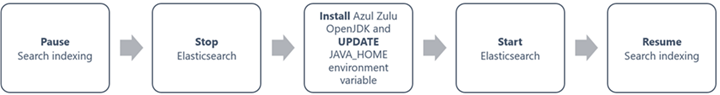
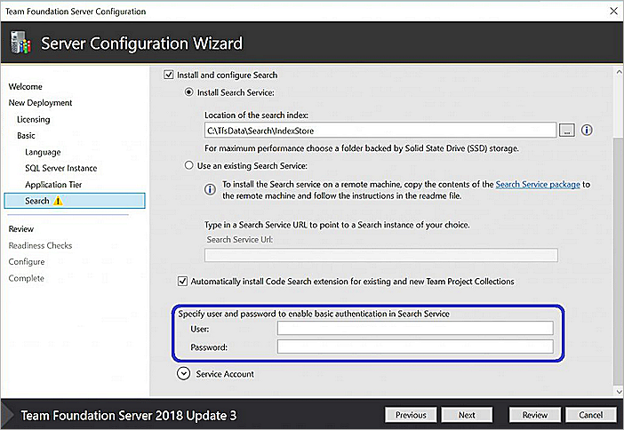
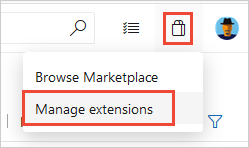
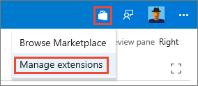

# Install and configure Search

[!INCLUDE [version-vsts-tfs-2017-on](../../boards/includes/version-vsts-tfs-2017-on.md)]

Learn how to do the following actions for the Search extension for Code, Wiki, and Work item searches in Azure DevOps Server.
- [Configure Search](#configure-search)
- [Secure Search](#secure-search)
- [Upgrade Search](#upgrade-search)
- [Uninstall Search](#uninstall-search)

For information about managing Search indexing, see [Manage Search and indexing](manage-search.md).

## Prerequisites

- To install the Search extension, you must be a Project Collection Administrator (PCA) for the organization. Non-administrative users can also request that the extension get added to their PCA.
- See [Install and configure Azure DevOps Server](/azure/devops/server/install/get-started) and [Requirements and compatibility](/azure/devops/server/requirements).

### Hardware recommendations

You can use Search on any size physical server or virtual machine that runs Azure DevOps Server. You can configure it on the same server, or on a separate server dedicated to Search. When you're configuring Search on the same server, consider the existing CPU utilization factor because of Azure DevOps Server itself.

> [!TIP]
> For production environments, we recommend you configure Search on a separate server.

For acceptable performance in multi-user scenarios, consider the following recommendations:

* Fewer than 250 users with Search located on the server (typically used for demonstration and trial purposes):
  - Quad core processor, 16 GB (minimum) RAM
  - CPU Utilization factor less than 50%
  - Fast hard drive backed by Solid State Drive (SSD) storage
* Fewer than 500 users with Search located on a [separate server](#install-or-update-search-on-a-separate-server): 
  - Dual core processor, 8 GB (minimum) RAM
  - Fast hard drive backed by Solid State Drive (SSD) storage
* Fewer than 1,000 users with Search located on a [separate server](#install-or-update-search-on-a-separate-server):
  - Quad core processor, 16 GB (minimum) RAM
  - Fast hard drive backed by Solid State Drive (SSD) storage
* More than 1,000 users with Search located on a [separate server](#install-or-update-search-on-a-separate-server):
  - Quad core processor, 16 GB (minimum) RAM
  - Fast hard drive backed by Solid State Drive (SSD) or Storage Area Network (SAN) storage
* Azure DevOps Server with Multiple ATs: 
  - Install Search on a [separate server](#install-or-update-search-on-a-separate-server)
* Azure DevOps Server CPU utilization greater than 50% before Search installation:
  - Install Search on a [separate server](#install-or-update-search-on-a-separate-server)

**Disk space requirement**:

The amount of disk space used by Search depends mainly on the type and size of files indexed. For Code search, since many times repositories can be large and have different code files in version control, disk space requirement could be significant. **Allocate up to 150% of the size of all the repositories to be indexed.** From TFS 2018 Update 3 and onward, users can exclude folders from their repositories for index to optimize the disk space that's consumed by search.

### Software dependencies

Search has the following dependencies, which are installed automatically as part of the configuration:

* [Elasticsearch](https://www.elastic.co/products/elasticsearch) by Elasticsearch BV (see Notes 1 and 2)
* [Elasticsearch NEST client](https://www.elastic.co/guide/en/elasticsearch/client/net-api/current/index.html) 
* [Azul Zulu OpenJDK](https://www.azul.com/products/zulu-community/) (see [Java installation notes](#java-installation-notes))
* [Markdowndeep](https://www.toptensoftware.com/markdowndeep/) by Topten Software
* [Roslyn](https://github.com/dotnet/roslyn) compiler platform
* [ANTLR](https://www.antlr.org/) language recognition parser

> [!NOTE]
> - Search uses a modified version of Elasticsearch. It works only with this modified version
> - A newer version of Elasticsearch ships with TFS 2018 Update 2 and onward, and Azure DevOps Server. All content is reindexed after installation when you upgrade from an older version of Search results. Depending on the volume of content (code files, work items, and wiki pages), re-indexing can take some time to complete
> - The system or server administrator must ensure that Server JRE is maintained and updated in line with the software provider's recommendations. Also see the [Java installation notes](#java-installation-notes) that follow
> - The Azul Zulu OpenJDK doesn't automatically install updates
> - Ensure that you regularly [check for updates](https://www.azul.com/downloads/zulu-community/?&version=java-8-lts&os=windows&os-details=Windows&architecture=x86-64-bit&package=jdk)

#### Java installation notes

- If the Search configuration wizard doesn't detect a working installation of a Java Runtime Environment (JRE), it provides an option to download and install the latest supported version. Internet connectivity is required to download. If the target server doesn't have Internet connectivity, you must download and install a JRE manually before attempting to install Search.
- Versions of Search before Azure DevOps Server used the [Oracle Server Java Runtime Environment](https://www.oracle.com/technetwork/java/javase/downloads/server-jre8-downloads-2133154.html). In Azure DevOps Server, the default JRE is [Azul Zulu OpenJDK](https://www.azul.com/products/zulu-community/).
- During installation, the wizard sets the **JAVA\_HOME** environment variable to point to the JRE installation folder. The configuration wizard might not detect an existing JRE installation if it wasn't correctly configured, or if the **JAVA\_HOME** setting points to an earlier version than required by Search. 

> [!NOTE]   
> We don't advise installing Elasticsearch on a machine where resources are shared, especially on a large enterprise environment with multiple application tiers. Instead, we recommend that you set up Elasticsearch in a separate dedicated machine. In that way, the JAVA environment isn't shared across machines for other purposes.

- If there's a version of a JRE **earlier** than the minimum required by Search, and the **JAVA\_HOME** variable was set to that version, we recommend that you install Search on a [separate server](#install-or-update-search-on-a-separate-server). If you change the value of the **JAVA\_HOME** variable, it may cause other installed software to fail.

- If there's a version of Server JRE **equal to or later** than the minimum required by Search and it's not recognized by the configuration wizard, set the value of the **JAVA\_HOME** variable to that version. This action's described in the JRE installation guide. Then, rerun the configuration wizard.
  - [Zulu OpenJDK installation guide](https://docs.azul.com/zulu/zuludocs/index.htm)
  - [Oracle JRE troubleshooting guide](https://docs.oracle.com/javase/7/docs/webnotes/tsg/) 

- If you can't install the version of Java required by Search because of other dependencies, you can do the following tasks:
  - Install Azure DevOps Server with the Search extension on a server that doesn't have Java installed. We don't recommend this action for more than 250 users or CPU utilization greater than 50% or multiple ATs)
  - Install Search and the JRE on a [separate server](#install-or-update-search-on-a-separate-server) from Azure DevOps Server

> [!NOTE]
> If you're using Oracle Server JRE 8, which was the default for Search in TFS (Azure DevOps Server doesn't use Oracle Server JRE 8), be aware of the following information:
> * Search doesn't use or support any of the commercial features of Server JRE 8. Therefore, during Search configuration,the commercial features of the Server JRE are neither activated nor unlocked
> * If you choose to continue with Oracle JRE, contact Oracle for a [Java SE Subscription](https://www.oracle.com/java/java-se-subscription.html), so that you can continue to receive JRE updates

#### Migrate to Zulu OpenJDK from Oracle Server JRE

Search in Azure DevOps Server supports both Azul Zulu OpenJDK and Oracle JRE, allowing you to choose between them based on your needs.
When selecting a JRE during installation, Azure DevOps Server defaults to Azul Zulu OpenJDK 8.

To change to the Azul Zulu OpenJDK, follow these steps:



For more information, see [GitHub Code-Search Java Migration](https://github.com/microsoft/Code-Search/tree/master/Java%20Migration).

> [!NOTE]
> * If you choose to use Azul Zulu OpenJDK, ensure that you [download version 8](https://www.azul.com/downloads/zulu-community/?&version=java-8-lts&os=windows&os-details=Windows&architecture=x86-64-bit&package=jdk).

## Feature availability

* Work Item Search is available in TFS 2017 Update 2 and later versions.
* Wiki Search is available in TFS 2018 Update 2 and later versions.
* Work Item and Wiki search are built-in extensions that are installed by default during Search configuration.
* Code Search is available in TFS 2017 and later versions, and is an opt-in feature. You can install Code Search later from the Local Gallery. Go to **Local Gallery** (```http://{server}/_gallery```) as an administrator. Non-administrative users can also request the extension for Azure DevOps Server. For more information, see [Install an extension](../../marketplace/get-tfs-extensions.md) in the Local gallery documentation.

## Configure Search

Configure the Search service using the dedicated pages in the Server Configuration Wizard as you install Azure DevOps Server. You can also [un-configure Search](#uninstall-search)
afterwards by running the Server Configuration Wizard again or by launching the Search Configuration Wizard. For configuring Search, be aware of the [configuration considerations](#configuration-considerations).
### Configuration considerations

Consider the following information when you're configuring Search:

* Both Work Item and Wiki search get enabled by default when Search is configured. These extensions can be later removed if necessary from the **Manage Extensions** page of Azure DevOps Server

* The Code Search extension must be installed for each Azure DevOps Server collection where you want to use it. When initially configuring Search, you can set a checkbox to **Automatically install Code Search extension for existing and new Project Collections** to automate this process
  * If you don't set the checkbox to install the Code Search extension for all your project collections, your PCA can install it from the Local Gallery. Ensure you go to the Local Gallery (`http://{Server}/_gallery`) from your Azure DevOps Server portal page. For more information, see [Install an extension](../../marketplace/get-tfs-extensions.md) in the Local gallery documentation

#### Use a second hard drive and remote server

* For maximum performance, the search index folder should be on a separate fast hard drive and backed by fast storage, such as a solid-state drive (SSD) or Storage Area Network (SAN). **Allocate up to 150%** of the size of all the repositories to be indexed. That's the worst-case scenario. The actual space that's consumed depends on the amount and type of code files, and the number of work items and wiki pages in that collection
  * Unless specified, the indexing service and Elasticsearch engine use the network service account during installation to create and access the index files. If you choose a different account, it must have **Log on as a service** permission
  * Restrict the permissions for the index disk and folder to protect the index from accidental or malicious modification or deletion. Configure appropriate [security settings](#secure-search) for the service

* When you're configuring Search for a server with **multiple application tiers (ATs)**, make sure it's installed on a [separate server](#install-or-update-search-on-a-separate-server). After you've installed Search on the remote server, use the Configuration Wizard on any one of the AT servers to link the remote Search instance with your Azure DevOps Server instance. When un-configuring Search in the future you must use the Configuration Wizard on the same AT server where configuration was originally carried out

#### Upgrade your server

* If you're doing a **pre-production upgrade** on a server where Search was already configured, you must fully reconfigure Search again to avoid corrupting your production instance. There's no option to configure Search as part of a pre-production upgrade. Instead, configure it after the pre-production upgrade is complete. You can uncheck **Automatically install and configure Code Search for all existing and new collections** during configuration. Instead, install the Search extension for just one or two of your collections after configuration is complete

* If you're doing a **production upgrade** on a server where Search is configured and you want to keep it, check the box next to **Install and Configure Search**. The wizard detects your existing Search instance and automatically selects **Use existing Search instance** , and pre-populates your current Search service URL. Use the **Install a new Search instance** option only if you want to set up a new instance of Search on the same server. Setting up a new instance causes all your code, work items, and wiki to be indexed again, which - depending on the size of the collections - can take some time. During indexing, users may see partial search results

* If you're **upgrading your server to new hardware**, you have the following two options. Select from these options, depending on how Search was previously configured:
  - If Search is on a separate server from Azure DevOps Server, you must select **Install and Configure Search** in the Server Configuration Wizard, and then select **Use an existing Search instance** and provide the URL of your existing Search instance to complete the Search configuration
  - If Search is configured alongside your Azure DevOps Server instance on the old server, you must select **Install and Configure Search** in the Server Configuration Wizard. Then, select **Install a new Search instance** again on the new server if you want to continue to cohost Search and Azure DevOps Server. All Search indexes for all collections are re-created which, depending on the size of each collection, might take some time   

* If you're **detaching a collection** from one Azure DevOps Server instance to attach it to another instance, do the following steps:
   1. Detach the collection from source Azure DevOps Server instance
   2. Configure Search on the target Azure DevOps Server instance (if not yet done already)
   3. Attach the collection to the target Azure DevOps Server
   4. Uninstall your Search extensions, like Code, Work item, or Wiki for the collection from the **Local Gallery** within your Azure DevOps Server
   5. Install the Search extension, for the collection from the **Local Gallery**, by browsing to it from your target Azure DevOps Server instance

### Install or update Search on a separate server

To install or update Search on a separate or remote server, typically when there are more than 250 users, do the following steps:

1. As you install Azure DevOps Server on the primary server, set the **Install and configure Search** checkbox 
   in the **Search** page of the Server Configuration Wizard.
2. Select the option to **Use an existing Search service**. 
3. Use the **Search service package** link that's provided in the wizard to access a set of Search installer files 
   on the local machine. Then, copy these files to the remote server.

   

4. Follow the instructions in the **Readme.txt** file, located in the set of 
   installer files, to install or update the Search service on the remote server.
5. After installation completes, copy the resulting Search server URL into the **Search URL** field of the configuration wizard that runs on the Azure DevOps Server instance.
6. When both installations are complete, configure appropriate 
   [security settings](#secure-search) for both servers.

## Secure search

The Search service uses a modified version of [Elasticsearch](https://www.elastic.co/products/elasticsearch) (the terms "Search" and "Elasticsearch" are used interchangeably for the rest of this section). Administrators must provide credentials whether the Search service is on the same machine as Azure DevOps Server, or on a separate machine. This action is part of configuring the Search feature through the server or the Search configuration wizard. These credentials are new and aren't related to any pre-existing account or server credentials. They're used to set up and connect to Search service. These new sets of credentials enable basic authentication in the search service.



For an upgrade from TFS 2018 Update 1.1 to TFS 2018 Update 3 or for search reconfiguration, only the user information autopopulates and administrators must provide password credentials. Administrators have an option to provide different username and password if they wish. If the Search service is on the same machine as Azure DevOps Server, administrators can provide a new set of credentials in the Configuration Wizard to set up the Search service, if wanted. However, if the Search service is on a remote machine, administrators must first provide the new credentials to the Search service setup script.

> [!NOTE]
> * Username and password values should both be between 8 and 64 characters in length. While the password can be assigned any value, the username can contain only alphanumeric and underscore characters. 
> * Search credentials only authenticate the users and make sure that unauthenticated users can't access the Elasticsearch endpoint. However, Elasticsearch doesn't support HTTPS and so these credentials get sent over the network as Base64 encoded strings. If there's a possibility of intermediate access to request, configure appropriate security settings based on your corporate security and compliance requirements.
> * Aim to limit access to both searching and indexing to specific users or user groups using encryption through IPSec, described as follows. 

Consider the following techniques for using IPSec to secure Elasticsearch on a Windows server:

* **Configure security with authentication only:**
  - Ensures only authorized users can access the Elasticsearch port. It requires only service-side rules (firewall rules on only the server running Elasticsearch)
  - Prerequisite: Azure DevOps Server must be configured with a domain account
  - Follow the steps in [Creating Firewall Rules that Allow IPsec-protected Network Traffic](/previous-versions/windows/it-pro/windows-server-2008-R2-and-2008/cc754873(v=ws.10))

* **Configure security with authentication, integrity protection, and encryption:**
  - Ensures encryption and integrity protection are applied along with authentication. It requires 
    both client-side and service-side rules (firewall rules on the server running Elasticsearch and all Azure DevOps Server App Tier servers)
  - Prerequisite: Azure DevOps Server must be configured with a domain account
  - Follow the steps in [Isolating a Server by Requiring Encryption and Group Membership](/previous-versions/windows/it-pro/windows-server-2008-R2-and-2008/cc772460(v=ws.10))

## Upgrade search

- **TFS 2017 Update 1** includes updated Search components.
  - If the Search service was configured in TFS 2017 RTM during an upgrade, the Search service components are updated automatically if the Search
service was configured on the TFS that's getting upgraded. 
  - If Search was configured on a remote server, follow [the instructions](#install-or-update-search-on-a-separate-server) to update it.

- **TFS 2017 Update 2** includes Work items Search. It uses the same Search service as Code Search. 
  - If the Search service was configured in TFS 2017 RTM/Update1 during an upgrade, the Search service components get updated automatically if the Search service was configured on the TFS that's being upgraded. 
  - If Search was configured on a remote server, follow [the instructions](#install-or-update-search-on-a-separate-server) to update it.

- **TFS 2018 Update 2** includes updated Search components and Wiki Search. 
  - If the Search service was configured in TFS 2017 RTM, Update1, Update2, or TFS 2018 RTM during an upgrade, the Search service components get updated automatically if the Search service was configured on the TFS that's being upgraded. 
  - If Search was configured on a remote server, follow [the instructions](#install-or-update-search-on-a-separate-server) to update it. 

  In both cases, all existing content (code files and work items) gets automatically reindexed to support the updated components after configuration. Depending on the volume of content, this upgrade might take some time to complete.

- **TFS 2018 Update 1.1 and TFS 2018 Update 3** include basic authentication for the communication between the TFS and Search service to make it more secure. Any installation or upgrade to TFS 2018 Update 1.1 or TFS 2018 Update 3, must provide credentials as part of configuring Search feature, through Server or the Search configuration wizard.

- **TFS 2018 Update 2 (or higher) to version Azure DevOps Server 2019 Update 1**, when search is configured on a separate server, requires a reinstallation of search. While following [the instructions for an upgrade](#install-or-update-search-on-a-separate-server), in step 4 instead of updating `Configure-TFSSearch.ps1 – Operation update`, run the following command to reinstall search:

```
Configure-TFSSearch.ps1 -Operation remove
Configure-TFSSearch.ps1 -Operation install -TFSSearchInstallPath <install location> -TFSSearchIndexPath $env:SEARCH_ES_INDEX_PATH
```

## Uninstall Search

For a pre-production upgrade, production upgrade, new hardware migration, cloning, or other maintenance operation, the Server Configuration Wizard unconfigures Search. But, it's easy to reconfigure after the server maintenance operation is complete.

However, there might be cases where you no longer want to use Search or you want to do a new and clean install. This operation requires multiple steps, depending on whether Search is configured on the [same server](#unconfig-same-server) as Azure DevOps Server, or on a [separate server](#unconfig-separate-server).

<a name="unconfig-same-server"></a>

### Un-configure Search on the machine configured as your Azure DevOps Server

1. Uninstall the Search extension for each collection where it's installed.
   Go to the **Manage Extensions** page of each collection in your Azure DevOps Server instance:

   ::: moniker range=">= azure-devops-2019"
   
   ::: moniker-end

   ::: moniker range="<= tfs-2018"
   
   ::: moniker-end

2. Remove the Search feature:
   - Open the Azure DevOps Server Administration Console
   - In the left pane, select the name of the server
   - In the right pane, choose **Remove Feature**
   - In the Remove Feature dialog, select **Search service**, and then choose **Remove**
3. Remove the Elasticsearch service:
   - Open **Command Prompt** as an administrator
   - Change the directory:
     * For TFS 2017 RTM, `cd "C:\Program Files\Microsoft Team Foundation Server 15.0\Search\ES\elasticsearch-1.7.1-SNAPSHOT\bin"`
     * For TFS 2017 Update 1, `cd "C:\Program Files\Microsoft Team Foundation Server 15.0\Search\ES\elasticsearch-2.4.1\bin"`
     * For TFS 2018 Update 2 and onward, and Azure DevOps Server, `cd "C:\Program Files\Microsoft Team Foundation Server 15.0\Search\ES\elasticsearch-5.4.1\bin"`
   - Remove the service:
     * For TFS 2017, `"service.bat remove"`
     * For TFS 2018 and Azure DevOps Server, `"elasticsearch-service.bat remove"`   
4. Remove Search data:
   - Delete the contents of the location described by the environment variable `SEARCH_ES_INDEX_PATH`
5. Remove environment variables:
   - Delete the environment variable `"SEARCH_ES_INDEX_PATH"`
   - Delete the environment variable `"ES_HEAP_SIZE"` (this environment variable is obsolete for TFS 2018 Update 2 and later, and Azure DevOps Server)
    
<a name="unconfig-separate-server"></a>

### Un-configure Search when it's configured on a separate server

1. Uninstall the Search extension, like for Code, Work item, or Wiki, for each collection where it's installed. Go to the **Manage Extensions** page of each collection in your Azure DevOps Server instance.

   ::: moniker range=">= azure-devops-2019"
   
   ::: moniker-end

   ::: moniker range="< azure-devops-2019"
   
   ::: moniker-end

::: moniker range="<= azure-devops-2019"
2. Remove the Search feature:

   - Open the In the Remove Feature dialog,  Administration Console
   - In the left pane, select the name of the Azure DevOps Server
   - In the right pane, choose **Remove Feature**
   - In the Remove Feature dialog, select **Search service**, and then choose **Remove**

3. Remove the Elasticsearch service and data:

   - Open **PowerShell** as an administrator
   - Open the **Configure Search.ps1** folder, along with the rest of the files that are required for a remote install of Search
   - Run the script again with the remove option: 
     * For TFS 2017 RTM, `"Configure Search.ps1 -RemoveTFSSearch"`
     * For TFS 2017 Update1 and onward, and Azure DevOps Server, `"ConfigureTFSSearch.ps1 -remove"`
::: moniker-end

<a name="limit-tfs"></a>

## Search limitations

Search for Azure DevOps Server has the following limitation: 

* If you do a disaster recovery (DR) operation and move your server back to an earlier snapshot of your SQL database, [reindex all your collections](manage-search.md#reindex-a-repository-or-collection).

## Related articles

- [Manage indexing for Search](manage-search.md)
- [Get started with Search](get-started-search.md)
- [Search FAQs](faq-search.yml)