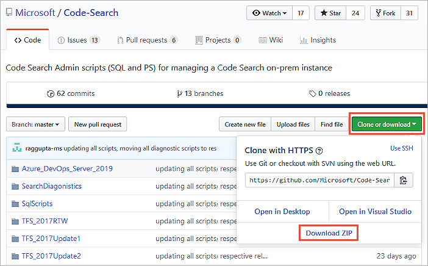

# Manage Search indexing

You can manage your search extension and indexing status, which include the following actions:
[Check indexing status](#check-indexing-status)
[Pause indexing](#pause-indexing)
[Resume indexing](#resume-indexing)
[Reindex a repository or collection](#reindex-a-repository-or-collection)

For information about how to install or configure Search, see [Install and configure Search](install-configure-search.md).

## Prerequisites

To manage Search and indexing, you must be a [Project Collection Administrator (PCA)](../../user-guide/project-admin-tutorial.md) for the organization.

## Manage indexing

Search gets managed by running PowerShell and SQL scripts. All of these scripts are available to download from the **[Code-Search GitHub repository](https://github.com/Microsoft/Code-Search)**. You can download all scripts into a local folder on the server. This server runs the database for Azure DevOps Server using the **Download ZIP** option. 

The PowerShell scripts require the SQL script files, so ensure the **SqlScripts** folder and its contents are present, along with the PowerShell scripts.

> [!NOTE]
> When you're executing scripts, ensure that you run the appropriate script for your Azure DevOps Server or TFS version:
> 
> * [TFS 2017 RTM](https://github.com/Microsoft/Code-Search/tree/master/TFS_2017RTW)
> * [TFS 2017 Update 1](https://github.com/Microsoft/Code-Search/tree/master/TFS_2017Update1)
> * [TFS 2017 Update 2](https://github.com/Microsoft/Code-Search/tree/master/TFS_2017Update2)
> * [TFS 2017 Update 3](https://github.com/Microsoft/Code-Search/tree/master/TFS_2017Update3)
> * [TFS 2018 RTM](https://github.com/Microsoft/Code-Search/tree/master/TFS_2018RTW)
> * [TFS 2018 Update 1](https://github.com/Microsoft/Code-Search/tree/master/TFS_2018Update1)
> * [TFS 2018 Update 2](https://github.com/Microsoft/Code-Search/tree/master/TFS_2018Update2)
> * [Azure DevOps Server and TFS 2018 Update 3](https://github.com/Microsoft/Code-Search/tree/master/TFS_2018Update3)

### Check indexing status

(For TFS 2017 Update 1 and later, and Azure DevOps Server, see the [next section](#check-indexing-status-for-tfs-2017-update-1-and-later).)

To check the indexing status after Search is configured, or after the extension is installed for a collection, do the following steps:

1. Execute the `CheckIndexingStatus.ps1` script with administrative privileges. 
   You're prompted to enter the following information:

   - The SQL server instance name where the TFS configuration database is.
   - The name of the TFS collection database.
   - The name of the TFS configuration database.
   - The name of the collection.
   - The number of previous days to check indexing status.

2. Check the following outputs:
 
   - **Collection indexing was triggered successfully**: Indicates that indexing is in progress. If it's displayed, check the following outputs. If it isn't displayed, go ahead to step 3. 
   - **Repositories Indexing Completed**: The repositories whose indexing has been completed and are now searchable.  
   - **Repositories in File Discovery Phase**: The repositories where files are yet to be discovered. The files are indexed after this stage. Repositories in this state aren't yet searchable. The number of files that are already discovered for indexing in each repository shows. This number increases as more files get discovered. 
   - **Repositories Indexing In Progress**: These repositories are partially indexed and should be searchable, even if the results are only partial.
 
3. It takes some time for indexing to complete. Execute the `CheckIndexingStatus.ps1` script at intervals to check indexing progress.

4. If indexing isn't working, or is in progress, but the number of files pending haven't changed for some time, or if you get no results for a search, execute the `TriggerCollectionIndexing.ps1` script in a PowerShell window with administrative permission. 

5. If the problem persists, contact [customer support ](https://developercommunity.visualstudio.com/spaces/21/index.html). 

### Check indexing status for TFS 2017 Update 1 and later

To check the indexing status after Search is configured, or after the extension was installed for a collection, complete the following steps:

1. Execute the `ExtensionInstallIndexingStatus.ps1` script with administrative privileges. 
   You're prompted to enter:

   - The SQL server instance name where the Azure DevOps Server configuration database is.
   - The name of the Azure DevOps Server collection database.
   - The name of the Azure DevOps Server configuration database.
   - The name of the collection.
   - The number of previous days to check indexing status.

 
2. Check the following outputs:

   - **Collection indexing was triggered successfully**: Indicates that 
     indexing is in progress. If it's displayed, check the following outputs.
     If it isn't displayed, go to step 3. 

   - **Repositories completed indexing**: The number of repositories for which indexing has completed and are searchable.
    
   - **Status of repositories currently indexing**: A list of the names of all the repositories that are still being indexed and are partially searchable.

 
3. It takes some time for indexing to complete. Execute the `RecentIndexingActivity.ps1` script at intervals to check indexing progress. This script takes the same parameters as the `ExtensionInstallIndexingStatus.ps1` script.

   - **Repositories completed fresh indexing**: The number of repositories for which indexing has completed within the specified time interval.

   - **Count of repositories with fresh indexing in progress**: The number of repositories for which indexing hasn't yet completed. These repositories are still being indexed and are partially searchable.

   - **Repositories completed continuous indexing**: The number of commits processed in the specified time interval. The number may not exactly match the total number of pushes to the repository because merges are committed as they're indexed.

   - **Count of repositories with continuous indexing in progress**: The number of repositories for which the commits are still being processed. These repositories show incomplete results until indexing is completed.

   
   - **Count of indexing job failures**: The number of indexing jobs that failed. Repositories associated with these indexing jobs could potentially show incomplete results until later indexing jobs for the same repositories have patched the failed indexing.

### Pause indexing

To pause all indexing, execute `PauseSearchIndexing.ps1`, which is useful if you see spikes in CPU utilization after configuring Search.

You're prompted to enter the following information:

* The SQL server instance name where the Azure DevOps Server configuration database is
* The name of the Azure DevOps Server configuration database

### Resume indexing

If indexing was paused, execute `ResumeIndexing.ps1` to start indexing again. 
You're prompted to enter the following information:

* The SQL server instance name where the Azure DevOps Server configuration database is
* The name of the Azure DevOps Server configuration database

### Reindex a repository or collection

To reindex a Git or TFVC repository, execute the appropriate
version of the script `Re-IndexingRepository.ps1` for your Azure DevOps Server version. 
You're prompted to enter the following information:

* The SQL server instance name where the Azure DevOps Server configuration database is
* The name of the Azure DevOps Server collection database
* The name of the Azure DevOps Server configuration database
* The type of reindexing to execute. The type can be one of the following values:
  - **Git\_Repository**
  - **TFVC\_Repository**
* The name of the collection
* The name of the repository to reindex

To reindex a **collection**, execute the script `TriggerCollectionIndexing.ps1`. 
You're prompted to enter the following information:

* The SQL server instance name where the Azure DevOps Server configuration database is
* The name of the Azure DevOps Server collection database
* The name of the Azure DevOps Server configuration database
* The name of the collection
* The entities to reindex. The entities can be one of the following values:
  - **All**
  - **Code**
  - **WorkItem**
  - **Wiki**

## Search limitations

Search for Azure DevOps Server has the following limitation: 

* If you do a disaster recovery (DR) operation and move your server back to an earlier snapshot of your SQL database, [re-index all your collections](manage-search.md#reindex-a-repository-or-collection).

## Related articles

- [Install and configure Search](install-configure-search.md)
- [Search FAQs](faq-search.yml)

