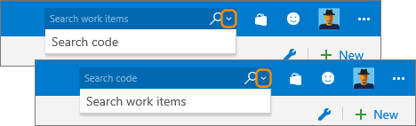

# Search across all your code, wiki, packages, and work items

[!INCLUDE [version-header](../../includes/version-tfs-2017-through-vsts.md)]

Azure DevOps stores a tremendous amount of information. This includes the following data:  
- Work items for planning and tracking your work  
- Wiki content for sharing information  
- Source code to maintain code and a history of code file changes  
- Build and release pipeline services to help you ship effortlessly. 

As your backlog and code base expand and are divided across multiple projects, teams and repositories, finding what you need can become increasingly difficult. 
  

<iframe src="https://channel9.msdn.com/Events/Visual-Studio/Connect-event-2015/500/player" width="340" height="190" allowFullScreen="true" frameBorder="0"></iframe>
  

To increase cross-team 
collaboration and sharing, you need solutions that can quickly and 
efficiently locate information across all your projects. The Search 
extensions available for Azure DevOps 
enable you to search across all the projects, teams, and repositories to which you have access. 

::: moniker range=">= azure-devops-2019"  

::: moniker-end

::: moniker range="< azure-devops-2019"  

::: moniker-end

With Search, you can easily search for information across all 
your projects, from any supported browser, computer, or mobile device. 
You can narrow down your results and focus on what you need by using filters. 

To perform specific searches, see one of the following articles: 

- [Search code](code-search.md)  
- [Search work items](work-item-search.md)  
- [Search the wiki](../wiki/search-wiki.md)  
- [Search artifacts or packages](package-search.md)

## Related articles

- [Adhoc vs managed work item queries](../../boards/queries/adhoc-vs-managed-queries.md?toc=/azure/devops/project/search/toc.json&bc=/azure/devops/project/search/breadcrumb/toc.json)
 