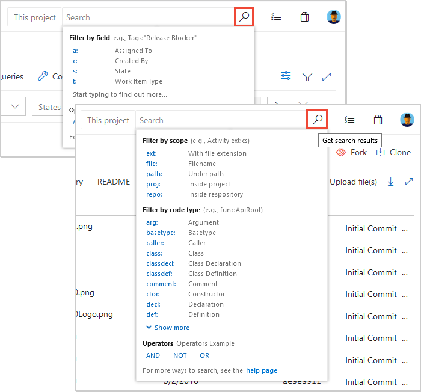
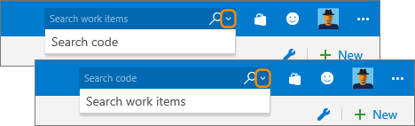

# Search across all your code, wiki and work items

[!INCLUDE [version-header](../../_shared/version-tfs-2017-through-vsts.md)]

Azure DevOps and TFS store a tremendous amount of information; 
work items for planning and tracking your work, wiki for sharing information, version control to track code file changes, 
and build and release services to help you ship effortlessly. 
As your backlog and codebase expand and are divided across multiple projects, teams and repositories, 
finding what you need becomes increasingly difficult. To maximize cross-team 
collaboration and sharing, you need solutions that can quickly and 
efficiently locate information across all your projects. The Search 
extensions available for Azure DevOps and TFS 
enable you to search across all the projects, teams and repositories to which you have access. 

::: moniker range=">= azure-devops-2019"  

::: moniker-end

::: moniker range="< azure-devops-2019"  

::: moniker-end

The Search extensions make it easy to search for information across all
your projects, from anywhere and any computer or mobile device, using just a web browser.
You can narrow down your results and focus in on what you need by using filters.

 &nbsp; **[Code Search](code-search.md)**

 &nbsp; **[Work Item Search](work-item-search.md)**

 &nbsp; **[Wiki Search](../wiki/search-wiki.md)**

See also:

* [Adhoc vs managed work item queries](../../boards/queries/adhoc-vs-managed-queries.md?toc=/azure/devops/project/search/toc.json&bc=/azure/devops/project/search/breadcrumb/toc.json)
* [Search your Wiki](https://blogs.msdn.microsoft.com/devops/2017/12/01/announcing-public-preview-of-wiki-search/)
