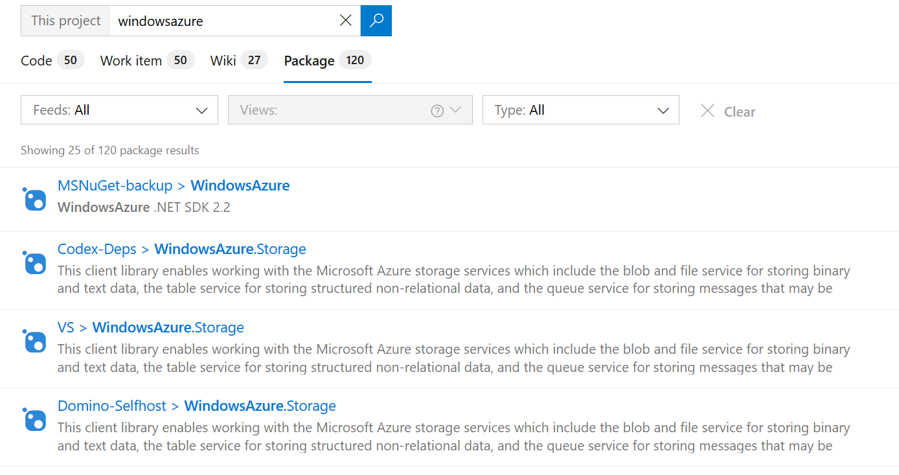
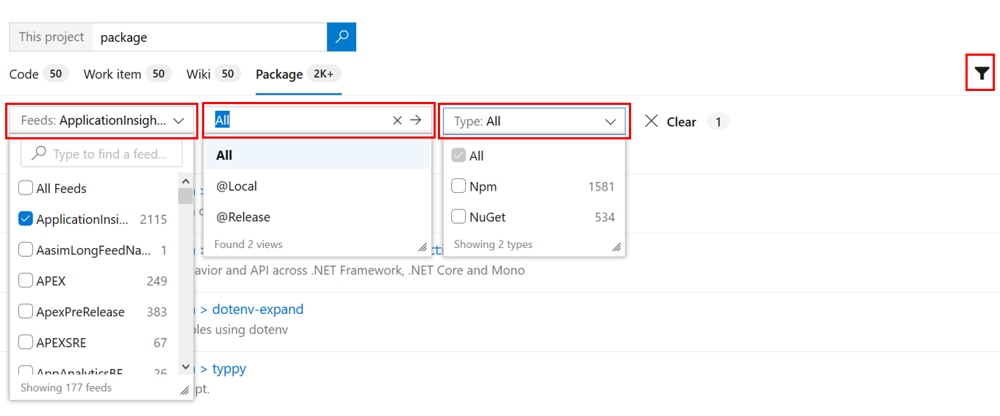
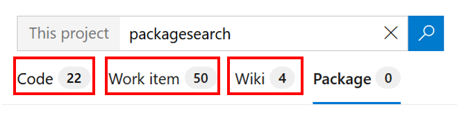

# Search your packages or artifacts

[!INCLUDE [version-header](../../includes/version-vsts-only.md)]

Package Search provides fast and flexible search across all your packages inside your organization. 

Learn more about packages here: [Azure Artifacts in Azure DevOps Services](../../artifacts/overview.md)

## Start searching

1. Open the **Azure Artifacts** section in Azure DevOps (see [Web portal navigation](../navigation/index.md)).

2. Choose  **Search** at the top right of the window to show the search textbox.

3. Enter a search string in the textbox, and press _Enter_ to start your search. 

## View the results

1. Search results are displayed with matches to user query shown in bold.

	> [!div class="mx-imgBorder"]  
	> 

   This is a full text search that uses simple search strings for words or phrases. 
   Note that searches are _not_ case-sensitive.

   > Open the search results in a new browser tab from a search box by
   pressing _Ctrl_ + _Enter_. In Google Chrome or Firefox, press _Ctrl_ + _Shift_ + _Enter_ to switch the focus
   to the new browser tab. 

2. Widen your search across all feeds, or narrow it to specific views
   and package types. The Views filter only appears if a single feed is selected from Feeds filter.
   Use the filter to show the selector lists.

	> [!div class="mx-imgBorder"]  
	>     

3. Select the criteria you want in the drop-down selector lists, or search across the entire organization.

	> [!div class="mx-imgBorder"]  
	>     

1. By switching pivots, quickly search [code](code-search.md) containing the same search string, or 
    search for the same string in your [wikis](../wiki/search-wiki.md)
    or search for the same string in your [work items](work-item-search.md)

	> [!div class="mx-imgBorder"]  
	> 

## Next step

> [!div class="nextstepaction"]
> [Learn more about Package Search](advanced-package-syntax.md)
