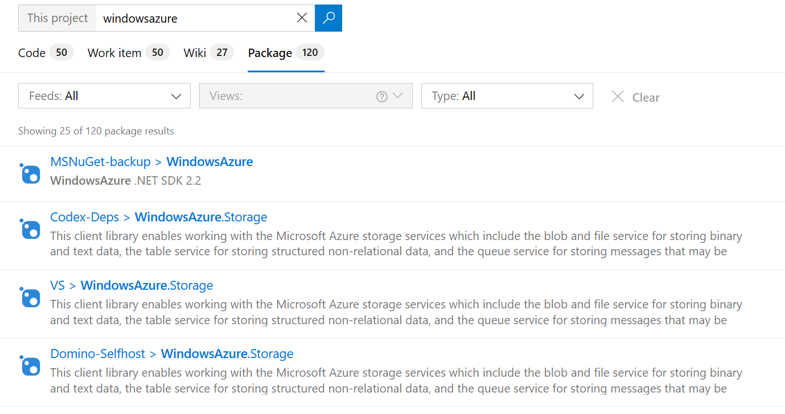
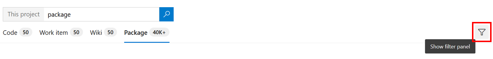
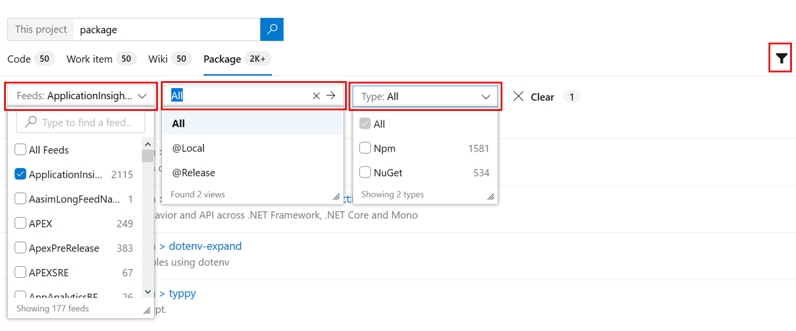
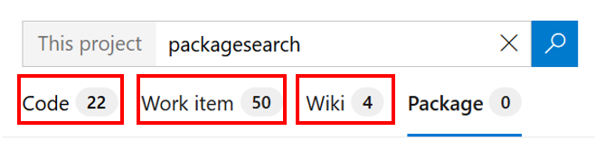

# Search your packages

[!INCLUDE [version-header](../../_shared/version-vsts-only.md)]

Package Search provides fast and flexible search across all your packages inside your organization. 

Learn more about packages here: [Azure Artifacts in Azure DevOps Services](../../artifacts/overview.md)

## Start searching

1. Open the **Azure Artifacts** section in Azure DevOps (see [Web portal navigation](../navigation/index.md)).

1. Choose the  icon at the top right of the window to show the search textbox.

       

1. Enter a search string in the textbox, and press _Enter_ (or choose the 
    icon) to start your search. 

## View the results

1. Search results are displayed with matches to user query shown in bold.

   

   This is a full text search that uses simple search strings for words or phrases. 
   Note that searches are _not_ case-sensitive.

   > Open the search results in a new browser tab from a search box by
   pressing _Ctrl_ + _Enter_ or by holding _Ctrl_ and clicking  the
    icon.
   In Google Chrome or Firefox, press _Ctrl_ + _Shift_ + _Enter_ to switch the focus
   to the new browser tab. 

1. Widen your search across all feeds, or narrow it to specific views
   and package types. Note that Views filter would only appear if a single feed is selected from Feeds filter.
   Use the "filter" icon to show the selector lists.

       

1. Select the criteria you want in the drop-down selector lists, or search across the entire organization.

       

1. By switching pivots, quickly search [code](code-search.md) containing the same search string, or 
    search for the same string in your [wikis](../wiki/search-wiki.md)
    or search for the same string in your [work items](work-item-search.md)

   

## Next step

> [!div class="nextstepaction"]
> [Learn more about Package Search](advanced-package-syntax.md)
