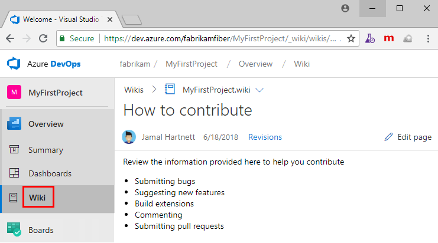

## Open the Wiki  

#### [Browser](#tab/browser) 

Connect to your project using a [supported web browser](/azure/devops/server/compatibility#supported-browsers) and choose **Wiki**.

> [!div class="mx-imgBorder"] 
>

If you need to switch your team project, choose the  Azure DevOps logo to [browse all team projects and teams](../../navigation/work-across-projects.md).

::: moniker range="= azure-devops"

#### [Azure DevOps CLI](#tab/azure-devops-cli)

You can view and open a wiki page defined for a project using the `az devops wiki show` command. To get started, see [Get started with Azure DevOps CLI](../../../cli/get-started.md).

> [!div class="tabbedCodeSnippets"]
```CLI
az devops wiki show --wiki
                      [--open]
                      [--project]
                      [--subscription]
```

### Parameters

- **--wiki**: Required. Name or ID of the wiki.
- **--open**: Optional. Open the wiki page in your web browser.
- **--project -p**: Optional. Name or ID of the project.
- **--subscription**: Optional. Name or ID of subscription. You can configure the default subscription using `az account set -s NAME_OR_ID`.

### Example

Open a wiki named 'myprojectwiki'.

> [!div class="tabbedCodeSnippets"]
```CLI
az devops wiki show --wiki myprojectwiki --open
```

::: moniker-end

* * *

::: moniker range=">= tfs-2018 <azure-devops"

[!INCLUDE [note-cli-not-supported](../../../_shared/note-cli-not-supported.md)]

::: moniker-end


