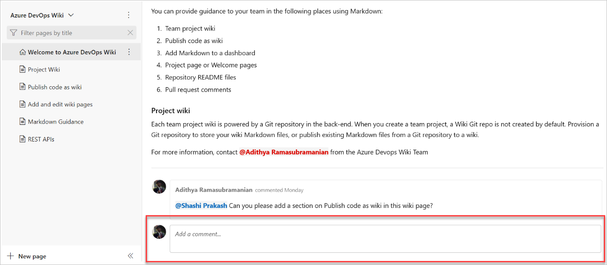
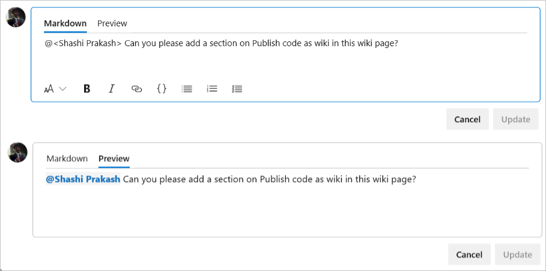
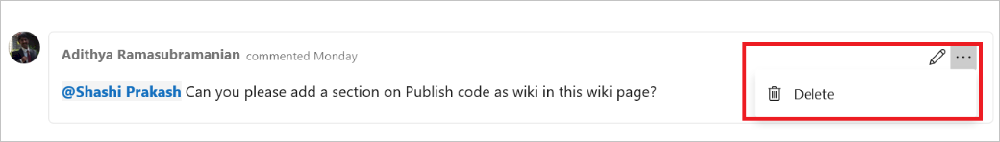

# Add comments to wiki pages

[!INCLUDE [temp](../../includes/version-azure-devops-plus-azure-devops-server-2020.md)]

Learn how to add comments to wiki pages for better collaboration.

## Add a comment

Add a comment at the bottom of any wiki page. Comments are posted on a per-branch basis. For example, if you make a comment on a wiki page on the main branch, it doesn't appear in another published branch of a file of the same name. Comments are stored on the internal database. For more information, see [Data locations for Azure DevOps](../../organizations/security/data-location.md).

### View markdown and preview tabs

When you add a markdown-based comment, there's a markdown editor and preview tab. Use these tabs to view and change how the comment is rendered before you add it. You can also @mention users and groups. This @mention sends an email notification to each user or group, with a link to the wiki page.

## Edit or delete comment

Edit or delete any comments that you've added to a wiki.

## Related articles

- [Search wiki content](search-wiki.md)
- [Follow wiki pages, get notifications](follow-notifications-wiki-pages.md)
- [Create and embed a work item from wiki content](create-embed-wit-from-wiki.md)
- [Version, select, or unpublish a wiki](wiki-select-unpublish-versions.md)
- [Markdown guidance](markdown-guidance.md)
- [Wiki Markdown guidance](wiki-markdown-guidance.md)

