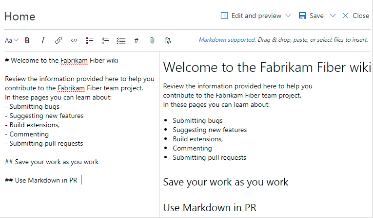

# Quickstart: Add and edit wiki pages

[!INCLUDE [temp](../../_shared/version-vsts-tfs-2018.md)]

Once the [Wiki Git repository is provisioned](./wiki-create-repo.md) for your team project, a new page opens in which you can specify a title and add content. This is a side by side edit and preview experience that will allow you to edit the page and preview the content as you enter content.

You author pages using [markdown format](../../reference/markdown-guidance.md). Also, you can use the format pane for rich-text formatting and to insert images, attachments, and links.  

> [!div class="mx-imgBorder"]  
> 

As you continue editing the page, save the page by entering **Ctrl+S**. To save with a custom revision message, click the context menu icon next to **Save**. For additional shortcuts, see [Keyboard shortcuts to manage Wiki pages](wiki-keyboard-shortcuts.md).

::: moniker range=">= azdevserver-2019"

> [!NOTE]  
> To add or edit pages to a wiki that you've published from a Git repository, see [Publish a Git repository to a wiki](publish-repo-to-wiki.md). This article addresses how to add and edit pages of a wiki that you've provisioned for a team project.

::: moniker-end

Use this article to learn how to do the following:  

> [!div class="checklist"]
> * Open **Wiki**
> * Add a wiki page
> * View revisions for a page
> * Edit and delete wiki pages
> * Reorder wiki pages
> * Make a page the wiki home page

## Prerequisites

* You must have a provisioned wiki. If you're wiki hasn't yet been created, [do that now](wiki-create-repo.md).
* You must be a member of the team project as a contributor to add or update wiki pages.

[!INCLUDE  [temp](_shared/open-wiki-hub.md)]

<a id="add-page" />

## Add a wiki page

To add another page, choose **New page**. Or, to add a sub-page, open the context menu of an existing page and select **Add sub-page**.

You must specify a unique title of 235 characters or less. Page titles are case sensitive. For other title restrictions, see [Wiki Git repository files and file structure, File naming conventions](wiki-file-structure.md#file-naming).

## Edit and delete wiki pages

To edit an existing Wiki page, open the page and click **Edit page**, or open it's context menu and click **Edit**.

To delete a page, open it's context menu from the tree view of pages and click **Delete**.  Confirm the delete in the dialog box that opens.

## Reorder a wiki page

You can reorder pages within the wiki tree view to have pages appear in the order and hierarchy you want. You can drag-and-drop a page title in the tree view to perform the following operations:

* Change the parent-child relationship of a page
* Change the order of the page within the hierarchy

> [!NOTE]  
> Moving a page in the hierarchy may break links to it from other pages. You can always fix the links manually after you move. Reordering a page within a hierarchy has no impact on page links.

You can also use keyboard shortcuts to re-order pages. Select a page and press **CTRL + UP ARROW** or **CTRL + DOWN ARROW** to change page orders.
To change the parent-child relationship of a page, open it's context menu and click **Move**. The **Move page** dialog opens. Select a parent page under which you can move the current page.

For a complete list of keyboard shortcuts, see [Keyboard shortcuts to manage Wiki pages](wiki-keyboard-shortcuts.md).

## Make a page the wiki home page

By default, the first page you add when you create a wiki is set as the wiki home page. You can change this if another page becomes more relevant. The home page opens whenever someone clicks **Wiki** within the web portal or clicks the  home icon.

To reset the home page, open the context menu of the page and click **Set as wiki homepage**.

## Try this next

> [!div class="nextstepaction"]
> [View wiki page history and revert](wiki-view-history.md)

## Related articles

* [Syntax guidance for Markdown files, widgets, wikis, and pull request comments](../../reference/markdown-guidance.md)
* [Keyboard shortcuts to manage wiki pages](wiki-keyboard-shortcuts.md)
* [Get Started with Git](../../repos/git/gitquickstart.md)
* [Manage README and Wiki permissions](manage-readme-wiki-permissions.md)

### Wiki page title naming restrictions

[!INCLUDE [temp](./_shared/wiki-naming-conventions.md)]
