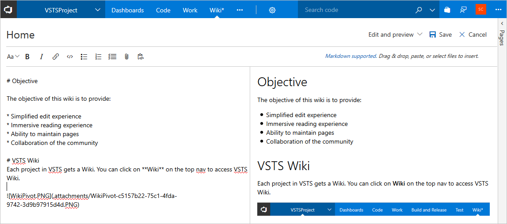
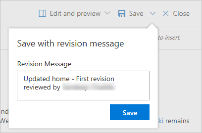
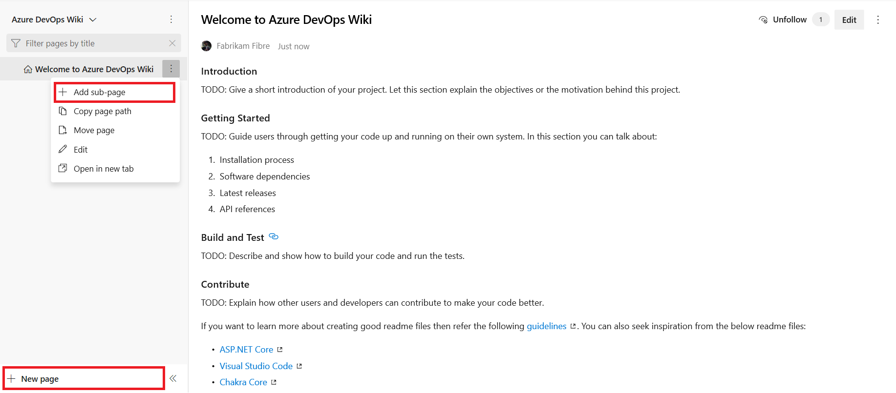
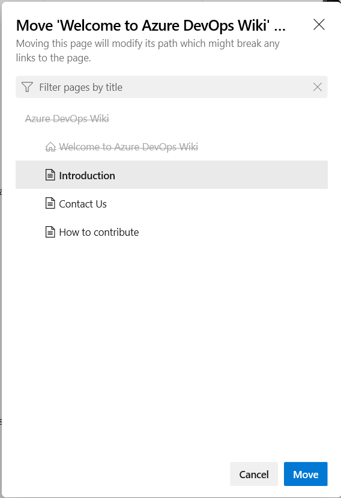

# Quickstart: Add and edit wiki pages

[!INCLUDE [temp](../../_shared/version-vsts-tfs-2018.md)]

When the [Wiki Git repository is provisioned](./wiki-create-repo.md) for your team project, you have a new page where you can add a title and content. There is a side-by-side edit and preview experience where you can edit the page and preview the content as you go.

In this quickstart, you learn how to do the following tasks:  

> [!div class="checklist"]
> * Open Wiki
> * Add a wiki page
> * View revisions for a page
> * Edit and delete wiki pages
> * Reorder wiki pages
> * Make a page the wiki home page

While you author pages using [Markdown format](../../reference/markdown-guidance.md), you can also use the format pane for rich-text formatting and inserting images, attachments, and links.  

> [!div class="mx-imgBorder"]  
> 

As you edit the page, save it by entering **Ctrl+S**. To save with a custom revision message, select the context menu icon next to **Save**. For additional shortcuts, see [Keyboard shortcuts to manage Wiki pages](wiki-keyboard-shortcuts.md).

> [!div class="mx-imgBorder"]  
> 

::: moniker range=">= azure-devops-2019"

> [!NOTE]  
> To add or edit pages to a wiki that you've published from a Git repository, see [Publish a Git repository to a wiki](publish-repo-to-wiki.md). This article addresses how to add and edit pages of a wiki that you've provisioned for a team project.

::: moniker-end

## Prerequisites

* You must have a provisioned wiki. If your wiki hasn't yet been created, [do that now](wiki-create-repo.md).
* You must be a member of the team project as a contributor to add or update wiki pages.

[!INCLUDE  [temp](_shared/open-wiki-hub.md)]

<a id="add-page" />

## Add a wiki page

To add another page, choose **New page**. Or, to add a subpage, open the context menu of an existing page and select **Add subpage**.

Specify a unique title of 235 characters or less. Page titles are case-sensitive. For other title restrictions, see [Wiki Git repository files and file structure, File naming conventions](wiki-file-structure.md#file-naming).

> [!div class="mx-imgBorder"]  
> 

You can also use keyboard shortcuts to add a new page by pressing **n** or add a subpage by pressing **c**. For a complete list of keyboard shortcuts, see [Keyboard shortcuts to manage Wiki pages](wiki-keyboard-shortcuts.md).

### Wiki page title naming restrictions

[!INCLUDE [temp](./_shared/wiki-naming-conventions.md)]

## Edit and delete wiki pages

To edit an existing Wiki page, open the page and select **Edit**, or open the context menu and select **Edit**. You can also use keyboard shortcut **e** to quickly navigate to the edit of the current page. 

To delete a page, open the context menu from the tree or the one inside the page and select **Delete**.  Confirm the delete in the dialog box that opens.

> [!NOTE]  
> Deleting a page deletes the page along with all the metadata and all its sub pages (if any) in the hierarchy.

## Reorder a wiki page

You can reorder pages within the wiki tree view to have pages appear in the order and hierarchy you want. You can drag-and-drop a page title in the tree view to perform the following operations:

* Change the parent-child relationship of a page
* Change the order of the page within the hierarchy

> [!NOTE]  
> Moving a page in the hierarchy may break links to it from other pages. You can always fix the links manually after you move. Reordering a page within a hierarchy has no impact on page links.

You can also use keyboard shortcuts to reorder pages. Select a page and press **CTRL + UP ARROW** or **CTRL + DOWN ARROW** to change page orders.
To change the parent-child relationship of a page, open its context menu and select **Move**. The **Move page** dialog opens. Select a parent page under which you can move the current page.

> [!div class="mx-imgBorder"]  
> 

For a complete list of keyboard shortcuts, see [Keyboard shortcuts to manage Wiki pages](wiki-keyboard-shortcuts.md).

## Make a page the wiki home page

By default, the first page you add when you create a wiki is set as the wiki home page. You can change this if another page becomes more relevant. You have to just drag and drop the page to the top of the tree.

## Next steps

> [!div class="nextstepaction"]
> [View wiki page history and revert](wiki-view-history.md)

