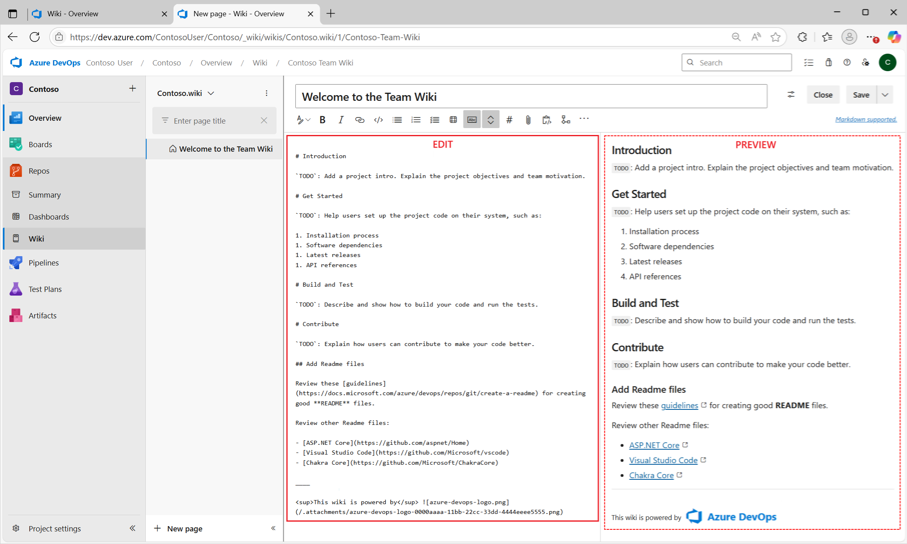
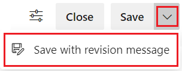
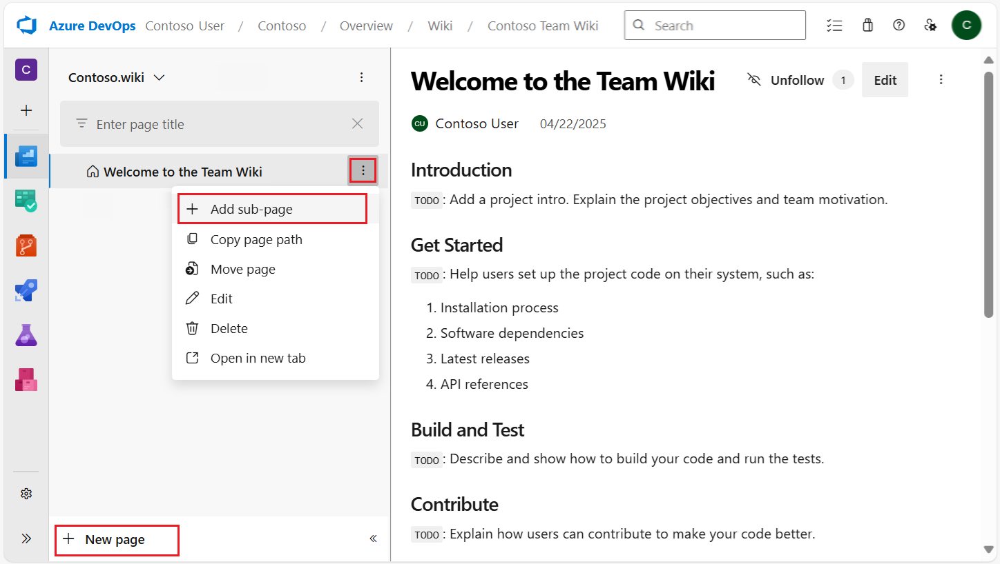
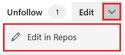
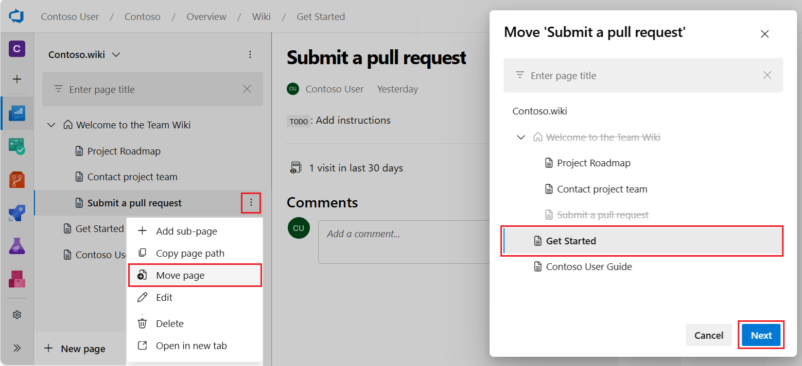

# Add and edit wiki pages

[!INCLUDE [version-lt-eq-azure-devops](../../includes/version-lt-eq-azure-devops.md)] 

You can add a title and content to a page, after the [wiki Git repository is provisioned](./wiki-create-repo.md) for your team project. There's a side-by-side edit and preview experience where you can edit the page and preview the content as you go.

While you author pages using [Markdown format](./markdown-guidance.md), you can also use the format pane for rich-text formatting and inserting images, attachments, and links.  

> [!div class="mx-imgBorder"]  
> 

As you edit the page, save it by entering **Ctrl+S**. To save with a custom revision message, select :::image type="icon" source="../../media/icons/context-menu.png" border="false":::next to **Save**. For more shortcuts, see [Keyboard shortcuts to manage wiki pages](../navigation/keyboard-shortcuts.md).

> [!div class="mx-imgBorder"]  
> 

::: moniker range="azure-devops"

## Wiki command-line tools

| Commands | Description |
|---------|---------|
| [az devops wiki show](#open-wiki) | Open a wiki |
| [az devops wiki page show](/cli/azure/devops/wiki/page#az-devops-wiki-page-show)| Get the content of a page or open a page |
| [az devops wiki page create](#add-a-wiki-page) | Add a new page |
| [az devops wiki page update](#edit-wiki-page) | Edit a page |
| [az devops wiki page delete](#delete-wiki-page) | Delete a page |

::: moniker-end

::: moniker range="<=azure-devops"

> [!NOTE]  
> To add or edit pages to a wiki that you've published from a Git repository, see [Publish a Git repository to a wiki](publish-repo-to-wiki.md). This article addresses how to add and edit pages of a wiki that you've provisioned for a team project.

::: moniker-end

<a id="prereq">  </a>

## Prerequisites

| Category | Requirements |
|--------------|-------------|
| **Project access** | Member of the project where the wiki's located. If you don't have access, request it from your project administrator. |
| **Permissions** | Member of the **Contributors** group. |
| **Access levels** | At least **Basic** access. |
| **Tasks**  | Complete [provisioned wiki](wiki-create-repo.md).|

<a id="open-wiki">  </a>

[!INCLUDE  [temp](includes/open-wiki-hub.md)]

<a id="add-page"></a>

## Add a wiki page

#### [Browser](#tab/browser) 

To add another page, choose **New page**. Or, to add a subpage, open the context menu of an existing page and select **Add subpage**.

Specify a unique title of 235 characters or less. Page titles are case-sensitive. For other title restrictions, see [Wiki Git repository files and file structure, File naming conventions](wiki-file-structure.md#file-naming-conventions).

> [!div class="mx-imgBorder"]  
> 

You can also use keyboard shortcuts to add a new page by pressing **n** or add a subpage by pressing **c**. For a complete list of keyboard shortcuts, see [Keyboard shortcuts to manage wiki pages](../navigation/keyboard-shortcuts.md#wiki-keyboard-shortcuts).

#### [Azure DevOps CLI](#tab/azure-devops-cli)

::: moniker range="azure-devops"

To add a wiki page, enter the `az devops wiki page create` command. 

> [!div class="tabbedCodeSnippets"]
```azurecli
az devops wiki page create --path
                           --wiki
                           [--comment]
                           [--content]
                           [--encoding {ascii, utf-16be, utf-16le, utf-8}]
                           [--file-path]
                           [--project]
                           [--subscription]
```

### Parameters

- **--path**: Required. Path of the wiki page.  
- **--wiki**: Required. Name or ID of the wiki.
-  **--comment**: Optional. Comment in the commit message of the file add operation. Default value: Added a new page using Azure DevOps CLI.
-  **--content**: Optional. Content of the wiki page. Ignored if `--file-path` is specified. 
-  **--encoding**: Optional. Encoding of the file. Used with `--file-path` parameter.
accepted values: `ascii`, `utf-16be`, `utf-16le`, `utf-8`
-  **--file-path**: Optional. Path of the file input if the content is specified in the file.    
-  **--project -p**: Required if not configured as default or picked up via git config. Name or ID of the project. You can configure the default project using the az devops configure `-d project=NAME_OR_ID`. 

### Examples

Create a new page with the path 'my page' in a wiki named 'myprojectwiki' with inline content.

> [!div class="tabbedCodeSnippets"]
```azurecli
az devops wiki page update --path 'my page' --wiki myprojectwiki --content "Hello World"
```

Update content of the page with path 'my page' in a wiki with content from a file.

> [!div class="tabbedCodeSnippets"]
```azurecli
az devops wiki page update --path 'my page' --wiki myprojectwiki --file-path a.txt --encoding utf-8
```

::: moniker-end

[!INCLUDE [note-cli-not-supported](../../includes/note-cli-not-supported.md)]

* * *

<a id="page-title-names"></a>

### Wiki page title naming restrictions

[!INCLUDE [temp](./includes/wiki-naming-conventions.md)]

## Edit and delete wiki pages

#### [Browser](#tab/browser) 

To edit an existing wiki page, open the page and select **Edit**, or open the context menu and select **Edit**. You can also use keyboard shortcut **e** to go to the edit of the current page quickly. For more information about specific editing functions, see [Use Markdown guidance](markdown-guidance.md).

::: moniker range="> azure-devops-2020"

For code wikis, you can edit a page in the side-by-side editor, using the markdown toolbar to create your content. This experience is identical to the process in a project wiki. You can also edit wiki pages in the Repos hub also by using the option, **Edit in Repos**.  

> [!div class="mx-imgBorder"]  
> 

Select **Edit in Repos** to create a branch and continue editing. The **Edit in Repos** button is available only for code wikis that have branch policies enabled. If you don't see the button, it might be because your wiki isn't a code wiki or branch policies aren't enabled. For more information on branch policies, see [Branch policies and settings](../../repos/git/branch-policies.md).

::: moniker-end

To delete a page, open the context menu from the tree or the one inside the page and select **Delete**. Confirm the delete in the dialog that opens.

> [!NOTE]  
> When you delete a wiki page, you also delete all its metadata and any subpages within its hierarchy.

#### [Azure DevOps CLI](#tab/azure-devops-cli)

::: moniker range="azure-devops"

### Edit wiki page

To edit a wiki page, enter the `az devops wiki page update` command. 

> [!div class="tabbedCodeSnippets"]
```azurecli
az devops wiki page update --path
                           --version
                           --wiki
                           [--comment]
                           [--content]
                           [--file-path]
                           [--project]
                           [--subscription]
```

### Parameters

- **--path**: Required. Path of the wiki page.
- **--version -v**: Required. Version (ETag) of the file to edit.
- **--wiki**: Required. Name of ID of the wiki.
- **--comment**: Optional. Comment in the commit message of delete operation.
- **--file-path**: Optional. Path of the file input if the content is specified in the file.
- **--project -p**: Optional. Name or ID of the project.
- **--subscription**: Optional. Name or ID of subscription. You can configure the default subscription using `az account set -s NAME_OR_ID`.

### Examples

Update content of the page with path 'my page' in a wiki named 'myprojectwiki' with inline content.

> [!div class="tabbedCodeSnippets"]
```azurecli
az devops wiki page update --path 'my page' --wiki myprojectwiki --content "Hello World" --version 4ae78ad5835cb7dd55072fe210c9ee7eb6d6413b
```

Update content of page with path 'my page' in a wiki with content from a file.

> [!div class="tabbedCodeSnippets"]
```azurecli
az devops wiki page update --path 'my page' --wiki myprojectwiki --file-path a.txt --encoding utf-8 --version 4ae78ad5835cb7dd55072fe210c9ee7eb6d6413b
```

### Delete wiki page

To delete a wiki page, enter the `az devops wiki page delete` command. 

> [!div class="tabbedCodeSnippets"]
```azurecli
az devops wiki page delete --path
                           --wiki
                           [--comment]
                           [--project]
                           [--subscription]
                           [--yes]
                          
```

### Parameters

- **--path**: Required. Path of the wiki page.
- **--wiki**: Required. Name or ID of the wiki.
- **--comment**: Optional. Comment in the commit message of the delete operation.
- **--project -p**: Optional. Name or ID of the project. You can configure the default project using az devops configure -d project=NAME_OR_ID. Required if not configured as default or picked up via git config.
- **--subscription**: Optional. Name or ID of subscription. You can configure the default subscription using `az account set -s NAME_OR_ID`.
- **--yes -y**: Optional. Don't prompt for confirmation.

### Example

Delete a wiki page with the path 'my wiki' in a wiki named 'myprojectwiki.'

> [!div class="tabbedCodeSnippets"]
```azurecli
az devops wiki page delete --path 'my wiki' --wiki 'myprojectwiki'
```

::: moniker-end

[!INCLUDE [note-cli-not-supported](../../includes/note-cli-not-supported.md)]

* * *

## Reorder a wiki page

You can reorder pages within the wiki tree view to have pages appear in the order and hierarchy you want. You can drag-and-drop a page title in the tree view to do the following operations:

* Change the parent-child relationship of a page.
* Change the order of the page within the hierarchy.

> [!NOTE]  
> Moving a page in the hierarchy might break links from other pages. You can manually fix these links after moving the page. Reordering a page within the hierarchy does not affect page links.

### Manually fix a broken link after moving a page

To manually fix a broken link after moving a page in the hierarchy, follow these steps:

1. **Identify broken links:**
   - Go to the pages that originally linked to the moved page.
   - Look for broken links, which might appear as errors or missing content.
2. **Edit the linking page:** Open the page with the broken link in edit mode.
3. **Update the link:**
   - Locate the broken link in the content.
   - Update the link to point to the new location of the moved page, which typically involves changing the URL or path in the link.
4. **Save changes:** Save the changes to the page to apply the updated link.
5. **Verify the fix:** Go to the updated link to ensure it correctly points to the moved page.

### Example

If you moved a page from `/docs/old-path/page.md` to `/docs/new-path/page.md`, you'd do the following steps:

1. Find the broken link in the content, such as `Link to Page`.
2. Edit the link to the new path: `Link to Page`.
3. Save the changes and verify that the link now correctly points to the new location.

### Use keyboard shortcuts to reorder pages

You can also use keyboard shortcuts to reorder pages. Select a page and press **CTRL + UP ARROW** or **CTRL + DOWN ARROW** to change page orders.
To change the parent-child relationship of a page, open its context menu and select **Move**. The **Move page** dialog opens. Select a parent page under which you can move the current page.

> [!div class="mx-imgBorder"]  
> 

For a complete list of keyboard shortcuts, see [Keyboard shortcuts to manage wiki pages](../navigation/keyboard-shortcuts.md#wiki-keyboard-shortcuts).

## Make a page the wiki home page

By default, the first page you add when you create a wiki is set as the wiki home page. You can change your wiki homepage if another page becomes more relevant by dragging and dropping the page to the top of the tree.

## Next steps

> [!div class="nextstepaction"]
> [View wiki page history and revert](wiki-view-history.md)

## Related articles

- [Follow a wiki page and receive notifications](follow-notifications-wiki-pages.md)
- [Compare provisioned vs. published wiki](provisioned-vs-published-wiki.md)
- [Update a wiki offline](wiki-update-offline.md)
- [Use wiki Markdown guidance](markdown-guidance.md)
