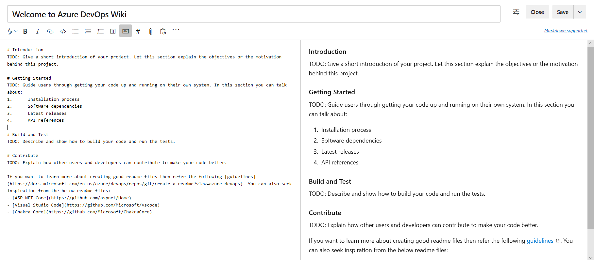
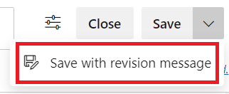

# Quickstart: Add and edit wiki pages

[!INCLUDE [temp](../../_shared/version-vsts-tfs-2018.md)]

When the [Wiki Git repository is provisioned](./wiki-create-repo.md) for your team project, you have a new page where you can add a title and content. There is a side-by-side edit and preview experience where you can edit the page and preview the content as you go.

In this quickstart, learn how to do the following tasks:  

> [!div class="checklist"]
> * Open wiki
> * Add a wiki page
> * View revisions for a page
> * Edit and delete wiki pages
> * Reorder wiki pages
> * Make a page the wiki home page

While you author pages using [Markdown format](../../reference/markdown-guidance.md), you can also use the format pane for rich-text formatting and inserting images, attachments, and links.  

> [!div class="mx-imgBorder"]  
> 

As you edit the page, save it by entering **Ctrl+S**. To save with a custom revision message, select the context menu icon next to **Save**. For additional shortcuts, see [Keyboard shortcuts to manage Wiki pages](wiki-keyboard-shortcuts.md).

> [!div class="mx-imgBorder"]  
> 

::: moniker range=">= azure-devops-2019"

> [!NOTE]  
> To add or edit pages to a wiki that you've published from a Git repository, see [Publish a Git repository to a wiki](publish-repo-to-wiki.md). This article addresses how to add and edit pages of a wiki that you've provisioned for a team project.

::: moniker-end

<a id="prereq">  </a>

## Prerequisites

* You must have a provisioned wiki. If your wiki hasn't yet been created, [do that now](wiki-create-repo.md).
* You must be a member of the team project as a contributor to add or update wiki pages.

[!INCLUDE  [temp](_shared/open-wiki-hub.md)]

::: moniker range="= azure-devops"

## View a wiki page - Azure DevOps CLI

To get the content of a page or open a page, enter the `az devops wiki show` command. 

> [!div class="tabbedCodeSnippets"]
```CLI
az devops wiki page show --path
                         --wiki
                         [--detect {false, true}]
                         [--include-content]
                         [--open]
                         [--org]
                         [--project]
                         [--version]
```

### Parameters

- **--path**: Required. Path of the wiki page.
- **--wiki**: Required. Name or ID of the wiki.
- **--detect**: Optional. Automatically detect organization.
- **--include-content**: Optional. Include content of the page.
- **--open**: Optional. Open the wiki page in your web browser.
- **--org --organization**: Optional. Azure DevOps organization URL.
- **--project -p**: Optional. Name or ID of the project.
- **--version -v**: Optional. Version (ETag) of the wiki page.

::: moniker-end

<a id="add-page" />

## Add a wiki page

#### [Browser](#tab/browser) 

To add another page, choose **New page**. Or, to add a subpage, open the context menu of an existing page and select **Add subpage**.

Specify a unique title of 235 characters or less. Page titles are case-sensitive. For other title restrictions, see [Wiki Git repository files and file structure, File naming conventions](wiki-file-structure.md#file-naming).

> [!div class="mx-imgBorder"]  
> 

You can also use keyboard shortcuts to add a new page by pressing **n** or add a subpage by pressing **c**. For a complete list of keyboard shortcuts, see [Keyboard shortcuts to manage Wiki pages](wiki-keyboard-shortcuts.md).

#### [Azure DevOps CLI](#tab/azure-devops-cli)

To add a wiki page, enter the `az devops wiki page create` command. 

> [!div class="tabbedCodeSnippets"]
```Azure CLI

az devops wiki page create --path
                           --wiki
                           [--comment]
                           [--content]
                           [--detect {false, true}]
                           [--encoding {ascii, utf-16be, utf-16le, utf-8}]
                           [--file-path]
                           [--org]
                           [--project]
```

#### Parameters

- **--path**: Required. Path of the wiki page.  
- **--wiki**: Required. Name or ID of the wiki.
-  **--comment**: Optional. Comment in the commit message of file add operation. Default value: Added a new page using Azure DevOps CLI.
-  **--content**: Optional. Content of the wiki page. Ignored if --file-path is specified. 
-  **--detect**: Optional. Automatically detect organization. Accepted values: false, true.
-  **--encoding**: Optional. Encoding of the file. Used in conjunction with --file-path parameter.
accepted values: ascii, utf-16be, utf-16le, utf-8
-  **--file-path**: Optional. Path of the file input if content is specified in the file.    
-  **--org --organization**: Required if not configured as default or picked up via git config. Example: https://dev.azure.com/MyOrganizationName/. Azure DevOps organization URL. You can configure the default organization using az devops configure -d organization=ORG_URL.  
-  **--project -p**: Required if not configured as default or picked up via git config. Name or ID of the project. You can configure the default project using az devops configure -d project=NAME_OR_ID. 

#### Examples

Create a new page with path 'my page' in a wiki named 'myprojectwiki' with inline content.

> [!div class="tabbedCodeSnippets"]
```CLI
az devops wiki page update --path 'my page' --wiki myprojectwiki --content "Hello World"            --version 4ae78ad5835cb7dd55072fe210c9ee7eb6d6413b
```

Update content of page with path 'my page' in a wiki with content from a file.

> [!div class="tabbedCodeSnippets"]
```CLI
az devops wiki page update --path 'my page' --wiki myprojectwiki --file-path a.txt            --encoding utf-8 --version 4ae78ad5835cb7dd55072fe210c9ee7eb6d6413b
```

[!INCLUDE [note-cli-not-supported](../../_shared/note-cli-not-supported.md)]
* * *

<a id="page-title-names"></a>

### Wiki page title naming restrictions

[!INCLUDE [temp](./_shared/wiki-naming-conventions.md)]

## Edit and delete wiki pages

#### [Browser](#tab/browser) 

To edit an existing Wiki page, open the page and select **Edit**, or open the context menu and select **Edit**. You can also use keyboard shortcut **e** to quickly navigate to the edit of the current page. 

For code wikis, you can edit wiki pages in Repos hub also by using the option **Edit in Repos**

> [!div class="mx-imgBorder"]  
> 

> [!NOTE]  
> If you have branch policies in your code wiki, use "Edit in Repos" to create a branch and continue editing.

To delete a page, open the context menu from the tree or the one inside the page and select **Delete**.  Confirm the delete in the dialog box that opens.

> [!NOTE]  
> Deleting a page deletes the page along with all the metadata and all its sub pages (if any) in the hierarchy.

#### [Azure DevOps CLI](#tab/azure-devops-cli)

## Edit wiki page

To edit a wiki page, enter the `az devops wiki page update` command. 

> [!div class="tabbedCodeSnippets"]
```CLI
az devops wiki page update --path
                           --version
                           --wiki
                           [--comment]
                           [--content]
                           [--detect {false, true}]
                           [--encoding {ascii, utf-16be, utf-16le, utf-8}]
                           [--file-path]
                           [--org]
                           [--project]
```

#### Parameters

- **--path**: Required. Path of the wiki page.
- **--version -v**: Required. Version (ETag) of file to edit.
- **--wiki**: Required. Name of ID of the wiki.
- **--comment**: Optional. Comment in the commit message of delete operation.
- **--detect**: Optional. Automatically detect organization.
- **--encoding**: Optional. Encoding of the file. Used in conjunction with --file-path parameter.
- **--file-path**: Optional. Path of the file input if content is specified in the file.
- **--org --organization**: Optional. Azure DevOps organization URL. You can configure the default organization using az devops configure -d organization=ORG_URL. Required if not configured as default or picked up via git config. Example: https://dev.azure.com/MyOrganizationName/.
- **--project -p**: Name or ID of the project.

#### Examples

Update content of page with path 'my page' in a wiki named 'myprojectwiki' with inline content.

> [!div class="tabbedCodeSnippets"]
```CLI
az devops wiki page update --path 'my page' --wiki myprojectwiki --content "Hello World"            --version 4ae78ad5835cb7dd55072fe210c9ee7eb6d6413b
```

Update content of page with path 'my page' in a wiki with content from a file.

> [!div class="tabbedCodeSnippets"]
```CLI
az devops wiki page update --path 'my page' --wiki myprojectwiki --file-path a.txt            --encoding utf-8 --version 4ae78ad5835cb7dd55072fe210c9ee7eb6d6413b
```

## Delete wiki page

To delete a wiki page, enter the `az devops wiki page delete` command. 

> [!div class="tabbedCodeSnippets"]
```CLI
az devops wiki page delete --path
                           --wiki
                           [--comment]
                           [--detect {false, true}]
                           [--org]
                           [--project]
                           [--yes]
                          
```

#### Parameters

- **--path**: Required. Path of the wiki page.
- **--wiki**: Required. Name or ID of the wiki.
- **--comment**: Optional. Comment in the commit message of delete operation.
- **--detect**: Optional. Automatically detect organization.
- **--org --organization**: Optional. Azure DevOps organization URL. 
- **--project -p**: Optional. Name or ID of the project.
- **--yes -y**: Optional. Do not prompt for confirmation.

[!INCLUDE [note-cli-not-supported](../../_shared/note-cli-not-supported.md)]

* * *

::: moniker range="azure-devops"

## Get wiki page content

To get wiki page content, enter the `az devops wiki show` command. 

> [!div class="tabbedCodeSnippets"]
```CLI
az devops wiki page show --path
                         --wiki
                         [--detect {false, true}]
                         [--include-content]
                         [--open]
                         [--org]
                         [--project]
                         [--version]
```

#### Parameters

- **--path**: Required. Path of the wiki page.
- **--wiki**: Required. Name or ID of the wiki.
- **--detect**: Optional. Automatically detect organization.
- **--include-content**: Optional. Include content of the page.
- **--open**: Open the wiki page in your web browser.
- **--org --organization**: Optional. Azure DevOps organization URL. 
- **--project -p**: Optional. Name or ID of the project.
- **--version -v**: Optional. Version (ETag) of the wiki page.

::: moniker-end


## Reorder a wiki page

You can reorder pages within the wiki tree view to have pages appear in the order and hierarchy you want. You can drag-and-drop a page title in the tree view to perform the following operations:

* Change the parent-child relationship of a page
* Change the order of the page within the hierarchy

> [!NOTE]  
> Moving a page in the hierarchy may break links to it from other pages. You can always fix the links manually after you move. Reordering a page within a hierarchy has no impact on page links.

You can also use keyboard shortcuts to reorder pages. Select a page and press **CTRL + UP ARROW** or **CTRL + DOWN ARROW** to change page orders.
To change the parent-child relationship of a page, open its context menu and select **Move**. The **Move page** dialog opens. Select a parent page under which you can move the current page.

> [!div class="mx-imgBorder"]  
> 

For a complete list of keyboard shortcuts, see [Keyboard shortcuts to manage Wiki pages](wiki-keyboard-shortcuts.md).

## Make a page the wiki home page

By default, the first page you add when you create a wiki is set as the wiki home page. You can change this if another page becomes more relevant. You have to just drag and drop the page to the top of the tree.

## Next steps

> [!div class="nextstepaction"]
> [View wiki page history and revert](wiki-view-history.md)


