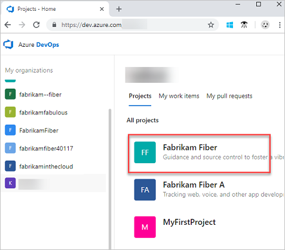

# Create and embed a work item from wiki

[!INCLUDE [temp](../../_shared/version-vsts-only.md)]

Learn how to create and embed work items in your wiki page content. This feature gives you an easy way to promote text to a link to a feature, task, or user story.

## Create and embed work item 

1. Sign in to your organization (`https://dev.azure.com/{yourorganization}`), and then select your **project**.

   

2. Select your **wiki**.
2. Highlight the text, and then select the type of work item you want to create from the **New work item** dropdown menu, which appears above the highlighted text. The work item form opens with the selected text added as the title and description of the work item. 
3. Add information to the work item, such as entering an assignee in the Assign To box, and then select **Save**.
  
    

The selected content in the wiki page is replaced with the embedded work item.

> [!NOTE]
> Only markdown plain text (including bold and italics) are replaced in the wiki page. For the rest of the content, like images, code blocks, and videos, the work item is created, but the embed must be done manually. This is to prevent the page from breaking due to the replaced work item.