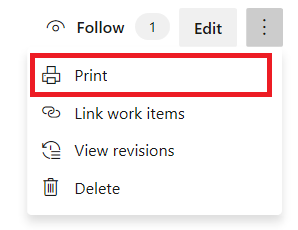

---
title: Filter a wiki TOC or print a wiki page
titleSuffix: Azure DevOps 
description: Filter the contents of a wiki TOC or print a wiki page in Azure DevOps 
ms.subservice: azure-devops-wiki
ms.custom: wiki, devdivchpfy22
ms.topic: conceptual
ms.assetid:
ms.author: chcomley
author: chcomley
ms.reviewer: gopinach
monikerRange: '<= azure-devops'
ms.date: 06/13/2022  
---

# Filter the contents of a wiki or print a page

[!INCLUDE [version-lt-eq-azure-devops](../../includes/version-lt-eq-azure-devops.md)] 

To focus on a single page or several pages, use the *Filter pages* feature in the table of contents (TOC). Or, to find pages containing a phrase or keyword, you can use the [search function](../search/get-started-search.md).

To print a wiki page, you can select a page and then print it.  

## Filter wiki pages

Enter a title, keyword, or character string into the **Filter pages by title** box to quickly find pages whose title contains the keyword.

> [!div class="mx-imgBorder"]  
> 

## Print a wiki page

The **Print page** menu option allows you to use your browser print function to send a page to a printer or save as a PDF. Currently, you can only print a single page at a time.

> [!div class="mx-imgBorder"]  
> 

::: moniker range="tfs-2018"
> [!NOTE]  
> The **Print page** feature is supported on TFS 2018.2 or later versions..
::: moniker-end

> [!NOTE]  
> The print feature may not be available from the Firefox web browser.  
