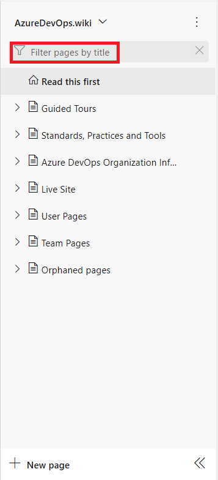

# Filter the contents of a wiki or print a page

[!INCLUDE [temp](../../_shared/version-vsts-tfs-2018.md)]

To focus on a single page or several pages, use the Filter pages feature in the TOC. Or, to find pages containing a phrase or keyword, you can use the [Search wiki in this project](search-wiki.md).

To print a wiki page, you can select a page and print it.  

## Filter wiki pages

Enter a title, keyword, or character string into the **Filter pages** box to quickly find pages whose title contains the keyword.

## Print a wiki page

The **Print page** menu option allows you to use your browser print function to send a page to a printer or save as a PDF. Currently, you can only print a single page at a time.

> [!div class="mx-imgBorder"]  
> 

::: moniker range="tfs-2018"
> [!NOTE]  
> The **Print page** feature is supported on TFS 2018.2 or later versions..
::: moniker-end

> [!NOTE]  
> The print feature may not be available from the Firefox web browser.  