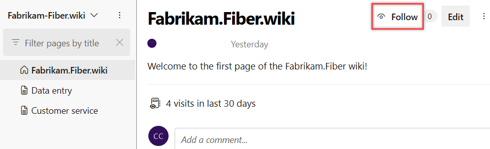
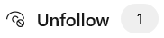

# Follow a wiki page, get notifications

[!INCLUDE [version-eq-azure-devops](../../includes/version-eq-azure-devops.md)]

Follow a Wiki page to receive email notifications whenever the page is edited, deleted, or renamed.

You receive immediate notifications for renames and deletions. For edits, you receive a 30-minute digest email that includes all edits made within that period. This digest helps prevent your inbox from being spammed with individual edit notifications.

## Follow a wiki page

To follow a Wiki page, select the **Follow** button on the page you want to track. You can manage your notification settings in your user profile to ensure you receive updates as needed.

   

When you create a page, you become a default follower of the page. 

## Unfollow a wiki page

You can unfollow a wiki page in the following ways:

- **UI:** Select the **Unfollow** button on the page.

  

- **Footer of your email notification:** Select the **Unfollow** link in your email notification.

  

> [!NOTE]
> When a user deletes a page, all followers get removed.

## Related articles

- [Create a wiki for your team project](wiki-create-repo.md)
- [Learn about wiki Git repository files and file structure](wiki-file-structure.md)
- [Make a clone of an existing Git repo](../../repos/git/clone.md)
- [Learn how to share code with push](../../repos/git/pushing.md)
- [Manage README and Wiki permissions](manage-readme-wiki-permissions.md)
- [Follow syntax guidance for Markdown files, widgets, wikis, and pull request comments](./markdown-guidance.md)
