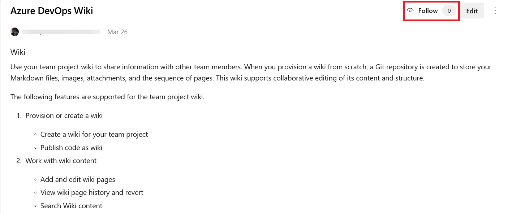
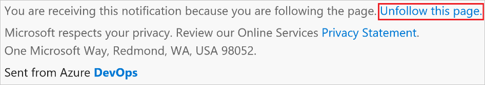

# Follow a wiki page, get notifications

[!INCLUDE [temp](../../_shared/version-vsts-only.md)]

Follow a Wiki page and get notified by email whenever the page is edited, deleted, or renamed.

Get immediate notifications for rename and delete. For edit notifications, you get a 30-minute digest email with all edits that occurred within that period. This digest prevents the emails from spamming your inbox.

   

When you create a page, you become a default follower of the page. You can unfollow the page in the following two ways:

* From within the UI

   

* From within the footer of your email notification

   

To reduce noise, you don’t get notified for pages that you follow when the action is performed by you.

> [!NOTE]
> When a page is deleted, all followers are removed.

## Related articles

- [Create a wiki for your team project](wiki-create-repo.md)
- [Wiki Git repository files and file structure](wiki-file-structure.md)
- [Clone an existing Git repo](../../repos/git/clone.md)
- [Share code with push](../../repos/git/pushing.md)
- [Manage README and Wiki permissions](manage-readme-wiki-permissions.md)
- [Syntax guidance for Markdown files, widgets, wikis, and pull request comments](../../reference/markdown-guidance.md).

