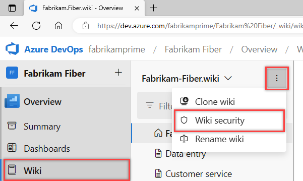

---
title: Manage permissions for READMEs and wiki pages
titleSuffix: Azure DevOps
description: Learn how to set permissions to grant or secure access to README files and you team project built-in wiki.
ms.technology: devops-collab
ms.custom: wiki
ms.topic: conceptual
ms.assetid: 
ms.author: chcomley
author: chcomley
ms.reviewer: gopinach
ms.date: 06/08/2021
monikerRange: '>= tfs-2017'
---

# Manage Wiki permissions

[!INCLUDE [temp](../../includes/version-tfs-2017-through-vsts.md)]

Learn about managing permissions for your wiki. By default, all members of the Contributors group can edit Wiki pages.

::: moniker range=">= tfs-2018"

## Manage wiki permissions

By default, all project contributors have read and edit access of the wiki repository. You can grant or restrict access to who can read and edit wiki pages by managing the wiki repository permissions. For more information about permissions in Azure DevOps, see [Get started with permissions, access, and security groups](../../organizations/security/about-permissions.md).
::: moniker-end

::: moniker range="tfs-2018"
> [!NOTE]  
> **Feature availability**: The built-in wiki is available with TFS 2018 and later versions.
::: moniker-end

::: moniker range=">= tfs-2018"

To open the Security dialog, choose **More > Wiki Security**.

> [!div class="mx-imgBorder"]  
> 

For definitions of each repository permission, see [Git repository permissions](../../organizations/security/permissions.md#git-repository).

:::image type="content" source="media/wiki/security-dialog.png" alt-text="Wiki security dialog/":::

## Don't have access to create a page?

If you don't have access to create a wiki page, you need to contact an administrator to grant you adequate permission on the underlying Git repository of the wiki.

## Stakeholder wiki access

### Private projects

Users with [Stakeholder access](../../organizations/security/get-started-stakeholder.md) in a private project can read project wiki pages and view revisions, however they can't do any edit operations. For example, Stakeholders can't create, edit, reorder, or revert changes to wiki pages. These permissions can't be changed.

Stakeholders have zero access to read or edit code wiki pages in private projects.

### Public projects

Stakeholders have full access to wikis in public projects.

For more information about Stakeholder access, see [About access levels, Stakeholder access, Public versus private feature access](../../organizations/security/access-levels.md#public-versus-private-feature-access).

## FAQ

### Q: Is it possible to grant permissions on a per-page basis?

**A:** No, permissions to access the wiki are made for all pages and not individual pages.

::: moniker-end

## Related articles

- [Default Git repository and branch permissions](../../organizations/security/default-git-permissions.md)
- [Get Started with Git](../../repos/git/gitquickstart.md)
