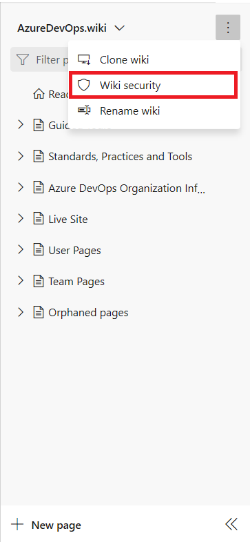
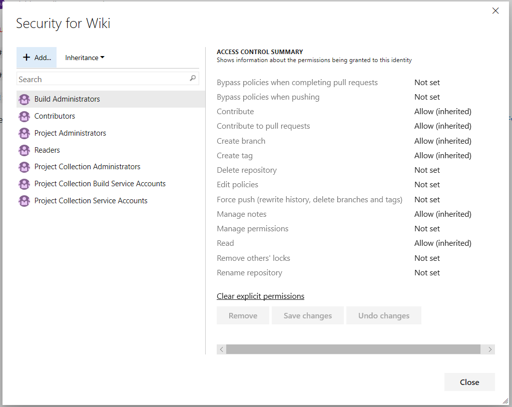

# Manage Wiki permissions

[!INCLUDE [temp](../../_shared/version-tfs-2017-through-vsts.md)]

By default, all members of the Contributors group can edit Wiki pages.

::: moniker range=">= tfs-2018"

## Manage wiki permissions

By default, all project contributors have read and edit access of the wiki repository. You can grant or restrict access to who can read and edit wiki pages by managing the wiki repository permissions.  
::: moniker-end

::: moniker range="tfs-2018"
> [!NOTE]  
> **Feature availability**: The built-in wiki is available with TFS 2018 and later versions. 
::: moniker-end

::: moniker range=">=tfs-2018"

To open the Security dialog, choose **More > Wiki Security**.

> [!div class="mx-imgBorder"]  
> 

For definitions of each repository permission, see [Git repository permissions](../../organizations/security/permissions.md#git-repository).

## Don't have access to create a page?

If you don't have access to create a wiki page, you need to contact an administrator to grant you adequate permission on the underlying Git repository of the wiki. Even if you don't have access to a wiki page, you can see the security and identify an administrative member who can provision access to the wiki.

> [!div class="mx-imgBorder"]  
>   

## Stakeholder wiki access

Users with [Stakeholder access](../../organizations/security/get-started-stakeholder.md) in a private project can read wiki pages and view revisions, however they can't perform any edit operations. For example, stakeholders can't create, edit, reorder, or revert changes to pages. These permissions can't be changed. They have full access to Wikis in public projects.

## Q & A

### Q: Is it possible to grant permissions on a per-page basis?

**A:** No, permissions to access the wiki are made for all pages and not individual pages.

::: moniker-end

## Related articles

- [Default Git repository and branch permissions](../../organizations/security/default-git-permissions.md)
- [Get Started with Git](../../repos/git/gitquickstart.md)
