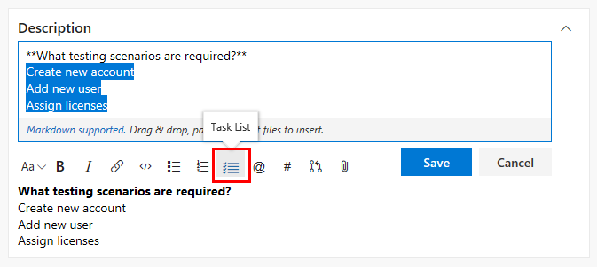
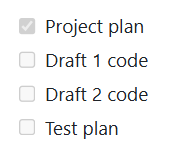
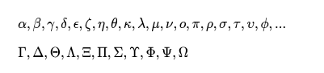

# Syntax guidance for basic Markdown usage

[!INCLUDE [version-lt-eq-azure-devops](../../includes/version-lt-eq-azure-devops.md)]

[!INCLUDE [version-selector](../../includes/version-selector.md)]

Here you can find some basic Markdown syntax guidance and specific guidance for using Markdown in Azure DevOps features. You can use both common [Markdown conventions](https://daringfireball.net/projects/markdown/syntax) and [GitHub-flavored extensions](https://help.github.com/articles/github-flavored-markdown/).

Having the right guidance at the right time is critical to success. Use [Markdown](https://en.wikipedia.org/wiki/Markdown) to add rich formatting, tables, and images to your project pages, README files, dashboards, and pull request comments.

For more supported syntax for wiki pages, see [Wiki Markdown guidance](wiki-markdown-guidance.md).

You can provide guidance in the following areas using Markdown:

::: moniker range=">= azure-devops-2019"

- [Project wiki](add-edit-wiki.md)
- [Publish code as wiki](publish-repo-to-wiki.md)
- [Markdown widget added to a dashboard](../../report/dashboards/add-markdown-to-dashboard.md)  
- [Project page or Welcome pages](../../organizations/projects/project-vision-status.md)
- [Repository README files](../../repos/git/create-a-readme.md)
- [Pull request (PR) comments](../../repos/git/pull-requests.md)  
- [Definition of Done (Kanban board)](../../boards/boards/add-columns.md#definition-of-done)

::: moniker-end

::: moniker range="tfs-2018"

- [Project Wiki](add-edit-wiki.md)
- [Markdown widget added to a dashboard](../../report/dashboards/add-markdown-to-dashboard.md)  
- [Project page or Welcome pages](../../organizations/projects/project-vision-status.md)  
- [Repository README files](../../repos/git/create-a-readme.md)
- [Pull request (PR) comments](../../repos/git/pull-requests.md)
- [Definition of Done (Kanban board)](../../boards/boards/add-columns.md#definition-of-done)

> [!NOTE]
> Rich Markdown rendering in code repositories is supported for TFS 2018.2 and later versions. You can create rich README.md files in the code repositories. The Markdown rendering of the MD files in code repositories supports HTML tags, block quotes, emojis, image resizing, and mathematical formulas. There is parity in Markdown rendering in Wiki and MD files in code.

::: moniker-end

> [!IMPORTANT]  
> Not all Markdown syntax is supported across all features. Each section in this article identifies the features and the syntax supported with the **Supported in** line.

## Headers

#### Supported in: Definition of Done | Markdown widget | Pull Requests | README files | Wikis  

Structure your comments using headers. Headers segment longer comments, making them easier to read.

Start a line with a hash character `#` to set a heading. Organize your remarks with subheadings by starting a line with more hash characters, for example, `####`. You can use up to six levels of headings.

**Example:**
```markdown
# This is a H1 header
## This is a H2 header
### This is a H3 header
#### This is a H4 header
##### This is a H5 header
```

**Result:**

:::image type="content" source="media/markdown-guidance/mrkdown-headers.png" alt-text="Screenshot of Web portal, headers 1 through 5.":::     

## Paragraphs and line breaks

#### Supported in: Definition of Done | Markdown widget | Pull Requests | README files | Wikis  

Make your text easier to read by breaking it into paragraphs or line breaks.  

### Pull requests

In pull request comments, select **Enter** to insert a line break and begin text on a new line.

**Example - pull request comment:**

<pre>
Add lines between your text with the **Enter** key.
Your text gets better spaced and makes it easier to read.
</pre>

**Result:**

Add lines between your text with the **Enter** key.

Your text gets better spaced and makes it easier to read.

### Markdown files or widgets

In a Markdown file or widget, enter two spaces before the line break, and then select **Enter** to begin a new paragraph.

**Example - Markdown file or widget:**

<pre>
Add two spaces before the end of the line, and then select **Enter**.(space, space, Enter)
A space gets added in between paragraphs.
</pre>

**Result:**  

Add two spaces before the end of the line, and then select Enter.

A space gets added in between paragraphs.

## Blockquotes

#### Supported in: Definition of Done | Markdown widget | Pull Requests | README files | Wikis  

Quote previous comments or text to set the context for your comment or text.

Quote single lines of text with `>` before the text. Use many `>` characters to nest quoted text.
Quote blocks of lines of text by using the same level of `>` across many lines.

**Example:**

<pre>
> Single line quote
>> Nested quote
>> multiple line
>> quote
</pre>

**Result:**  


## Horizontal rules

#### Supported in: Definition of Done | Markdown widget | Pull Requests | README files | Wikis  

To add a horizontal rule, add a line that's a series of dashes `---`. The line above the line containing the `---` must be blank.

**Example:**

<div id="do_not_render">
<pre>
above
&nbsp;
&#45;&#45;&#45;&#45;
below
</pre>
</div>

**Result:**  

above    

-----    

below    

## Emphasis (bold, italics, strikethrough) 

#### Supported in: Definition of Done | Markdown widget | Pull Requests | README files | Wikis  

You can emphasize text by applying bold, italics, or strikethrough to characters:

- To apply italics: surround the text with an asterisk `*` or underscore `_` 
- To apply bold: surround the text with double asterisks `**`.
- To apply strikethrough: surround the text with double tilde characters `~~`.

Combine these elements to apply emphasis to the text.

::: moniker range=">= azure-devops-2019"

> [!NOTE]  
> There is no Markdown syntax that supports underlining text. Within a wiki page, you can use the HTML `<u>` tag to generate underlined text. For example, `<u>underlined text</u>` yields <u>underlined text</u>.

::: moniker-end

::: moniker range="tfs-2018"

> [!NOTE]
> There is no Markdown syntax that supports underlining text. Within a wiki page in TFS 2018.2 and later versions, you can use the HTML `<u>` tag to generate underlined text. For example, `<u>underlined text</u>` yields <u>underlined text</u>.

::: moniker-end

**Example:**

<pre>
Use _emphasis_ in comments to express **strong** opinions and point out ~~corrections~~  
**_Bold, italicized text_**  
**~~Bold, strike-through text~~**
</pre>

<br/>

**Result:**  

Use _emphasis_ in comments to express **strong** opinions and point out <s>corrections</s>  
**_Bold, italicized text_**
**~~Bold, strike-through text~~**  

## Code highlighting


#### Supported in: Pull Requests | README files | Wikis

Highlight suggested code segments using code highlight blocks.
To indicate a span of code, wrap it with three backtick quotes (<code>&#96;&#96;&#96;</code>) on a new line at both the start and end of the block. To indicate code inline, wrap it with one backtick quote (<code>&#96;</code>).

> [!NOTE] 
> Code highlighting entered within the Markdown widget renders code as plain preformatted text.


**Example:**

<pre>&#96;&#96;&#96;
sudo npm install vsoagent-installer -g  
&#96;&#96;&#96;
</pre>  

<br/>

**Result:**

```
sudo npm install vsoagent-installer -g
```

<br/>

**Example:**

<pre>
To install the Microsoft Cross Platform Build & Release Agent, run the following: &#96;$ sudo npm install vsoagent-installer -g&#96;.
</pre>

<br/>

**Result:**

To install the Microsoft Cross Platform Build & Release Agent, run the following command: `$ sudo npm install vsoagent-installer -g`.  

<br/>

Within a Markdown file, text with four spaces at the beginning of the line automatically converts to a code block.  

Set a language identifier for the code block to enable syntax highlighting for any of the supported languages in [highlightjs](https://github.com/highlightjs/highlight.js/tree/9.10.0/src/languages), version v9.10.0.

<pre>
``` language
code
```
</pre>

<br/>

**More examples:**

<pre>
``` js
const count = records.length;
```
</pre>

``` js
const count = records.length;
```

<br/>

<pre>
``` csharp
Console.WriteLine("Hello, World!");
```
</pre>

``` csharp
Console.WriteLine("Hello, World!");
```

## Tables

#### Supported in: Markdown widget | Pull Requests | README files | Wikis 

Organize structured data with tables. Tables are especially useful for describing function parameters, object methods, and other data with a
clear name to description mapping. You can format tables in pull requests, wiki, and Markdown files such as README files and Markdown widgets.  

- Place each table row on its own line.
- Separate table cells using the pipe character `|`.
- To use a pipe character within a table you must escape with a backslash `\|`.
- The first two lines of a table set the column headers and the alignment of elements in the table.
- Use colons (`:`) when dividing the header and body of tables to specify column alignment (left, center, right).
- To start a new line, use the HTML break tag (`<br/>`) (works within a Wiki but not elsewhere).  
- Make sure to end each row with a CR or LF.
- You must enter a blank space before and after work item or pull request (PR) mentioned inside a table cell.

**Example:**

```markdown
| Heading 1 | Heading 2 | Heading 3 |  
|-----------|:-----------:|-----------:|  
| Cell A1 | Cell A2 | Cell A3 |  
| Cell B1 | Cell B2 | Cell B3<br/>second line of text |  
```


**Result:**  

| Heading 1 | Heading 2 | Heading 3 |  
|-----------|:---------:|-----------:|  
| Cell A1 | Cell A2 | Cell A3 |  
| Cell B1 | Cell B2 | Cell B3<br/>second line of text |  

## Lists

#### Supported in: Definition of Done | Markdown widget | Pull Requests | README files | Wikis  


Organize related items with lists. You can add ordered lists with numbers or unordered lists with just bullets.

Ordered lists start with a number followed by a period for each list item. Unordered lists start with a `-`. Begin each list item on a new line. In a Markdown file or widget, enter two spaces before the line break to begin a new paragraph or enter two line breaks consecutively to begin a new paragraph.

### Ordered or numbered lists

**Example:**  
```markdown
1. First item.
1. Second item.
1. Third item.
```

**Result:**  
1. First item.
2. Second item.
3. Third item.

### Bulleted lists

**Example:**

```
- Item 1
- Item 2
- Item 3
```

**Result:**

- Item 1
- Item 2
- Item 3

### Nested lists

**Example:**  
```
1. First item.
   - Item 1
   - Item 2
   - Item 3
1. Second item.
   - Nested item 1
      - Further nested item 1
      - Further nested item 2
      - Further nested item 3
   - Nested item 2
   - Nested item 3
```

**Result:**  

1. First item.
    - Item 1
    - Item 2
    - Item 3
2. Second item.
    - Nested item 1
       - Further nested item 1
       - Further nested item 2
       - Further nested item 3 
    - Nested item 2
    - Nested item 3


<a id="link-work-items" />

## Links

#### Supported in: Definition of Done | Markdown widget | Pull Requests | README files | Wikis  

In pull request comments and wikis, HTTP and HTTPS URLs automatically format as links. You can link to work items by entering the *#* key and a work item ID and then choosing the work item from the list.

Avoid auto suggestions for work items by prefixing *#* with a backslash (`\`). This action can be useful if you want to use *#* for color hex codes.

In Markdown files and widgets, you can set text hyperlinks for your URL using the standard Markdown link syntax:

```markdown
[Link Text](Link URL)
```

When you're linking to another Markdown page in the same Git or TFVC repository, the link target can be a relative path or an absolute path in the repository.  

**Supported links for Welcome pages:**

- Relative path: `[text to display](target.md)` 
- Absolute path in Git: `[text to display](/folder/target.md)`
- Absolute path in TFVC: `[text to display]($/project/folder/target.md)`
- URL: `[text to display](http://address.com)`

**Supported links for Markdown widget:**

<ul>
<li>URL: <code>[text to display](http://address.com)</code>  </li>
</ul>

**Supported links for Wiki:**  
<ul>
<li>Absolute path of Wiki pages: <code>[text to display](/parent-page/child-page)</code> </li>
<li>URL: <code>[text to display](http://address.com)</code>  </li>
</ul>

> [!NOTE]  
> Links to documents on file shares using `file://` aren't supported on 2017.1 and later versions. This restriction has been implemented for security purposes.
>
> For information on how to specify relative links from a Welcome page or Markdown widget, see [Source control relative links](#source-control-relative-links).

**Example:**  

```
[C# language reference](/dotnet/csharp/language-reference/)
```

**Result:**

[C# language reference](/dotnet/csharp/language-reference/)

<a id="relative-links">  </a>

### Source control relative links

Links to source control files get interpreted differently depending on whether you specify them in a Welcome page or a Markdown widget. The system interprets relative links as follows:

- **Welcome page:** relative to the root of the source control repository in which the welcome page exists
- **Markdown widget:**  relative to the team project collection URL base

For example:

| Welcome page  | Markdown widget equivalent  |  
|--------------------|-----------------------------------|  
| /BuildTemplates/AzureContinuousDeploy.11.xaml |/DefaultCollection/Fabrikam Fiber/_versionControl#path=$/Tfvc Welcome/BuildTemplates/AzureContinuousDeploy.11.xaml|  
| ./page-2.md |/DefaultCollection/Fabrikam Fiber/_versionControl#path=$/Tfvc Welcome/page-2.md |  

### Anchor links

Within Markdown files, anchor IDs are assigned to all headings when rendered as HTML. The ID is the heading text, with the spaces replaced by dashes (-) and all lower case. In general, the following conventions apply:

- Punctuation marks and leading white spaces within a file name are ignored
- Upper case letters convert to lower case letter
- Spaces between letters convert to dashes (-)

**Example:**

```
###Link to a heading in the page
```

<br/>


**Result:**

The syntax for an anchor link to a section...

<pre>
[Link to a heading in the page](#link-to-a-heading-in-the-page)
</pre>
<br/>
The ID is all lower case, and the link is case-sensitive, so be sure to use lower case, even though the heading itself uses upper case.

You can also reference headings within another Markdown file:

<pre>
[text to display](./target.md#heading-id)  
</pre>

<br/>
In wiki, you can also reference heading in another page:

<pre>
[text to display](/page-name#section-name)
</pre>

<a name="images"> </a>

## Images

#### Supported in: Markdown widget | Pull Requests | README files | Wikis 

To highlight issues or make things more interesting, you can add images and animated GIFs to the following aspects of your pull requests:

- Comments
- Markdown files
- Wiki pages

Use the following syntax to add an image: <div id="do_not_render"><pre>&#33;&#91;Text](URL)</pre></div> The text in the brackets describes the linked image and the URL points to the image location.

**Example:**

<pre>


</pre>

<br/>

**Result:**

The path to the image file can be a relative path or the absolute path in Git or TFVC, just like the path to another Markdown file in a link.  

- Relative path: ``  
- Absolute path in Git: ``  
- Absolute path in TFVC: ``  
- Resize image: `IMAGE_URL =WIDTHxHEIGHT`
  > [!NOTE]
  > Be sure to include a space before the equal sign.
  >- Example: ``
  >- It's also possible to specify only the WIDTH by leaving out the HEIGHT value: `IMAGE_URL =WIDTHx`

## Checklist or task list

#### Supported in: Pull Requests | Wikis

Lightweight task lists are great ways to track progress on your to-dos as a pull request creator or reviewer in the PR description or in a wiki page. Select the Markdown toolbar to get started or apply the format to the selected text.

You can Use `[ ]` or `[x]` to support checklists. Precede the checklist with either `-<space>` or `1.<space>` (any numeral).

**Example - Apply the task list Markdown to a highlighted list**

> [!div class="mx-imgBorder"]  
> 

To mark items as completed by checking the boxes, you need to manually edit the markdown and modify the syntax after adding a task list.

> [!div class="mx-imgBorder"]  
> 

**Example - Format a list as a task list**

<pre>
- [ ] A  
- [ ] B  
- [ ] C  
- [x] A  
- [x] B  
- [x] C  

</pre>

<br/>

**Result:**  

 

> [!NOTE]
> A checklist within a table cell isn't supported.

## Emoji

#### Supported in: Pull Requests | Wikis

In pull request comments and wiki pages, you can use emojis to add character and react to comments in the request. Enter what you're feeling surrounded by `:` characters to get a matching emoji in your text. We support the [full set of emojis](https://www.webpagefx.com/tools/emoji-cheat-sheet/).

**Example:**

<pre>
:smile:
:angry:
</pre>

<br/>

**Result:**  


To escape emojis, enclose them using the \` character.

**Example:**

<pre>`:smile:` `:)` `:angry:`</pre>

**Result:**

 `:smile:` `:)` `:angry:`

## Ignore or escape Markdown syntax to enter specific or literal characters

#### Supported in: Definition of Done | Markdown widget | Pull Requests | README files | Wikis  

:::row:::
   :::column span="1":::
      **Syntax**
   :::column-end::: 
   :::column span="1":::
      **Example/notes**
   :::column-end:::
:::row-end:::
:::row:::
   :::column span="1":::
      To insert one of the following characters, prefix with a <code>&#92;</code>(backslash).  
      `&#92;`, backslash   
      `&#96;`, backtick  
      `&#95;`, underscore  
      `{}`, curly braces  
      `[]`, square brackets  
      `()`, parentheses  
      `#`, hash mark  
      `+`, plus sign 
      `-`, minus sign (hyphen) 
      `.`, period  
      `!`, exclamation mark 
      `*`, asterisk
   :::column-end::: 
   :::column span="1":::
      Some examples on inserting special characters:  
      Enter `&#92;&#92;` to get \   
      Enter `&#92;&#95;` to get &#95;   
      Enter `&#92;#` to get #  
      Enter `&#92;(` to get (  
      Enter `&#92;.` to get .  
      Enter `&#92;!` to get !  
      Enter `&#92;*` to get *  
   :::column-end:::
:::row-end:::

<a name="attach"></a>

## Attachments

#### Supported in: Pull Requests | Wikis

In pull request comments and wiki pages, you can attach files to illustrate your point or to give more detailed reasoning behind your suggestions. To attach a file, drag and drop it into the comment field, or wiki page edit experience. You can also select the **paperclip** in the upper right of the comment box or from the format pane in your wiki page.

        

If you have an image in your clipboard, you can paste it from the clipboard into the comment box or wiki page, and it renders directly into your comment or wiki page.

Attaching non-image files creates a link to the file in your comment. Update the description text between the brackets to change the text displayed in the link.
The attached image files render directly into your comment or wiki pages. Save or update your comment or wiki page with an attachment. Then, you can see the attached image and select links to download the attached files.

Attachments support the following file formats:

> [!div class="mx-tdCol2BreakAll"]
> |          Type          | File formats |
> |------|---------|
> | Code | CS (.cs), Extensible Markup Language (.xml), JavaScript Object Notation (.json), Hypertext Markup Language(.html, .htm), Layer (.lyr), Windows PowerShell script (.ps1), Roshal Archive (.rar), Remote Desktop Connection (.rdp), Structured Query Language (.sql) - **Note: Code attachments aren't permitted in PR comments**  |
> | Compressed files | ZIP (.zip) and GZIP (.gz) |
> | Documents | Markdown (.md), Microsoft Office Message (.msg), Microsoft Project (.mpp), Word (.doc and .docx), Excel (.xls, .xlsx and .csv), and Powerpoint (.ppt and .pptx), text files (.txt), and PDFs (.pdf) | 
> | Images | PNG (.png), GIF (.gif), JPEG (both .jpeg and .jpg), Icons (.ico) | 
> | Visio | VSD (.vsd and .vsdx)  |
> | Video | MOV (.mov), MP4 (.mp4) |

> [!NOTE]
> Not all file formats are supported within pull requests, such as Microsoft Office Message (.msg) files.

<a id="math-notation">  </a>
<a id="mathematical-notation">  </a>

## Mathematical notation and characters

#### Supported in: Pull Requests | Wikis

We support both inline and block [KaTeX](https://khan.github.io/KaTeX/function-support.html) notation in wiki pages and pull requests. See the following supported elements:

- Symbols
- Greek letters
- Mathematical operators
- Powers and indices
- Fractions and binomials
- Other KaTeX supported elements

To include mathematical notation surround the mathematical notation with a `$` sign for inline and `$$` for block,  as shown in the following examples:

::: moniker range="tfs-2018"

> [!NOTE]  
> This feature is supported within Wiki pages and pull requests for TFS 2018.2 or later versions.

::: moniker-end

### Example: Greek characters

```KaTeX
$
\alpha, \beta, \gamma, \delta, \epsilon, \zeta, \eta, \theta, \kappa, \lambda, \mu, \nu, \omicron, \pi, \rho, \sigma, \tau, \upsilon, \phi, ...
$  


$\Gamma,  \Delta,  \Theta, \Lambda, \Xi, \Pi, \Sigma, \Upsilon, \Phi, \Psi, \Omega$
```

**Result:**
> [!div class="mx-imgBorder"]
> 

### Example: Algebraic notation

```KaTeX
Area of a circle is $\pi r^2$

And, the area of a triangle is:

$$
A_{triangle}=\frac{1}{2}({b}\cdot{h})
$$
```

**Result:**
> [!div class="mx-imgBorder"]
> 

### Example: Sums and Integrals

```KaTeX
$$
\sum_{i=1}^{10} t_i
$$


$$
\int_0^\infty \mathrm{e}^{-x}\,\mathrm{d}x
$$     
```

**Result:**
> [!div class="mx-imgBorder"]
> 

## Related articles  

- [Project page or Welcome pages](../../organizations/projects/project-vision-status.md)
- [README files](../../repos/git/create-a-readme.md)
- [Markdown widget](../../report/dashboards/add-markdown-to-dashboard.md)  
- [Dashboards](../../report/dashboards/dashboards.md)
- [Widget catalog](../../report/dashboards/widget-catalog.md)
- [Add and edit Wiki pages](add-edit-wiki.md)
