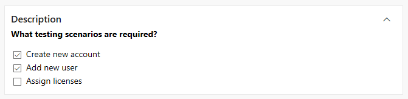
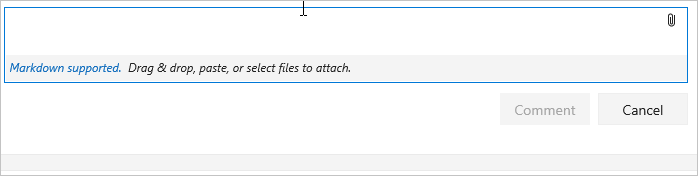

# Syntax guidance for basic Markdown usage

[!INCLUDE [temp](../../_shared/version-ts-tfs-2015-2016.md)]

[!INCLUDE [version-selector](../../_shared/version-selector.md)]

Here you can find some basic Markdown syntax guidance and specific guidance for using Markdown in Azure DevOps features. You can use both common [Markdown conventions](http://daringfireball.net/projects/markdown/syntax) and [GitHub-flavored extensions](https://help.github.com/articles/github-flavored-markdown/).

Having the right guidance at the right time is critical to success. Use [Markdown](https://en.wikipedia.org/wiki/Markdown) to add rich formatting, tables, and images to your project pages, README files, dashboards, and pull request comments.

For additional syntax that's supported for Wiki pages, see [Wiki Markdown guidance](wiki-markdown-guidance.md).

You can provide guidance in the following areas using Markdown:

::: moniker range=">= azure-devops-2019"

- [Project wiki](add-edit-wiki.md)
- [Publish code as wiki](publish-repo-to-wiki.md)
- [Markdown widget added to a dashboard](../../report/dashboards/add-markdown-to-dashboard.md)  
- [Project page or Welcome pages](../../organizations/projects/project-vision-status.md)
- [Repository README files](../../repos/git/create-a-readme.md)
- [Pull request comments](../../repos/git/pull-requests.md)  
- [Definition of Done (Kanban board)](../../boards/boards/definition-of-done.md)

::: moniker-end

::: moniker range="tfs-2018"

- [Project wiki](add-edit-wiki.md)
- [Markdown widget added to a dashboard](../../report/dashboards/add-markdown-to-dashboard.md)  
- [Project page or Welcome pages](../../organizations/projects/project-vision-status.md)  
- [Repository README files](../../repos/git/create-a-readme.md)
- [Pull request comments](../../repos/git/pull-requests.md)
- [Definition of Done (Kanban board)](../../boards/boards/definition-of-done.md)

> [!NOTE]
> Rich Markdown rendering in code repositories is supported for TFS 2018.2 and later versions. You can create rich README.md files in the code repositories. The Markdown rendering of the MD files in code repositories supports HTML tags, block quotes, emojis, image resizing, and mathematical formulas. There is parity in Markdown rendering in Wiki and MD files in code.

::: moniker-end

::: moniker range="tfs-2017"

- [Markdown widget added to a dashboard](../../report/dashboards/add-markdown-to-dashboard.md)
- [Project page or Welcome pages](../../organizations/projects/project-vision-status.md) 
- [Repository README files](../../repos/git/create-a-readme.md)
- [Pull request comments](../../repos/git/pull-requests.md)
- [Definition of Done (Kanban board)](../../boards/boards/definition-of-done.md)

> [!NOTE]
> With TFS 2017.1, welcome pages, the Markdown widget on team dashboards, and the Definition of Done on Kanban boards no longer supports file links in their Markdown. As a workaround, you can include your file link as text in the Markdown.

::: moniker-end  

::: moniker range="tfs-2015"

- [Markdown widget added to a dashboard](../../report/dashboards/add-markdown-to-dashboard.md)
- [Project page or Welcome pages](../../organizations/projects/project-vision-status.md)
- [Repository README files](../../repos/git/create-a-readme.md)
- [Definition of Done (Kanban board)](../../boards/boards/definition-of-done.md)

::: moniker-end

## Headers

Structure your comments using headers. Headers segment longer comments, making them easier to read.

Start a line with a hash character `#` to set a heading. Organize your remarks with subheadings by starting a line with additional hash characters, for example `####`. Up to six levels of headings are supported.

**Example:**
```markdown
# This is a H1 header
## This is a H2 header
### This is a H3 header
#### This is a H4 header
##### This is a H5 header
```

**Result:**

        

## Paragraphs and line breaks

Make your text easier to read by breaking it up with paragraphs or line breaks.  

::: moniker range=">= tfs-2018"
In pull request comments, select **Enter** to insert a line break, and begin text on a new line.

In a Markdown file or widget, enter two spaces before the line break to begin a new paragraph, or enter two consecutive line breaks to begin a new paragraph.

::: moniker-end

::: moniker range="tfs-2017"
In pull request comments, select Enter to insert a line break, and begin text on a new line. In a Markdown file or widget, enter two spaces prior to the line break to begin a new paragraph, or enter two consecutive line breaks to begin a new paragraph.
::: moniker-end

::: moniker range="tfs-2015"
In a Markdown file or widget, enter two spaces prior to the line break to begin a new paragraph, or enter two line breaks consecutively to begin a new paragraph.
::: moniker-end

**Example - pull request comment:**

<pre>
Add lines between your text with the Enter key.
This spaces your text better and makes it easier to read.
</pre>

**Result:**
Add lines between your text with the Enter key.
This spaces your text better and makes it easier to read.

**Example - Markdown file or widget:**

<pre>
Add two spaces prior to the end of the line.(space, space)
This adds space in between paragraphs.
</pre>

**Result:**  
Add two spaces prior to the end of the line.

Space is added in between paragraphs.

## Block quotes

Quote previous comments or text to set the context for your comment or text.

Quote single lines of text with `>` before the text. Use many `>` characters to nest quoted text.
Quote blocks of lines of text by using the same level of `>` across many lines.

**Example:**

<pre>
> Single line quote
>> Nested
>> multiple line
>> quote
</pre>

**Result:**  


## Horizontal rules

To add a horizontal rule, add a line that's a series of dashes `---`. The line above the line containing the `---` must be blank.

**Example:**

<div id="do_not_render">
<pre>
above
&nbsp;
&#45;&#45;&#45;&#45;
below
</pre>
</div>

**Result:**  

above    

-----    

below    

## Emphasis (bold, italics, strikethrough)  

You can emphasize text by applying bold, italics, or strikethrough to characters:

- To apply italics: surround the text with an asterisk `*` or underscore `_` 
- To apply bold: surround the text with double asterisks `**`.
- To apply strikethrough: surround the text with double tilde characters `~~`.

Combine these elements to apply emphasis to text.

::: moniker range=">= azure-devops-2019"
> [!NOTE]  
> There is no Markdown syntax that supports underlining text. Within a wiki page, you can use the HTML `<u>` tag to generate underlined text. For example, `<u>underlined text</u>` yields <u>underlined text`</u>.
::: moniker-end

::: moniker range="tfs-2018"
> [!NOTE]  
> There is no Markdown syntax that supports underlining text. Within a wiki page in TFS 2018.2 and later versions, you can use the HTML `<u>` tag to generate underlined text. For example, `<u>underlined text</u>` yields <u>underlined text`</u>.
::: moniker-end

::: moniker range=">= tfs-2015 <= tfs-2017"
> [!NOTE]  
> There is no Markdown syntax that supports underlining text.
::: moniker-end

**Example:**

<pre>
Use _emphasis_ in comments to express **strong** opinions and point out ~~corrections~~
**_Bold, italicized text_**  
**~~Bold, strike-through text~~**
</pre>

<br/>
**Result:**  
Use _emphasis_ in comments to express **strong** opinions and point out <s>corrections</s>
**_Bold, italicized text_**
**~~Bold, strike-through text~~**  

## Code highlighting

Highlight suggested code segments using code highlight blocks.
To indicate a span of code, wrap it with three backtick quotes (<code>&#96;&#96;&#96;</code>) on a new line at both the start and end of the block. To indicate code inline, wrap it with one backtick quote (<code>&#96;</code>).

**Example:**

<pre>&#96;&#96;&#96;
$ sudo npm install vsoagent-installer -g  
&#96;&#96;&#96;
</pre>  

<br/>
**Result:**
```
$ sudo npm install vsoagent-installer -g
```
<br/>
**Example:**

<pre>
To install the Microsoft Cross Platform Build & Release Agent, run the following: &#96;$ sudo npm install vsoagent-installer -g&#96;.
</pre>

<br/>
**Result:**
To install the Microsoft Cross Platform Build & Release Agent run the following command: `$ sudo npm install vsoagent-installer`.  

<br/>
Within a Markdown file, text with four spaces at the beginning of the line automatically converts to a code block.  

Set a language identifier for the code block to enable syntax highlighting for any of the [supported languages](http://highlightjs.readthedocs.io/en/latest/css-classes-reference.html#language-names-and-aliases).

<pre>
``` language
code
```
</pre>

<br/>
**Additional examples:**

<pre>
``` js
const count = records.length;
```
</pre>

``` js
const count = records.length;
```

<br/>
<pre>
``` csharp
Console.WriteLine("Hello, World!");
```
</pre>

``` csharp
Console.WriteLine("Hello, World!");
```

## Tables

Organize structured data with tables. Tables are especially useful for describing function parameters, object methods, and other data that has
a clear name to description mapping. You can format tables in pull requests, wiki, and Markdown files such as README files and Markdown widgets.  

- Place each table row on its own line
- Separate table cells using the pipe character `|`
- The first two lines of a table set the column headers and the alignment of elements in the table
- Use colons (`:`) when dividing the header and body of tables to specify column alignment (left, center, right)
- To start a new line, use the HTML break tag (`<br/>`) (Works within a Wiki but not elsewhere)  
- Make sure to end each row with a CR or LF.
- A blank space is required before and after work item or pull request (PR) mentions inside a table cell.

**Example:**

```markdown
| Heading 1 | Heading 2 | Heading 3 |  
|-----------|:-----------:|-----------:|  
| Cell A1 | Cell A2 | Cell A3 |  
| Cell B1 | Cell B2 | Cell B3<br/>second line of text |  
```

<br/>
**Result:**  

| Heading 1 | Heading 2 | Heading 3 |  
|-----------|:---------:|-----------:|  
| Cell A1 | Cell A2 | Cell A3 |  
| Cell B1 | Cell B2 | Cell B3<br/>second line of text |  

## Lists

Organize related items with lists. You can add ordered lists with numbers, or unordered lists with just bullets.

Ordered lists start with a number followed by a period for each list item. Unordered lists start with a `-`. Begin each list item on a new line. In a Markdown file or widget, enter two spaces prior to the line break to begin a new paragraph, or enter two line breaks consecutively to begin a new paragraph.

### Ordered or numbered lists

**Example:**  
```markdown
1. First item.
2. Second item.
3. Third item.
```

**Result:**  
1. First item.
2. Second item.
3. Third item.

### Bullet lists

**Example:**

<pre>
- Item 1
- Item 2
- Item 3
</pre>

**Result:**

- Item 1
- Item 2
- Item 3

### Nested lists

**Example:**  
<pre>
1. First item.
   - Item 1
   - Item 2
   - Item 3
1. Second item.
   - Nested item 1
   - Nested item 2
   - Nested item 3 
</pre>

**Result:**  

1. First item.
	- Item 1
	- Item 2
	- Item 3
2. Second item.
	- Nested item 1
	- Nested item 2
	- Nested item 3


<a id="link-work-items" />
## Links

In pull request comments and wikis, HTTP and HTTPS URLs are automatically formatted as links. You can link to work items by entering the *#* key and a work item ID, and then choosing the work item from the list.

Avoid auto suggestions for work items by prefixing *#* with a backslash (`\`). This can be useful if you want to use *#* for color hex codes.

In Markdown files and widgets, you can set text hyperlinks for your URL using the standard Markdown link syntax:

```markdown
[Link Text](Link URL)
```
When linking to another Markdown page in the same Git or TFVC repository, the link target can be a relative path or an absolute path in the repository.  

**Supported links for Welcome pages:**

<ul>
<li>Relative path: ```[text to display](./target.md)```  </li>
<li>Absolute path in Git: ```[text to display](/folder/target.md)``` </li>
<li>Absolute path in TFVC: ```[text to display]($/project/folder/target.md)```</li>
<li>URL: ```[text to display](http://address.com)```  </li>
</ul>

**Supported links for Markdown widget:**

<ul>
<li>URL: ```[text to display](http://address.com)```  </li>
</ul>

**Supported links for Wiki:**  
<ul>
<li>Absolute path of Wiki pages: ```[text to display](/parent-page/child-page)``` </li>
<li>URL: ```[text to display](http://address.com)```  </li>
</ul>

> [!NOTE]  
> Links to documents on file shares using `file://` aren't supported on 2017.1 and later versions. This restriction has been implemented for security purposes.
>
>For information on how to specify relative links from a Welcome page or Markdown widget, see [Source control relative links](#relative-links).

**Example:**  
<pre>
&#91;C# language reference](https://msdn.microsoft.com/library/618ayhy6.aspx)
</pre>

**Result:**

[C# language reference](https://msdn.microsoft.com/library/618ayhy6.aspx)

::: moniker range=">= tfs-2018"

<a id="relative-links">  </a>

### Source control relative links

Links to source control files are interpreted differently depending on whether you specify them in a Welcome page or a Markdown widget. The system interprets relative links as follows:

- **Welcome page:** relative to the root of the source control repository in which the welcome page exists
- **Markdown widget:**  relative to the team project collection URL base

For example:

| Welcome page  | Markdown widget equivalent  |  
|--------------------|-----------------------------------|  
| /BuildTemplates/AzureContinuousDeploy.11.xaml |/DefaultCollection/Fabrikam Fiber/_versionControl#path=$/Tfvc Welcome/BuildTemplates/AzureContinuousDeploy.11.xaml|  
| ./page-2.md |/DefaultCollection/Fabrikam Fiber/_versionControl#path=$/Tfvc Welcome/page-2.md |  

### Anchor links

Within Markdown files, anchor IDs are assigned to all headings when rendered as HTML. The ID is the heading text, with the spaces replaced by dashes (-) and all lower case. In general, the following conventions:

- Punctuation marks and leading white spaces within a file name are ignored
- Upper case letters are  converted to lower
- Spaces between letters are converted to dashes (-).

**Example:**

<pre>
###Link to a heading in the page
</pre>

<br/>
**Result:**

The syntax for an anchor link to a section...

<pre>
[Link to a heading in the page](#link-to-a-heading-in-the-page)
</pre>
<br/>
The ID is all lower case, and the link is case sensitive, so be sure to use lower case, even though the heading itself uses upper case.

You can also reference headings within another Markdown file:

<pre>
[text to display](./target.md#heading-id)  
</pre>

<br/>
In wiki, you can also reference heading in another page:

<pre>
[text to display](/page-name#section-name)
</pre>

<a name="images"> </a>

## Images

To highlight issues or make things more interesting, you can add images and animated GIFs to the following in your pull requests:

- Comments
- Markdown files
- Wiki pages

Use the following syntax to add an image: <div id="do_not_render"><pre>&#33;&#91;Text](URL)</pre></div> The text in the brackets describes the image being linked and the URL points to the image location.

**Example:**

<pre>

</pre>

<br/>
**Result:**


The path to the image file can be a relative path or the absolute path in Git or TFVC, just like the path to another Markdown file in a link.  
<ul>
<li>Relative path:<br/> `````` </li>
<li>Absolute path in Git:<br/> `````` </li>
<li>Absolute path in TFVC:<br/> ``````  </li>
<li>Resize image:<br/> ``````  </li>
</ul>

> [!NOTE]
> The syntax to support image resizing is only supported in pull requests and in the Wiki.

::: moniker-end

::: moniker range=">= tfs-2017"
## Checklist or task list

Lightweight task lists are great ways to track progress on a list of todos as a pull request creator or reviewer in the PR description or in a wiki page. Select the Markdown toolbar to get started or apply the format to selected text.

You can Use `[ ]` or `[x]` to support checklists. You need to precede the checklist with either `-<space>` or `1.<space>` (any numeral).

**Example - Apply the task list Markdown to a highlighted list**

> [!div class="mx-imgBorder"]  
> 

After you've added a task list, you can check the boxes to mark items as completed. These are expressed and stored within the comment as [ ] and [x] in Markdown.

> [!div class="mx-imgBorder"]  
> 

**Example - Format a list as a task list**

<pre>
- [ ] A  
- [ ] B  
- [ ] C  
- [x] A  
- [x] B  
- [x] C  

</pre>

<br/>
**Result:**  
 
 

> [!NOTE]
> A checklist within a table cell isn't supported.

::: moniker-end

::: moniker range=">= tfs-2017"

## Emoji

::: moniker-end

::: moniker range=">= tfs-2018"
In pull request comments and wiki pages, you can use emojis to add character and react to comments in the request. Enter what you're feeling surrounded by `:` characters to get a matching emoji in your text. The [full set of emojis](http://www.webpagefx.com/tools/emoji-cheat-sheet/) are supported.

::: moniker-end

::: moniker range="tfs-2017"
In pull request comments, you can use emojis to add characters and react to comments in the request. Enter what you're feeling surrounded by `:` characters to get a matching emoji in your text. The [full set of emojis](http://www.webpagefx.com/tools/emoji-cheat-sheet/) are supported.

::: moniker-end

::: moniker range=">= tfs-2017"

**Example:**

<pre>
:smile:
:angry:
</pre>
<br/>

**Result:**  


To escape emojis, enclose them using the \` character.

**Example:**

<pre>`:smile:` `:)` `:angry:`</pre>

**Result:**

 `:smile:` `:)` `:angry:`

::: moniker-end

## Ignore or escape Markdown syntax to enter specific or literal characters

<table width="650px">
<tbody valign="top">
<tr>
<th width="300px">Syntax</th>
<th width="350px">Example/notes</th>
</tr>


<tr>
<td>
<p>To insert one of the following characters, prefix with a backslash:</p>

<p style="margin-bottom:2px;">```\   backslash ``` </p>
<p style="margin-bottom:2px;"><code>\`</code>   `backtick`</p>
<p style="margin-bottom:2px;">```_   underscore  ```</p>
<p style="margin-bottom:2px;">```{}  curly braces  ``` </p>
<p style="margin-bottom:2px;">```[]  square brackets ```</p>
<p style="margin-bottom:2px;">```()  parentheses  ```</p>
<p style="margin-bottom:2px;">```#   hash mark  ``` </p>
<p style="margin-bottom:2px;">```+   plus sign  ```</p>
<p style="margin-bottom:2px;">```-   minus sign (hyphen) ```</p>
<p style="margin-bottom:2px;">```.   dot  ``` </p>
<p style="margin-bottom:2px;">```!   exclamation mark  ```</p>

</td>
<td>Some examples on inserting special characters
<p>Enter ```\\``` to get \\ </p>
<p>Enter ```\_``` to get _ </p>
<p>Enter ```\#``` to get \# </p>
<p>Enter ```\(``` to get \( </p>
<p>Enter ```\.``` to get \. </p>
<p>Enter ```\!``` to get \! </p>
</td>
</tr>

</tbody>
</table>

::: moniker range=">= tfs-2017"

<a name="attach"></a>

## Attachments

::: moniker-end

::: moniker range=">= tfs-2018"
In pull request comments and wiki pages, you can attach files to illustrate your point or to give more detailed reasoning behind your suggestions. To attach a file, drag and drop it into the comment field or wiki page edit experience. You can also select the paper-clip icon in the upper right of the comment box or the format pane in wiki page.
::: moniker-end

::: moniker range="tfs-2017"
In pull request comments, you can attach files to illustrate your point or to give more detailed reasoning behind your suggestions. To attach a file, drag and drop it into the comment field. You can also select the paper-clip icon in the upper right of the comment box.
::: moniker-end

::: moniker range="tfs-2017"
> [!NOTE]  
> Attachments in pull requests is available with TFS 2017.1 and later versions.
::: moniker-end

::: moniker range=">= tfs-2017"

        

If you have an image in your clipboard, you can paste it from the clipboard into the comment box or wiki page and it renders directly into your comment or wiki page.

Attaching non-image files creates a link to the file in your comment. Update the description text between the brackets to change the text displayed in the link.
Attached image files render directly into your comment or wiki pages. After you save or update a comment or wiki page with an attachment, you can see the attached image(s) and can select links to download attached files.

Attachments support the following file formats.

> [!div class="mx-tdCol2BreakAll"]
> |          Type          | File formats |
> |------|---------|
> | Code | CS (.cs), Extensible Markup Language (.xml), JavaScript Object Notation (.json), Hypertext Markup Language(.html, .htm), Layer (.lyr), Windows PowerShell script (.ps1), Roshal Archive (.rar), Remote Desktop Connection (.rdp), Structured Query Language (.sql) - **Note: Code attachments aren't permitted in PR comments**  |
> | Compressed files | ZIP (.zip) and GZIP (.gz) |
> | Documents | Markdown (.md), Microsoft Office Message (.msg), Microsoft Project (.mpp), Word (.doc and .docx), Excel (.xls, .xlsx and .csv), and Powerpoint (.ppt and .pptx), text files (.txt), and PDFs (.pdf) | 
> | Images | PNG (.png), GIF (.gif), JPEG (both .jpeg and .jpg), Icons (.ico) | 
> | Visio | VSD (.vsd and .vsdx)  |
> | Video | MOV (.mov), MP4 (.mp4) |

> [!NOTE]
> Not all file formats are supported within pull requests, such as Microsoft Office Message (.msg) files.

::: moniker-end


<a id="math-notation">  </a>
<a id="mathematical-notation">  </a>

::: moniker range=">=tfs-2018"

## Mathematical notation and characters

Both inline and block [KaTeX](https://khan.github.io/KaTeX/function-support.html) notation is supported in wiki pages and pull requests. The following supported elements are included:

- Symbols
- Greek letters
- Mathematical operators
- Powers and indices
- Fractions and binomials
- Other KaTeX supported elements

To include mathematical notation, surround the mathematical notation with a `$` sign, for inline, and `$$` for block,  as shown in the following examples:

::: moniker-end

::: moniker range="tfs-2018"
> [!NOTE]  
> This feature is supported within Wiki pages and pull requests for TFS 2018.2 or later versions.
::: moniker-end

::: moniker range=">=tfs-2018"

### Example: Greek characters

```KaTeX
$
\alpha, \beta, \gamma, \delta, \epsilon, \zeta, \eta, \theta, \kappa, \lambda, \mu, \nu, \omicron, \pi, \rho, \sigma, \tau, \upsilon, \phi, ...
$  


$\Gamma,  \Delta,  \Theta, \Lambda, \Xi, \Pi, \Sigma, \Upsilon, \Phi, \Psi, \Omega$
```

**Result:**
> [!div class="mx-imgBorder"]


### Example: Algebraic notation

```KaTeX
Area of a circle is $\pi r^2$

And, the area of a triangle is:

$$
A_{triangle}=\frac{1}{2}({b}\cdot{h})
$$

```

**Result:**
> [!div class="mx-imgBorder"]


### Example: Sums and Integrals

```KaTeX
$$
\sum_{i=1}^{10} t_i
$$


$$
\int_0^\infty \mathrm{e}^{-x}\,\mathrm{d}x
$$     
```

**Result:**
> [!div class="mx-imgBorder"]


::: moniker-end

## Related articles  

- [Project page or Welcome pages](../../organizations/projects/project-vision-status.md)
- [README files](../../repos/git/create-a-readme.md)
- [Markdown widget](../../report/dashboards/add-markdown-to-dashboard.md)  
- [Dashboards](../../report/dashboards/dashboards.md)
- [Widget catalog](../../report/dashboards/widget-catalog.md)
- [Add and edit Wiki pages](add-edit-wiki.md)
  