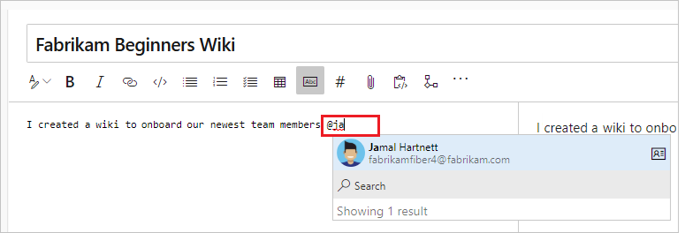

# Use Markdown in Azure DevOps

[!INCLUDE [version-lt-eq-azure-devops](../../includes/version-lt-eq-azure-devops.md)]

[!INCLUDE [version-selector](../../includes/version-selector.md)]

In this article, find basic syntax guidance for using Markdown in Azure DevOps features and [wiki Markdown](#use-markdown-in-wikis). You can use both common [Markdown conventions](https://daringfireball.net/projects/markdown/syntax) and [GitHub-flavored extensions](https://help.github.com/articles/github-flavored-markdown/).

Use Markdown to add formatting, tables, images, and more to your project pages, README files, dashboards, pull requests, [wikis](#use-markdown-in-wikis), and so on.

Not all Markdown syntax is supported across all features in Azure DevOps. The following table links to each basic syntax section in this article and highlights which features support it.

|Markdown type |Supported features  |
|---------|---------|
|[Headers](#headers)   | Definition of Done (board), Markdown widget, pull request, README, wiki |
|[Paragraphs and line breaks](#paragraphs-and-line-breaks)| Definition of Done (board), Markdown widget, pull request, README files, wiki|
|[Blockquotes](#blockquotes)  | [Definition of Done (board)](../../boards/boards/add-columns.md#definition-of-done), [Markdown widget](../../report/dashboards/add-markdown-to-dashboard.md), [pull request](../../repos/git/pull-requests.md), [README files](../../repos/git/create-a-readme.md), [wiki](add-edit-wiki.md) |
|[Horizontal rules](#horizontal-rules)    |[Definition of Done (board)](../../boards/boards/add-columns.md#definition-of-done), [Markdown widget](../../report/dashboards/add-markdown-to-dashboard.md), [pull request](../../repos/git/pull-requests.md), [README files](../../repos/git/create-a-readme.md), [wiki](add-edit-wiki.md) |
|[Emphasis](#emphasis-bold-italics-strikethrough)    | [Definition of Done (board)](../../boards/boards/add-columns.md#definition-of-done), [Markdown widget](../../report/dashboards/add-markdown-to-dashboard.md), [pull request](../../repos/git/pull-requests.md), [README files](../../repos/git/create-a-readme.md), [wiki](add-edit-wiki.md) |
|[Code highlighting](#code-highlighting)   | [pull request](../../repos/git/pull-requests.md), [README files](../../repos/git/create-a-readme.md), [wiki](add-edit-wiki.md)        |
|[Suggest change](#suggest-change)   | [pull request](../../repos/git/pull-requests.md)        |
|[Tables](#tables)    | [Markdown widget](../../report/dashboards/add-markdown-to-dashboard.md), [pull request](../../repos/git/pull-requests.md), [README files](../../repos/git/create-a-readme.md), [wiki](add-edit-wiki.md)       |
|[Lists](#lists)    |[Definition of Done (board)](../../boards/boards/add-columns.md#definition-of-done), [Markdown widget](../../report/dashboards/add-markdown-to-dashboard.md), [pull request](../../repos/git/pull-requests.md), [README files](../../repos/git/create-a-readme.md), [wiki](add-edit-wiki.md)         |
|[Links](#links)    |[Definition of Done (board)](../../boards/boards/add-columns.md#definition-of-done), [Markdown widget](../../report/dashboards/add-markdown-to-dashboard.md), [pull request](../../repos/git/pull-requests.md), [README files](../../repos/git/create-a-readme.md), [wiki](add-edit-wiki.md)         |
|[Images](#images)    | [Markdown widget](../../report/dashboards/add-markdown-to-dashboard.md), [pull request](../../repos/git/pull-requests.md), [README files](../../repos/git/create-a-readme.md), [wiki](add-edit-wiki.md)        |
|[Checklist or task list](#checklist-or-task-list)    |  [pull request](../../repos/git/pull-requests.md), [wiki](add-edit-wiki.md)       |
|[Emoji](#emoji)     | [pull request](../../repos/git/pull-requests.md), [wiki](add-edit-wiki.md)        |
|[Ignore or escape Markdown syntax](#ignore-or-escape-markdown-syntax-to-enter-specific-or-literal-characters)    |  [Definition of Done (board)](../../boards/boards/add-columns.md#definition-of-done), [Markdown widget](../../report/dashboards/add-markdown-to-dashboard.md), [pull request](../../repos/git/pull-requests.md), [README files](../../repos/git/create-a-readme.md), [wiki](add-edit-wiki.md)     |
| [Attachments](#attachments) |  [pull request](../../repos/git/pull-requests.md), [wiki](add-edit-wiki.md)  |
| [Mathematical notation and characters](#mathematical-notation-and-characters)| [pull request](../../repos/git/pull-requests.md), [wiki](add-edit-wiki.md)     |

For more information, see [Definition of Done (board)](../../boards/boards/add-columns.md#definition-of-done), [Markdown widget](../../report/dashboards/add-markdown-to-dashboard.md), [pull request](../../repos/git/pull-requests.md), [README files](../../repos/git/create-a-readme.md), and [wiki](add-edit-wiki.md).


## Headers

Structure your content using headers. Headers segment longer content, making it easier to read.

To set a heading, start a line with a hash character `#`. Organize your remarks with subheadings by starting a line with more hash characters, for example, `####`. You can use up to six levels of headings.

**Example:**
```markdown
# This is a H1 header
## This is a H2 header
### This is a H3 header
#### This is a H4 header
##### This is a H5 header
```

**Result:**

:::image type="content" source="media/markdown-guidance/mrkdown-headers.png" alt-text="Screenshot of Web portal, headers 1 through 5.":::     

## Paragraphs and line breaks

#### Supported in: Definition of Done | Markdown widget | Pull Requests | README files | Wikis  

Make your text easier to read by breaking it into paragraphs or line breaks.  

### Pull requests

In pull request comments, select **Enter** to insert a line break, and begin text on a new line.

**Example - pull request comment:**

<pre>
Add lines between your text with the **Enter** key.
Your text gets better spaced and makes it easier to read.
</pre>

**Result:**

Add lines between your text with the **Enter** key.

Your text gets better spaced and makes it easier to read.

### Markdown files or widgets

In a Markdown file or widget, enter two spaces before the line break, and then select **Enter** to begin a new paragraph.

**Example - Markdown file or widget:**

<pre>
Add two spaces before the end of the line, and then select **Enter**.(space, space, Enter)
A space gets added in between paragraphs.
</pre>

**Result:**  

Add two spaces before the end of the line, and then select Enter.

A space gets added in between paragraphs.

## Blockquotes

Quote previous comments or text to set the context for your comment or text. Quote single lines of text with `>` before the text. Use many `>` characters to nest quoted text. Quote blocks of lines of text by using the same level of `>` across many lines.

**Example:**

<pre>
> Single line quote
>> Nested quote
>> multiple line
>> quote
</pre>

**Result:**  


## Horizontal rules

To add a horizontal rule, add a line that's a series of dashes `---`. The line above the line containing the `---` must be blank.

**Example:**

<div id="do_not_render">
<pre>
above
&nbsp;
&#45;&#45;&#45;&#45;
below
</pre>
</div>

**Result:**  

above    

-----    

below    

## Emphasis (bold, italics, strikethrough) 

#### Supported in: Definition of Done | Markdown widget | Pull Requests | README files | Wikis  

You can emphasize text by applying bold, italics, or strikethrough to characters:

- To apply italics: surround the text with an asterisk `*` or underscore `_` 
- To apply bold: surround the text with double asterisks `**`.
- To apply strikethrough: surround the text with double tilde characters `~~`.

Combine these elements to apply emphasis to the text.

::: moniker range=">= azure-devops-2019"

> [!NOTE]  
> There is no Markdown syntax that supports underlining text. Within a wiki page, you can use the HTML `<u>` tag to generate underlined text. For example, `<u>underlined text</u>` yields <u>underlined text</u>.

::: moniker-end


**Example:**

<pre>
Use _emphasis_ in comments to express **strong** opinions and point out ~~corrections~~  
**_Bold, italicized text_**  
**~~Bold, strike-through text~~**
</pre>

**Result:**  

Use _emphasis_ in comments to express **strong** opinions and point out <s>corrections</s>  
**_Bold, italicized text_**
**~~Bold, strike-through text~~**  

## Code highlighting

Highlight suggested code segments using code highlight blocks.
To indicate a span of code, wrap it with three backtick quotes (<code>```</code>) on a new line at both the start and end of the
block. To indicate code inline, wrap it with one backtick quote (<code>`</code>).

Code highlighting entered within the Markdown widget renders code as plain preformatted text.

**Example:**

<pre>&#96;&#96;&#96;
sudo npm install vsoagent-installer -g  
&#96;&#96;&#96;
</pre>  

<br/>

**Result:**

```
sudo npm install vsoagent-installer -g
```

<br/>

**Example:**

<pre>
&#96;&#96;&#96;To install the Microsoft Cross Platform Build & Release Agent, run the following: &#96;$ sudo npm install vsoagent-installer -g&#96;.&#96;&#96;&#96; 
</pre>

<br/>

**Result:**

```To install the Microsoft Cross Platform Build & Release Agent, run the following command: `$ sudo npm install vsoagent-installer -g`.```  

<br/>

Within a Markdown file, text with four spaces at the beginning of the line automatically converts to a code block.  

Set a language identifier for the code block to enable syntax highlighting for any of the supported languages in [highlightjs](https://github.com/highlightjs/highlight.js/tree/stable-11/src/languages).

<pre>
``` language
code
```
</pre>

<br/>

**More examples:**

<pre>
``` js
const count = records.length;
```
</pre>

``` js
const count = records.length;
```

<br/>

<pre>
``` csharp
Console.WriteLine("Hello, World!");
```
</pre>

``` csharp
Console.WriteLine("Hello, World!");
```

## Suggest change

In pull requests, you can use comments to suggest replacement text for one or more lines in a file. 
Users can easily apply the suggested change by selecting **Apply Change**. This action results in committing the change to the pull request.

Code highlighting entered within the Markdown widget renders code in diff format with line prefixed by '-' and '+'.

**Example:**

<pre>
```suggestion
  for i in range(A, B+100, C):
```
</pre>

:::image type="content" source="media/markdown-guidance/suggestion-snapshot.png" alt-text="Screenshot showing example of suggested changed in a pull request."::: 

For more information, see [Suggest changes in comments](../../repos/git/review-pull-requests.md?tabs=browser#suggest-changes-in-comments).

## Tables

Organize structured data with tables. Tables are especially useful for describing function parameters, object methods, and other data with a
clear name to description mapping.

- Place each table row on its own line.
- Separate table cells using the pipe character `|`.
- To use a pipe character within a table, you must escape with a backslash `\|`.
- The first two lines of a table set the column headers and the alignment of elements in the table.
- Use colons (`:`) when dividing the header and body of tables to specify column alignment (left, center, right).
- To start a new line, use the HTML break tag (`<br/>`) (works within a Wiki but not elsewhere).  
- Make sure to end each row with a carriage return (CR) or line feed (LF).
- You must enter a blank space before and after work item or pull request (PR) mentioned inside a table cell.

**Example:**

```markdown
| Heading 1 | Heading 2 | Heading 3 |  
|-----------|:-----------:|-----------:|  
| Cell A1 | Cell A2 | Cell A3 |  
| Cell B1 | Cell B2 | Cell B3<br/>second line of text |  
```

**Result:**  

| Heading 1 | Heading 2 | Heading 3 |  
|-----------|:---------:|-----------:|  
| Cell A1 | Cell A2 | Cell A3 |  
| Cell B1 | Cell B2 | Cell B3<br/>second line of text |  

## Lists

Use lists to organize related items. You can add ordered lists with numbers or unordered lists with just bullets. Ordered lists start with a number followed by a period for each list item. Unordered lists start with a `-`. 

Begin each list item on a new line. In a Markdown file or widget, enter two spaces before the line break to begin a new paragraph or enter two line breaks consecutively to begin a new paragraph.

### Ordered or numbered lists

**Example:**  
```markdown
1. First item.
1. Second item.
1. Third item.
```

**Result:**  
1. First item.
2. Second item.
3. Third item.

### Bulleted lists

**Example:**

```
- Item 1
- Item 2
- Item 3
```

**Result:**

- Item 1
- Item 2
- Item 3

### Nested lists

**Example:**  
```
1. First item.
   - Item 1
   - Item 2
   - Item 3
1. Second item.
   - Nested item 1
      - Further nested item 1
      - Further nested item 2
      - Further nested item 3
   - Nested item 2
   - Nested item 3
```

**Result:**  

1. First item.
    - Item 1
    - Item 2
    - Item 3
2. Second item.
    - Nested item 1
       - Further nested item 1
       - Further nested item 2
       - Further nested item 3 
    - Nested item 2
    - Nested item 3

<a id="link-work-items"></a>

## Links

In pull request comments and wikis, HTTP and HTTPS URLs automatically format as links. You can link to work items by entering the `#` key and a work item ID and then choosing the work item from the list.

Avoid auto suggestions for work items by prefixing `#` with a backslash (`\`). This action can be useful if you want to use `#` for color hex codes.

In Markdown files and widgets, you can set text hyperlinks for your URL using the standard Markdown link syntax:

```markdown
[Link Text](Link URL)
```

When you link to another Markdown page in the same Git or Team Foundation Version Control (TFVC) repository, the link target can be a relative path or an absolute path in the repository.  

**Supported links for Welcome pages:**

- Relative path: `[text to display](target.md)` 
- Absolute path in Git: `[text to display](/folder/target.md)`
- Absolute path in TFVC: `[text to display]($/project/folder/target.md)`
- URL: `[text to display](http://address.com)`

**Supported links for Markdown widget:**

- URL: `[text to display](http://address.com)`

**Supported links for Wiki:**  

- Absolute path of Wiki pages: `[text to display](/parent-page/child-page)`
- URL: `[text to display](http://address.com)`

> [!NOTE]  
> - Links to documents on file shares using `file://` aren't supported on 2017.1 and later versions. This restriction has been implemented for security purposes.
> - For information on how to specify relative links from a Welcome page or Markdown widget, see [Source control relative links](#source-control-relative-links).

**Example:**  

```
[C# language reference](/dotnet/csharp/language-reference/)
```

**Result:**

[C# language reference](/dotnet/csharp/language-reference/)

<a id="relative-links">  </a>

### Source control relative links

Links to source control files get interpreted differently depending on whether you specify them in a Welcome page or a Markdown widget. The system interprets relative links as follows:

- **Welcome page:** Relative to the root of the source control repository in which the welcome page exists
- **Markdown widget:** Relative to the team project collection URL base

For example:

| Welcome page  | Markdown widget equivalent  |  
|--------------------|-----------------------------------|  
| /BuildTemplates/AzureContinuousDeploy.11.xaml |/DefaultCollection/Fabrikam Fiber/_versionControl#path=$/Tfvc Welcome/BuildTemplates/AzureContinuousDeploy.11.xaml|  
| ./page-2.md |/DefaultCollection/Fabrikam Fiber/_versionControl#path=$/Tfvc Welcome/page-2.md |  

### Anchor links

Within Markdown files, anchor IDs get assigned to all headings when rendered as HTML. Anchor links also support special characters. The ID is the heading text, with the spaces replaced by dashes (-) and all lower case. The following conventions apply to anchor links:

- Punctuation marks and leading white spaces within a file name are ignored
- Upper case letters convert to lower case letters
- Spaces between letters convert to dashes (-)

**Example:**

```
###Link to a heading in the page
```

<br/>

**Result:**

The syntax for an anchor link to a section...

<pre>
[Link to a heading in the page](#link-to-a-heading-in-the-page)
</pre>
<br/>
The ID is all lower case, and the link is case-sensitive, so be sure to use lower case, even though the heading uses upper case.

You can also reference headings within another Markdown file:

<pre>
[text to display](./target.md#heading-id)  
</pre>

<br/>
In wiki, you can also reference heading in another page:

<pre>
[text to display](/page-name#section-name)
</pre>

<a name="images"> </a>

## Images

To highlight issues or make things more interesting, you can add images and animated GIFs to the following aspects of your pull requests.

- Comments
- Markdown files
- Wiki pages

Use the following syntax to add an image: <div id="do_not_render"><pre>&#33;&#91;Text](URL)</pre></div> The text in the brackets describes the linked image and the URL points to the image location.

**Example:**

<pre>


</pre>

<br/>

**Result:**

The path to the image file can be a relative path or the absolute path in Git or TFVC, just like the path to another Markdown file in a link.  

- Relative path: ``  
- Absolute path in Git: ``  
- Absolute path in TFVC: ``  
- Resize image: `IMAGE_URL =WIDTHxHEIGHT`
  > [!NOTE]
  > Be sure to include a space before the equal sign.
  >- Example: ``
  >- It's also possible to specify only the WIDTH by leaving out the HEIGHT value: `IMAGE_URL =WIDTHx`

## Checklist or task list

Lightweight task lists are great ways to track progress on your to-dos as a pull request creator or reviewer in the PR description or in a wiki page. Select the Markdown toolbar to get started or apply the format to the selected text.

Use `[ ]` or `[x]` to support checklists. Precede the checklist with either `-<space>` or `1.<space>` (any numeral).

**Example - Apply the task list Markdown to a highlighted list**

> [!div class="mx-imgBorder"]  
> 

To mark items as completed by checking the boxes, you need to manually edit the markdown and modify the syntax after adding a task list.

> [!div class="mx-imgBorder"]  
> 

**Example - Format a list as a task list**

<pre>
- [ ] A  
- [ ] B  
- [ ] C  
- [x] A  
- [x] B  
- [x] C  

</pre>

<br/>

**Result:**  

 

> [!NOTE]
> A checklist within a table cell isn't supported.

## Emoji

In pull request comments and wiki pages, you can use emojis to add character and react to comments in the request. Enter what you're feeling surrounded by `:` characters to get a matching emoji in your text. We support [*most* emojis](https://www.webpagefx.com/tools/emoji-cheat-sheet/).

**Example:**

<pre>
:smile:
:angry:
</pre>

<br/>

**Result:**  


To escape emojis, enclose them using the \` character.

**Example:**

<pre>`:smile:` `:)` `:angry:`</pre>

**Result:**

 `:smile:` `:)` `:angry:`

## Ignore or escape Markdown syntax to enter specific or literal characters

:::row:::
   :::column span="1":::
      **Syntax**
   :::column-end::: 
   :::column span="1":::
      **Example/notes**
   :::column-end:::
:::row-end:::
:::row:::
   :::column span="1":::
      To insert one of the following characters, prefix with a `&#92;`(backslash).  
      `&#92;`, backslash   
      `&#96;`, backtick  
      `&#95;`, underscore  
      `{}`, curly braces  
      `[]`, square brackets  
      `()`, parentheses  
      `#`, hash mark  
      `+`, plus sign 
      `-`, minus sign (hyphen) 
      `.`, period  
      `!`, exclamation mark 
      `*`, asterisk
   :::column-end::: 
   :::column span="1":::
      Some examples on inserting special characters:  
      Enter `&#92;&#92;` to get \   
      Enter `&#92;&#95;` to get &#95;   
      Enter `&#92;#` to get #  
      Enter `&#92;(` to get (
      Enter `&#92;.` to get .  
      Enter `&#92;!` to get !  
      Enter `&#92;*` to get *  
   :::column-end:::
:::row-end:::

<a name="attach"></a>

## Attachments

In pull request comments and wiki pages, you can attach files to illustrate your point or to give more detailed reasoning behind your suggestions. To attach a file, drag and drop it into the comment field, or wiki page edit experience. You can also select the **paperclip** in the upper right of the comment box or from the format pane in your wiki page.

:::image type="content" source="media/markdown-guidance/attach_files.png" alt-text="Screenshot of Web portal, Pull Request, Attach files via drag and drop.":::   

If you have an image on your clipboard, you can paste it into the comment box or wiki page, and it renders directly into your comment or wiki page.

Attaching nonimage files creates a link to the file in your comment. To change the text displayed in the link, update the description text between the brackets.
The attached image files render directly into your comment or wiki pages. Save or update your comment or wiki page with an attachment. Then, you can see the attached image and select links to download the attached files.

Attachments support the following file formats:

> [!div class="mx-tdCol2BreakAll"]
> |          Type          | File formats |
> |------|---------|
> | Code | CS (.cs), Extensible Markup Language (.xml), JavaScript Object Notation (.json), Hypertext Markup Language(.html, .htm), Layer (.lyr), Windows PowerShell script (.ps1), Roshal Archive (.rar), Remote Desktop Connection (.rdp), Structured Query Language (.sql) - **Note: Code attachments aren't permitted in PR comments**  |
> | Compressed files | ZIP (.zip) and GZIP (.gz) |
> | Documents | Markdown (.md), Microsoft Office Message (.msg), Microsoft Project (.mpp), Word (.doc and .docx), Excel (.xls, .xlsx and .csv), and Powerpoint (.ppt and .pptx), text files (.txt), and PDFs (.pdf) | 
> | Images | PNG (.png), GIF (.gif), JPEG (both .jpeg and .jpg), Icons (.ico) | 
> | Visio | VSD (.vsd and .vsdx)  |
> | Video | MOV (.mov), MP4 (.mp4) |

> [!NOTE]
> Not all file formats are supported within pull requests, such as Microsoft Office Message (.msg) files.

<a id="math-notation">  </a>
<a id="mathematical-notation">  </a>

## Mathematical notation and characters

We support both inline and block [KaTeX](https://khan.github.io/KaTeX/function-support.html) notation in wiki pages and pull requests. See the following supported elements:

- Symbols
- Greek letters
- Mathematical operators
- Powers and indices
- Fractions and binomials
- Other KaTeX supported elements

To include mathematical notation surround the mathematical notation with a `$` sign for inline and `$$` for block,  as shown in the following examples:


### Example: Greek characters

```KaTeX
$
\alpha, \beta, \gamma, \delta, \epsilon, \zeta, \eta, \theta, \kappa, \lambda, \mu, \nu, \omicron, \pi, \rho, \sigma, \tau, \upsilon, \phi, ...
$  


$\Gamma,  \Delta,  \Theta, \Lambda, \Xi, \Pi, \Sigma, \Upsilon, \Phi, \Psi, \Omega$
```

**Result:**
> [!div class="mx-imgBorder"]
> 

### Example: Algebraic notation

```KaTeX
Area of a circle is $\pi r^2$

And, the area of a triangle is:

$$
A_{triangle}=\frac{1}{2}({b}\cdot{h})
$$
```

**Result:**
> [!div class="mx-imgBorder"]
> 

### Example: Sums and Integrals

```KaTeX
$$
\sum_{i=1}^{10} t_i
$$


$$
\int_0^\infty \mathrm{e}^{-x}\,\mathrm{d}x
$$     
```

**Result:**
> [!div class="mx-imgBorder"]
> 

## Use Markdown in wikis

The following guidance shows Markdown syntax for use in Azure DevOps wikis.

::: moniker range=">= azure-devops-2022"

## Add Mermaid diagrams to a wiki page

Mermaid lets you create diagrams and visualizations using text and code. 

> [!NOTE]
> - Not all syntax in the following linked content for diagram types works in Azure DevOps. For example, we don't support most HTML tags, Font Awesome, `flowchart` syntax (`graph` used instead), or LongArrow `---->`. 
> - Mermaid isn't supported in the Internet Explorer browser.
> - If you experience an "Unsupported diagram type," the functionality may not be yet available in your organization due to usual deployment scheme.

Wiki supports the following Mermaid diagram types:

- [Sequence diagrams](https://mermaid.js.org/syntax/sequenceDiagram.html)
- [Gantt charts](https://mermaid.js.org/syntax/gantt.html)
- [Flowcharts](https://mermaid.js.org/syntax/flowchart.html)
- [Class diagram](https://mermaid.js.org/syntax/classDiagram.html)
- [State diagram](https://mermaid.js.org/syntax/stateDiagram.html)
- [User Journey](https://mermaid.js.org/syntax/userJourney.html)
- [Pie chart](https://mermaid.js.org/syntax/pie.html)
- [Requirements diagram](https://mermaid.js.org/syntax/requirementDiagram.html)

For more information, see the [Mermaid release notes](https://github.com/mermaid-js/mermaid/releases) and [active requests in the Developer Community](https://developercommunity.visualstudio.com/search?space=21&q=mermaid&stateGroup=active).

To add a Mermaid diagram to a wiki page, use the following syntax:

``` wiki-mermaid
::: mermaid
<mermaid diagram syntax>
:::
```
### Sequence diagram example

A sequence diagram is an interaction diagram that shows how processes operate with one another and in which order.

```markdown
::: mermaid
sequenceDiagram
    Christie->>Josh: Hello Josh, how are you?
    Josh-->>Christie: Great!
    Christie->>Josh: See you later!
:::
```

:::image type="content" source="media/wiki/wiki-mermaid-sequence-diagram.png" alt-text="Screenshot of mermaid sequence.":::

### Gantt chart example

A Gantt chart records each scheduled task as one continuous bar that extends from the left to the right. The `x` axis represents time and the `y` records the different tasks and the order in which they're to be completed.

When you exclude a date, day, or collection of dates specific to a task, the Gantt chart accommodates those changes by extending an equal number of days toward the right, not by creating a gap inside the task.

```markdown
::: mermaid
gantt
    title A Gantt chart
    dateFormat YYYY-MM-DD
    excludes 2022-03-16,2022-03-18,2022-03-19
    section Section

    A task          :a1, 2022-03-07, 7d
    Another task    :after a1 , 5d
:::
```

:::image type="content" source="media/wiki/wiki-mermaid-gantt-chart.png" alt-text="Screenshot showing the Mermaid Live Editor with code and preview for Gantt chart.":::

### Flowchart example

A flowchart is composed of nodes, geometric shapes and edges, and arrows or lines.
The following example shows a flowchart using `graph` rather than `flowchart`. 

> [!NOTE]
> We don't support `---->` or `flowchart` syntax, nor links to and from `subgraph`.

```
:::mermaid
graph LR;
    A[Hard edge] -->|Link text| B(Round edge) --> C{Decision}
    C -->|One| D[Result one]
    C -->|Two| E[Result two]
:::
```

:::image type="content" source="media/wiki/wiki-mermaid-flowchart.png" alt-text="Screenshot showing the Mermaid Live Editor with code and preview for flowchart.":::

### Class diagram example

The class diagram is main part of object-oriented modeling. The diagram describes objects, their attributes, methods, and inheritance between them. 

```
:::mermaid
classDiagram
    Creature <|-- Superman
    Creature <|-- Vampire
    Creature <|-- Diavolo
    Creature: +int size
    Creature: +int weight
    Creature: +isBenign()
    Creature: +power()
    class Superman{
        +String currentName
        +fly()
        +heal()
    }
    class Vampire{
        -int age
        -canBite()
    }
    class Diavolo{
        +bool is_serving
        +heat()
    }
:::
```

:::image type="content" source="media/wiki/wiki-mermaid-class-diagram.png" alt-text="Screenshot showing the Mermaid Live Editor with code and preview for Class diagram.":::

### State diagram example

The state diagram is used to describe how the system states can change from one to another. 

```
:::mermaid
stateDiagram-v2
    [*] --> Active
    state Active {
        [*] --> NumLockOff
        NumLockOff --> NumLockOn : EvNumLockPressed
        NumLockOn --> NumLockOff : EvNumLockPressed
        --
        [*] --> CapsLockOff
        CapsLockOff --> CapsLockOn : EvCapsLockPressed
        CapsLockOn --> CapsLockOff : EvCapsLockPressed
        --
        [*] --> ScrollLockOff
        ScrollLockOff --> ScrollLockOn : EvScrollLockPressed
        ScrollLockOn --> ScrollLockOff : EvScrollLockPressed
    }
:::
```

:::image type="content" source="media/wiki/wiki-mermaid-state-diagram.png" alt-text="Screenshot showing the Mermaid Live Editor with code and preview for State diagram." lightbox="media/wiki/wiki-mermaid-state-diagram.png":::

### User journey example

The user journey diagram describes what steps are required to complete certain higher level action or task. 

```
:::mermaid
journey
    title Home office day
    section Go to work
      Wake up: 1: Me, Dog
      Take shower: 2: Me
      Go downstairs: 3: Me, Dog
      Make coffee: 4: Me
      Have a breakfast: 5: Me, Dog
      Go upstairs: 3: Me, Dog
      Do work: 1: Me, Dog
    section Go home
      Go downstairs: 3: Me, Dog
      Sit down: 5: Me
:::
```

:::image type="content" source="media/wiki/wiki-mermaid-user-journey.png" alt-text="Screenshot of rendering of User Journey mermaid diagram.":::

### Pie chart example

The pie chart diagram is used to visualize the percentages in a circled graph. 

```
:::mermaid
pie title Fishermans in countries
    "Norway" : 684
    "Sweeden" : 234
    "Switzerland" : 10
:::
```

:::image type="content" source="media/wiki/wiki-mermaid-pie-chart.png" alt-text="Screenshot showing the Mermaid Live Editor with code and preview for Pie chart." lightbox="media/wiki/wiki-mermaid-pie-chart.png":::

### Requirements diagram example

The requirements diagram visualizes the requirements and their connections.

```
:::mermaid
requirementDiagram
    requirement development_req {
    id: 1
    text: requirements spec.
    risk: medium
    verifymethod: test
    }
    element test_suite {
    type: manual test
    }
    test_suite - verifies -> development_req
:::
```

:::image type="content" source="media/wiki/wiki-mermaid-requirements-diagram.png" alt-text="Screenshot showing the Mermaid Live Editor with code and preview for Requirements diagram." lightbox="media/wiki/wiki-mermaid-requirements-diagram.png":::

::: moniker-end

::: moniker range=">= azure-devops-2019"

<a id="toc-wiki" > </a>

## Create a table of contents (TOC) for wiki pages

To create a table of contents, add a \[[\_TOC\_]]. The TOC is generated when the tag gets added and there's at least one heading on the page.

> [!div class="mx-imgBorder"]
> 

The \[[\_TOC\_]] can be placed anywhere in the page to render the table of contents.
Only Markdown headings are considered for TOC (HTML heading tags aren't considered).

All HTML and Markdown tags get stripped from the headings while adding it inside the TOC block.
See the following example of how the TOC renders when you add bold and italics to a heading.

> [!div class="mx-imgBorder"]
> 

Consistency is maintained in the formatting of the TOC.

> [!NOTE]
> The tag \[[\_TOC\_]] is case-sensitive. For example, \[[\_toc\_]] may not render the TOC. Also, only the first instance of [[\_TOC\_]] is rendered and the rest are ignored.

::: moniker-end

::: moniker range="azure-devops"

## Add a subpages table

Add a table of content for subpages (TOSP) to your wiki pages. This table has links to all subpages located under the page where the table of subpages is shown.

You can add the table of subpages either by inserting the special tag `[[_TOSP_]]` manually or by selecting from the **More options** menu. Only the first `[[_TOSP_]]` tag is used to create the table of subpages.

:::image type="content" source="media/wiki/wiki-table-content-subpages.png" alt-text="Screenshot showing markdown for child pages of Page 1.":::

::: moniker-end

::: moniker range=">= azure-devops-2019"

## Add a collapsible section

To add a collapsible section in a wiki page, use the following syntax:

```html
# A collapsible section with markdown
<details>
  <summary>Click to expand!</summary>
  
  ## Heading
  1. A numbered
  2. list
     * With some
     * Sub bullets
</details>
```

:::image type="content" source="media/wiki/add-collapsible-section-wiki.png" alt-text="Screenshot showing markdown on one side and how the collapsible section renders on the other.":::

Make sure to add an empty line in the following areas:

- after the closing `</summary>` tag, otherwise the markdown/code blocks don't show correctly
- after the closing `</details>` tag if you have multiple collapsible sections

## Embed videos in a wiki page

To embed videos from YouTube and Microsoft Streams in a wiki page, use the following syntax:

```markdown
::: video
<iframe width="640" height="360" src="https://www.youtube.com/embed/OtqFyBA6Dbk" allowfullscreen style="border:none"><iframe>
:::
```
The iframe corresponds to the embedding iframe block of either a YouTube or Microsoft Streams video.

The ending ":::" is required to prevent a break in the page.

## Embed Azure Boards query results in wiki

To embed Azure Boards query results in a wiki page as a table, use the following syntax:

> [!div class="tabbedCodeSnippets"]
```Query syntax
::: query-table <queryid>
:::
```

For example:

:::
query-table 6ff7777e-8ca5-4f04-a7f6-9e63737dddf7
:::

You can also use the **toolbar** and the **query selector** to embed the query results in a wiki page.


For more information about how to copy the query URL, which provides a GUID for the query, see [Email query items or share query URL](../../boards/queries/view-run-query.md#email-query-items-or-share-a-query-url).

## @mention users and groups

To @mention users or groups in wiki, key in "@" in the wiki editor. This @mention opens autosuggest from which you can mention users or groups to get notified by email.



You can also select **@mention** from the edit toolbar.


When you edit pages directly in code, use the following pattern, `@<{identity-guid}>`.

::: moniker-end

::: moniker range=">= azure-devops-2020"

## View page visits for wiki pages

Automatically, you see an aggregated count of page visits for the last 30 days on every page. We define a page visit as a page view by a given user in a 15-minute interval.

Use the batch API `pagesBatch` to see the daily quantity of visits to all pages in a paginated way. They aren't sorted by number of visits, however. For data over 30 days old, you can get all page visits using the rest API. Sort these pages based on the number of visits to get the top 100. You can store these visits in a dashboard or database.


::: moniker-end

<a id="link-work-items">  </a>

## Link to work items from a wiki page

Enter the pound sign (`#`), and then enter a work item ID.


<a name="html"></a>

## Use HTML tags in wiki pages

In wiki pages, you can also create rich content using HTML tags.

> [!TIP]
> You can nest Markdown within your HTML, but you must include a blank line between the HTML element and the markdown.


 ```HTML
<p>
  
  [A Markdown link](https://microsoft.com) 
</p>
```

> [!NOTE]
> Pasting rich content as HTML is supported in Azure DevOps Server 2019.1 and later versions.

**Example - Embedded video**

```HTML
<video src="path of the video file" width=400 controls>
</video>
```

```HTML
<video src="https://sec.ch9.ms/ch9/7247/7c8ddc1a-348b-4ba9-ab61-51fded6e7247/vstswiki_high.mp4" width=400 controls>
</video>
```

**Example - Rich text format**

```HTML
<p>This text needs to <del>strikethrough</del> <ins>since it is redundant</ins>!</p>
<p><tt>This text is teletype text.</tt></p>
<font color="blue">Colored text</font>
<center>This text is center-aligned.</center>
<p>This text contains <sup>superscript</sup> text.</p>
<p>This text contains <sub>subscript</sub> text.</p>
<p>The project status is <span style="color:green;font-weight:bold">GREEN</span> even though the bug count / developer may be in <span style="color:red;font-weight:bold">red.</span> - Capability of span
<p><small>Disclaimer: Wiki also supports showing small text</small></p>
<p><big>Bigger text</big></p>
```

**Result:**


<!---
<p>This text needs to <del>strikethrough</del> <ins>since it is redundant</ins>!</p>
<p><tt>This text is teletype text.</tt></p>
<font color="blue">Colored text</font>
<center>This text is center-aligned.</center>
<p>This text contains <sup>superscript</sup> text.</p>
<p>This text contains <sub>subscript</sub> text.</p>
<p>The project status is <span style="color:green;font-weight:bold">GREEN</span> even though the bug count / developer may be in <span style="color:red;font-weight:bold">red.</span> - Capability of span
<p><small>Disclaimer: Wiki also supports showing small text</small></p>
<p><big>Bigger text</big></p>
-->


## Related articles  

- [Project page or Welcome pages](../../organizations/projects/project-vision-status.md)
- [README files](../../repos/git/create-a-readme.md)
- [Markdown widget](../../report/dashboards/add-markdown-to-dashboard.md)  
- [Dashboards](../../report/dashboards/dashboards.md)
- [Widget catalog](../../report/dashboards/widget-catalog.md)
- [Add and edit Wiki pages](add-edit-wiki.md)
