# Share your project vision, view project activity   

[!INCLUDE [temp](../../_shared/version-ts-tfs-2015-2016.md)] 

::: moniker range=">= tfs-2018"  
From the project summary page, you can share your project vision with your team, add project members, and check the latest project activity. You can share your project vision and objective, as well as ways for team members to contribute to the project through a project README file or through a project wiki.  

If you want to use a project wiki, then you'll want to first [Create a Wiki for your project](wiki-create-repo.md). You can then [change the project summary page to point to the wiki](#change-repo).

::: moniker-end  

::: moniker range=">= tfs-2015 <= tfs-2017"  
From the project home page, you can share your project vision with your team, add project members, and check the latest project activity. You can share your project vision and objective, as well as ways for team members to contribute to the project through a project README file.   
::: moniker-end  

::: moniker range=">= tfs-2015 <= tfs-2018"   
> [!NOTE]    
> The features and functions available from your project page depend on the source control&#151;Git or Team Foundation Version Control (TFVC)&#151;that you selected when you [created your team project](../../organizations/projects/create-project.md).  
::: moniker-end  

## Prerequisites

- To edit information on the project page, change the repository used to share your project vision. or manage project membership, you must be a member of the [Project Administrators group](../../organizations/security/set-project-collection-level-permissions.md) or have your **Edit project-level information** permission set to **Allow**. 
- To edit a page, you must be a contributor to the repository or branch or have the **Contribute** permissions set to **Allow**.  
- To view the project page, you must be a valid member of the project. For more information, see [Permissions and groups, Valid user groups](../../organizations/security/about-permissions.md#validusers).

## Open Project summary 

[!INCLUDE [temp](../../_shared/new-navigation.md)]  

# [New navigation](#tab/new-nav)  

::: moniker range="vsts"  
  
From your web browser, choose **Overview>Summary**. If you don't have a  project yet, [create a project](../../organizations/projects/create-project.md).   

If you haven't set up your project summary yet, you'll see this welcome page: 

> [!div class="mx-imgBorder"]  
> 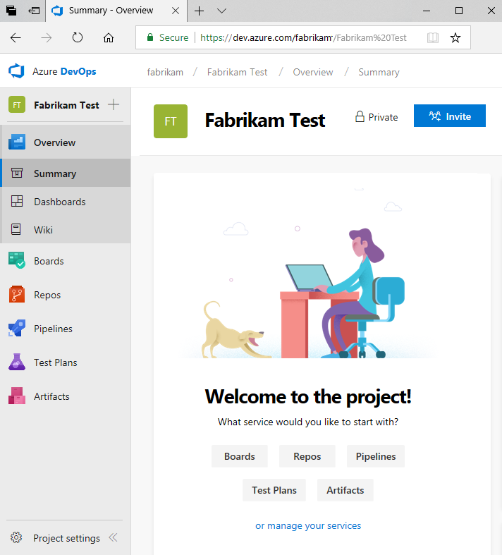  

You can select one of the following tasks to get started: accounts/add-team-members.md
- **Invite** to begin [adding others to your project](../../organizations/security/add-users-team-project.md). Note, you can only invite users who have already been [added to your organization](../../organizations/accounts/add-team-members.md). 
- **Boards** to begin [adding work items](../../boards/work-items/view-add-work-items.md).
- **Repos** to open [Repos>Files](../../repos/git/clone.md) page where you can clone or import a repository, or [initialize a README file](#initialize-readme) for your project summary page.
- **Pipelines** to start [defining a pipeline](../../pipelines/index.md).
- **Test Plans** to start [defining test plans and test suites](../../test/create-a-test-plan.md).
- [Manage your services](../../organizations/settings/set-services.md) to disable the visibility of one or more services.

To support your project vision, you can choose a README file that you maintain in a project repository, or the [project Wiki](wiki-create-repo.md). To choose between a README file or a Wiki, see [Change the repository](#change-repo). To define a README file for your project, see [Initialize a README file for your Git repo](#initialize-git) or [Initialize a README file for your TFVC repo](#initialize-tfvc).

::: moniker-end  
 

::: moniker range=">= tfs-2015 <= tfs-2018"    
[!INCLUDE [temp](../../_shared/new-navigation-not-supported.md)]  
::: moniker-end    

# [Previous navigation](#tab/previous-nav)

::: moniker range=">= tfs-2015"    
From your web browser, open the team project drop down menu and select the home page. If you don't have a  project, [create a team project](../../organizations/projects/create-project.md).   

  

::: moniker-end

To define a README file for your project, see [Initialize a README file for your Git repo](#initialize-git) or  [Initialize a README file for your TFVC repo](#initialize-tfvc).

::: moniker range="tfs-2017"

> [!NOTE]   
> The project page described in this section is available for TFS 2017.1 and later versions. It replaces the [Welcome page](#welcome-pages) used in TFS 2015 and TFS 2017. 

::: moniker-end

---

## Initialize a README file for a Git repo

You can share your project vision and objective, as well as ways for team members to contribute to the project through a project README file. For Git projects, the README.md file needs to be at the root of each repository in the default branch. For Git based projects the left pane supports navigation to other repositories. A separate Welcome page/README.md file can be created for each repository.  

# [New navigation](#tab/new-nav)  

::: moniker range="vsts"  

0. Open **Repos>Files**. This page guides you to get started quickly by adding code to your repository when you choose one of the options to clone, push, import, or simply initialize a repo.  

0. With the **Add a README** check box checked, choose **Initialize**. 

	> [!div class="mx-imgBorder"]  
	> 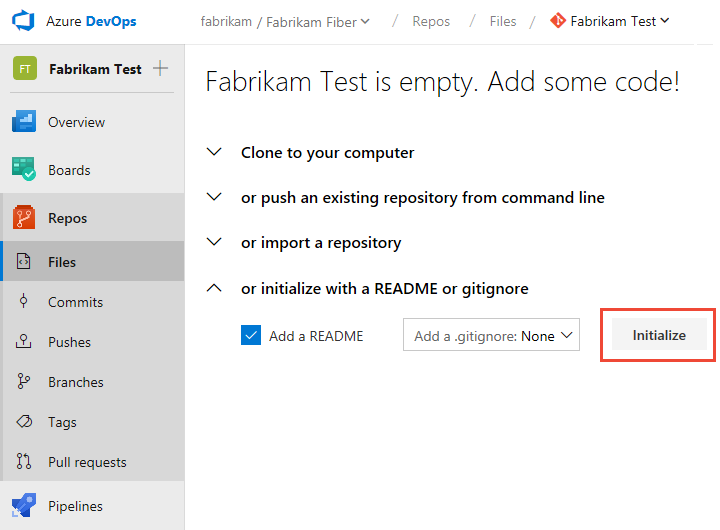

	A default README file is added to the project repository, in this case, the **Fabrikam Test** repo.

0.	Return to **Overview>Summary** and choose the README file for the project page. Choose the  edit icon.

	> [!div class="mx-imgBorder"]  
	> 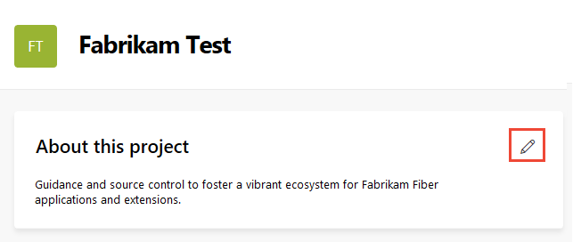  

0. Select the project repository where you initialized the README file. 

	> [!div class="mx-imgBorder"]  
	> 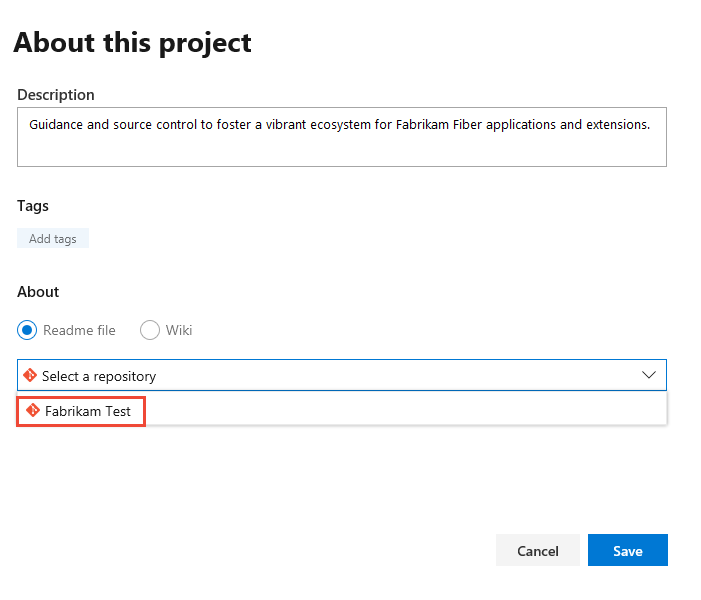  

0. To edit the README file, choose the README file link. 

	> [!div class="mx-imgBorder"]  
	> 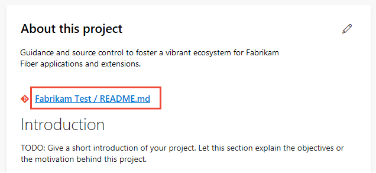  

	You'll be directed to the **Repos>Files** page for the README file. You can edit and modify the README markdown file like you would any other file in a Git repository. You can use Markdown language to format the README file and add images. To learn more about adding a README file, see [Create a README for your repo](../../repos/git/create-a-readme.md) and [Markdown guidance](../wiki/markdown-guidance.md). 

::: moniker-end    

::: moniker range=">= tfs-2015 <= tfs-2018"    
[!INCLUDE [temp](../../_shared/new-navigation-not-supported.md)]  
::: moniker-end    

# [Previous navigation](#tab/previous-nav)

::: moniker range=">= tfs-2018"  
0. Open the Project home page. 

0. With the **Add a README** check box checked, choose **Initialize**. 

	> [!div class="mx-imgBorder"]  
	> 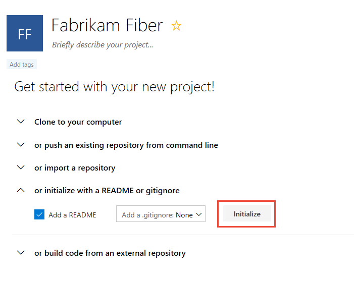

	A default README file is added to the project repository, in this case, the **Fabrikam Test** repo.

0. To edit the project README.md file, choose **Edit**. 

	> [!div class="mx-imgBorder"]  
	> 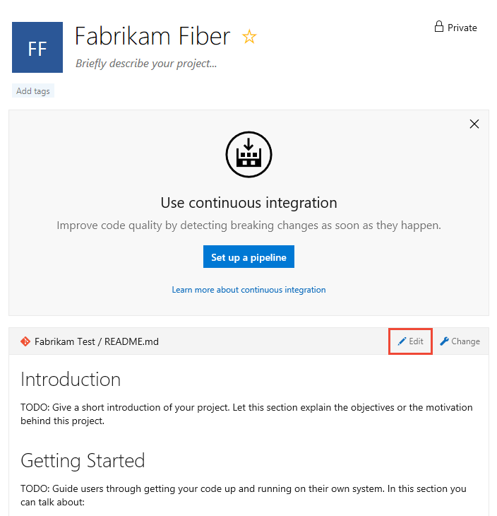

	You can use Markdown language to format the README file and add images. To learn more about adding a README file, see [Create a README for your repo](../../repos/git/create-a-readme.md) and [Markdown guidance](../wiki/markdown-guidance.md). 

::: moniker-end  

::: moniker range=">= tfs-2015  <= tfs-2017"  

0. You can start editing directly from the Welcome page.

	> [!div class="mx-imgBorder"]  
	> 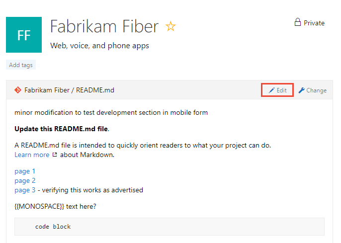  

	> [!NOTE]   
	> If you set policies on the Git repository, changes to the welcome page must be done as a pull request.  

0. To add another page, simply enter a link to a new Markdown file that doesn't yet exist, for example:
 
	`[page-1](./page-1.md)`

3. After you save the file, click the link. Respond to the prompt to edit the file and commit it to your repository.  

::: moniker-end  

---

## Initialize a README file for a TFVC repo

For projects that selected TFVC for version control, the README.md file needs to be at the root of your team project folder (i.e. $/TeamProject/README.md). 

# [New navigation](#tab/new-nav)  

::: moniker range="vsts"  

0. Open **Repos>Files**. 

0. Choose **Add Project Description**.

	> [!div class="mx-imgBorder"]  
	> 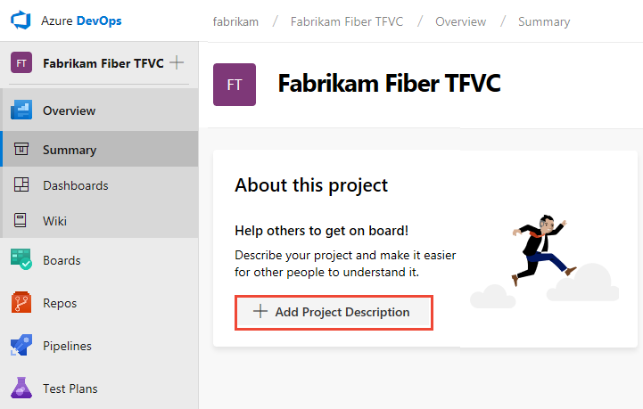 

0. You can select the TFVC repository and choose **Save**. If no README file has been created yet in the repo, you'll see the following message. 

	> [!div class="mx-imgBorder"]  
	> 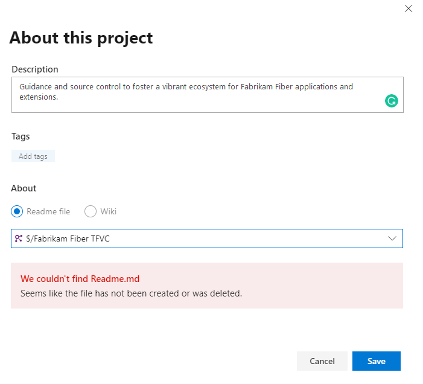 

0. To create a README file, choose **Repos>Files** and choose new file to add a file to the project repository. 

0. Name the file as **README.md**. 

	> [!div class="mx-imgBorder"]  
	> 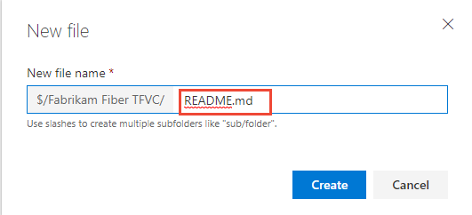 

0. Add the contents of your README file in markdown format, and then choose **Check in...**.  

	> [!div class="mx-imgBorder"]  
	> 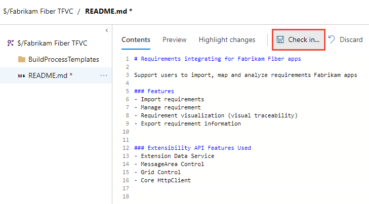 

0. Choose **Check in** to complete the check in process of the README file.  

	> [!div class="mx-imgBorder"]  
	> 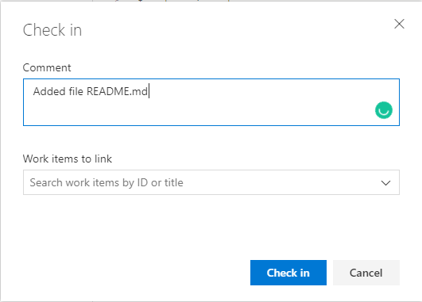 

0. Now, choose **Overview>Summary** to review your project summary page with the README file displayed.  

	> [!div class="mx-imgBorder"]  
	> 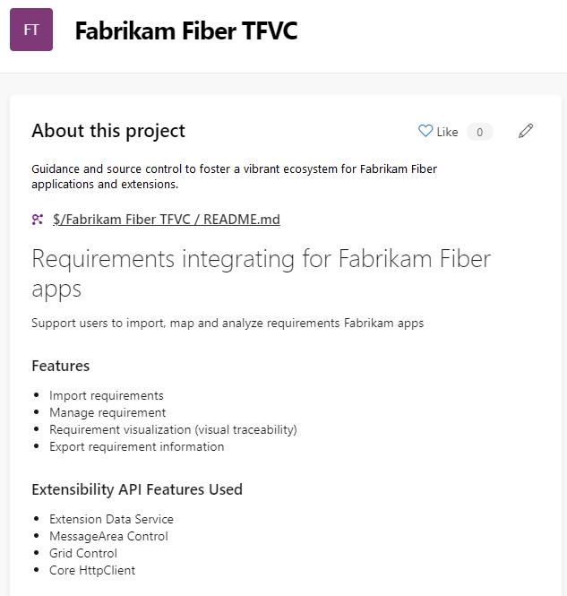 

::: moniker-end  

::: moniker range=">= tfs-2015  <= tfs-2018"  
[!INCLUDE [temp](../../_shared/new-navigation-not-supported.md)]  
::: moniker-end  

# [Previous navigation](#tab/previous-nav)

0. Open the Project home page. 

0. Choose **Create README**.  

	> [!div class="mx-imgBorder"]  
	>  

	A default README file is added to the project repository, in this case, the **Fabrikam Fiber TFVC** repo.

0. You can immediately edit the README file. When done, choose **Check in**. 

	> [!div class="mx-imgBorder"]  
	> 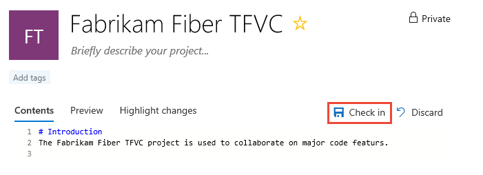  
Any additional Markdown files you have (ones with a *.md extension) in the root of the project folder will also show up in the left pane for easy navigation between them so you can provide additional information.  

---

## View project activity, add project members  

In addition to sharing information, the project summary page pulls data from the applications to give visitors a bird's-eye view of your project activity. 

::: moniker range="vsts"   
To add users to the project, choose the  **add** button. You can only add users to a project that you have already added to the organization. To learn more, see [Add users to a team project or team](../../organizations/security/add-users-team-project.md). 

> [!div class="mx-imgBorder"]  
> 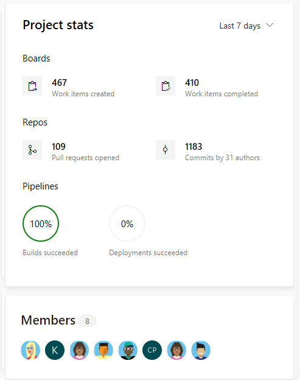 

::: moniker-end  

::: moniker range=">= tfs-2015 <= tfs-2018"  
To add users to the project, choose the  **add** button. To learn more, see [Add users to a team project or team](../../organizations/security/add-users-team-project.md).  

  

::: moniker-end   

<a id="change-repo" />
## Change the repository 

You can change the repository used to support your project vision, including pointing it to the home page of your [built-in Wiki](wiki-create-repo.md).

# [New navigation](#tab/new-nav)

::: moniker range="vsts"  

0. Open **Overview>Summary** . 

0. Choose the  edit icon.

	> [!div class="mx-imgBorder"]  
	>   

	If you don't see the **Edit** icon, then you're not a member of the Project Administrators group. [Get added as an admin](../../organizations/security/set-project-collection-level-permissions.md) in order to proceed.

0. Select a different repository or choose the Wiki option. 

	> [!div class="mx-imgBorder"]  
	> 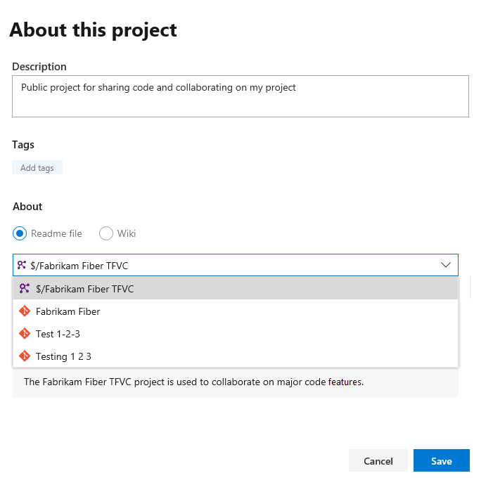  

	> [!TIP]  
	> If you choose the Wiki option, only the Wiki home page displays. To access additional Wiki pages, you must navigate to the Wiki.    

::: moniker-end  

::: moniker range=">= tfs-2015  <= tfs-2018"  
[!INCLUDE [temp](../../_shared/new-navigation-not-supported.md)]  
::: moniker-end  

# [Previous navigation](#tab/previous-nav)

0. From your project home page, choose **Change**. 

	> [!div class="mx-imgBorder"]  
	> 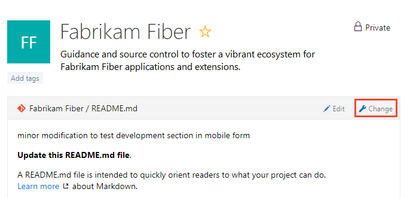  

	If you don't see **Change** link, then you're not a member of the Project Administrators group. [Get added as an admin](../../organizations/security/set-project-collection-level-permissions.md) in order to proceed.

0. From the select file dialog, choose an existing repo from the drop-down menu, or choose the Wiki option as shown here. 

	     

	> [!TIP]  
	> Only the Wiki home page displays. To access additional Wiki pages, you must navigate to the Wiki.    

---

## Try this next

> [!div class="nextstepaction"]
> [Create a wiki for your team project](wiki-create-repo.md) 

## Related articles  

- [Markdown guidance](../wiki/markdown-guidance.md) 
- [Work across projects](../navigation/work-across-projects.md)

<!---
### Git repository 

       
> [!div class="mx-imgBorder"]  
> 

> [!div class="mx-imgBorder"]  
> 

Use this page to leverage all the built-in DevOps functionality of Azure DevOps and to perform the following activities.

> [!div class="mx-tdCol2BreakAll"]
> |Git repository   |TFVC repository   |  
> |-------------|----------| 
> |- Clone your project to your client computer - Push an existing repository from the command line - Import a repository - Initialize a README or gitignore - Setup a build from an external repository - [Add team members](#cross-project-activity) - [View code, build, and work activity](#cross-project-activity) |- Setup a build - Add a README for your project - [Add team members](#cross-project-activity) - [View code, build, and work activity](#cross-project-activity) |

-->