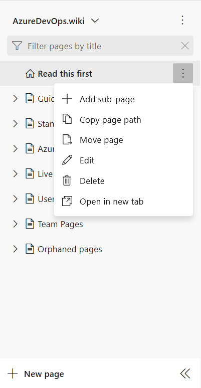
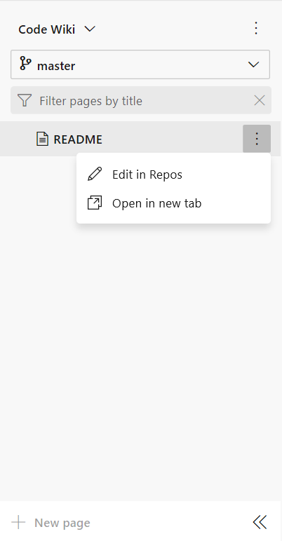

# Differences between provisioned wikis and published code as a wiki

[!INCLUDE [temp](../../_shared/version-vsts-tfs-2018.md)]

<!--- Supports https://go.microsoft.com/fwlink/?linkid=866310 -->

With publish code as wiki, you have the following two options for maintaining wiki content.

- The first option is to [provision a wiki for your team project](wiki-create-repo.md). This option supports one and only one wiki for the team project.
- The second option supports [publishing markdown files defined in a Git repository to a wiki](publish-repo-to-wiki.md). With this option, you can maintain several versioned wikis to support your content needs. This is available only if Azure Repos service is enabled.

While both options maintain the wiki content in Git repositories, the way you add, update, and manage the wiki content differs.

> [!NOTE]  
> The publish code as wiki feature is currently available on Azure DevOps Services . For TFS 2018 and later versions, you can only [provision a wiki for your team project](wiki-create-repo.md).  

## Wiki page menu options

One of the first things you'll notice is that with a provisioned wiki, you add and edit pages directly within the **Wiki**. All content updates to a provisioned wiki occur within the **Wiki**.

 With a publish code as wiki, you add, edit, and update content from **Repos** or **Code**.

This is reflected in the menu options that are unavailable for the wiki pages as shown in the following illustrations. As you can see, several options aren't supported for the publish as code wiki pages.

> [!div class="mx-tdCol2BreakAll"]
> |    Provisioned wiki    | Publish code as wiki |
> |------|---------|
> |  |  |

For example, the **Edit** option for the publish code as wiki will take you to the **Code** page to edit that specific page. Updates you make to a page in the branch you selected for the wiki will automatically be published to the wiki.  

## Supported features and operational differences

Both a provisioned wiki and publish as code wikis support the following features:

- [Markdown format](markdown-guidance.md)
- [HTML tags](markdown-guidance.md#html)
- [Insert and resize images](markdown-guidance.md#images)
- [Mathematical notation and characters](markdown-guidance.md#mathematical-notation)
- [Link to work items using #](markdown-guidance.md#link-work-items)
- [Attach files](markdown-guidance.md#attach)
- [Filter Wiki contents](filter-print-wiki.md)
- [Wiki search](search-wiki.md)  
- [Print a Wiki page](filter-print-wiki.md)

The following table summarizes those operations or features that may differ depending on the wiki type.  

> [!div class="mx-tdCol2BreakAll"]
> |Operation |    Provisioned wiki    | Publish code as wiki |
> |--------|--------------|--------------|  
> |[Support multiple wikis, name the wiki](publish-repo-to-wiki.md)  |  |  |
> |[Add or edit pages from the **Wiki**](add-edit-wiki.md) | |  |
> |[Add or edit pages from **Repos>Files** or **Code>Files**](publish-repo-to-wiki.md) |  |  |
> |[Revert to an earlier revision from the **Wiki**](wiki-view-history.md#revert-provision) | |  |
> |[Revert to an earlier revision from **Repos** or **Code**](wiki-view-history.md#revert-publish) |  |  |
> |[Update content offline](wiki-update-offline.md) |  |  |
> |[Maintain versioned wikis](#versioning) |  |  |
> |[Select a wiki version](wiki-select-unpublish-versions.md) |  |  |
> |[Unpublish a wiki](wiki-select-unpublish-versions.md) |  |  |

## Add pages

To add a page to the *provisioned wiki*, you use the **New page** or **Add sub-page** menu option. To learn more, see [Add and edit wiki pages](add-edit-wiki.md#add-page).

To add a page to a *publish code as wiki*, you add a markdown file under the folder of the branch that you published. The file must end in **.md** for the wiki to recognize it as a page to publish. To learn more, see [Publish a Git repository to a wiki](add-edit-wiki.md#add-page).

## Page sequence and the table of contents (TOC)

The *provisioned wiki* manages the page sequence and table of contents automatically as you add or move pages within the TOC.

To structure the TOC for a *publish code as wiki*, you define the **.order** file at the root, and for each sub-folder or parent page which contains sub-pages.

Both types of wikis follow the same file structure, it's just that the publish code as wiki requires you to maintain the page sequence manually.

To learn more about working with **.order** files, see  [Wiki Git repository files and file structure](wiki-file-structure.md#order-file).

## Page revisions and reverting to a previous version

From the **Wiki**, you can view the revisions of any wiki page by choosing **Revisions** or selecting the **View revisions** menu option.

However, the revert process differs depending on the wiki page type.  

- For a **provisioned wiki page**, simply click the **Revert** button as described in [Revert a commit to a provisioned wiki page](wiki-view-history.md#revert-provision)
- For a **publish as code wiki page**, you must work from a local branch and submit a pull request to update the branch you're working from. For details, see [Revert a commit to a provisioned wiki page](wiki-view-history.md#revert-publish).

## Versioning and un-publishing a wiki

Versioning allows you to publish different content versions to distinct wikis based on a versioned branch of a Git repo. This feature, as well as the ability to un-publish content that you've previously published to a wiki, are only supported for wikis that you created by publishing code to a wiki.

To learn more, see [Version, select, or un-publish a published wiki](wiki-select-unpublish-versions.md).

## Update a wiki by working offline

With both a *provisioned wiki* and *publish as code wikis*, you can work offline or in a local branch to update content. To learn more, see [Clone and update wiki pages offline](wiki-update-offline.md).

## Related articles

- [Create a wiki for your team project](./wiki-create-repo.md)
- [Wiki Git repository files and file structure](wiki-file-structure.md)
- [Publish a Git repository to a wiki](publish-repo-to-wiki.md)
- [Get Started with Git](../../repos/git/gitquickstart.md)
