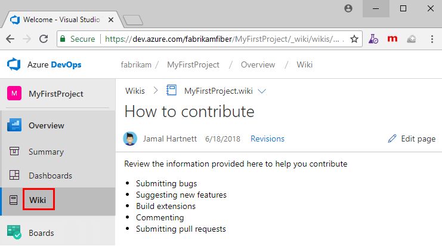

# Publish a Git repo to a wiki

[!INCLUDE [version-lt-eq-azure-devops](../../includes/version-lt-eq-azure-devops.md)] 

You can publish content that you already maintain in a Git repo to a wiki. For example, this content could be software development kit (SDK) support, product documentation, or a README file. You can also publish multiple wikis within a single team project.

In this quickstart, learn how to do the following tasks:

> [!div class="checklist"]
> * Open wiki
> * Publish a Git repo to a wiki
> * Edit pages of a published wiki
> * Add pages to a published wiki
> * Change the page sequence of a published wiki
> * Make a page the wiki home page

When you publish your Markdown files to a wiki, you gain the following benefits:

- Organize the content into a hierarchical page structure
- Table of contents that readers can browse and filter
- Publish new versions of the content
- Manage content in the same way you manage your code base
- Readers can search the wiki easily using the wiki search feature

For more information about managing the different wiki types, see [Provisioned vs. published code as wiki](provisioned-vs-published-wiki.md).

> [!TIP]
> You can add and edit content you've published to a wiki using the steps outlined in this article. You can also work offline and update wiki content in the same way that you collaborate on code through a Git repo. For more information, see [Update wiki pages offline](wiki-update-offline.md).

<a id="prereq">  </a>

## Prerequisites

* Have a team project. If you don't have one, [create a project](../../organizations/projects/create-project.md) now.  
* Enable the Azure Repos service for your project.
* Have a Git repo defined in your team project. Ideally, this repo contains at least one Markdown file, which you want to publish to your wiki. For more information, see [Create a new Git repo in your project](../../repos/git/create-new-repo.md).
* Have the permission **Contribute** to publish code as wiki. By default, this permission is set for members of the [Contributors group](../../repos/git/set-git-repository-permissions.md). 
  Anyone who has permissions to contribute to the Git repo can add or edit wiki pages.

## Open wiki  

::: moniker range=">= azure-devops-2019"

1. Sign in to your organization (```https://dev.azure.com/{yourorganization}```), open your project, and then select **Overview** > **Wiki**.

   > [!div class="mx-imgBorder"]  
   > 

If you need to switch projects, select :::image type="icon" source="../../media/icons/project-icon.png" border="false"::: **Azure DevOps** to [browse all projects](../navigation/work-across-projects.md).  

::: moniker-end

::: moniker range="< azure-devops-2019"

1. Sign in to your organization (```https://dev.azure.com/{yourorganization}```) and select **Wiki**.  

::: moniker-end

## Publish a Git repository to a wiki

#### [Browser](#tab/browser) 

Do the following steps when you maintain Markdown files in an existing Git repo and you want to publish them to a wiki.

1. Select **Publish code as wiki**.  

	> [!div class="mx-imgBorder"]  
	>  

	> [!NOTE]
	> The **Publish code as wiki** option won't appear if your project doesn't have a Git repo defined. [Create a new Git repo](../../repos/git/create-new-repo.md), and then return and refresh this page.

1. If you've already provisioned a team project wiki, select **Publish code wiki**.

	> [!div class="mx-imgBorder"]  
	> 

1. Choose the repo, branch, and folder that contain the Markdown files and enter a name for the wiki repo. The Git repo must be within the team project.

	> [!div class="mx-imgBorder"]  
	> 

	Specify the root of the repo when you want to publish all Markdown files in the repo to your wiki.  

1. Select **Publish**. The wiki repo populates with the Markdown files and folders included within the repo you selected.

	For example, the following image shows the published repo for the files that are contained in the azure-docs-sdk-node repo that you selected in Step 2.

	> [!div class="mx-imgBorder"]  
	> 
 
	The wiki table of contents (TOC) contains the following files:
   - Each Markdown file (file type= `.md`) defined in the repo/branch/folder is listed in alphabetical order, the TOC title is derived from the Markdown file name.
   - A parent page for each subfolder defined within the published folder, even if it doesn't contain any Markdown files.

     The following image shows the contents of the azure-docs-sdk-node repo.

     > [!div class="mx-imgBorder"]  
     > 

The head of the Git repo branch is mapped to the wiki. Any changes made within the branch and selected folder(s) are automatically reflected in the wiki. There are no other workflows involved.

> [!NOTE]
> You can publish up to 10 branches per published code wiki.

For the provisioned wiki with the extra Markdown files, you can add or edit pages in the same way that you maintain code in your Git repo.  

#### [Azure DevOps CLI](#tab/azure-devops-cli) 

::: moniker range="azure-devops"

You can publish a Git repo to a wiki with the [az devops wiki create](/cli/azure/devops/wiki#ext-azure-devops-az-devops-wiki-create) command. To get started, see [Get started with Azure DevOps CLI](../../cli/index.md). Run this command when you maintain Markdown files in an existing Git repo and you want to publish them to a wiki.

> [!NOTE]
> You can't publish code as wiki if your project doesn't have a Git repo already defined. If necessary, [create a new Git repo](/cli/azure/repos#ext-azure-devops-az-repos-create), and then return to this page.

```azurecli 
az devops wiki create [--mapped-path]
                      [--name]
                      [--org]
                      [--project]
                      [--repository]
                      [--type {codewiki, projectwiki}]
                      [--version]
``` 

#### Parameters 

- **`mapped-path`**: Required for the **`codewiki`** type. Mapped path of the new wiki. For example, you can specify '/' to publish from the root of the repo. 
- **`name`**: Name of the new wiki.
- **`org`**: Azure DevOps organization URL. You can configure the default organization using the `az devops configure -d organization=ORG_URL`command. Required if not configured as default or picked up using the `git config` command. For example, `--org https://dev.azure.com/MyOrganizationName/`.
- **`project`**: Name or ID of the project. You can configure the default project using the `az devops configure -d project=NAME_OR_ID` command. Required if not configured as default or picked up using the `git config` command.
- **`repository`**: Required for the **`codewiki`** type. Name or ID of the repo from which to publish the wiki.
- **`type`**: Type of wiki to create. The accepted values are **`projectwiki`** (default) and **`codewiki`**.
- **`version`**: Required for the **`codewiki`** type. Repo branch name from which to publish the code wiki.

::: moniker-end
[!INCLUDE [temp](../../includes/note-cli-supported-server.md)]  
::: moniker range="azure-devops"

#### Example 

The following command creates a `codewiki` named "My New Wiki" published from the `MyRepo` repo. The wiki is published in the `wikis` folder in the `main` branch and the result is shown in table format.

```azurecli 
az devops wiki create --name "My New Wiki" --type codewiki --repository MyRepo --mapped-path /wikis --version main --output table

ID                                    Name         Type
------------------------------------  -----------  --------
77abd847-31ec-45e9-8622-a190df8e5917  My New Wiki  codewiki

```

::: moniker-end

[!INCLUDE [temp](../../includes/note-cli-not-supported.md)] 

* * *

## Edit, rename, or delete pages  

Do the following steps to edit, rename, or delete a wiki page.

1. In your project, open **Repos** > **Files** or **Code > Files**.
1. Choose the page you want, select :::image type="icon" source="../../media/icons/actions-icon.png" border="false"::: **Actions**, and then choose the operation.

    > [!div class="mx-imgBorder"]  
    > 

> [!NOTE]  
> You can manage your wiki repo in the same way you manage any other Git repo by defining branch policies on the branch that you selected to publish to a wiki. But, without any policies defined, you can make changes and push them directly to the branch from your web portal or from a client.  

### Edit a page

Use the links available in edit mode to preview your changes or highlight changes made from the previous version. To discard your changes, select **Cancel**. For more information about supported Markdown features, see [Syntax guidance for Markdown usage](./markdown-guidance.md).  

1. When you're done, add a comment about your updates, and then select **Commit**.

	> [!div class="mx-imgBorder"]  
	> 

   The system automatically presents you with a link to create a pull request. You can ignore this message when you're directly editing the wiki branch.

    > [!div class="mx-imgBorder"]  
    > 

> [!TIP]
> When you change the name or case of a file, update the `.order` file to reflect the change. For more information, see [Change the page sequence, add or update an .order file](#page-sequence).

### Rename a page

All pages that you want to appear in the TOC must be the file type `.md`. 

1. Select **Rename** to rename the file accordingly.

For example, in the following image, we rename *new-home-page.md* to *New-Home-Page.md*. This page appears in the TOC with the label, "New Home Page".

> [!div class="mx-imgBorder"]  
> 

Page titles are case-sensitive and must be unique within the folder, and 235 characters or less. For more information about other title restrictions, see [Page title naming restrictions](wiki-file-structure.md#file-naming-conventions).

### Delete a page

You can delete any Markdown files that you don't want to appear in the wiki from the published folder. If you've included the file in an `.order` file, then delete its entry from the `.order` file. For more information, see [Change the page sequence, add, or update an .order file](#page-sequence).

<a id="add-page" />

## Add a page or pages  

You can add the following pages to your published wiki:

- Add a file to a root folder or subfolder from the web portal
- Upload files to a root folder or subfolder
- Add or update an `.order` file to specify the page sequence in the wiki TOC

Each update requires you to commit your changes to the repo. You can then refresh your wiki for your published repo to review the changes.  

### Add a page from the web portal

1. From **Repos** > **Files** or **Code** > **Files** for the published repo, select :::image type="icon" source="../../media/icons/actions-icon.png" border="false"::: **Actions**, and then choose **File**.

    > [!div class="mx-imgBorder"]  
    > 

1. Enter a name for the page, make sure to specify the `.md` file type. The file name should correspond to the page title that you want to appear in the TOC, with dashes in place of spaces. Specify a unique title of 235 characters or less. Page titles are case-sensitive. For more information about other title restrictions, see [Page title naming restrictions](wiki-file-structure.md#file-naming-conventions).

    For example, to add a page that appears in the TOC as *Page 4*, add a file named `Page-4.md`.

    > [!div class="mx-imgBorder"]  
    > 

1. Enter the contents of the page. For more information, see [Syntax guidance for Markdown files, widgets, wikis, and pull request comments](./markdown-guidance.md).

1. When you're done, select **Commit**.

### Upload files to a folder

1. If you have existing content already defined, you can upload it to a folder. Select :::image type="icon" source="../../media/icons/actions-icon.png" border="false"::: **Actions**, and then choose **Upload file(s)**.

    > [!div class="mx-imgBorder"]  
    > 

1. Complete the **Commit** dialog form, selecting the folder and files you want to upload.

    > [!div class="mx-imgBorder"]  
    > 

### Add a parent page and subpages

To add a parent page, first add a Markdown file at the root folder level and then add a folder with the same label.

1. To add a folder, select **Folder**, and then complete the **New Folder** dialog form. Specify at least one file to correspond to a subpage in the folder.

    > [!div class="mx-imgBorder"]  
    > 

1. Add all the files you want as subpages to the folder.  

### Add or update an .order file

The last step when you're adding files or folders to the wiki repo is to add or update the `.order` file of the updated folders. This action reflects the sequence of pages you want to show in the TOC. For details, see [Change the page sequence, add, or update a .order file](#page-sequence). Any files that aren't listed in the `.order` file get added to the end of the alphabetical list, as their order is set to `int.MaxValue`.

<a id="page-sequence" />

## Change the page sequence, add, or update an .order file

Each `.order` file defines the sequence of pages contained within a folder. The root `.order` file specifies the sequence of pages defined at the root level. For each folder, an `.order` file defines the sequence of subpages added to a parent page.

1. You can add an `.order` file in the same way that you add any file from the **Code > Files** page. Name the file `.order`.

1. Edit the contents of the file to reflect the sequence of Markdown files contained within the folder. Each entry should mirror the file name but without the `.md` file type. Titles are case-sensitive, so the entry should match the case used in the file name.

For example:  

```
README
page-2
page-3
Page-4
Misc content
```

## Set a home page

By default, the first file that appears at the root within alphabetical order is set as the wiki home page. When you select **Wiki** in the web portal, the home page opens.

1. Change the home page by setting the page sequence within the root `.order` file.

For example, enter the page name into the first line:  

```
New home page name here
page-2
page-3
Page-4
README
Misc content
```

## Promote folder to page

For a folder to also be a page, you need a Markdown file with the same name as the folder, set as a sibling to the folder. So, both the folder and the `.md` file of the same name should lie next to each other.

As displayed in the following example, Test has both a folder and an `.md` file, which creates a hierarchy within the wiki tree.


## Next steps

> [!div class="nextstepaction"]
> [Un-publish a wiki or select a version](wiki-select-unpublish-versions.md)

## Related articles

- [Follow a wiki page and get notifications](follow-notifications-wiki-pages.md)
- [Provisioned vs. published wiki](provisioned-vs-published-wiki.md)
- [Update wiki offline](wiki-update-offline.md)
- [Wiki Markdown guidance](wiki-markdown-guidance.md)
