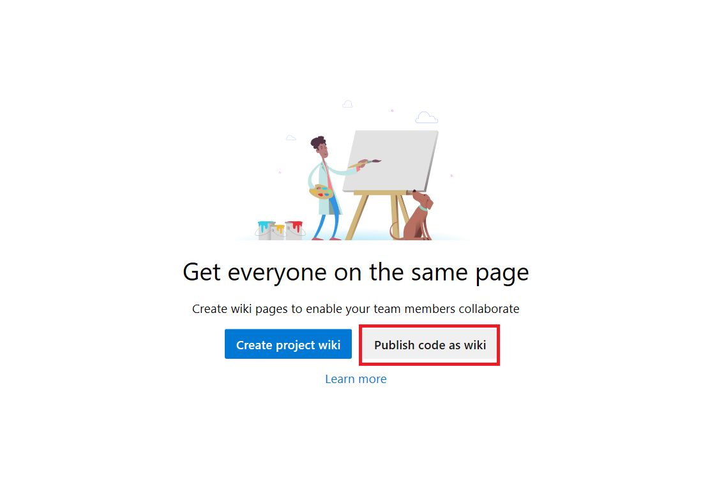
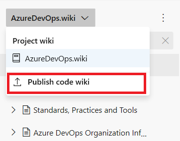
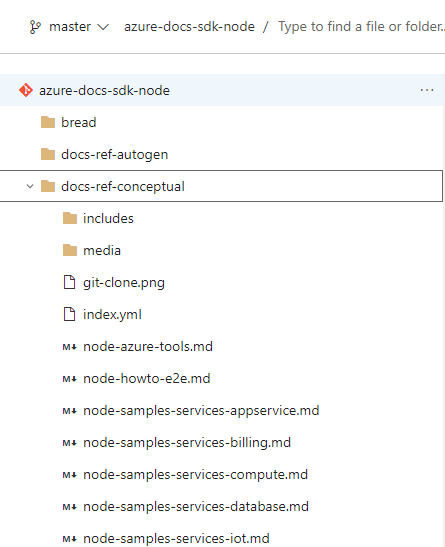
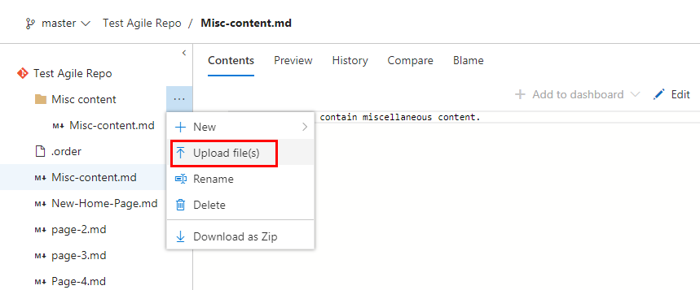

# Publish a Git repository to a wiki

[!INCLUDE [temp](../../_shared/version-vsts-only.md)]

Content that you already maintain in a Git repository can be published to a wiki. For example, content written to support a software development kit (SDK), product documentation, or README files can quickly be published to a wiki. Multiple wikis can be published within a single team project.

By publishing your markdown files to a wiki, you gain the following benefits:

- Organize the content into a hierarchical page structure
- Table of contents that readers can browse and filter
- Publish new versions of the content
- Manage content in the same way you manage your code base
- Readers can search the wiki easily using the Wiki search feature

Use this article to learn how to:  

> [!div class="checklist"]
> * Open **Wiki**
> * Publish a Git repo to a wiki
> * Edit pages of a published wiki
> * Add pages to a published wiki
> * Change the page sequence of a published wiki
> * Make a page the wiki home page

To perform these steps, you'll want to understand the underlying structure of your wiki Git repo. For details, see [Wiki Git repository files and file structure](wiki-file-structure.md). To understand how to manage the different wiki types, see [Differences between provisioned wiki and publish code as wiki](provisioned-vs-published-wiki.md).

> [!TIP]
> You can add and edit content you've published to a wiki using the steps outlined in this article. Or, you can also work offline and update wiki content in the same way you collaborate on code through a Git repository. For more information, see [Update wiki pages offline](wiki-update-offline.md).

<a id="prereq">  </a>

## Prerequisites

* You must have a team project. If you don't have a team project yet, [create one](../../organizations/projects/create-project.md).  
* You must have enabled Azure Repos service for your project.
* You must have a Git repository defined in your team project. Ideally, this repository contains at least one markdown file which you want to publish to your wiki. If you need to add a Git repository, see [Create a new Git repo in your project](../../repos/git/create-new-repo.md).
* You must have the permission **Contribute** to publish code as wiki. By default, this permissions is set for members of the [Project Administrators group](../../organizations/security/set-git-tfvc-repository-permissions.md). 
* Anyone who has permissions to contribute to the Git repository can add or edit wiki pages. Anyone with access to the team project, including [stakeholders](../../organizations/security/get-started-stakeholder.md), can view the wiki.

## Open Wiki  

Begin by connecting to your project using a [supported web browser](/tfs/server/compatibility#supported-browsers) and choose **Wiki**.  

> [!NOTE]
> Choose **Previous navigation** when you see a top-level blue bar. Choose **New navigation** if you see a vertical sidebar or if you enabled the **New Navigation** preview feature. The vertical sidebar, along with other navigational features, is enabled when the **New Navigation** preview feature has been enabled for the signed-in user or the organization in Azure DevOps. To learn how to use the web portal effectively, see [Web portal navigation](/azure/devops/project/navigation/index).  

# [New navigation](#tab/new-nav)  

::: moniker range=">= azdevserver-2019"

Choose **Overview>Wiki**.

> [!div class="mx-imgBorder"]  
> 

If you need to switch your team project, choose the  Azure DevOps logo to [browse all team projects and teams](/azure/devops/project/navigation/work-across-projects).  

::: moniker-end

# [Previous navigation](#tab/previous-nav)

::: moniker range="vsts"

Choose **Wiki**.

> [!div class="mx-imgBorder"]  
> 

- If you need to switch your team project, choose the  Azure DevOps logo to [browse all team projects and teams](/azure/devops/project/navigation/work-across-projects).   
- If you don't see **Wiki**, your screen size may be reduced. Choose the  three dots (elipses icon), then choose **Wiki>Wiki**.


::: moniker-end

::: moniker range="azdevserver-2019"
[!INCLUDE [temp](../../_shared/previous-navigation-not-supported-azd.md)] 
::: moniker-end

---

## Publish a Git repository to a wiki

Choose this option when you maintain markdown files in an existing Git repo and you want to publish them to a wiki.

1. Select **Publish code as Wiki**.  

	> [!div class="mx-imgBorder"]  
	>  

	> [!NOTE]
	> The **Publish code as Wiki** option won't appear if your project doesn't have a Git repository defined. [Create a new Git repo](../../repos/git/create-new-repo.md), and then return and refresh this page.

	Or, if you have already provisioned a team project wiki, from the context menu for Wikis, choose the **Publish code as wiki** menu option.

	> [!div class="mx-imgBorder"]  
	> 

2. Choose the repository, branch, and folder that contain the markdown files and name the wiki repository. The Git repo must reside within the team project.

	> [!div class="mx-imgBorder"]  
	> 

	Specify the root of the repository when you want to publish all markdown files in the repository to your wiki.  

3. Choose **Publish**. The wiki repo is populated with the markdown files and folders included within the repo you selected. If a sub-folder does not contain a markdown file, it will not show up in the  Wiki.

	For example, the following image shows the published repo for the files contained in the azure-docs-sdk-node repository selected in Step 2.

	> [!div class="mx-imgBorder"]  
	> 
 
	The wiki Table of Contents (TOC) contains the following: 
	- Each markdown file (file type=**.md**) defined in the repo/branch/folder is listed in alphabetical order, the TOC title is derived from the markdown file name
	- A parent page for each sub-folder defined within the published folder, even if it doesn't contain any markdown files.

	And here is an image of the contents of the azure-docs-sdk-node repository.

	> [!div class="mx-imgBorder"]  
	> 

The head of the Git repo branch is now mapped to the wiki. Any changes made within the branch and selected folder(s) are automatically reflected in the Wiki. There are no other workflows involved. 

With the Wiki provisioned with the markdown files you've added, you can now add or edit pages in the same way that you maintain code in your Git repository.  

## Edit, rename, or delete pages  

0. To edit, rename, or delete a page, open **Repos>Files** or **Code>Files**.

0. Choose the page you want, open the  actions icon and choose the operation you want.

	> [!div class="mx-imgBorder"]  
	> 

> [!NOTE]  
> You can manage your wiki repo in the same way you manage any other Git repo by defining branch policies on the branch that you selected to publish to a wiki. However, without any policies defined, you can make changes and push them directly to the branch from your web portal or from a client.  

### Edit a page

You can use the links available in edit mode to preview your changes or highlight changes made from the previous version. To discard your changes, simply click **Cancel**. For details about supported markdown features, see [Syntax guidance for Markdown files, widgets, wikis, and pull request comments](../../reference/markdown-guidance.md).  

0. When finished with your updates, choose **Commit**, and then fill in the Commit dialog form.

	> [!div class="mx-imgBorder"]  
	> 

0. The system will automatically present you with a link to create a pull request. You can ignore this message when you are directly editing the wiki branch.

	> [!div class="mx-imgBorder"]  
	> 

> [!TIP]    
> When you change the name or case of a file, you'll want to update the **.order** file to reflect the change. To learn more, jump to [Change the page sequence, add or update a .order file](#page-sequence).

### Rename a page

All pages that you want to appear in the TOC must have **.md** as their file type. If you forget that, or want to change the title case or title that appears in the TOC, choose the **Rename** option to rename the file accordingly.

For example, here we rename *new-home-page.md* to *New-Home-Page.md*. This page will now show up in the TOC with the label, "New Home Page".

> [!div class="mx-imgBorder"]  
> 

Page titles are case sensitive and must be unique within the folder, and 235 characters or less. For other title restrictions, see [Page title naming restrictions](#page-title-names).

### Delete a page

Any markdown files that you don't want to appear in the wiki, you can delete from the published folder. If you have included the file in a **.order** file, then delete it's entry from the **.order** file. To learn more, jump to [Change the page sequence, add or update a .order file](#page-sequence).

<a id="add-page" />

## Add a page or pages  

You can add pages to your published wiki as follows:

- Add a file to a root folder or sub-folder from the web portal
- Upload files to a root folder or sub-folder
- Add or update a .order file to specify the page sequence in the wiki TOC.

Each update you make requires you commit your changes to the repository. You can then refresh your **Wiki** for your published repo to review the changes.  

### Add a page from the web portal 

0. From **Repos>Files** or **Code>Files** for the published repo, open the  actions icon and choose **File**.

	> [!div class="mx-imgBorder"]  
	> 

0. Enter a name for the page, make sure to specify the **.md** file type. The file name should correspond to the page title that you want to appear in the TOC, with dashes in place of spaces. You must specify a unique title of 235 characters or less. Page titles are case sensitive. For other title restrictions, see [Page title naming restrictions](#page-title-names).

	For example, to add a page that will appear in the TOC as *Page 4*, add a file named *Page-4.md*.

	> [!div class="mx-imgBorder"]  
	> 

0. Enter the contents of the page. For details about supported markdown features, see [Syntax guidance for Markdown files, widgets, wikis, and pull request comments](../../reference/markdown-guidance.md).

0. When done, choose **Commit**, and then fill in the Commit dialog form.


### Upload files to a folder 

0. If you have existing content already defined, you can upload it into a folder. Open the  actions icon and choose **Upload file(s)**.

	> [!div class="mx-imgBorder"]  
	> 

0. Fill in the Commit dialog form, selecting the folder and files you want to upload. 

	> [!div class="mx-imgBorder"]  
	> 


### Add a parent page and sub-pages

To add a parent page, you'll first add a markdown file at the root folder level and then add a folder with the same label.

0. To add a folder, choose **Folder**, and then fill in the New folder dialog form. Specify at least one file to correspond to a sub-page in the folder.

	> [!div class="mx-imgBorder"]  
	> 

0. Add all the files you want as sub-pages to the folder.  

### Add or update a .order file

The last step when adding files or folders to the wiki repo is to add or update the **.order** file of the updated folders to reflect the sequence of pages you want to show in the TOC. For details, see [Change the page sequence, add or update a .order file](#page-sequence).

> [!TIP]
> Files that you upload or add won't show up in the wiki TOC until you add or update the **.order** file to include them.

<a id="page-sequence" />

## Change the page sequence, add or update a .order file

Each **.order** file defines the sequence of pages contained within a folder. The root **.order** file specifies the sequence of pages defined at the root level. And for each folder, a **.order** file defines the sequence of sub-pages added to a parent page.

You can add a **.order** file in the same way as you add any file from the **Code>Files** page. Simply name the file *.order*.

Then, edit the contents of the file to reflect the sequence of markdown files contained within the folder. Each entry should mirror the file name with dashes replaced with a space and without the **.md** file type. Titles are case sensitive, so the entry should match the case used in the file name.

For example:  

```
README
page-2
page-3
Page-4
Misc content
```

## Set a home page

By default, the first file that appears at the root within alphabetical order is set as the wiki home page. The home page opens whenever someone clicks **Wiki** within the web portal or clicks the  home icon.

You can change the home page by setting the page sequence within the root **.order** file.

For example:  

```
New Home Page
README
page-2
page-3
Page-4
Misc content
```

## Try this next

> [!div class="nextstepaction"]
> [Version, select, or un-publish a published wiki](wiki-select-unpublish-versions.md)

## Related articles

- [Wiki Git repository files, file structure, and naming conventions](wiki-file-structure.md)
- [Differences between provisioned wiki and publish code as wiki](provisioned-vs-published-wiki.md)
- [Syntax guidance for Markdown files, widgets, wikis, and pull request comments](../../reference/markdown-guidance.md)
- [Update wiki pages offline](wiki-update-offline.md)
- [Manage README and Wiki permissions](manage-readme-wiki-permissions.md)
