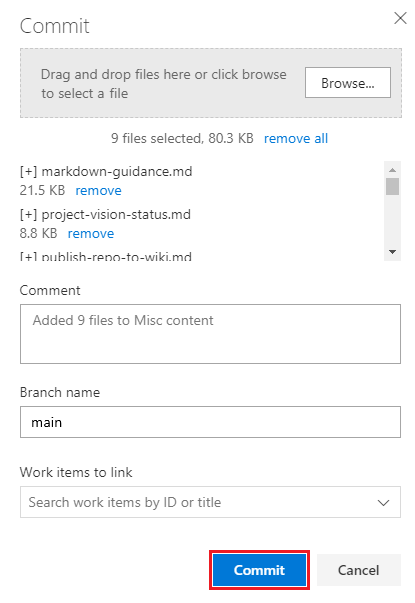

# Publish a Git repository to a wiki

[!INCLUDE [temp](../../includes/version-vsts-tfs-2018.md)]

In this quickstart, learn how to do the following tasks:

> [!div class="checklist"]
> * Open Wiki
> * Publish a Git repo to a wiki
> * Edit pages of a published wiki
> * Add pages to a published wiki
> * Change the page sequence of a published wiki
> * Make a page the wiki home page

Content that you already maintain in a Git repository can be published to a wiki. For example, this could be content written to support a software development kit (SDK), product documentation, or README file. You can publish multiple wikis within a single team project.

By publishing your Markdown files to a wiki, you gain the following benefits:

- Organize the content into a hierarchical page structure
- Table of contents that readers can browse and filter
- Publish new versions of the content
- Manage content in the same way you manage your code base
- Readers can search the wiki easily using the Wiki search feature

For information about managing the different wiki types, see [Differences between provisioned wiki and publish code as wiki](provisioned-vs-published-wiki.md).

> [!TIP]
> You can add and edit content you've published to a wiki using the steps outlined in this article. Or, you can also work offline and update wiki content in the same way you collaborate on code through a Git repository. For more information, see [Update wiki pages offline](wiki-update-offline.md).

<a id="prereq">  </a>

## Prerequisites

* You must have a team project. If you don't have a team project yet, [create one](../../organizations/projects/create-project.md).  
* You must have enabled Azure Repos service for your project.
* You must have a Git repository defined in your team project. Ideally, this repository contains at least one Markdown file, which you want to publish to your wiki. If you need to add a Git repository, see [Create a new Git repo in your project](../../repos/git/create-new-repo.md).
* You must have the permission **Contribute** to publish code as wiki. By default, this permission is set for members of the [Contributors group](../../repos/git/set-git-repository-permissions.md). 
* Anyone who has permissions to contribute to the Git repository can add or edit wiki pages.

## Open Wiki  

Begin by connecting to your project using a [supported web browser](/azure/devops/server/compatibility#supported-browsers) and choose **Wiki**.  

::: moniker range=">= azure-devops-2019"

Choose **Overview > Wiki**.

> [!div class="mx-imgBorder"]  
> 

If you need to switch your team project, choose :::image type="icon" source="../../media/icons/project-icon.png" border="false"::: **Azure DevOps** to [browse all team projects and teams](../navigation/work-across-projects.md).  

::: moniker-end

## Publish a Git repository to a wiki

#### [Browser](#tab/browser) 

Choose this option when you maintain Markdown files in an existing Git repo and you want to publish them to a wiki.

1. Select **Publish code as Wiki**.  

	> [!div class="mx-imgBorder"]  
	>  

	> [!NOTE]
	> The **Publish code as Wiki** option won't appear if your project doesn't have a Git repository defined. [Create a new Git repo](../../repos/git/create-new-repo.md), and then return and refresh this page.

	If you've already provisioned a team project wiki, from the context menu for Wikis, choose **Publish code wiki**.

	> [!div class="mx-imgBorder"]  
	> 

2. Choose the repository, branch, and folder that contain the Markdown files and name the wiki repository. The Git repo must be within the team project.

	> [!div class="mx-imgBorder"]  
	> 

	Specify the root of the repository when you want to publish all Markdown files in the repository to your wiki.  

3. Choose **Publish**. The wiki repo is populated with the Markdown files and folders included within the repo you selected.

	For example, the following image shows the published repo for the files that are contained in the azure-docs-sdk-node repository that you selected in Step 2.

	> [!div class="mx-imgBorder"]  
	> 
 
	The wiki Table of Contents (TOC) contains the following files:
   - Each Markdown file (file type=**.md**) defined in the repo/branch/folder is listed in alphabetical order, the TOC title is derived from the Markdown file name
   - A parent page for each subfolder defined within the published folder, even if it doesn't contain any Markdown files.

     And here's an image of the contents of the azure-docs-sdk-node repository.

     > [!div class="mx-imgBorder"]  
     > 

The head of the Git repo branch is now mapped to the wiki. Any changes made within the branch and selected folder(s) are automatically reflected in the Wiki. There are no other workflows involved.

> [!NOTE]
> You're limited to publishing 10 branches as code wikis.

For the Wiki that's provisioned with the Markdown files you've added, you can now add or edit pages in the same way that you maintain code in your Git repository.  

#### [Azure DevOps CLI](#tab/azure-devops-cli) 

::: moniker range=">= azure-devops-2020"

You can publish a Git repository to a wiki with the [az devops wiki create](/cli/azure/devops/wiki#ext-azure-devops-az-devops-wiki-create) command. To get started, see [Get started with Azure DevOps CLI](../../cli/index.md). Run this command when you maintain Markdown files in an existing Git repo and you want to publish them to a wiki.

> [!NOTE]
> You can't publish code as Wiki if your project doesn't have a Git repository already defined. If necessary, [create a new Git repo](/cli/azure/repos#ext-azure-devops-az-repos-create), and then return to this page.

```azurecli 
az devops wiki create [--mapped-path]
                      [--name]
                      [--org]
                      [--project]
                      [--repository]
                      [--type {codewiki, projectwiki}]
                      [--version]
``` 

#### Parameters 

- **mapped-path**: (Required for the **codewiki** type). Mapped path of the new wiki. For example, you can specify "/" to publish from the root of the repository. 
- **name**: Name of the new wiki.
- **org**: Azure DevOps organization URL. You can configure the default organization using `az devops configure -d organization=ORG_URL`. Required if not configured as default or picked up using `git config`. Example: `--org https://dev.azure.com/MyOrganizationName/`.
- **project**: Name or ID of the project. You can configure the default project using `az devops configure -d project=NAME_OR_ID`. Required if not configured as default or picked up using `git config`.
- **repository**: (Required for the **codewiki** type). Name or ID of the repository to publish the wiki from.
- **type**: Type of wiki to create. The accepted values are **projectwiki** (default) and **codewiki**.
- **version**: (Required for the **codewiki** type). Repository branch name to publish the code wiki from.

::: moniker-end
[!INCLUDE [temp](../../includes/note-cli-supported-server.md)]  
::: moniker range=">= azure-devops-2020"

#### Example 

The following command creates a **codewiki** named "My New Wiki" published from the **MyRepo** repository. The wiki is published in the **wikis** folder in the **main** branch and the result is shown in table format.

```azurecli 
az devops wiki create --name "My New Wiki" --type codewiki --repository MyRepo --mapped-path /wikis --version main --output table

ID                                    Name         Type
------------------------------------  -----------  --------
77abd847-31ec-45e9-8622-a190df8e5917  My New Wiki  codeWiki

```

::: moniker-end

[!INCLUDE [temp](../../includes/note-cli-not-supported.md)] 

* * *

## Edit, rename, or delete pages  

1. To edit, rename, or delete a page, open **Repos>Files** or **Code>Files**.

2. Choose the page you want, select :::image type="icon" source="../../media/icons/actions-icon.png" border="false"::: **Actions**, and then choose the operation that you want.

    > [!div class="mx-imgBorder"]  
    > 

> [!NOTE]  
> You can manage your wiki repo in the same way you manage any other Git repo by defining branch policies on the branch that you selected to publish to a wiki. However, without any policies defined, you can make changes and push them directly to the branch from your web portal or from a client.  

### Edit a page

You can use the links available in edit mode to preview your changes or highlight changes made from the previous version. To discard your changes, select **Cancel**. For details about supported Markdown features, see [Syntax guidance for Markdown usage](./markdown-guidance.md).  

1. When finished with your updates, choose **Commit**, and then fill in the Commit dialog form.

	> [!div class="mx-imgBorder"]  
	> 

2. The system automatically presents you with a link to create a pull request. You can ignore this message when you're directly editing the wiki branch.

    > [!div class="mx-imgBorder"]  
    > 

> [!TIP]
> When you change the name or case of a file, you'll want to update the **.order** file to reflect the change. To learn more, jump to [Change the page sequence, add or update a .order file](#page-sequence).

### Rename a page

All pages that you want to appear in the TOC must have **.md** as their file type. Choose **Rename** to rename the file accordingly.

For example, here we rename *new-home-page.md* to *New-Home-Page.md*. This page appears in the TOC with the label, "New Home Page".

> [!div class="mx-imgBorder"]  
> 

Page titles are case-sensitive and must be unique within the folder, and 235 characters or less. For other title restrictions, see [Page title naming restrictions](wiki-file-structure.md#file-naming-conventions).

### Delete a page

Any Markdown files that you don't want to appear in the wiki, you can delete from the published folder. If you've included the file in an **.order** file, then delete its entry from the **.order** file. To learn more, jump to [Change the page sequence, add, or update an .order file](#page-sequence).

<a id="add-page" />

## Add a page or pages  

You can add pages to your published wiki as follows:

- Add a file to a root folder or subfolder from the web portal
- Upload files to a root folder or subfolder
- Add or update a .order file to specify the page sequence in the wiki TOC.

Each update you make requires you commit your changes to the repository. You can then refresh your **Wiki** for your published repo to review the changes.  

### Add a page from the web portal

1. From **Repos>Files** or **Code>Files** for the published repo, select :::image type="icon" source="../../media/icons/actions-icon.png" border="false"::: **Actions**, and then choose **File**.

    > [!div class="mx-imgBorder"]  
    > 

2. Enter a name for the page, make sure to specify the **.md** file type. The file name should correspond to the page title that you want to appear in the TOC, with dashes in place of spaces. Specify a unique title of 235 characters or less. Page titles are case-sensitive. For other title restrictions, see [Page title naming restrictions](wiki-file-structure.md#file-naming-conventions).

    For example, to add a page that appears in the TOC as *Page 4*, add a file named *Page-4.md*.

    > [!div class="mx-imgBorder"]  
    > 

3. Enter the contents of the page. For details about supported Markdown features, see [Syntax guidance for Markdown files, widgets, wikis, and pull request comments](./markdown-guidance.md).

4. When done, choose **Commit**, and then fill in the Commit dialog form.

### Upload files to a folder

1. If you have existing content already defined, you can upload it into a folder. Select :::image type="icon" source="../../media/icons/actions-icon.png" border="false"::: **Actions**, and then choose **Upload file(s)**.

    > [!div class="mx-imgBorder"]  
    > 

2. Fill in the Commit dialog form, selecting the folder and files you want to upload.

    > [!div class="mx-imgBorder"]  
    > 

### Add a parent page and subpages

To add a parent page, you'll first add a Markdown file at the root folder level and then add a folder with the same label.

1. To add a folder, choose **Folder**, and then fill in the New folder dialog form. Specify at least one file to correspond to a subpage in the folder.

    > [!div class="mx-imgBorder"]  
    > 

2. Add all the files you want as subpages to the folder.  

### Add or update a .order file

The last step when adding files or folders to the wiki repo is to add or update the **.order** file of the updated folders to reflect the sequence of pages you want to show in the TOC. For details, see [Change the page sequence, add, or update a .order file](#page-sequence).

> [!TIP]
> Files that you upload or add won't show up in the wiki TOC until you add or update the **.order** file to include them.

<a id="page-sequence" />

## Change the page sequence, add, or update a .order file

Each **.order** file defines the sequence of pages contained within a folder. The root **.order** file specifies the sequence of pages defined at the root level. And for each folder, a **.order** file defines the sequence of subpages added to a parent page.

You can add a **.order** file in the same way as you add any file from the **Code>Files** page. Name the file *.order*.

Then, edit the contents of the file to reflect the sequence of Markdown files contained within the folder. Each entry should mirror the file name but without the **.md** file type. Titles are case-sensitive, so the entry should match the case used in the file name.

For example:  

```
README
page-2
page-3
Page-4
Misc content
```

## Set a home page

By default, the first file that appears at the root within alphabetical order is set as the wiki home page. The home page opens whenever you select **Wiki** within the web portal.

You can change the home page by setting the page sequence within the root **.order** file.

For example, enter the page name into the first line:  

```
New home page name here
page-2
page-3
Page-4
README
Misc content
```

## Promote folder to page

For a folder to be a page as well, there should be a markdown file with the same name as the folder as a sibling to the folder, meaning both the folder and the md file of the same name should lie next to each other.

Displayed in the following example, Test has both a folder and an md file, which creates a hierarchy within the Wiki tree.


## Next steps

> [!div class="nextstepaction"]
> [Version, select, or un-publish a published wiki](wiki-select-unpublish-versions.md)
