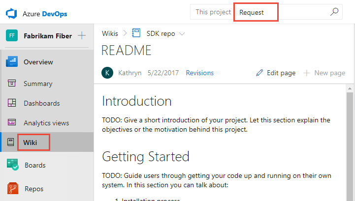
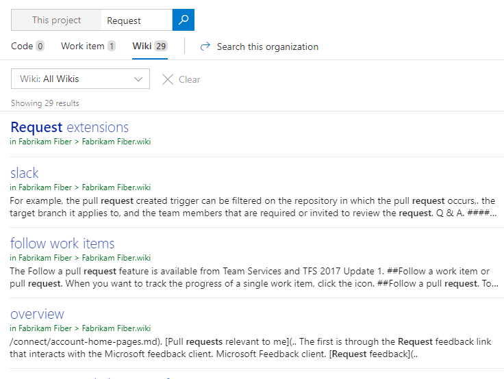

# Search  Wiki

[!INCLUDE [temp](../../_shared/version-vsts-tfs-2018.md)]

With wiki search, you can search within a project wiki or across all wikis created for your organization.

::: moniker range="tfs-2018"
> [!NOTE]  
> Wiki search is supported on TFS 2018.2 or later versions. 
::: moniker-end

[!INCLUDE [temp](../../_shared/new-navigation-azd.md)]  

# [New navigation](#tab/new-nav)  

::: moniker range=">= azdevserver-2019"

Choose **Overview>Wiki** and enter your keyword or phrase into the search box.

> [!div class="mx-imgBorder"]  
> 

::: moniker-end

::: moniker range="tfs-2018"
[!INCLUDE [temp](../../_shared/new-navigation-not-supported.md)]  
::: moniker-end

# [Previous navigation](#tab/previous-nav)

::: moniker range="tfs-2018 || vsts"

Simply open **Wiki** and enter your keyword or phrase into the search box.

> [!div class="mx-imgBorder"]  
> 

::: moniker range="azdevserver-2019"
[!INCLUDE [temp](../../_shared/previous-navigation-not-supported-azd.md)] 
::: moniker-end

::: moniker range="azdevserver-2019"
[!INCLUDE [temp](../../_shared/previous-navigation-not-supported-azd.md)] 
::: moniker-end
---

The search feature quickly returns wiki pages by title or page content.

English language stemming support helps you find the most relevant wiki pages. For example, when you enter *request* in the search box, wiki search will return page results containing related words such as *requesting, requested, requests,* and so on.

> [!div class="mx-imgBorder"]  
> 

> [!TIP]
> When you search from **Wiki**, you'll automatically navigate to wiki search results. If you initiate a search from another page, such as one under **Repos/Code** or **Boards/Work**, then first select the **Search wiki** option from the search box menu options.

## Related articles

- [Search code](..//search/code-search.md)
- [Search work items](..//search/work-item-search.md)
