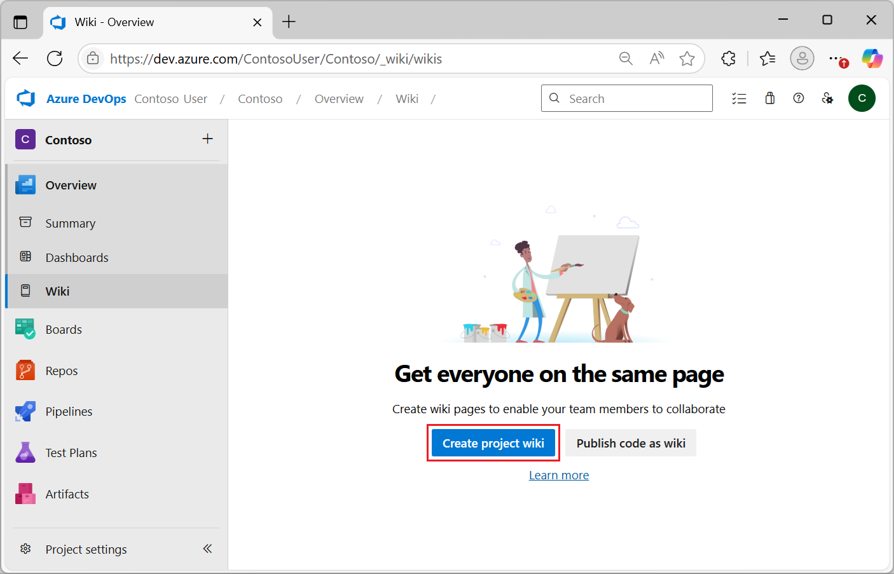
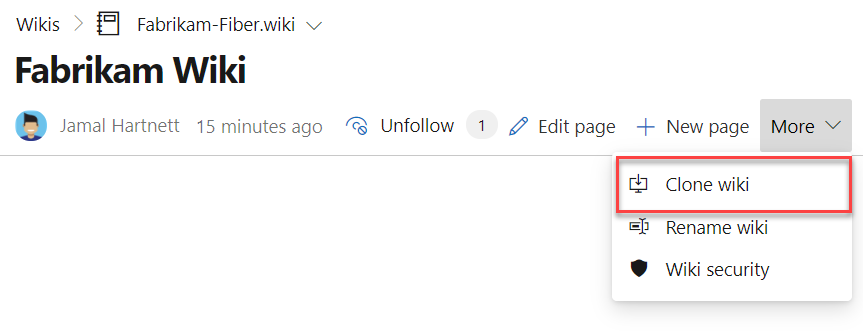

# Create a Wiki for your project

[!INCLUDE [temp](../../includes/version-vsts-tfs-2018.md)]

Learn how to open a wiki and provision a Git repo for your wiki.

Every team project can have a wiki. Use the wiki to share information with your team to understand and contribute to your project.

::: moniker range=">= azure-devops-2019"

Each team project wiki is powered by a Git repository in the back-end. When you create a team project, a Wiki Git repo is not created by default. Provision a Git repository to store your wiki Markdown files, or [publish existing Markdown files from a Git repository](publish-repo-to-wiki.md) to a wiki.

::: moniker-end

::: moniker range="tfs-2018"

Each team project wiki is powered by a Git repository in the back-end. When you create a team project, a Wiki Git repo isn't created by default. Provision a Git repository to store your wiki Markdown files.

::: moniker-end

<a id="prereq">  </a>

## Prerequisites

::: moniker range="azure-devops"

* You must have a team project. If you don't have a team project yet, create one in [Azure DevOps](../../organizations/accounts/set-up-vs.md).
* You must have at least Basic access to create and modify a wiki.
* You must have the permission **Create Repository** to publish code as wiki. By default, this permission is set for members of the [Project Administrators group](../../repos/git/set-git-repository-permissions.md). 
* Anyone who is a member of the Contributors security group can add or edit wiki pages. Anyone with access to the team project, including [stakeholders](../../organizations/security/get-started-stakeholder.md), can view the wiki.

::: moniker-end

::: moniker range=">= tfs-2018 <= azure-devops-2020"

* You must have a team project. If you don't have a team project yet, create one [on-premises](../../organizations/projects/create-project.md).
* You must have the permission **Create Repository** to publish code as wiki. By default, this permission is set for members of the [Project Administrators group](../../repos/git/set-git-repository-permissions.md). 
* Anyone who is a member of the Contributors security group can add or edit wiki pages. Anyone with access to the team project, including [stakeholders](../../organizations/security/get-started-stakeholder.md), can view the wiki.

::: moniker-end

[!INCLUDE [temp](includes/open-wiki-hub.md)]

## Provision a wiki Git repository

#### [Browser](#tab/browser) 

Provision a new Git repository that stores all your wiki pages and related artifacts. From the Wiki landing page, select **Create Project Wiki**. (Even if you use TFVC for source control, you can create a wiki with a Git repository.)

::: moniker range=">= azure-devops-2019"

> [!div class="mx-imgBorder"]  
> 
::: moniker-end

::: moniker range="tfs-2018"
> [!div class="mx-imgBorder"]  
> 
::: moniker-end

If you don't have access to create a Wiki Git repository or if you don't have access to any of the existing wikis, the following message appears.

> [!div class="mx-imgBorder"]  
> 

Your administrator can provision the Wiki Git repository or you can request that they elevate your permissions. Stakeholders can't create a wiki, as they have no permissions to work in **Repos** or **Code**.

The Wiki Git repo is referred as *TeamProjectName.wiki*. For example, if your team project is 'foobar' then the Wiki repo is labeled 'foobar.wiki'.

> [!NOTE]
> If you want to provision more wikis, then you must [publish code as a wiki](publish-repo-to-wiki.md). You can set up multiple wiki repos within a single project.

### How can I go to the Git repository?

The *TeamProjectName.wiki* doesn't appear in the drop-down menu of repositories from **Repos** or **Code**. It also isn't in the list provided from the **Project Settings > Repositories** or **Project Settings > Version Control** pages.  
However, you can get to it from the following URL:

::: moniker range="azure-devops"
`https://dev.azure.com/<OrgName>/<TeamProjectName>/_git/<WikiName>` 
::: moniker-end

::: moniker range=">= tfs-2018 < azure-devops"
`https://<ServerName>/DefaultCollection/<TeamProjectName>/_git/<WikiName>` 
::: moniker-end

Choose **Clone Wiki** from the ellipsis near the wiki picker to access the Wiki URL.

    

The URL of the wiki Git repository is exposed. Copy and paste it into your web browser to access the underlying Git repo.

#### [Azure DevOps CLI](#tab/azure-devops-cli) 

::: moniker range=">= azure-devops-2020"

You can create a wiki with the [az devops wiki create](/cli/azure/devops/wiki#ext-azure-devops-az-devops-wiki-create) command. To get started, see [Get started with Azure DevOps CLI](../../cli/index.md).

> [!NOTE]
> If you want to provision more than one wiki, then you must [publish code as a wiki](./publish-repo-to-wiki.md#publish-a-git-repository-to-a-wiki). You can set up multiple wiki repos within a single project.

```azurecli 
az devops wiki create [--mapped-path]
                      [--name]
                      [--org]
                      [--project]
                      [--repository]
                      [--type {codewiki, projectwiki}]
                      [--version]
``` 

#### Parameters 

- **mapped-path**: (Required for the **codewiki** type). Mapped path of the new wiki. For example, you can specify "/" to publish from the root of the repository. 
- **name**: (Required for the **codewiki** type). Name of the new wiki. If you don't specify a name for type **projectwiki**, then the new wiki will be named *TeamProjectName*.wiki.
- **org**: Azure DevOps organization URL. You can configure the default organization using `az devops configure -d organization=ORG_URL`. Required if not configured as default or picked up using `git config`. Example: `--org https://dev.azure.com/MyOrganizationName/`.
- **project**: Name or ID of the project. You can configure the default project using `az devops configure -d project=NAME_OR_ID`. Required if not configured as default or picked up using `git config`.
- **repository**: (Required for the **codewiki** type). Name or ID of the repository to publish the wiki from.
- **type**: Type of wiki to create. The accepted values are **projectwiki** (default) and **codewiki**.
- **version**: (Required for the **codewiki** type). Repository branch name to publish the code wiki from.

::: moniker-end
[!INCLUDE [temp](../../includes/note-cli-supported-server.md)]
::: moniker range=">= azure-devops-2020"

#### Example 

The following command creates a wiki named "Fabrikam Fiber" and shows the output in table format.

```azurecli 
az devops wiki create --name "Fabrikam Fiber" --output table

ID                                    Name                 Type
------------------------------------  -------------------  -----------
7edcc35b-89be-465e-855e-377ba8660af7  Fabrikam Fiber.wiki  projectWiki

```

::: moniker-end

[!INCLUDE [temp](../../includes/note-cli-not-supported.md)] 

* * * 

## Next steps

> [!div class="nextstepaction"]
> [Add and edit wiki pages](add-edit-wiki.md)
