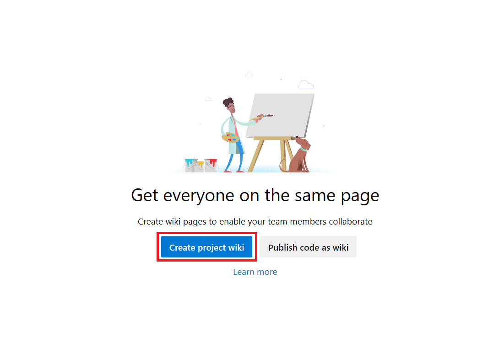
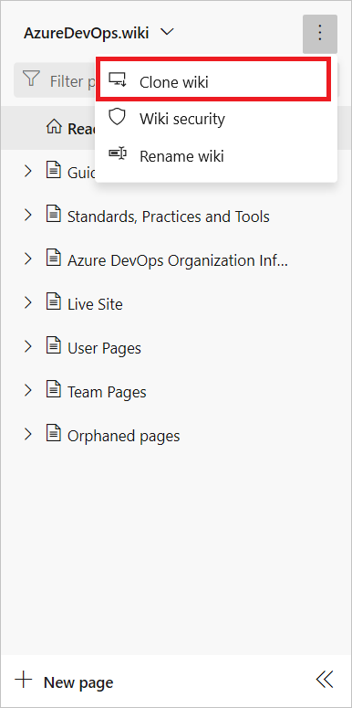

# Quickstart: Create a Wiki for your project

[!INCLUDE [temp](../../_shared/version-vsts-tfs-2018.md)]

Every team project can have a wiki. Use the wiki to share information with your team to understand and contribute to your project.

::: moniker range=">= azure-devops-2019"

Each team project wiki is powered by a Git repository in the back-end. When you create a team project, a Wiki Git repo is not created by default. Provision a Git repository to store your wiki Markdown files, or [publish existing Markdown files from a Git repository](publish-repo-to-wiki.md) to a wiki.

::: moniker-end

::: moniker range="tfs-2018"

Each team project wiki is powered by a Git repository in the back-end. When you create a team project, a Wiki Git repo isn't created by default. Provision a Git repository to store your wiki Markdown files.

::: moniker-end

In this article, we show you how to:  

> [!div class="checklist"]
> * Open **Wiki**
> * Provision a Git repo for your wiki

## Prerequisites

::: moniker range="azure-devops"

* You must have a team project. If you don't have a team project yet, create one in [Azure DevOps](../../organizations/accounts/set-up-vs.md).  
*  You must have the permission **Create Repository** to publish code as wiki. By default, this permissions is set for members of the [Project Administrators group](../../organizations/security/set-git-tfvc-repository-permissions.md). 
* Anyone who is a member of the Contributors security group can add or edit wiki pages. Anyone with access to the team project, including [stakeholders](../../organizations/security/get-started-stakeholder.md), can view the wiki.

::: moniker-end

::: moniker range="tfs-2018 || azure-devops-2019"

* You must have a team project. If you don't have a team project yet, create one [on-premises](../../organizations/projects/create-project.md).
* You must have the permission **Create Repository** to publish code as wiki. By default, this permissions is set for members of the [Project Administrators group](../../organizations/security/set-git-tfvc-repository-permissions.md). 
* Anyone who is a member of the Contributors security group can add or edit wiki pages. Anyone with access to the team project, including [stakeholders](../../organizations/security/get-started-stakeholder.md), can view the wiki.

::: moniker-end

[!INCLUDE [temp](_shared/open-wiki-hub.md)]

## Provision a wiki Git repository

Provision a new Git repository that stores all your wiki pages and related artifacts. From the Wiki landing page, select **Create Wiki**. (Even if you use TFVC for source control, you can create a wiki with a Git repository.)

::: moniker range=">= azure-devops-2019"

> [!div class="mx-imgBorder"]  
> 
::: moniker-end

::: moniker range="tfs-2018"
> [!div class="mx-imgBorder"]  
> 
::: moniker-end

---

If you don't have access to create a Wiki Git repository, the following message appears.

> [!div class="mx-imgBorder"]  
> 

Your administrator can provision the Wiki Git repository or you can request that they elevate your permissions. Stakeholders can't create a wiki, as they have no permissions to work in **Repos** or **Code**.

The Wiki Git repo is referred as *TeamProjectName.wiki*. For example, if your team project is 'foobar' then the Wiki repo is labeled 'foobar.wiki'.

## Next steps

> [!div class="nextstepaction"]
> [Add and edit wiki pages](add-edit-wiki.md)

## Related articles

- [Wiki Git repository files, file structure, and naming conventions](wiki-file-structure.md)
- [Provisioned wiki vs. publish code as wiki](provisioned-vs-published-wiki.md)
- [Publish a Git repository to a wiki](publish-repo-to-wiki.md)
- [Update wiki pages offline](wiki-update-offline.md)
- [Migrate your existing pages to the new team project wiki](migrate-extension-wiki-pages.md)
- [Manage README and Wiki permissions](manage-readme-wiki-permissions.md)

### Why is the Git repository hidden?

The *TeamProjectName.wiki* doesn't appear in the drop-down menu of repositories from **Repos** or **Code**. It also isn't in the list provided from the **Project Settings>Code>repositories** or **Project Settings>Version Control** pages.  

However, you can navigate to it from the following URL:

::: moniker range=">= azure-devops-2019"
`https://<AccountName>.visualstudio.com/DefaultCollection/<TeamProjectName>/_git/<WikiName>` 
::: moniker-end

::: moniker range="tfs-2018"
`https://<ServerName>/DefaultCollection/<TeamProjectName>/_git/<WikiName>` 
::: moniker-end

Choose **More**, and then **Clone Wiki** to access the Wiki URL.

    

The URL of the wiki Git repository is exposed. Copy and paste it into your web browser to access the underlying Git repo.
