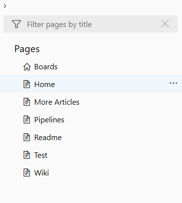
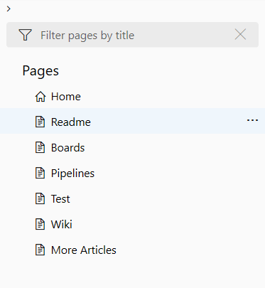
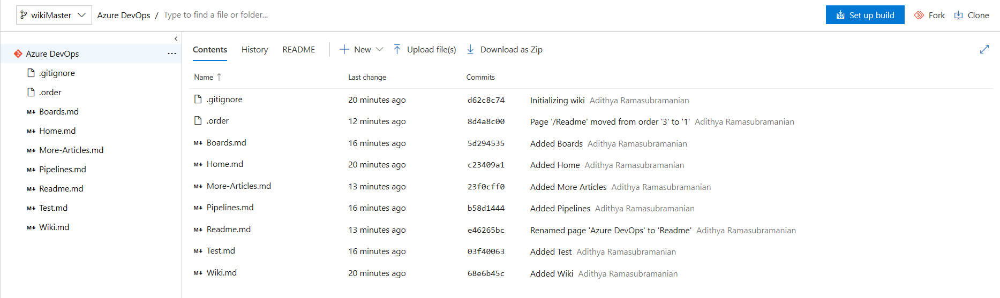

# Wiki Git repository files and file structure

[!INCLUDE [temp](../../_shared/version-vsts-tfs-2018.md)]

When you create a team project, a Wiki Git repo isn't created by default. To start using a wiki, you must first [provision it](wiki-create-repo.md). Each wiki is powered by a Git repository in the back-end. This repository stores the Markdown pages, images, attachments, and the sequence of pages and subpages.  

## Wiki file and folder structure

The team project wiki Git repositories are assigned the following labels.

- Wiki repo for a team project: *ProjectName.wiki*
- Master branch: *wikiMaster*

> [!NOTE]  
> You can manage your wiki repo in the same way you manage any other Git repo, by defining branch policies on the wikiMaster branch. However, you can make changes to your local wikiMaster branch and push them directly to the remote branch without defining any policies.

The wiki repository has the following files and folders:

- File for each Markdown page entered at the root level
- File labeled *.order* at the root and under each folder  
- Folder for each page that has subpages  
- *.attachments* folder, storing all the attachments of the wiki  

<a id="file-naming" />
<a id="page-title-names"></a>

## File naming conventions

Each file follows the convention of inserting dashes for a space in the page title. For example, the "How to contribute" page title corresponds to the **How-to-contribute.md** file name.  

[!INCLUDE [temp](./_shared/wiki-naming-conventions.md)]

<a id="order-file" ></a>

## *.order* file

The *.order* file is used to set the order of the Wiki pages in a particular hierarchy. With order files, you can set your own order for the Wiki pages according to the information flow on that hierarchy.

For example, the images below shows the default order for an hierarchy which is in alphabetical order and the order in which the content needs to be arranged for a logical information flow.

> 
> 

To change the order of the Wiki pages in the hierarchy, a ".order" file is required at the same level of the pages.

> 

The content of the order file contains the list of files in the required order (without the ".md" extension).
In this case, it is as follows:

```
Home
Readme
Boards
Pipelines
Test
Wiki
More-Articles
```

## Related articles

- [Provisioned wiki vs. publish code as wiki](provisioned-vs-published-wiki.md)
- [Create a wiki for your team project](wiki-create-repo.md)
- [Publish a Git repository to a wiki](publish-repo-to-wiki.md)
- [Update wiki pages offline](wiki-update-offline.md)
- [Manage README and Wiki permissions](manage-readme-wiki-permissions.md)