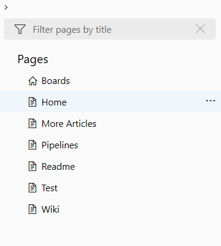
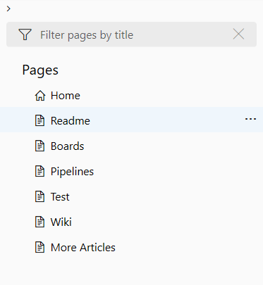
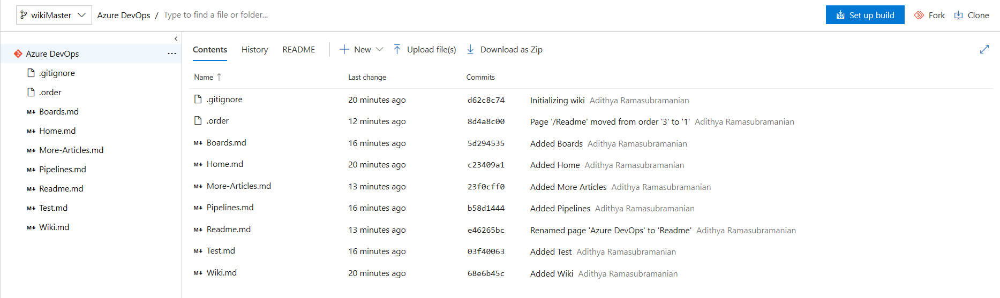

---
title: Wiki files, structure, and conventions
titleSuffix: Azure DevOps 
description: Understand the file conventions of the Git repository wiki in Azure DevOps
ms.technology: devops-collab
ms.custom: wiki
ms.topic: conceptual
ms.assetid:
ms.author: chcomley
ms.reviewer: gopinach
author: chcomley
monikerRange: '>= tfs-2018'
ms.date: 12/12/2019  
---

# Wiki Git repository files and file structure

[!INCLUDE [temp](../../includes/version-vsts-tfs-2018.md)]

When you create a team project, a Wiki Git repo isn't created by default. To start using a Wiki, you must first [provision it](wiki-create-repo.md). Each Wiki is powered by a Git repository in the back-end. This repository stores the Markdown pages, images, attachments, and the sequence of pages and subpages.  

## Wiki file and folder structure

The team project Wiki Git repositories are assigned the following labels.

- Wiki repo for a team project: *ProjectName.wiki*
- Main branch: *wikiMain*

> [!NOTE]  
> You can manage your Wiki repo in the same way you manage any other Git repo, by defining branch policies on the wikiMain branch. However, you can make changes to your local wikiMain branch and push them directly to the remote branch without defining any policies.

The Wiki repository has the following files and folders:

- File for each Markdown page entered at the root level
- File labeled *.order* at the root and under each folder  
- Folder for each page that has subpages  
- *.attachments* folder, storing all the attachments of the Wiki  

<a id="file-naming" />
<a id="page-title-names"></a>

## File naming conventions

Each file requires using dashes instead of spaces in the page title. For example, the "How to contribute" page title corresponds to the **How-to-contribute.md** file name. The page name is added to the URL, ensuring that links you share remain intact as the Wiki changes over time. 

[!INCLUDE [temp](./includes/wiki-naming-conventions.md)]

<a id="order-file" ></a>

## *.order* file

The *.order* file is used to set the order of the Wiki pages in a particular hierarchy. With *order* files, you can set your own order for the Wiki pages according to the information flow on that hierarchy.

For example, the images below show the default order for a hierarchy, which is in alphabetical order and the order in which the content needs to be arranged for a logical information flow.

> 
> 

To change the order of the Wiki pages in the hierarchy, the *.order* file is required at the same level of the pages.

> 

The content of the *order* file contains the list of files in the required order (without the ".md" extension).
In this case, it is as follows:

```
Home
Readme
Boards
Pipelines
Test
Wiki
More-Articles
```

When there's no *.order* file the pages are sorted alphabetically. To revert to alphabetical sorting, do the following steps:
1. Copy the clone URL for the Wiki and open it in a browser.
   Doing so opens the Git Repo (Files Hub), which backs the Wiki.
2. Navigate to the *.order* file and delete it.
   The .order file is automatically (re)created after deletion, for example, in a drag and drop action on an article.

## Related articles

- [Provisioned Wiki vs. publish code as wiki](provisioned-vs-published-wiki.md)
- [Create a Wiki for your team project](wiki-create-repo.md)
- [Publish a Git repository to a Wiki](publish-repo-to-wiki.md)
- [Update Wiki pages offline](wiki-update-offline.md)
- [Manage README and Wiki permissions](manage-readme-wiki-permissions.md)
