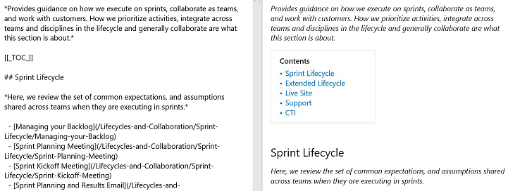

# Syntax guidance for Markdown usage in Wiki

[!INCLUDE [temp](../../_shared/version-ts-tfs-2015-2016.md)]

[!INCLUDE [version-selector](../../_shared/version-selector.md)]

Here you can find some Wiki-specific Markdown syntax guidance for use in Azure DevOps.

::: moniker range=">= azure-devops-2019"
<a id="toc-wiki" > </a>

## Table of contents (TOC) for Wiki pages

You can now just add a tag [[\_TOC\_]] to enable a table of contents in your page. The TOC is generated when the tag is added and there is at least one heading in the page.

> [!div class="mx-imgBorder"]  
> 

The [[\_TOC\_]] can be placed anywhere in the page to render the table of contents.
Only Markdown headings are considered for TOC (HTML heading tags aren't).

All HTML and Markdown tags are stripped from the headings while adding it inside the TOC block.
For example: Adding bold and italics to a heading text renders the TOC as follows.

> [!div class="mx-imgBorder"]
> [

Consistency is maintained in the formatting in TOC.

> [!NOTE] 
> The tag [[\_TOC\_]] is case-sensitive. For example, [[\_toc\_]] may not render the TOC. Also, only the first instance of [[\_TOC\_]] is rendered and the rest are ignored.

::: moniker-end

::: moniker range=">= azure-devops-2019"

## Embed Videos in a Wiki page

To embed videos from YouTube and Microsoft Streams in a wiki page, use the following syntax:

```markdown
::: video
<iframe width="560" height="315" src="https://www.youtube.com/embed/OtqFyBA6Dbk" frameborder="0" allow="autoplay; encrypted-media" allowfullscreen></iframe>
:::
```
The iframe is the embed iframe block of the YouTube or Microsoft Streams video.

**Result:**

<iframe width="560" height="315" src="https://www.youtube.com/embed/OtqFyBA6Dbk" frameborder="0" allow="autoplay; encrypted-media" allowfullscreen></iframe>

(The ending ":::" is required to prevent a break in the page)

::: moniker-end

::: moniker range=">= azure-devops-2019"

## YAML tags

Any file that contains a YAML block in a Wiki is processed by a table with one head and one row. The YAML block must be the first thing in the file and must take the form of valid YAML set between triple-dashed lines. It supports all basic datatypes, lists, and objects as values. The syntax is supported in wiki, code file preview.

Basic example:

```yaml
---
tag: post
title: Hello world
---
```
 


Tags with list:
```yaml
---
tags: 
- post
- code
- web
title: Hello world
---
```


::: moniker-end

::: moniker range=">= azure-devops-2019"

## Embed Azure Boards query results in Wiki

To embed Azure Boards query results in a wiki page as a table, use the following syntax:

```boards-query
::: query-table <queryid>
:::
```

Alternatively, you can also use the toolbar icon and the query selector to embed the query results in a wiki page.

> 

> 


::: moniker-end


::: moniker range=">= azure-devops-2019"

## @mention users and groups

To @mention users or groups in wiki, key in "@" in the wiki editor. This will open up an autosuggest from which you can mention users or groups who will get notified by email.

> 

You can also select "@mention" from the edit toolbar.

> 


::: moniker-end

<a id="link-work-items">  </a>

## Link to work items from a Wiki page

::: moniker range="> tfs-2018"
Enter the pound sign (`#`), and then enter a work item ID.

::: moniker-end

::: moniker range="tfs-2018"
> [!NOTE]  
> This feature is available with TFS 2018.2 and later versions.  
::: moniker-end


<a name="html"></a>

## HTML tag support in wiki pages

In wiki pages, you can also create rich content using HTML tags.

::: moniker range="tfs-2018"
> [!NOTE]  
> Pasting rich content as HTML is supported in TFS 2018.2 and later versions.
::: moniker-end

::: moniker range=">= tfs-2018"
**Example - Embedded video**

```HTML
<video src="path of the video file" width=400 controls>
</video>
```

**For example:**  
```HTML
<video src="https://sec.ch9.ms/ch9/7247/7c8ddc1a-348b-4ba9-ab61-51fded6e7247/vstswiki_high.mp4" width=400 controls>
</video>
```

</br>
**Result:**
</br>
<video src="_img/markdown-guidance/vstswiki_mid.mp4" width="600" controls>
</video>

**Example - Rich text format**

```HTML
<p>This text needs to <del>strikethrough</del> <ins>since it is redundant</ins>!</p>
<p><tt>This text is teletype text.</tt></p>
<font color="blue">Colored text</font>
<center>This text is center-aligned.</center>
<p>This text contains <sup>superscript</sup> text.</p> 
<p>This text contains <sub>subscript</sub> text.</p>
<p>The project status is <span style="color:green;font-weight:bold">GREEN</span> even though the bug count / developer may be in <span style="color:red;font-weight:bold">red.</span> - Capability of span
<p><small>Disclaimer: Wiki also supports showing small text</small></p>
<p><big>Bigger text</big></p>
```

**Result:**
<p>This text needs to <del>strikethrough</del> <ins>since it is redundant</ins>!</p>
<p><tt>This text is teletype text.</tt></p>
<font color="blue">Colored text</font>
<center>This text is center-aligned.</center>
<p>This text contains <sup>superscript</sup> text.</p> 
<p>This text contains <sub>subscript</sub> text.</p>
<p>The project status is <span style="color:green;font-weight:bold">GREEN</span> even though the bug count / developer may be in <span style="color:red;font-weight:bold">red.</span> - Capability of span
<p><small>Disclaimer: Wiki also supports showing small text</small></p>
<p><big>Bigger text</big></p>

::: moniker-end

## Related articles

- [Project wiki](add-edit-wiki.md)
- [Wiki file structure](wiki-file-structure.md)
- [Wiki view history](wiki-view-history.md)