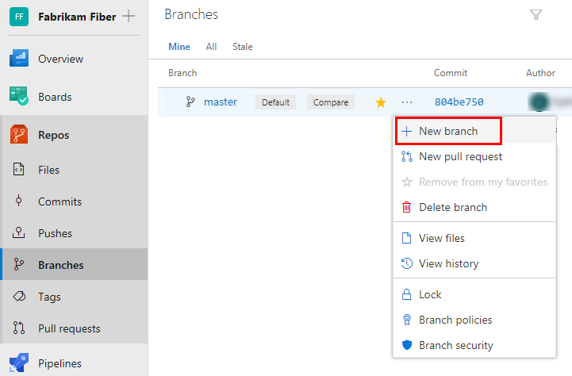
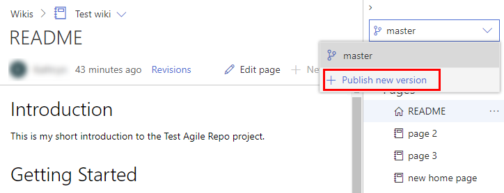
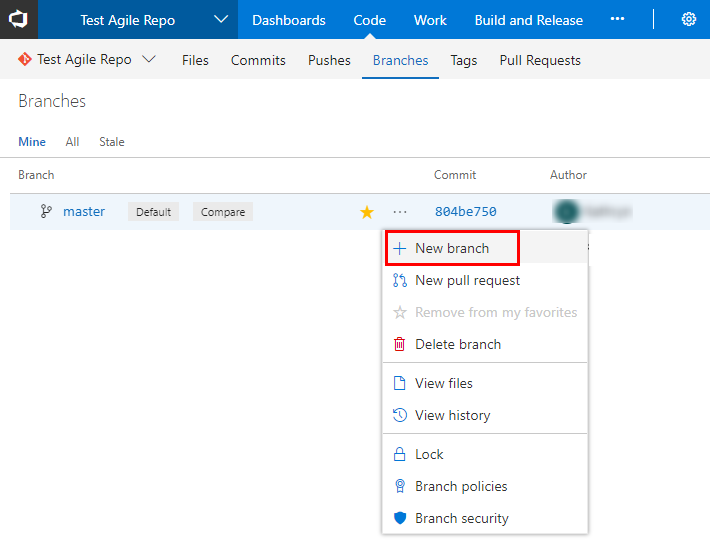
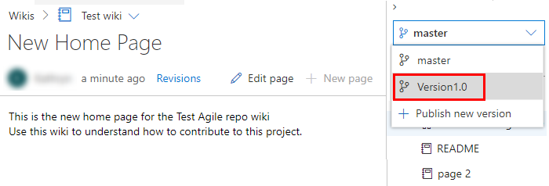
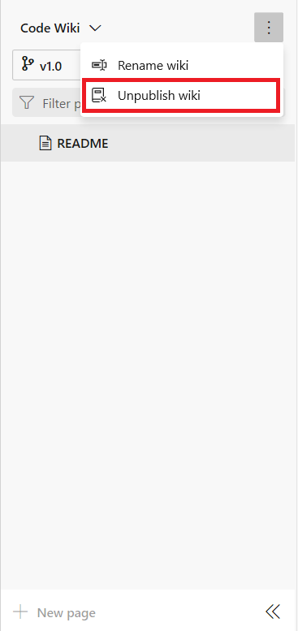
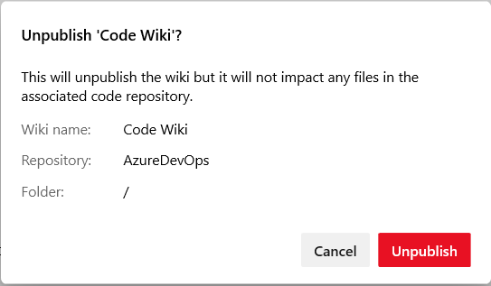

# Publish, unpublish, and select version of a wiki

[!INCLUDE [temp](../../_shared/version-azure-devops.md)]

When you publish a Git repository to a wiki, you can publish new branch of the repo as versions, select a version to view, or unpublish the repo.

## Publish a new wiki version

If your published wiki corresponds to a product version, you can publish new versions as you release new versions of your product. To create a new version, create a new branch of your repo, and then make updates to that new branch.

::: moniker range=">= azure-devops-2019"  

1. To create a new branch from the web portal, open **Repos > Branches**, open the  actions icon for the branch you have previously published, and select **New branch**.

	> [!div class="mx-imgBorder"]  
	> 

0. To publish the new branch to a wiki, open the **Wiki** page for the currently published branch, open the  actions icon, and then choose **Publish new version**.

	> [!div class="mx-imgBorder"]  
	> 

0. Complete the form, choosing the branch that you previously created.  

	> [!div class="mx-imgBorder"]  
	> 

0. Select **Update**.

::: moniker-end

::: moniker range="azure-devops"  

1. To create a new branch from the web portal, open the **Code > Branches** page, open the  actions icon for the branch you have previously published, and select **New branch**.

	> [!div class="mx-imgBorder"]  
	> 

2. To Publish the new branch to a wiki, open the **Wiki** page for the currently published branch, open the  actions icon, and choose **Publish new version**.

	> [!div class="mx-imgBorder"]  
	> 

3. Fill out the form, choosing the branch that you previously created.  

	> [!div class="mx-imgBorder"]  
	> 

4. Choose **Update**.

::: moniker-end

## Select a wiki version

To select a wiki version, choose the version from the branch options from the **Wiki** page.

> [!div class="mx-imgBorder"]
> 

## Unpublish a published wiki

If you no longer want a repository to be published as a wiki, you can choose to unpublish it from **Wiki**. Unpublishing a wiki unpublishes all versions of the repository that you have published previously.

1. Select the wiki you want to unpublish, pen the context menu, and select **Unpublish wiki**.

	> [!div class="mx-imgBorder"]  
	> 

2. Confirm that you want to unpublish the wiki by choosing **Unpublish**.  

	> [!div class="mx-imgBorder"]  
	> 

## Related articles

- [Provisioned wiki vs. publish code as wiki](provisioned-vs-published-wiki.md)
- [Update wiki pages offline](wiki-update-offline.md)
- [Manage README and Wiki permissions](manage-readme-wiki-permissions.md)
