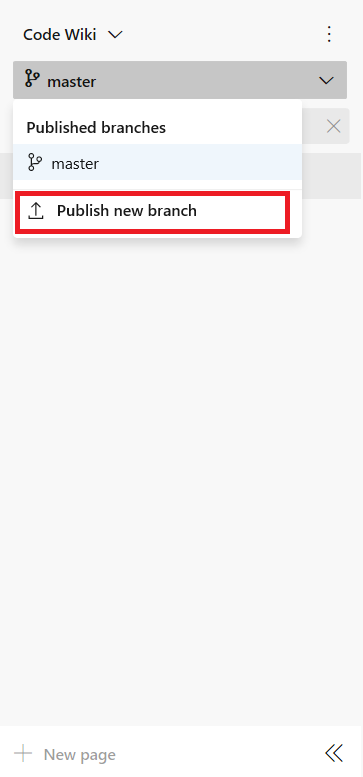

# Version, select, or unpublish a published wiki

[!INCLUDE [temp](../../_shared/version-vsts-only.md)] 

::: moniker range=">= tfs-2018"
> [!NOTE]  
> The publish code as wiki feature is currently available on Azure DevOps Services only. For TFS 2018 and later versions, you can only provision a wiki for your team project.  
::: moniker-end

When you publish a Git repository to a wiki, you can publish new branch versions of the repo, select a version to view, or unpublish the repo. 

::: moniker range="vsts"

## Publish a new wiki version 

When your published wiki corresponds to a product version, you can publish new versions as you release new versions of your product. To create a new version, create a new branch of your repo and then make updates to that new branch.

[!INCLUDE [temp](../../_shared/new-navigation.md)]  

# [New navigation](#tab/new-nav)  

0. To create a new branch from the web portal, open **Repos>Branches**, open the  actions icon for the branch you have previously published, and choose **New branch**. 

	> [!div class="mx-imgBorder"]  
	> 

0. To Publish the new branch to a wiki, open the **Wiki** page for the currently published branch, open the  actions icon, and choose **Publish new version**.

	> [!div class="mx-imgBorder"]  
	> 

0. Fill out the form, choosing the branch that you previously created.  

	> [!div class="mx-imgBorder"]  
	> 

0. Choose **Update**. 

# [Previous navigation](#tab/previous-nav)

0. To create a new branch from the web portal, open the **Code>Branches** page, open the  actions icon for the branch you have previously published, and choose **New branch**. 

	> [!div class="mx-imgBorder"]  
	> 

0. To Publish the new branch to a wiki, open the **Wiki** page for the currently published branch, open the  actions icon, and choose **Publish new version**.

	> [!div class="mx-imgBorder"]  
	> 

0. Fill out the form, choosing the branch that you previously created.  

	> [!div class="mx-imgBorder"]  
	> 

0. Choose **Update**. 

---

## Select a wiki version

To select a wiki version, choose the version from the branch options from the **Wiki** page.

> [!div class="mx-imgBorder"]  
> 

## Unpublish a published wiki

If you no longer want a repository to be published as a wiki, you can choose to unpublish it from **Wiki**. Unpublishing a wiki unpublishes all versions of the repository that you have published previously. 

0. Simply select the wiki you want to unpublish, pen the context menu, and choose **Unpublish wiki**. 

	> [!div class="mx-imgBorder"]  
	> 

0. Confirm that you want to unpublish the wiki by choosing **Unpublish**.  

	> [!div class="mx-imgBorder"]  
	> 

## Related articles

- [Differences between provisioned wiki and publish code as wiki](provisioned-vs-published-wiki.md)
- [Update wiki pages offline](wiki-update-offline.md)
- [Manage README and Wiki permissions](manage-readme-wiki-permissions.md) 

::: moniker-end
