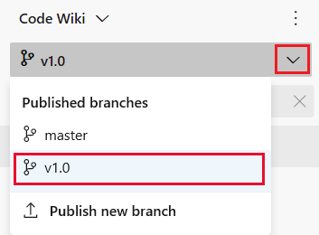
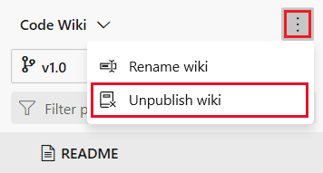

# Publish, unpublish, and select version of a wiki

[!INCLUDE [version-vsts-plus-azdevserver-2019](../../includes/version-vsts-plus-azdevserver-2019.md)]

When you publish a Git repository to a wiki, you can publish new branch of the repo as versions, select a version to view, or unpublish the repo.

## Publish a new wiki branch

If your published wiki corresponds to a product version, you can publish new branches as you release new versions of your product. To create a new version, create a new branch of your repo, and then make updates to that new branch.

1. To create a new branch from the web portal, select **Repos** > **Branches**, select :::image type="icon" source="../../media/icons/actions-icon.png" border="false"::: **Actions** for the branch you previously published, and then select **New branch**.

	> [!div class="mx-imgBorder"]  
	> 

1. To publish the new branch to a wiki, open the **Wiki** page for the currently published branch, open the branch picker, and then choose **Publish new branch**.

	> [!div class="mx-imgBorder"]  
	> 

1. Complete the form, choosing the branch that you previously created.  

	> [!div class="mx-imgBorder"]  
	> 

1. Select **Update**.

## Select a wiki version

To select a wiki version, choose the version from the branch options from the **Wiki** page.

> [!div class="mx-imgBorder"]
> 

## Unpublish a published wiki

If you no longer want a repository to be published as a wiki, you can choose to unpublish it from **Wiki**. 

> [!NOTE]
> Unpublishing a wiki unpublishes the entire code wiki, which includes all versions of the repository that you have published previously.

1. Select the wiki you want to unpublish, open the context menu, and select **Unpublish wiki**.

	> [!div class="mx-imgBorder"]  
	> 

2. Confirm that you want to unpublish the wiki by choosing **Unpublish**.  

	> [!div class="mx-imgBorder"]  
	> 

## Related articles

- [Provisioned wiki vs. publish code as wiki](provisioned-vs-published-wiki.md)
- [Update wiki pages offline](wiki-update-offline.md)
- [Manage README and Wiki permissions](manage-readme-wiki-permissions.md)
