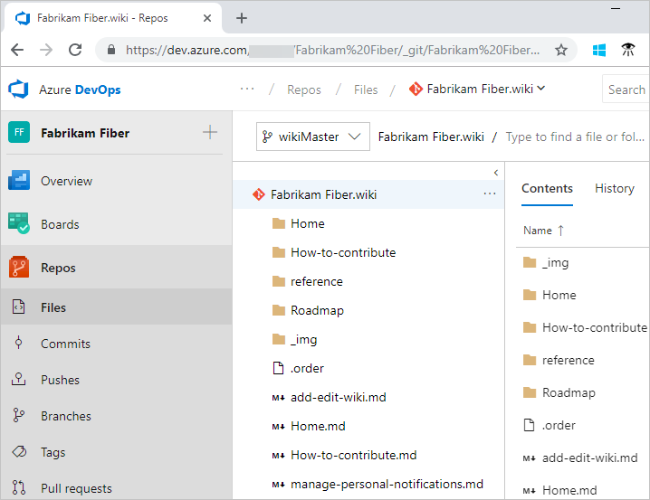

# Clone and update wiki content offline

[!INCLUDE [temp](../../_shared/version-vsts-tfs-2018.md)]

You can update your wiki pages offline the same way you develop code in a Git repo.

::: moniker range="tfs-2018"
> [!NOTE]  
> GIT workflows, like branch policies, are applicable only for publish code as wiki workflows.
::: moniker-end

You can use any client you want or git command-line tools to update your wiki offline. For details on working with Git repositories and supported tools, see [Git Repositories](../../repos/git/index.md).

The basic steps to update wiki content offline are as follows:

1. Clone your wiki Git repo to your local IDE or workspace
2. Add files or folders to your local git branch
3. Update the .order files to reflect the pages and subpages that you've added
4. Commit and push the updates you made to your local git branch

## Prerequisites

::: moniker range=">= azure-devops-2019"

Do the following to migrate Markdown pages from another wiki to your team project wiki or to content that you publish as code to a wiki.

- [Understand the underlying structure of your wiki Git repo](wiki-file-structure.md)
- See the [Differences between provisioned wiki and publish code as wiki](provisioned-vs-published-wiki.md)

::: moniker-end

::: moniker range="tfs-2018"

Do the following to migrate Markdown pages from another wiki to your team project wiki.

- [Understand the underlying structure of your wiki Git repo](wiki-file-structure.md).

::: moniker-end

<a id="edit-wiki-offline"></a>

## Clone your wiki

Your wiki repository stores pages, images, attachments, and the sequence of pages and subpages. Clone your wiki to begin.

1. Sign in to your organization (`https://dev.azure.com/{yourorganization}`), and then select your project.

   

2. Open the **More** context menu and select **Clone wiki**.

	

2. From the **Clone repo** dialog, select the  copy-clone icon.  

	

	Enter it in your browser to view the files defined under the wikiMaster branch.

	> [!div class="mx-imgBorder"]  
	> 

3. Use the URL that you copied to clone the repo in the IDE that you use. To learn more, see one of the following articles:
	- [Clone an existing Git repo](../../repos/git/clone.md)
	- [Using Version Control in VS Code](https://code.visualstudio.com/docs/editor/versioncontrol)
	- [Get Started with Git and Azure DevOps](../../repos/git/gitquickstart.md?view=azure-devops&tabs=visual-studio)

## Add pages to your local Git repository

We author pages using [Markdown format](../../reference/markdown-guidance.md). Add a Markdown file to your local branch for each page and subpage that you want to add to your wiki.

### Add pages

To add pages at the root of the wiki tree, add a Markdown file at the root of the Git repository.

1. For each page you want to add, create a Markdown file with the page contents, and then add it under the root folder for your repo.

	For the Fabrikam Fiber team project, it's in the following folder:  

	`C:\Users\UserName\Source\Repos\Fabrikam Fiber.wiki`

2.  To add pages at the root of the wiki tree, add a Markdown file for each page at the root of the Git repository.

	> [!div class="mx-imgBorder"]  
	> 

3. After you've added all the pages you want to add at the root, update the **.order** file at the root. It should have one entry for each Markdown file that is defined at the root. Each entry should match the file title with spaces replaced with a dash.

	For example:  

	```
	Welcome
	Roadmap  
	How-to-contribute  
	Home  
	Reference  
	```

### Add subpages

1. Create a folder for the parent page, and then add Markdown files for each subpage in the folder.

   For example, we added to following files to the How-to-contribute folder. These subpages appear under the How to contribute page in the wiki.

	> [!div class="mx-imgBorder"]  
	> 

2. Add a **.order** file in the folder with the order of the subpages as they should appear in the wiki. To understand the use of the **.order** file to sequence pages, see [Wiki Git repository files and file structure](wiki-file-structure.md).
	 
	For example, the file has the following subpages:

	```
	Request-extensions  
	Licensing  
	Smoke-test  
	Coding-guidelines  
	```

### Push your changes

When you're done with all your updates, [push the files to the Git repository](../../repos/git/pushing.md).

The added pages and subpages appear immediately in your wiki.

   > [!div class="mx-imgBorder"]  
   > 

If there are any errors in the process, the pages appear in your wiki with a warning sign.


## Related articles

- [Create a wiki for your team project](wiki-create-repo.md)
- [Wiki Git repository files and file structure](wiki-file-structure.md)
- [Clone an existing Git repo](../../repos/git/clone.md)
- [Share code with push](../../repos/git/pushing.md)
- [Manage README and Wiki permissions](manage-readme-wiki-permissions.md)
- [Syntax guidance for Markdown files, widgets, wikis, and pull request comments](../../reference/markdown-guidance.md).

<!---


 


	

	

In the web portal, you can view the repo files based on the following URL: 
::: moniker range=">= azure-devops-2019"
	`https://*AccountName*.visualstudio.com/DefaultCollection/*ProjectName*/_git/*ProjectName*.wiki`
::: moniker-end
::: moniker range=">= tfs-2018"
	`https://*ServerName*/DefaultCollection/*ProjectName*/_git/*ProjectName*.wiki`
::: moniker-end

1. Clone your wiki Git repo to your local IDE or workspace 
2. Create a local git branch based on your wikiMaster branch 
3. Add files or folders to your local git branch 
4. Update the .ORDER file(s) to reflect the pages and subpages you've added 
5. Commit and push the updates you made to your local git branch
6. Create a pull request to merge your changes to the wikiMaster branch 
7. Approve the changes to complete the pull request.  

While that's a lot of steps, the main steps that are specific to updating a wiki is step 3. The rest follow the standard steps for updating a Git repo.

-->  