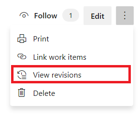
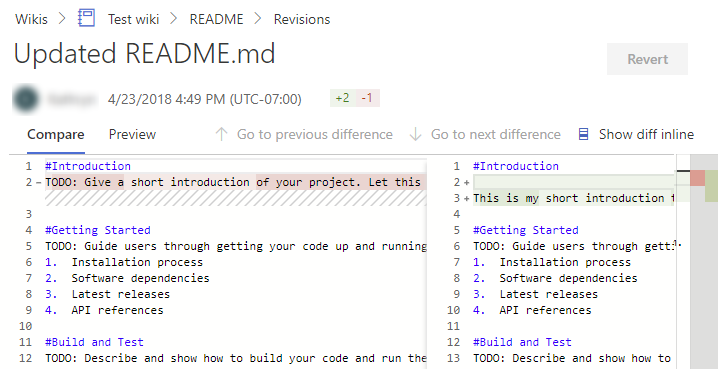
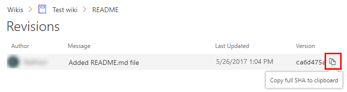
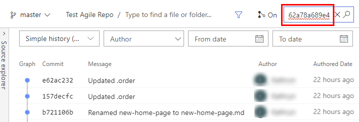

# View wiki page history and revert changes

[!INCLUDE [temp](../../_shared/version-vsts-tfs-2018.md)]

You can see details of the changes made to a wiki page and revert to an earlier version, if needed.

## View wiki page revision history  

1. To view the revision history of a page, select the **Revisions** link provided on each page. You can also select **View revisions** in the context menu of a page.

	

2. Revision pages show who made the change along with the revision message, date, and version or commit ID. To view details of a revision, select the message or version link.

	::: moniker range=">= azure-devops-2019"
	> [!div class="mx-imgBorder"]  
	> 
	::: moniker-end
	::: moniker range="tfs-2018"
	
	::: moniker-end
3.	Similar to any git file revision, the revision details page provides a **side-by-side diff view** or the **inline diff view**. Choose **Preview** to see the content of the page of the specific revision.

	
	::: moniker range=">= azure-devops-2019"

	For a *publish as code wiki* page, you see similar information, but the **Revert** button isn't active.

	> [!div class="mx-imgBorder"]  
	> 
	::: moniker-end
4. [Use the breadcrumbs](../navigation/use-breadcrumbs-selectors.md) to return to the page or revisions of the page.

::: moniker range=">= tfs-2018"

## Revert a commit to a *provisioned wiki* page

Select the **Revert** button on the revision details page to revert a change on a wiki page.

::: moniker-end

::: moniker range="tfs-2018"
> [!NOTE]
> The **Revert** option is available with TFS 2018.2 and later versions.
::: moniker-end

::: moniker range=">= tfs-2018"

::: moniker-end

::: moniker range=">= azure-devops-2019"

## Revert a commit to a *publish as code wiki* page

If you need to revert to an earlier revision for a page that you have published as code, do one of the following actions:

- If the commit is the most recent revision to a page, you can revert from the web portal
- If the commit is an earlier revision, with additional commits having occurred in between, create a separate branch and revert the changes in that branch

### Revert from a recent revision from the web portal

1. Preview any version by choosing the commit id from the **Revisions** page for the selected file.

2. Copy the full ID of the commit by selecting the  copy-clone icon.  Here we copy the commit id, `ca6d475a22eb1db930cf238f3b80862a78a689e4`, with the abbreviated ID of `ca6d475a`.

	> [!div class="mx-imgBorder"]  
	> 

3. Open the **Code > Commits** page and paste the ID that you copied into the Commit ID box and choose the  search icon.
 
	> [!div class="mx-imgBorder"]  
	> 
	
4. From the commit page, open the  actions icon and choose the **Revert** option.  

	> [!div class="mx-imgBorder"]  
	> 

5. Confirm that you want to revert. Choose **Revert** in the dialog.  

	> [!div class="mx-imgBorder"]  
	> 

	A branch is created with the reverted changes.

6. Select **Create Pull Request**.  

	> [!div class="mx-imgBorder"]  
	> 
		
	If instead, you receive an error message as shown, it indicates that you must create a local branch and make your changes manually as described in the next section.

	> [!div class="mx-imgBorder"]  
	> 

7. Select **Create** in the New Pull Request form.

8. Select **Complete** to merge the changes into the master wiki branch. Optionally, check the **Delete** checkbox to delete the intermediate branch.

	> [!div class="mx-imgBorder"]  
	> 

Return to the wiki, refresh the browser, and you should see the reverted content.

### Revert from earlier revisions using a different branch

To revert to an earlier committed version, one that is not the immediate last revision, of a publish as code wiki page, you must update a branch other than the master branch for the wiki, and then create a pull request to the master branch.

0.	Create a local branch of the master wiki branch.
0.	View the commit history and locate the commit that contains the changes you want to undo.
0.	Use the revert command to revert the desired commit.
0.	When a conflict arises, use the conflict resolution tools to resolve the issues.
0.	Commit the changes locally to your local branch.
0.	Push the local branch to the remote server.
0.	Create a pull request for your local branch into master.
0.	Complete the pull request.

You can use the following steps to identify the commit that contains the content you want to revert to. Then, use standard Git operations to revert the content.

For more information, see the following articles:

- [Clone an existing Git repo](../../repos/git/clone.md)  
- [Create work in branches](../../repos/git/branches.md)  
- [Review history](../../repos/git/review-history.md)  
- [Undo (revert) changes](../../repos/git/undo.md)
- [Resolve merge conflicts](../../repos/git/merging.md)
- [Copy changes with cherry-pick](../../repos/git/cherry-pick.md)
- [Commit details](../../repos/git/commit-details.md)

::: moniker-end

## Related articles

- [Wiki Git repository files and file structure](wiki-file-structure.md)
- [Differences between provisioned wiki and publish code as wiki](provisioned-vs-published-wiki.md)
- [Update wiki pages offline](wiki-update-offline.md)
- [Manage README and Wiki permissions](manage-readme-wiki-permissions.md)