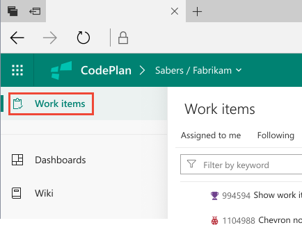
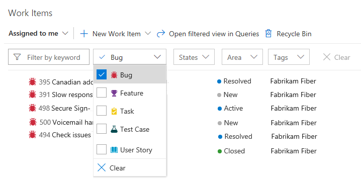

# View and filter work items  

[!INCLUDE [temp](_shared/version-public-projects.md)]  

When you connect to a public project and the Azure Codex Agile app, you're able to view work items defined for that project. If you're a contributor or stakeholder, you can also [add and edit work items](../work/work-items/view-add-work-items.md).  

## View work items 

From the **Work Items** page, you can view recently created, updated, and completed work items.   

# [Horizontal navigation](#tab/horizontal) 

Click the **Wiki** link located in the top navigation bar.  If you don't see the **Wiki** option, click the .

> [!div class="mx-imgBorder"]

# [Vertical navigation](#tab/vertical) 

In Codex Agile, click the **Work Items** link located in the left navigation pane.

> [!div class="mx-imgBorder"]
 

---

For help navigating to a team project or the Codex Agile app, see [Navigation basics]. 

## Choose your work item view

Using the drop-down menu, you can focus on relevant items using one of the three pivots described next. Additionally, you can [filter](#filter) and [sort](#sort) each pivot view.  

<table>
<tbody valign="top">
<tr>
<td>

</td>
<td>
<ul>
<li>**Recently updated**: lists work items recently updated in the project. </li>
<li>**Recently completed**: lists work items completed or closed in the project.</li>
<li>**Recently created**: lists work items created within the last 30 days in the team project.</li>
</ul>
</td>
</tr>
</tbody>
</table>

<a id="filter" />
## Filter the list of work items
You can filter each work item pivot view by typing a keyword or using one or more of the fields provided, such as work item type (Types), State, Area Path, and Tags. The page remembers the filters you set for each pivot, supporting personalized views across all pivots.  

> [!div class="mx-imgBorder"]

<a id="sort" />
## Sort your view and other View options 

You can sort your view by one of the column fields that you select from the **View options** menu. 

> [!NOTE]   
> The column fields differ depending on the view that you select. You can't change the fields supported by a view. 

<table>
<tbody valign="top">
<tr>
<td>

</td>
<td>
<ul>
<li>**ID, Work Item Type, Title, State, Area Path, Tags** (Assigned to me view): Sorts by the column selected.  </li>
<li>**Ascending/Descending**: click to change the sort order.   </li>
<li>**Completed Work Items**: Click the slider to choose to show completed work items in the current pivot view.  </li>
</ul>
</td>
</tr>
</tbody>
</table>

<!---
## Copy selected items to the clipboard or email them

To select several items in a sequence, hold down the shift key. To select several non-sequential items, use the Ctrl key. Then, you can use **Ctrl+c** to copy the selected items to a clipboard. Or, you can open the context menu for the selected work items, click (), and then choose the option you want from the menu. 

> [!div class="mx-imgBorder"]

-->

>[!NOTE]  
>Depending on the process chosen when the team project was created&mdash;[Agile](../work/work-items/guidance/agile-process-workflow.md), [Scrum](../work/work-items/guidance/scrum-process-workflow.md), or [CMMI](../work/work-items/guidance/cmmi-process-workflow.md)&mdash;the types of work items you view will differ. For example, backlog items may be called product backlog items (Scrum), user stories (Agile), or requirements (CMMI). All three are similar: they describe the customer value to deliver and the work to be performed.
>
> For an overview of all three processes, see [Choose a process](../work/work-items/guidance/choose-process.md). 

