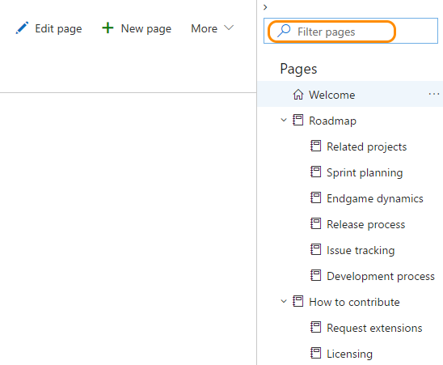

# View and filter wiki pages 

[!INCLUDE [temp](_shared/version-public-projects.md)] 

When you connect to a public project, you're able to view pages added to the Wiki for that project. If you're a contributor, you can also [add and edit pages](../collaborate/add-edit-wiki.md).  

For help navigating to a team project, see [Navigation basics]. 

# [Vertical navigation](#tab/vertical) 

Click the **Wiki** link located in the left navigation pane.

> [!div class="mx-imgBorder"]
 

# [Horizontal navigation](#tab/horizontal) 

Click the **Wiki** link located in the top navigation bar.  If you don't see the **Wiki** option, click the .

> [!div class="mx-imgBorder"]

---

## Filter wiki pages

The filter feature allows you to quickly find a wiki page as the number of pages grows. 

To find a page, enter a title or keyword into the **Filter pages** box.   
 
> [!div class="mx-imgBorder"]

