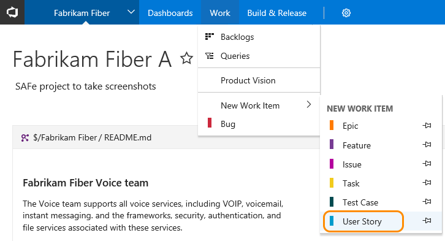
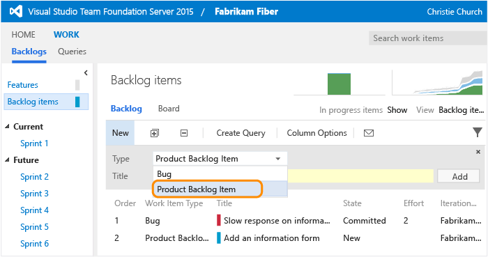

# Get started with Stakeholder access

<b>Team Services | TFS 2017 | TFS 2015 | TFS 2013</b> 

With Stakeholder access, you can add and modify work items, approve releases, and view dashboards. You can check project status and provide direction, feedback, feature ideas, and business alignment to a team. For a review of all features you have access to, see [Stakeholder feature access](#feature-access). 


## First time signing in 

1. If you're connecting to Team Services, click the link provided in the email invitation you should have received. 

  Or, open a browser window and enter the URL for the web portal.

  **Team Services:**  ```http://AccountName.visualstudio.com/DefaultCollection/ProjectName```
 
  **On-premises TFS:**  ```http://ServerName:8080/tfs/DefaultCollection/ProjectName```

  For example, to connect to the server named *FabrikamPrime* and project named *Contoso*, type ```http://FabrikamPrime:8080/tfs/DefaultCollection/Contoso```.

2.  Enter your credentials. If you aren't able to sign in, you need to be added as a member to a team project and added to Stakeholder access. 


<a id="create-work-item">  </a> 
## Add a work item

You might see different work item types in your view based on the process selected for your team project: [Scrum](../work/guidance/scrum-process.md), [Agile](../work/guidance/agile-process.md),  or [CMMI](../work/guidance/cmmi-process.md). 


>[!NOTE]  
>A caution icon on a tab indicates values that violate validation rules. You must correct information on that tab in order to save the work item.    
    
<div style="background-color: #f2f0ee;padding-top:10px;padding-bottom:10px;">

<ul class="nav nav-pills" style="padding-right:15px;padding-left:15px;padding-bottom:5px;vertical-align:top;font-size:18px;">

<li style="float:left;" data-toggle="collapse" data-target="#add-work-item">Add a work item </li> 

<li style="float: right;"><a style="max-width: 374px;min-width: 120px;vertical-align: top;background-color:#AEAEAE;margin: 0px 0px 0px 8px;min-width:50px;color: #fff;border: solid 2px #AEAEAE;border-radius: 0;padding: 2px 6px 0px 6px;outline-style:none;height:32px;font-size:12px;font-weight:400" data-toggle="pill" href="#add-work-item-tfs-2015-13">TFS 2015, TFS 2013</a></li>

<li class="active" style="float: right"><a style="max-width: 374px;min-width: 120px;vertical-align: top;background-color:#007acc;margin: 0px 0px 0px 0px;min-width:90px;color: #fff;border: solid 2px #007acc;border-radius: 0;padding: 2px 6px 0px 6px;outline-style:none;height:32px;font-size:12px;font-weight:400" data-toggle="pill" href="#add-work-item-team-services">Team Services, TFS 2017</a></li>

</ul>
 
<div id="add-work-item" class="tab-content collapse in fade" style="background-color: #ffffff;margin-left:5px;margin-right:5px;padding: 5px 5px 5px 5px;">

<div id="add-work-item-team-services" class="tab-pane fade in active"> 

<p>From the Work hub, choose a work item, for example User Story, from the New Work Item list of options. Click the  pin icon to have it show up within the Work hub drop down menu. </p>

 <br/>  

<p>Enter a title and then save the work item. Before you can change the State from its initial default, you must save it.</p>  


</div>

<div id="add-work-item-tfs-2015-13" class="tab-pane fade"> 

<p>From the Queries page, choose a work item from the New drop down menu.</p>

  

<p>Enter a title and then save the work item. Before you can change the State from its initial default, you must save it.</p>  

</div>


</div>
</div> 
<p>You can [add existing tags to any work item to support filter backlogs and queries](../work/track/add-tags-to-work-items.md).</p>

<p>Work items you add are automatically scoped to your [team's area and iteration paths](../work/scale/set-team-defaults.md). To change the team context, see [Switch team project or team focus](../work//how-to/switch-team-context-work.md).</p>
	
>[!NOTE]  
>Depending on the process chosen when the team project was created&mdash;[Scrum](../work/guidance/scrum-process.md), 
[Agile](../work/guidance/agile-process.md), or [CMMI](../work/guidance/cmmi-process.md)&mdash;the types of work items you can create will differ. For example, backlog items may be called product backlog items (Scrum), user stories (Agile), or requirements (CMMI). All three are similar: they describe the customer value to deliver and the work to be performed.
>	
> For an overview of all three processes, see [Choose a process](../work/guidance/choose-process.md). 


<a id="check-backlog">  </a> 
## Check the backlog or add new work  

Work appears in the backlog in priority order.

1. To view or edit a work item, select it and choose Enter.

	 

2. To add a new item, select the type and then name it. Your items are added to the bottom of the list.  

	  

## Check work in progress  

To view the team's work status, open the Kanban board. Chick the title of an item to open or edit it. 


<a id="query">  </a> 
## Find work assigned to you, or query for other work items  

Open the Queries page to see the list of work items assigned to you.  

 

Or, open any of the queries defined in the Shared Queries folder.  

  

And, you can [create new queries or edit existing queries](../work/track/using-queries.md) and save them under My Queries folder.  


## Related notes 
For a comparison chart of Stakeholder vs Basic access, see this [feature matrix](https://www.visualstudio.com/team-services/compare-features/). See also these quickstart guides: 

- [Add work items](../work/backlogs/add-work-items.md)  
- [Create your backlog](../work/backlogs/create-your-backlog.md)
- [Kanban basics](../work/kanban/kanban-basics.md)
 
>[!NOTE]  
>If you work from Team Services or TFS 2017.1 or later versions, you'll have access to select preview features. To learn more, see [Enable preview features](../collaborate/preview-features.md). 

<a id="feature-access">  </a> 
### Stakeholder feature access

>[!NOTE]  
>**Feature availability**: The following features are available from Team Services or from the web portal of the listed on-premises TFS version or a later version. Those not annotated are available from all platforms and versions. To determine your platform or TFS version, see [Platform and version support](../provide-feedback.md#platform-version).   


<div style="float:left;width:350px;margin:8px;font-size:90%">
<p style="font-weight:bold;padding-bottom:0px;text-align:center;">Work</p>
<ul style="padding-left:30px">
<li style="margin-bottom:2px">[View, create, and modify work items](#create-work-item) <sup>4</sup></li>
<li style="margin-bottom:2px">[View, add, and modify items on backlogs](#check-backlog) <sup>5</sup></li>
<li style="margin-bottom:2px">[View, and modify items on sprint backlogs](../work/scrum/sprint-planning.md) <sup>5</sup></li>
<li style="margin-bottom:2px">[View, and modify items on the task board](../work/scrum/task-board.md) <sup>5, 6</sup></li>
<li style="margin-bottom:2px">[View, and modify items (Kanban)](../work/kanban/kanban-basics.md)  <sup>5, 6</sup></li> 
<li style="margin-bottom:2px">[Add tasks to the checklist (Kanban)](../work/kanban/add-task-checklists.md) <sup>5, 6</sup> (TFS 2015.1)</li>
<li style="margin-bottom:2px">[Follow changes made to work items](../collaborate/follow-work-items.md) (TFS 2017)</li>
<li style="margin-bottom:2px">[View the cumulative flow diagram](../report/guidance/cumulative-flow.md)</li>
<li style="margin-bottom:2px">[View, create, and save queries](#query) <sup>7</sup> </li>
<li style="margin-bottom:2px">[Submit, view, and change feedback responses](../work/connect/give-feedback.md)</li>
<li style="margin-bottom:2px">[Change work item type](../work/backlogs/remove-delete-work-items.md) (Team Services)</li>


</ul>
</div>

<div style="float:left;width:350px;margin:8px;font-size:90%">
<p style="font-weight:bold;padding-bottom:0px;text-align:center;">Build & Release</p>
<ul style="padding-left:30px">
<li style="margin-bottom:2px">[View releases](../build/actions/view-manage-releases.md) <sup>3</sup> (TFS 2015.2)</li>
<li style="margin-bottom:2px">[Approve a release](../build/concepts/definitions/release/environments.md#approvals) (TFS 2015.2)</li>
</ul>

<p style="font-weight:bold;padding-bottom:0px;text-align:center;">Account, Dashboards, and Notifications</p>
<ul style="padding-left:30px">
<li style="margin-bottom:2px">[Navigate to teams, team projects, and more](../connect/account-home-pages.md) (Team Services)</li>
<li style="margin-bottom:2px">[View project welcome pages](../collaborate/project-vision-status.md) (Team Services)</li>
<li style="margin-bottom:2px">[View team dashboards](../report/dashboards.md) <sup>1</sup></li>
<li style="margin-bottom:2px">[Manage personal notifications](../collaborate/manage-personal-notifications.md) (Team Services, TFS 2017) </li>
<li style="margin-bottom:2px">[Set personal alerts for changes to work items](../work/track/alerts-and-notifications.md) (TFS) </li>
<li style="margin-bottom:2px">[Invite users and assign licenses](../setup-admin/team-services/add-account-users-assign-access-levels-team-services.md) <sup>2</sup>  (Team Services)  </li>
</ul>


</div>


<div style="clear:left;font-size:100%">
</div>


**Notes:**   
1. Stakeholders cannot view markdown README files defined for repositories.  
2. In order to add users and assign licenses for Team Services, stakeholders must be added to the [Project Collection Administrators](../setup-admin/add-administrator-tfs.md) group. Also, they must use the current Users page (not the Streamlined User Management page under preview) in order to manage users. To learn more, see [Manage users and access](../setup-admin/team-services/add-account-users-assign-access-levels-team-services.md).    
3. Stakeholders can only view and approve releases.  
4. Stakeholders can assign existing tags to work items, but not create new tags.  
5. Stakeholders cannot change the backlog priority order (all items are added at the end of the backlog), assign items to an iteration using drag and drop, use the mapping pane or forecasting.
6. Stakeholders cannot move cards on the board to update status, set the values of fields shown on cards, or set or view  team capacity.
7. Stakeholders can save queries under My Queries but cannot save under Shared Queries. 


Also, Stakeholders cannot add or view [Delivery Plans](../work/scale/review-team-plans.md).   

If you choose a feature that's not available to you as a stakeholder, you'll receive an error message indicating that you have insufficient permissions when you try to complete the task. 
#### Features stakeholders can't access 

If you need access to the following features&mdash;which support the daily work of product owners, team leads, developers, testers, and project administrators&mdash;you need to be have Basic access:  
- Change the priority of an item within a backlog  
- Delete work items or move work items to another team project
- Create shared queries, view charts, and modify the home page  
- View Delivery Plans (a Marketplace extension)    
- Access the full set of features of the Code, Build, Test, and Release hubs  
- Participate in team rooms, which capture interactive, detailed conversations about the project.  

> [!NOTE]   
> Stakeholders can view administrative pages that support managing permissions, area and iteration paths, and more; however, for the most part, they can't modify any objects on these pages. The one exception is their ability to [manage users and access](../setup-admin/team-services/add-account-users-assign-access-levels-team-services.md).  
