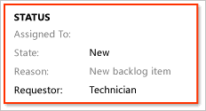

# Add or modify a field for work tracking 

[!INCLUDE [version-lt-azure-devops](../includes/version-lt-azure-devops.md)]

Your project includes 100 or more data fields, depending on the process used to create it, such as [Agile](../boards/work-items/guidance/agile-process.md), [Basic](../boards/get-started/plan-track-work.md), [Scrum](../boards/work-items/guidance/scrum-process.md), or [CMMI](../boards/work-items/guidance/cmmi-process.md). Each work item is tied to a work item type (WIT), and the data you can track corresponds to the fields assigned to that WIT. You can update work item data by [modifying the data field within a work item](../boards/work-items/about-work-items.md).

> [!NOTE]  
> If you're using the Inherited process model, see [Add a custom field to a work item type](../organizations/settings/work/add-custom-field.md).

You can modify existing fields or add custom fields to track more data. For example, you can customize a pick list in a drop-down menu, set a default value, or restrict the values a field can accept.

Pick lists get defined in different ways, such as through the user interface, WIT workflows, or by adding user accounts to a project, as shown in the following table.   

> |WIT definition  |Command line change (On-premises XML process) |
> |-------------|----------|  
> |- [Customize a pick list](#picklist)<br/>- [Add rules to a field](#add-rules)<br/>- [Add a custom field](#add-custom-field)<br/>- [Change the field label on the form](#change-label)<br/>- [Add a custom control](#custom-control) |- [List fields](../boards/work-items/work-item-fields.md#list-fields)<br/>- [Change a field attribute](#change-attribute) <br/>- [Delete a field](#delete-field)<br/>- [Index a field](#index-field)  | 

## Prerequisites
 
| **Category**    | **Requirements**    |
|---------------|-----------------------|
| **List fields**   | Have your **View project-level information** permission for the project in the collection set to **Allow**. |
| **Add or customize a field**  | Be a member of the **Project Administrators** group or have your **Edit project-level information** permission set to **Allow**. |
| **Delete, rename, or change a field** | Be a member of the **Team Foundation Administrators** security group or the **Project Collection Administrators** security group. |
  
To get added as an administrator, [Change project collection-level permissions](../organizations/security/change-organization-collection-level-permissions.md).

## Methods by which work item fields get added 

Work item fields track data for a work item type, define query filter criteria, and generate reports. Any data element you want to track, except for system fields, must be defined as a work item field. You can define fields within a work item type (WIT) or global workflow definition.

Work item fields are maintained at the project collection level and get added in the following scenarios:

- **Creating a project**: Fields defined in the selected process template for WITs or global workflows are created. Core system fields are automatically included for every work item type. For a list of core system fields, see [Work item field index](../boards/work-items/guidance/work-item-field.md). For more information about templates, see [Process templates](process-templates/index.md).
- **Importing a WIT definition**: New fields defined in the WIT definition get added to the collection. Learn more in [All WITD XML elements reference](/previous-versions/azure/devops/reference/xml/all-witd-xml-elements-reference).
- **Importing a global workflow definition**: New fields defined in the global workflow are added to the collection. Global workflows allow shared fields across multiple work item types. See [Customize global workflow](/previous-versions/azure/devops/reference/xml/global-workflow-xml-element-reference) for details.

The complete set of fields in a collection includes all fields defined in WITs and global workflows across all projects. You can modify attributes, rename, or delete fields, but these changes might affect on-premises servers and reporting.

To add or customize a field, edit the XML content of the WIT definition. Define each field using a **FIELD** element within the **FIELDS** section. For more information, see [All FIELD XML elements reference](/previous-versions/azure/devops/reference/xml/all-field-xml-elements-reference).

<a id="modify-field">  </a>

## Add a field, apply a rule, or change an attribute 

To add a custom field, add field rules, or change the label of a field on a work item form, modify the WIT or types that use the field. Follow the [customization sequence](customize-work.md) that matches your process model. 

To change a field attribute or rename a field, use the **witadmin** command line tool. Otherwise, to modify a field, you add or modify the rules associated with the field within a WIT definition.   


<a id="edit">  </a>

## To edit a WIT definition file 

To add rules or add a custom field, export, edit, and then import the WIT definition file.

[!INCLUDE [temp](../includes/process-editor.md)]  

To track data, you add the field to the WIT definition file, except for system fields, which are fields with a reference name starting with **System.**. System fields are automatically defined for all WITs, even if they aren't included in the WIT definition. For details, see [Work item field index](../boards/work-items/guidance/work-item-field.md).

<a id="boolean-field">  </a>

## Add a checkbox or Boolean field 

Use the following syntax to add a Boolean field within the **FIELDS** section of the WIT definition. 

```XML
<FIELD name="Triage" refname="Fabrikam.Triage" type="Boolean" >
   <DEFAULT from="value" value="False" />
   <HELPTEXT>Triage work item</HELPTEXT>
</FIELD>
```

And then add the following syntax within the **FORM** section to have the field appear on the form. 

```XML
<Control Label="Triage" Type="FieldControl" FieldName="Fabrikam.Triage" />
```
 
The field appears as a checkbox on the form. 

<a id="picklist">  </a>

## Customize a pick list

Pick lists are enumerated values displayed in drop-down menus on work item forms and in the **Value** column of the query editor. To customize a pick list for most string or integer fields, edit the WIT definition. For example, use the following XML to add a custom Resolution field with a pick list.

:::row:::
   :::column span="1":::
   Custom field and pick list   
   
   :::column-end:::
   :::column span="2":::
   ```
   <FIELD name="Resolution" refname="MyCompany.Resolution" type="String">    
   <ALLOWEDVALUES>
      <LISTITEM value="By Design" />
      <LISTITEM value="Duplicate" />
      <LISTITEM value="External" />
      <LISTITEM value="Fixed" />
      <LISTITEM value="Not Repro" />
      <LISTITEM value="Postponed" />
      <LISTITEM value="Won't Fix" />
   </ALLOWEDVALUES>
   </FIELD>
   ```
   :::column-end:::
:::row-end:::

Rules allow you to combine lists, restrict who can access a list, and set conditions for when a list appears on the work item form. You can use the **expanditems** and **filteritems** attributes to control whether a distribution list shows individual members or filters specific items.

To simplify maintenance, use global lists for shared lists across WITs or projects. Global lists reduce the effort required to update shared lists. If parts of a list need to differ across WITs or projects, you can define a global list for specific portions of a pick list. For more information, see [Define pick lists](/previous-versions/azure/devops/reference/xml/define-pick-lists) and [Define global lists](/previous-versions/azure/devops/reference/xml/define-global-lists).

<a id="add-rules">  </a>

### Add rules to a field

To add a custom field or apply rules to a field, edit the WIT definition. You can restrict rules to specific users or groups using the **for** or **not** attributes to define who the rule applies to or excludes.

For example, the following code snippet enforces a rule that only members of the Management Team, a custom-defined group, can modify the Stack Rank field after a work item gets created:

```xml
<FIELD name="Stack Rank" refname="Microsoft.VSTS.Common.StackRank" type="Double" reportable="dimension">  
   <FROZEN not="[project]\Management Team" />  
   <HELPTEXT>Work first on items with lower-valued stack rank. Set in triage.</HELPTEXT>
</FIELD>  
```

You can apply rules to fields to achieve the following actions:

> | Action | XML Element |
> |---|---|  
> | Add a tool-tip to a field. | **HELPTEXT** |  
> | Define or restrict the values a field can have. | **CANNOTLOSEVALUE**, **EMPTY**, **FROZEN**, **NOTSAMEAS**, **READONLY**, **REQUIRED** |  
> | Copy a value or set a default value for a field. | **COPY**, **DEFAULT**, **SERVERDEFAULT** |  
> | Restrict who can modify a field. | **VALIDUSER**, **for**, **not** |  
> | Enforce pattern matching for string fields. | **MATCH** |  
> | Apply rules conditionally based on other field values. | **WHEN**, **WHENNOT**, **WHENCHANGED**, **WHENNOTCHANGED** |  

System fields, identified by the "System" prefix, for example, System.ID, allow limited rule customization. For instance, you can't copy or clear fields that track who created, changed, or closed a work item, or system-managed date-time fields.

For details on field rules and restrictions, see [Rules and rule evaluation](../organizations/settings/work/rule-reference.md).

<a id="add-custom-field">  </a>

## To add a custom field

To add a custom field, edit the WIT definition to add a **FIELD** element within the **FIELDS** section and a **Control** element within the **FORM** section. 

1. Export the WIT definition file [based on the process model you use](customize-work.md).   

2. Locate the section of the XML file that begins with ```FIELDS```.

3. Add the ```FIELD``` element that specifies the name of the custom field to add. You must specify the following required attributes: friendly ```name```, ```refname``` (reference name), and ```type```. For more information, see [FIELD (Definition) element reference](/previous-versions/azure/devops/reference/xml/field-definition-element-reference).

   The following code specifies the custom field, Requestor, with a reference name of ```FabrikamFiber.MyTeam.Requestor``` and a pick list of allowed values, with the default value of Customer.

   ```XML
   <FIELD name="Requestor" refname="FabrikamFiber.MyTeam.Requestor" type="String" reportable="Dimension">
      <ALLOWEDVALUES>
         <LISTITEM value="Customer" />
         <LISTITEM value="Executive Management" />
         <LISTITEM value="Other" />
         <LISTITEM value="Support" />
         <LISTITEM value="Team" />
         <LISTITEM value="Technicians" />
         <DEFAULTVALUE value="Customer" />
       </ALLOWEDVALUES>
   </FIELD>
   ```
   
   > [!TIP]
   > Elements within the list always appear in alphanumeric order, regardless of how you enter them in the XML definition file. The Reference Name, or `refname`, is the programmatic name for the field. All other rules should refer to the `refname`. For more information, see [Naming restrictions and conventions](../organizations/settings/naming-restrictions.md#WorkItemFields). 

4. Add the `Control` element within the `FORM` section so that the custom field appears on the form within the group of elements where you want it to appear.

   For example, the following code snippet adds the Requestor field to appear below the Reason field on the work item form.

   ```XML
   <Column PercentWidth="50">
      <Group Label="Status">
         <Column PercentWidth="100">
            <Control FieldName="System.AssignedTo" Type="FieldControl" Label="Assi&amp;gned To:" LabelPosition="Left" />
            <Control FieldName="System.State" Type="FieldControl" Label="&amp;State:" LabelPosition="Left" />
            <Control FieldName="System.Reason" Type="FieldControl" Label="Reason:" LabelPosition="Left" ReadOnly="True" />
            <Control FieldName="FabrikamFiber.MyTeam.Requestor" Type="FieldControl" Label="Requestor:" LabelPosition="Left" ReadOnly="True" />
         </Column>
      </Group>
   </Column>
   ```
   
   > [!TIP]  
   > In the schema definition for work tracking, all child elements of the `FORM` element must use camel case, while all other elements must be in uppercase. Ensure the case structure of opening and closing tags matches XML syntax rules to avoid validation errors. For more information, see [Control XML element reference](/previous-versions/azure/devops/reference/xml/control-xml-element-reference?view=tfs-2015&preserve-view=true).

5. Import the WIT definition file according to the process model you use.

6. Open either the web portal or Team Explorer to view the changes. If the client is already open, refresh the page.

   The following illustration shows that the work item form for the product backlog item now contains the new field.  

     


<a id="change-label">  </a>

## To change the field label on a work item form

To modify the field label, change the value assigned to the ```Control``` element ```Label``` attribute. To remove a field from the work item form, delete the ```Control``` element associated with the field. 

1. Export the WIT definition file according to your process model.

2. In the `FORM` and `Layout` sections, find the definition of the field you want to modify. This example modifies the label for the **Title** field:

   ```XML
   <Column PercentWidth="70">  
      <Control Type="FieldControl" FieldName="System.Title" Label="Title" LabelPosition="Left" />  
   </Column>
   ```

3. Change the label for the field so that the Portuguese branch office working on this particular project can read the name of the **Title** field when they work with the work item form. Include the Portuguese word for title (Titulo) in the Title field.

   ```XML
   <Column PercentWidth="70">  
      <Control Type="FieldControl" FieldName="System.Title" Label="Title (Titulo):" LabelPosition="Left" />  
   </Column>
   ```

3. Import the modified WIT definition.

<a id="custom-control">  </a>

## Add a custom control  

Using the [REST APIs for tracking work items](/rest/api/azure/devops/wit/work%20items), you can programmatically create, update, and find bugs, tasks, and other work item types (WITs). Additionally, you can create custom controls to enhance the functionality of a work item form.

Alternatively, you can use custom controls available through the [Visual Studio Marketplace](https://marketplace.visualstudio.com/search?term=custom%20controls&target=AzureDevOps&category=All%20categories&visibilityQuery=all&sortBy=Relevance), such as:

- [Multi-value control](https://marketplace.visualstudio.com/items?itemName=ms-devlabs.vsts-extensions-multivalue-control): Allows input of multiple values for a field using a list of checkboxes.  
- [Color picklist control](https://marketplace.visualstudio.com/items?itemName=ms-devlabs.color-form-control): Enables adding colors to picklist items.  
- [Work item form one-select actions](https://marketplace.visualstudio.com/items?itemName=mohitbagra.witoneclickactions): Provides a customizable set of rules for one-select actions.

To add a custom control to the new web form, see [WebLayout and Control elements](/previous-versions/azure/devops/reference/xml/weblayout-xml-elements).

<a id="change-attribute">  </a>

::: moniker range="< azure-devops"

## Change an attribute of an existing field 

You use **witadmin changefield** to change the attributes of an existing field. For example, the following command changes the friendly name defined for MyCompany.Type to Evaluation Method.  

```
witadmin changefield /collection:http://AdventureWorksServer:8080/tfs/DefaultCollection /n:MyCompany.Type /name:"Evaluation Method"
```  

The following table summarizes the attributes you can change using [witadmin changefield](witadmin/manage-work-item-fields.md).

> [!div class="mx-tdCol2BreakAll"]  
> 
> | Attribute | Description |
> |---|---|
> | Data type | Specifies the type of data that the field accepts. In general, you can't change the field data type once it is defined. You can switch the field data type only for fields of type **HTML** or **PlainText**. |
> | Friendly name | The friendly name appears in the drop-down menus of work item queries and it must be unique across all fields that are defined within a project collection. The friendly name may differ from the form label that appears on the work item form. |
> | Reporting attributes | You can change the name of the field as it appears in a report, the report reference name, and the reporting type. You can localize the reporting friendly name.<br /><br />The reporting type determines whether the field's data is written to the relational warehouse database, to both the relational warehouse database and to the OLAP cube, or to generate a pre-calculated sum of values when processing the OLAP cube.<br /><br />For a complete list of the default reportable fields, see [Reportable fields reference](/previous-versions/azure/devops/reference/xml/reportable-fields-reference) . For more information about reportable attributes, see [Work item fields and attributes, Reportable attributes](../boards/work-items/work-item-fields.md). |
> | Synchronization | You can enable or disable synchronization for person-name fields with Active Directory. |

::: moniker-end

<a id="index-field">  </a>

::: moniker range="< azure-devops"

## Change the index attribute of a field

Enable indexing for a field to improve query response times when filtering. By default, the following fields are indexed: Assigned To, Created Date, Changed By, State, Reason, Area ID, Iteration ID, and Work Item Type.

To enable or disable indexing for a field, use the [**witadmin indexfield** command](witadmin/manage-work-item-fields.md). 

::: moniker-end

<a id="delete-field">  </a>

## Delete a field

When you remove a field from a specific WIT, the field remains in the collection or the database server, even if it's no longer referenced by any WIT. To completely remove a field, follow these steps.

1.  Remove the `FIELD` definition from all WIT definitions and any global workflows that reference it.

2.  Verify the field isn't in use. For example:

    ```
    witadmin listfields /collection:http://AdventureWorksServer:8080/tfs/DefaultCollection /n:MyCompany.CustomContact

    Field: MyCompany.CustomContact
    Name: Custom Contact
    Type: String
    Reportable As: dimension
    Use: Not In Use
    Indexed: False
    ```

3.  Delete the field. For example:

    ```
    witadmin deletefield /collection:http://AdventureWorksServer:8080/tfs/DefaultCollection /n:MyCompany.CustomContact
    ```

4.  If the deleted field was reportable and your project uses SQL Server Reporting Services, [rebuild the data warehouse to purge the old field and its values](/previous-versions/azure/devops/report/admin/rebuild-data-warehouse-and-cube).

For more information, see [Manage work item fields](witadmin/manage-work-item-fields.md).

<a id="integration-fields">  </a>

## Test, build, and version control fields

Certain work item types include fields generated by automated processes that integrate with Team Foundation Build, Microsoft Test Manager, and Team Foundation version control. To add these fields to your custom work item types (WITs), [edit the WIT definition](#edit) following the steps outlined earlier.

For example, you can add the **Found In** and **Integrated in Build** fields, which associate bugs with the builds where they were found or fixed. Use the following code snippet to include these fields in a WIT definition:

> [!div class="tabbedCodeSnippets"]
> ```XML
> <FIELD name="Found In" refname="Microsoft.VSTS.Build.FoundIn" type="String" reportable="dimension">
>     <HELPTEXT>Product build number (revision) in which this item was found</HELPTEXT>
> </FIELD>
> <FIELD name="Integration Build" refname="Microsoft.VSTS.Build.IntegrationBuild" type="String" reportable="dimension">
>     <HELPTEXT>Product build number this bug was fixed in</HELPTEXT>
> </FIELD>
> ```

For more information, see [Query based on build and test integration fields](../boards/queries/build-test-integration.md).

::: moniker range="< azure-devops-2022"

## Field names and reporting

You can add fields or change the attributes of existing fields to support reporting. When you add or change fields, you should name them systematically so that you can find the field in the Analysis Services cube because the fields get logically grouped into folders. For more information, see [Add or modify work item fields to support reporting](/previous-versions/azure/devops/reference/xml/add-or-modify-work-item-fields-to-support-reporting).

::: moniker-end

## Related articles

- [Review work tracking object limits](../organizations/settings/work/object-limits.md)  
- [Customize your work tracking experience](customize-work.md)  
- [Learn about work item fields and attributes](../boards/work-items/work-item-fields.md)  
- [Import, export, and manage work item fields using witadmin](witadmin/manage-work-item-fields.md)  
